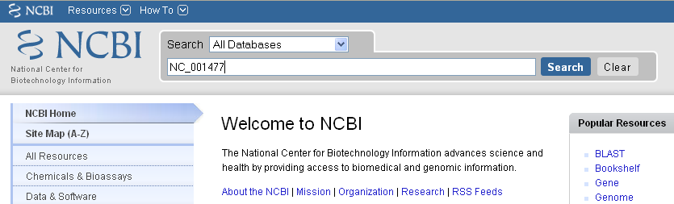
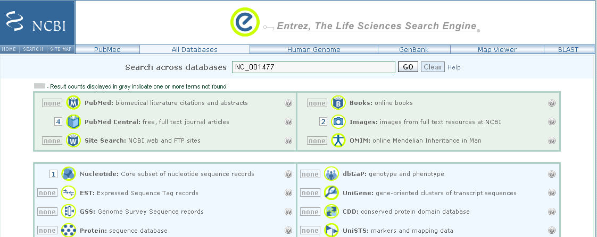
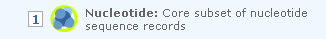
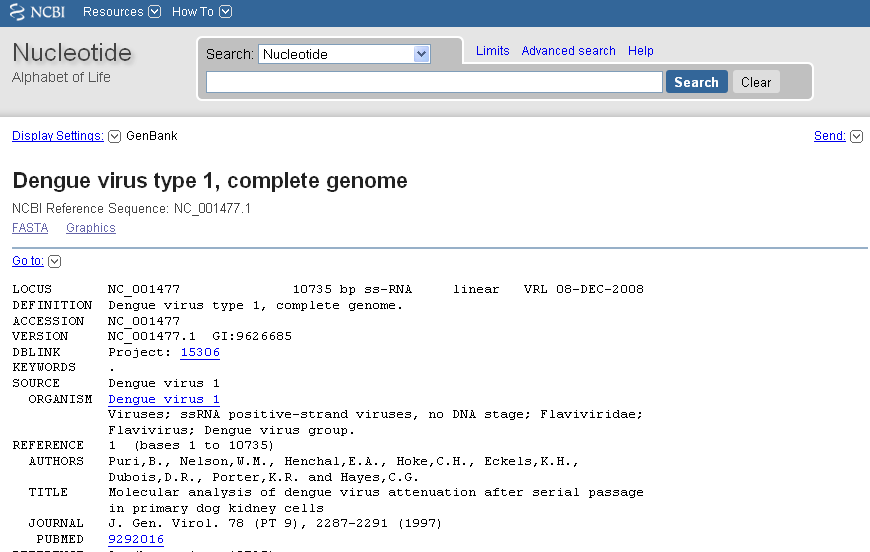
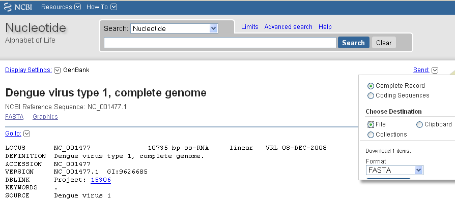
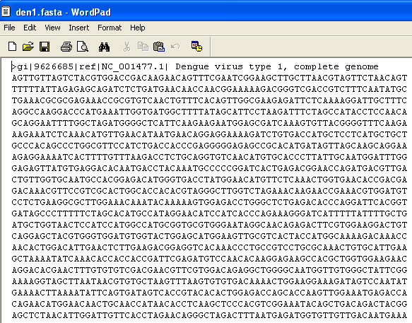

DNA Sequence Statistics
=======================

Using R for Bioinformatics 
--------------------------

This booklet tells you how to use the R software to carry out some simple analyses
that are common in bioinformatics. In particular, the focus is on computational analysis
of biological sequence data such as genome sequences and protein sequences.

This booklet assumes that the reader has some basic knowledge of biology, but not
necessarily of bioinformatics. The focus of the booklet is to explain simple bioinformatics
analysis, and to explain how to carry out these analyses using R.

To use R, you first need to start the R program on your computer.
You should have already installed R on your computer (if not, for instructions on how to
install R, see `How to install R <./installr.html>`_).

R packages for bioinformatics: Bioconductor and SeqinR
------------------------------------------------------

Many authors have written R packages for performing a wide variety
of analyses. These do not come with the standard R installation,
but must be installed and loaded as "add-ons".

Bioinformaticians have written several specialised *packages* for
R. In this practical, you will learn to use the SeqinR package to
retrieve sequences from a DNA sequence database, and to carry out
simple analyses of DNA sequences.

Some well known bioinformatics packages for R are the Bioconductor
set of R packages  
(`www.bioconductor.org <http://www.bioconductor.org/>`_), which
contains several packages with many R functions for analysing
biological data sets such as microarray data; and the SeqinR
package
(`pbil.univ-lyon1.fr/software/seqinr/home.php?lang=eng <http://pbil.univ-lyon1.fr/software/seqinr/home.php?lang=eng>`_),
which contains R functions for obtaining sequences from DNA and protein
sequence databases, and for analysing DNA and protein sequences.

To use function from the SeqinR package, 
we first need to install the SeqinR package (for instructions on how to
install an R package, see `How to install an R package <./installr.html#how-to-install-an-r-package>`_).
Once you have installed the "SeqinR" R package, you can load the "SeqinR" R package by typing:

.. highlight:: r

::

    > library("seqinr")

Remember that you can ask for more information about a particular R
command by using the help() function. For example, to ask for more
information about the library() function, you can type:

::

    > help("library")

FASTA format
------------

The FASTA format is a simple and widely used format for storing
biological (DNA or protein) sequences. It was first used by the
FASTA program for sequence alignment. It begins with a single-line
description starting with a ">" character, followed by lines of
sequences. Here is an example of a FASTA file:

::

    > A06852 183 residues
    MPRLFSYLLGVWLLLSQLPREIPGQSTNDFIKACGRELVRLWVEICGSVSWGRTALSLEE
    PQLETGPPAETMPSSITKDAEILKMMLEFVPNLPQELKATLSERQPSLRELQQSASKDSN
    LNFEEFKKIILNRQNEAEDKSLLELKNLGLDKHSRKKRLFRMTLSEKCCQVGCIRKDIAR
    LC

The NCBI sequence database
--------------------------

The National Centre for Biotechnology Information (NCBI)
(`www.ncbi.nlm.nih.gov <http://www.ncbi.nlm.nih.gov/>`_) in the US
maintains a huge database of all the DNA and protein sequence data
that has been collected, the NCBI Sequence Database. This also a
similar database in Europe, the European Molecular Biology
Laboratory (EMBL) Sequence Database
(`www.ebi.ac.uk/embl <http://www.ebi.ac.uk/embl/>`_), and also a
similar database in Japan, the DNA Data Bank of Japan (DDBJ;
`www.ddbj.nig.ac.jp <http://www.ddbj.nig.ac.jp/>`_). These three
databases exchange data every night, so at any one point in time,
they contain almost identical data.

Each sequence in the NCBI Sequence Database is stored in a separate
*record*, and is assigned a unique identifier that can be used to
refer to that sequence record. The identifier is known as an
*accession*, and consists of a mixture of numbers and letters. For
example, Dengue virus causes `Dengue fever <http://www.who.int/denguecontrol/en/>`_, 
which is classified as a neglected tropical disease by the WHO. 
by any one of four types of Dengue virus: DEN-1, DEN-2, DEN-3, and DEN-4.
The NCBI accessions for the DNA sequences of the DEN-1, DEN-2, DEN-3, and DEN-4
Dengue viruses are NC\_001477, NC\_001474, NC\_001475 and NC\_002640, respectively.

Note that because the NCBI Sequence Database, the EMBL Sequence
Database, and DDBJ exchange data every night, the DEN-1 (and DEN-2, DEN-3, DEN-4) Dengue virus
sequence will be present in all three databases, but it will
have different accessions in each database, as they each use their
own numbering systems for referring to their own sequence records.

Retrieving genome sequence data from NCBI
-----------------------------------------

You can easily retrieve DNA or protein sequence data from the NCBI
Sequence Database via its website
`www.ncbi.nlm.nih.gov <http://www.ncbi.nlm.nih.gov/>`_.

The Dengue DEN-1 DNA sequence is a viral DNA sequence, and as
mentioned above, its NCBI accession is NC\_001477. To retrieve
the DNA sequence for the Dengue DEN-1 virus from NCBI, go to the NCBI
website, type "NC\_001477" in the Search box at the top of
the webpage, and press the "Search" button beside the Search box:

|image0|

On the results page you will see the number of hits to "NC\_001477"
in each of the NCBI databases on the NCBI website. There are many
databases on the NCBI website, for example, the "PubMed" data
contains abstracts from scientific papers, the "Nucleotide"
database contains DNA and RNA sequence data, the "Protein" data
contains protein sequence data, and so on. The picture below shows
what the results page should look like for your NC\_001477 search.
As you are looking for the DNA sequence of the Dengue DEN-1 virus  
genome, you expect to see a hit in the NCBI Nucleotide database,
and indeed there is hit in the Nucleotide database (indicated by
the "1" beside the icon for the Nucleotide database):

|image1|

To look at the one sequence found in the Nucleotide database, you
need to click on the icon for the NCBI Nucleotide database on the
results page for the search:

|image2|

When you click on the icon for the NCBI Nucleotide database, it
will bring you to the record for NC\_001477 in the NCBI Nucleotide
database. This will contain the name and NCBI accession of the
sequence, as well as other details such as any papers describing
the sequence:

|image3|

To retrieve the DNA sequence for the DEN-1 Dengue virus genome
sequence as a FASTA format sequence file, click on "Send" at the top
right of the NC\_001477 sequence record webpage, and then choose
"File" in the pop-up menu that appears, and then choose FASTA
from the "Format" menu that appears, and click on "Create file".

click on the "Download"
link at the top right of the NC\_001477 sequence record webpage,
and choose "FASTA" from the list that appears. A box will pop up
asking you what to name the file. You should give it a sensible
name (eg. "den1.fasta") and save it in a place where you will
remember (eg. in the "My Documents" folder is a good idea):

|image4|

You can now open the FASTA file containing the DEN-1 Dengue virus genome
sequence using WordPad on your computer. To open WordPad, click on
"Start" on the bottom left of your screen, click on "All Programs"
in the menu that appears, and then select "Accessories" from the
menu that appears next, and then select "WordPad" from the menu
that appears next. WordPad should start up. In Wordpad, choose
"Open" from the "File" menu. The WordPad "Open" dialog will appear.
Set "Files of type" to "All Documents" at the bottom of the WordPad
"Open" dialog. You should see a list of files, now select the file
that contains the DEN-1 Dengue virus sequence (eg. "den1.fasta"). The
contents of the FASTA format file containing the Dengue DEN-1 sequence
should now be displayed in WordPad:

|image5|

Reading genome sequence data into SeqinR
----------------------------------------

Using the SeqinR package in R, you can easily read a DNA sequence
from a FASTA file into R. For example, we described above how to
retrieve the DEN-1 Dengue virus genome sequence from the NCBI
database and save it in a FASTA format file (eg. "den1.fasta").
You can read this FASTA format file into R using the read.fasta()
function from the SeqinR R package:

::

    > library("seqinr") 
    > dengue <- read.fasta(file = "den1.fasta")

Note that R expects the files that you read in (eg. "den1.fasta")
to be in the "My Documents" folder on your computer, so if you
stored "den1.fasta" somewhere else, you will have to move or copy
it into "My Documents".

The command above reads the contents of the fasta format file
den1.fasta into an R object called *dengue*. The variable
*dengue* is an R list object. As explained above, a list is an R
object that is like a vector, but can contain elements that are
numeric and/or contain characters. In this case, the list *dengue*
contains information from the FASTA file that you have read in (ie.
the NCBI accession for the dengue sequence, and the DNA sequence
itself). In fact, the first element of the list object *dengue*
contains the the DNA sequence. As described above, we can access
the elements of an R list object using double square brackets.
Thus, we can store the DNA sequence for DEN-1 Dengue virus in a
variable *dengueseq* by typing:

::

    > dengueseq <- dengue[[1]]

The variable *dengueseq* is a vector containing the nucleotide
sequence. Each element of the vector contains one nucleotide of the
sequence. Therefore, to print out a certain subsequence of the
sequence, we just need to type the name of the vector *dengueseq*
followed by the square brackets containing the indices for those
nucleotides. For example, the following command prints out the
first 50 nucleotides of the DEN-1 Dengue virus genome sequence:

::

    > dengueseq[1:50]
    [1] "a" "g" "t" "t" "g" "t" "t" "a" "g" "t" "c" "t" "a" "c" "g" "t" "g" "g" "a"
    [20] "c" "c" "g" "a" "c" "a" "a" "g" "a" "a" "c" "a" "g" "t" "t" "t" "c" "g" "a"
    [39] "a" "t" "c" "g" "g" "a" "a" "g" "c" "t" "t" "g"
     
Note that *dengueseq[1:50]* refers to the elements of the vector
*dengueseq* with indices from 1-50. These elements contain the
first 50 nucleotides of the DEN-1 Dengue virus sequence.

Length of a DNA sequence
------------------------

Once you have retrieved a DNA sequence, we can obtain some simple
statistics to describe that sequence, such as the sequence's total
length in nucleotides. In the above example, we retrieved the
DEN-1 Dengue virus genome sequence, and stored it in the vector
variable *dengueseq* To subsequently obtain the length of the
genome sequence, we would use the length() function, typing:

::

    > length(dengueseq)
    [1] 10735 

The length() function will give you back the length of the sequence
stored in variable *dengueseq*, in nucleotides. The length()
function actually gives the number of elements in the input vector
that you pass to it, which in this case in the number of elements
in the vector *dengueseq*. Since each element of the vector
*dengueseq* contains one nucleotide of the DEN-1 Dengue virus   
sequence, the result for the DEN-1 Dengue virus genome tells us
the length of its genome sequence (ie. 10735 nucleotides long).

Base composition of a DNA sequence
----------------------------------

An obvious first analysis of any DNA sequence is to count the
number of occurrences of the four different nucleotides ("A", "C",
"G", and "T") in the sequence. This can be done using the the
table() function. For example, to find the number of As, Cs, Gs,
and Ts in the DEN-1 Dengue virus sequence (which you have put
into vector variable *dengueseq*, using the commands above), you
would type:

::

    > table(dengueseq)
    dengueseq
      a    c    g    t 
    3426 2240 2770 2299 
    
This means that the DEN-1 Dengue virus genome sequence has 3426 
As, 2240 Cs, 2770 Gs and 2299 Ts.

GC Content of DNA
-----------------

One of the most fundamental properties of a genome sequence is its
GC content, the fraction of the sequence that consists of Gs and
Cs, ie. the %(G+C).

The GC content can be calculated as the percentage of the bases in
the genome that are Gs or Cs. That is, GC content = (number of Gs +
number of Cs)\*100/(genome length). For example, if the genome is
100 bp, and 20 bases are Gs and 21 bases are Cs, then the GC
content is (20 + 21)\*100/100 = 41%.

You can easily calculate the GC content based on the number of As,
Gs, Cs, and Ts in the genome sequence. For example, for the
DEN-1 Dengue virus genome sequence, we know from using the
table() function above that the genome contains 3426 As, 2240 Cs,
2770 Gs and 2299 Ts. Therefore, we can calculate the GC content
using the command:

::

    > (2240+2770)*100/(3426+2240+2770+2299)
    [1] 46.66977 

Alternatively, if you are feeling lazy, you can use the GC()
function in the SeqinR package, which gives the fraction of bases
in the sequence that are Gs or Cs.

::

    > GC(dengueseq)
    [1] 0.4666977 

The result above means that the fraction of bases in the
DEN-1 Dengue virus genome that are Gs or Cs is 0.4666977. To
convert the fraction to a percentage, we have to multiply by 100,
so the GC content as a percentage is 46.66977%.

DNA words
---------

As well as the frequency of each of the individual nucleotides
("A", "G", "T", "C") in a DNA sequence, it is also interesting to
know the frequency of longer DNA "words". The individual
nucleotides are DNA words that are 1 nucleotide long, but we may
also want to find out the frequency of DNA words that are 2
nucleotides long (ie. "AA", "AG", "AC", "AT", "CA", "CG", "CC",
"CT", "GA", "GG", "GC", "GT", "TA", "TG", "TC", and "TT"), 3
nucleotides long (eg. "AAA", "AAT", "ACG", etc.), 4 nucleotides
long, etc.

To find the number of occurrences of DNA words of a particular
length, we can use the count() function from the R SeqinR package. For example, to find
the number of occurrences of DNA words that are 1 nucleotide long
in the sequence *dengueseq*, we type:

::

     
    > count(dengueseq, 1)
      a    c    g    t 
     3426 2240 2770 2299 
    
As expected, this gives us the number of occurrences of the
individual nucleotides. To find the number of occurrences of DNA
words that are 2 nucleotides long, we type:

::

    > count(dengueseq, 2)
      aa   ac   ag   at   ca   cc   cg   ct   ga   gc   gg   gt   ta   tc   tg   tt 
     1108  720  890  708  901  523  261  555  976  500  787  507  440  497  832  529 

Note that by default the count() function includes all overlapping DNA words in
a sequence. Therefore, for example, the sequence "ATG" is considered to contain
two words that are two nucleotides long: "AT" and "TG".

If you type help('count'), you will see that the result (output) of
the function count() is a *table* object. This means that you can
use double square brackets to extract the values of elements from
the table. For example, to extract the value of the third element
(the number of Gs in the DEN-1 Dengue virus sequence), you can type:

::

    > denguetable <- count(dengueseq,1)
    > denguetable[[3]] 
     [1] 2770

The command above extracts the third element of the table produced
by count(dengueseq,1), which we have stored in the table variable
*denguetable*.

Alternatively, you can find the value of the element of the table
in column "g" by typing:

::

    > denguetable[["g"]]
     [1] 2770

Summary
-------

In this practical, you will have learnt to use the following R
functions:

#. length() for finding the length of a vector or list
#. table() for printing out a table of the number of occurrences of
   each type of item in a vector or list.

These functions belong to the standard installation of R.

You have also learnt the following R functions that belong to the
SeqinR package:

#. GC() for calculating the GC content for a DNA sequence
#. count() for calculating the number of occurrences of DNA words
   of a particular length in a DNA sequence

Links and Further Reading
-------------------------

Some links are included here for further reading.

For background reading on DNA sequence statistics, it is
recommended to read Chapter 1 of
*Introduction to Computational Genomics: a case studies approach*
by Cristianini and Hahn (Cambridge University Press;
`www.computational-genomics.net/book/ <http://www.computational-genomics.net/book/>`_).

For more in-depth information and more examples on using the SeqinR
package for sequence analysis, look at the SeqinR documentation,
`http://pbil.univ-lyon1.fr/software/seqinr/doc.php?lang=eng <http://pbil.univ-lyon1.fr/software/seqinr/doc.php?lang=eng>`_.

There is also a very nice chapter on "Analyzing Sequences", which
includes examples of using SeqinR for sequence analysis, in the
book *Applied statistics for bioinformatics using R* by Krijnen
(available online at
`cran.r-project.org/doc/contrib/Krijnen-IntroBioInfStatistics.pdf <http://cran.r-project.org/doc/contrib/Krijnen-IntroBioInfStatistics.pdf>`_).

For a more in-depth introduction to R, a good online tutorial is
available on the "Kickstarting R" website,
`cran.r-project.org/doc/contrib/Lemon-kickstart <http://cran.r-project.org/doc/contrib/Lemon-kickstart/>`_.

There is another nice (slightly more in-depth) tutorial to R
available on the "Introduction to R" website,
`cran.r-project.org/doc/manuals/R-intro.html <http://cran.r-project.org/doc/manuals/R-intro.html>`_.

Acknowledgements
----------------

Thank you to Noel O'Boyle for helping in using Sphinx, `http://sphinx.pocoo.org <http://sphinx.pocoo.org>`_, to create
this document, and github, `https://github.com/ <https://github.com/>`_, to store different versions of the document
as I was writing it, and readthedocs, `http://readthedocs.org/ <http://readthedocs.org/>`_, to build and distribute
this document.

Many of the ideas for the examples and exercises for this chapter
were inspired by the Matlab case studies on
*Haemophilus influenzae*
(`www.computational-genomics.net/case\_studies/haemophilus\_demo.html <http://www.computational-genomics.net/case_studies/haemophilus_demo.html>`_)
and Bacteriophage lambda
(`http://www.computational-genomics.net/case\_studies/lambdaphage\_demo.html <http://www.computational-genomics.net/case_studies/lambdaphage_demo.html>`_)
from the website that accompanies the book
*Introduction to Computational Genomics: a case studies approach*
by Cristianini and Hahn (Cambridge University Press;
`www.computational-genomics.net/book/ <http://www.computational-genomics.net/book/>`_).

Thank you to Jean Lobry and Simon Penel for helpful advice on using
the SeqinR package.

Contact
-------

I will be grateful if you will send me (`Avril Coghlan <http://www.ucc.ie/microbio/avrilcoghlan/>`_) corrections or suggestions for improvements to
my email address a.coghlan@ucc.ie 

License
-------

The content in this book is licensed under a `Creative Commons Attribution 3.0 License
<http://creativecommons.org/licenses/by/3.0/>`_.

Exercises
---------

Answer the following questions, using the R package. For each
question, please record your answer, and what you typed into R to
get this answer.

Model answers to the exercises are given in the chapter entitled
`Answers to the exercises on DNA Sequence Statistics <./chapter1_answers.html>`_.

Q1. What are the last twenty nucleotides of the Dengue virus genome sequence?

Q2. What is the length in nucleotides of the genome sequence for the bacterium *Mycobacterium leprae* strain TN (accession NC\_002677)?
    Note: *Mycobacterium leprae* is a bacterium that is responsible for causing leprosy, which is classified by the WHO as a neglected tropical disease.
    As the genome sequence is a DNA sequence, you need to look for it in the
    NCBI Nucleotide database.

Q3. How many of each of the four nucleotides A, C, T and G, and any other symbols, are there in the *Mycobacterium leprae* TN genome sequence?
    Note: other symbols apart from the four nucleotides A/C/T/G may
    appear in a sequence. They correspond to positions in the sequence
    that are are not clearly one base or another and they are due, for
    example, to sequencing uncertainties. or example, the symbol 'N'
    means 'aNy base', while 'R' means 'A or G' (puRine). There is a
    table of symbols at
    `www.bioinformatics.org/sms/iupac.html <http://www.bioinformatics.org/sms/iupac.html>`_.

Q4. What is the GC content of the *Mycobacterium leprae* TN genome sequence, when (i) all non-A/C/T/G nucleotides are included, (ii) non-A/C/T/G nucleotides are discarded?
    Hint: look at the help page for the GC() function to find out how
    it deals with non-A/C/T/G nucleotides.

Q5. How many of each of the four nucleotides A, C, T and G are there in the complement of the *Mycobacterium leprae* TN genome sequence?
    Hint: you will first need to search for a function to calculate the
    complement of a sequence. Once you have found out what function to
    use, remember to use the help() function to find out what are the
    arguments (inputs) and results (outputs) of that function. How does
    the function deal with symbols other than the four nucleotides A,
    C, T and G?
    Are the numbers of As, Cs, Ts, and Gs in the complementary sequence
    what you would expect?

Q6. How many occurrences of the DNA words CC, CG and GC occur in the *Mycobacterium leprae* TN genome sequence?

Q7. How many occurrences of the DNA words CC, CG and GC occur in the (i) first 1000 and (ii) last 1000 nucleotides of the *Mycobacterium leprae* TN genome sequence?
    How can you check that the subsequence that you have looked at is
    1000 nucleotides long?

