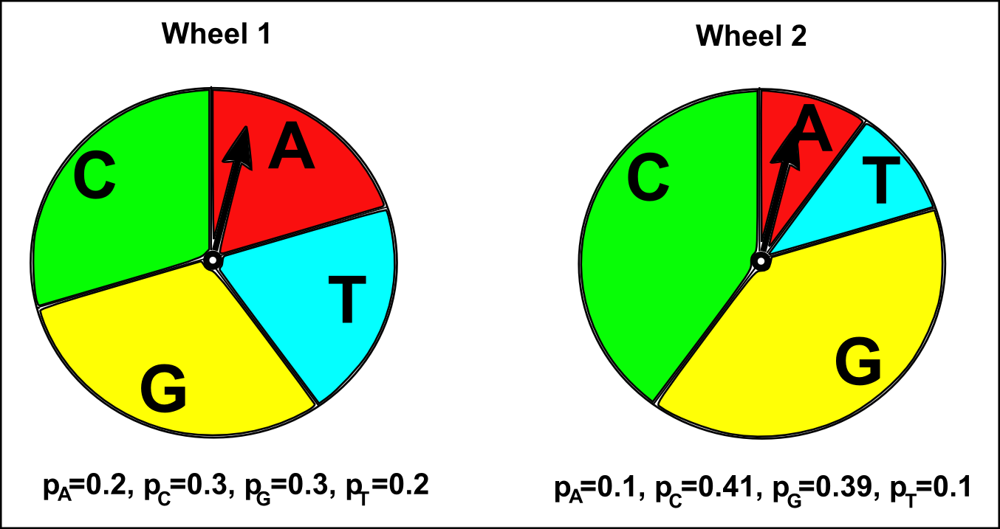
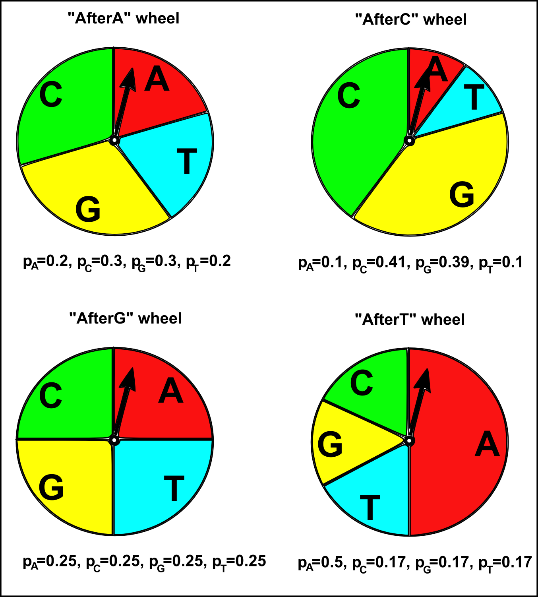
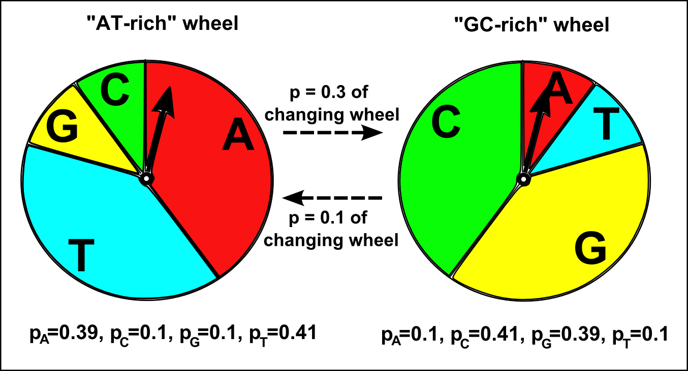

Hidden Markov Models
====================

A little more about R
---------------------

In previous practicals, you learnt how to create different types of
variables in R such as scalars, vectors and lists. Sometimes it is
useful to create a variable before you actually need to store any
data in the variable. To create a vector without actually storing
any data in it, you can use the numeric() command to create a
vector for storing numbers, or the character() command to create a
vector for storing characters (eg. "A", "hello", etc.) For example,
you may want to create a vector variable for storing the square of
a number, and then store numbers in its elements afterwards:

::

    > myvector <- numeric()                  # Create a vector "myvector" for storing numbers
    > for (i in 1:10) { myvector[i] <- i*i } # Fill in the values in the vector "myvector"
    > myvector                               # Print out the vector "myvector"
    [1]   1   4   9  16  25  36  49  64  81 100

Note that if you try to store numbers in the elements of a vector
that you have not yet created, you will get an error message, for
example:

::

    > for (i in 1:10) { avector[i] <- i*i }  # Try to store values in the vector "avector"
    Error in avector[i] <- i * i : object 'avector' not found

Another very useful type of variable is a matrix. You can create a
matrix in R using the matrix() command. If you look at the help
page for the matrix() command, you will see that its arguments
(inputs) are the data to store in the matrix, the number of rows to
store it in, the number of columns to store it in, and whether to
fill the matrix with data column-by-column or row-by-row. For
example, say you have the heights and weights of eight patients in
a hospital in two different vectors:

::

    > heights <- c(180, 170, 175, 160, 183, 177, 179, 182)
    > weights <- c(90, 88, 100, 68, 95, 120, 88, 93)

To store this data in a matrix that has one column per person, and
one row for heights and one row for weights, we type:

::

    > mymatrix <- matrix(c(heights,weights), 2, 8, byrow=TRUE)
    > mymatrix # Print out the matrix
    [,1] [,2] [,3] [,4] [,5] [,6] [,7] [,8]
    [1,]  180  170  175  160  183  177  179  182
    [2,]   90   88  100   68   95  120   88   93

We needed to use the argument "byrow=TRUE" to tell the matrix()
command to fill the matrix row-by-row (ie. to put the values from
the vector *heights* into the first row of the matrix, and the
values from the vector *weights* into the second row of the
matrix).

You can assign names to the rows and columns of a matrix using the
rownames() and colnames() commands, respectively. For example, to
assign names to the rows and columns of matrix *mymatrix*, you
could type:

::

    > rownames(mymatrix) <- c("height", "weight")
    > colnames(mymatrix) <- c("patient1", "patient2", "patient3", "patient4", "patient5", "patient6", "patient7", "patient8")
    > mymatrix # Print out the matrix now
    patient1 patient2 patient3 patient4 patient5 patient6 patient7 patient8
    height      180      170      175      160      183      177      179      182
    weight       90       88      100       68       95      120       88       93

Once you have created a matrix, you can access the values in the
elements of the matrix by using square brackets containing the
indices of the row and column of the element. For example, if you
want to access the value in the second row and fourth column of
matrix *mymatrix*, you can type:

::

    > mymatrix[2,4]
    [1] 68

If you want to access all the values in a particular row of the
matrix, you can just type the index for the row, and leave out the
index for the column. For example, if you want to get the values in
the second row of the matrix *mymatrix*, type:

::

    > mymatrix[2,]
    patient1 patient2 patient3 patient4 patient5 patient6 patient7 patient8 
    90       88      100       68       95      120       88       93 

Likewise, if you want to get the values in a particular column of a
matrix, leave out the index for the row, and just type the column
index. For example, if you want to get the values in the fourth row
of the *mymatrix*, type:

::

    > mymatrix[,4]
    height weight 
    160     68 

A multinomial model of DNA sequence evolution
---------------------------------------------

The simplest model of DNA sequence evolution assumes that the
sequence has been produced by a random process that randomly chose
any of the four nucleotides at each position in the sequence, where
the probability of choosing any one of the four nucleotides depends
on a predetermined probability distribution. That is, the four
nucleotides are chosen with *p\ :sub:`A`\ *, *p\ :sub:`C`\ *,
*p\ :sub:`G`\ *, and *p\ :sub:`T`\ * respectively. This is known as
the *multinomial sequence model*.

A multinomial model for DNA sequence evolution has four parameters:
the probabilities of the four nucleotides *p\ :sub:`A`\ *,
*p\ :sub:`C`\ *, *p\ :sub:`G`\ *, and *p\ :sub:`T`\ *. For example,
say we may create a multinomial model where *p\ :sub:`A`\ *=0.2,
*p\ :sub:`C`\ *=0.3, *p\ :sub:`G`\ *=0.3, and *p\ :sub:`T`\ *=0.2.
This means that the probability of choosing a A at any particular
sequence position is set to be 0.2, the probability of choosing a C
is 0.3, of choosing a G is 0.3, and of choosing a T is 0.2. Note
that *p\ :sub:`A`\ * + *p\ :sub:`C`\ * + *p\ :sub:`G`\ * +
*p\ :sub:`T`\ * = 1, as the sum of the probabilities of the four
different types of nucleotides must be equal to 1, as there are
only four possible types of nucleotide.

The multinomial sequence model is like having a roulette wheel that
is divided into four different slices labelled "A", "T", "G" and
"C", where the *p\ :sub:`A`\ *, *p\ :sub:`T`\ *, *p\ :sub:`G`\ *
and *p\ :sub:`C`\ * are the fractions of the wheel taken up by the
slices with these four labels. If you spin the arrow attached to
the centre of the roulette wheel, the probability that it will stop
in the slice with a particular label (eg. the slice labelled "A")
only depends on the fraction of the wheel taken up by that slice
(*p\ :sub:`A`\ * here; see the picture below).

|image0|

Generating a DNA sequence using a multinomial model
---------------------------------------------------

We can use R to generate a DNA sequence using a particular
multinomial model. First we need to set the values of the four
parameters of the multinomial model, the probabilities
*p\ :sub:`A`\ *, *p\ :sub:`C`\ *, *p\ :sub:`G`\ *, and
*p\ :sub:`T`\ * of choosing the nucleotides A, C, G and T,
respectively, at a particular position in the DNA sequence. For
example, say we decide to set *p\ :sub:`A`\ *=0.2,
*p\ :sub:`C`\ *=0.3, *p\ :sub:`G`\ *=0.3, and *p\ :sub:`T`\ *=0.2.
We can use the function sample() in R to generate a DNA sequence of
a certain length, by selecting a nucleotide at each position
according to this probability distribution:

::

    > nucleotides    <- c("A", "C", "G", "T") # Define the alphabet of nucleotides
    > probabilities1 <- c(0.2, 0.3, 0.3, 0.2) # Set the values of the probabilities
    > seqlength      <- 30                    # Set the length of the sequence
    > sample(nucleotides, seqlength, rep=TRUE, prob=probabilities1) # Generate a sequence 
    [1] "A" "C" "T" "G" "T" "T" "T" "T" "A" "G" "T" "C" "A" "G" "G" "G" "G" "C" "G"
    [20] "C" "G" "T" "C" "C" "G" "G" "C" "A" "G" "C"

If you look at the help page for the function(), you will find that
its inputs are the vector to sample from (*nucleotides* here), the
size of the sample (*seqlength* here), and a vector of
probabilities for obtaining the elements of the vector being
sampled (*probabilities1* here). If we use the sample() function to
generate a sequence again, it will create a different sequence
using the same multinomial model:

::

    > sample(nucleotides, seqlength, rep=TRUE, prob=probabilities1) # Generate another sequence 
    [1] "T" "G" "C" "T" "A" "T" "G" "G" "T" "C" "G" "A" "A" "T" "G" "G" "G" "G" "C"
    [20] "T" "A" "A" "C" "C" "G" "A" "G" "G" "C" "G"

In the same way, we can generate a sequence using a different
multinomial model, where *p\ :sub:`A`\ *=0.1, *p\ :sub:`C`\ *=0.41,
*p\ :sub:`G`\ *=0.39, and *p\ :sub:`T`\ *=0.1:

::

    > probabilities2 <- c(0.1, 0.41, 0.39, 0.1) # Set the values of the probabilities for the new model
    > sample(nucleotides, seqlength, rep=TRUE, prob=probabilities2) # Generate a sequence 
    [1] "G" "C" "C" "T" "C" "C" "C" "C" "G" "G" "G" "G" "G" "A" "C" "C" "C" "A" "G"
    [20] "A" "G" "C" "T" "C" "G" "G" "C" "G" "G" "C"

As you would expect, the sequences generated using this second
multinomial model have a higher fraction of Cs and Gs compared to
the sequences generated using the first multinomial model above.
This is because *p\ :sub:`C`\ * and *G\ :sub:`T`\ * are higher for
this second model than for the first model (*p\ :sub:`C`\ *=0.41
and *G\ :sub:`T`\ *=0.39 in the second model, versus
*p\ :sub:`C`\ *=0.3 and *G\ :sub:`T`\ *=0.3 in the first model).
That is, in the second multinomial model we are using a roulette
wheel that has large slices labelled "C" and "G", while in the
first multinomial model we were using a roulette wheel with
relatively smaller slices labelled "C" and "G" (see the picture
below).

|image1|

A Markov model of DNA sequence evolution
----------------------------------------

A multinomial model of DNA sequence evolution is a good model of
the evolution of many DNA sequences. However, for some DNA
sequences, a multinomial model is not an accurate representation of
how the sequences have evolved. One reason is that a multinomial
model assumes that each part of the sequence (eg. the first 100
nucleotides of the sequence, the second 100 nucleotides, the third
100 nucleotides, etc.) have the same frequency of each type of
nucleotide (the same *p\ :sub:`A`\ *, *p\ :sub:`C`\ *,
*p\ :sub:`G`\ *, and *p\ :sub:`T`\ *), and this may not be true for
a particular DNA sequence if there are considerable differences in
nucleotide frequencies in different parts of the sequence.

Another assumption of a multinomial model of DNA sequence evolution
is that the probability of choosing a particular nucleotide (eg.
"A") at a particular position in the sequence only depends on the
predetermined frequency of that nucleotide (*p\ :sub:`A`\ * here),
and does not depend at all on the nucleotides found at adjacent
positions in the sequence. This assumption holds true for many DNA
sequences. However, for some DNA sequences, it is not true, because
the probability of finding a particular nucleotide at a particular
position in the sequence *does* depend on what nucleotides are
found at adjacent positions in the sequence. In this case, a
different type of DNA sequence model called a
*Markov sequence model* is a more accurate representation of the
evolution of the sequence.

A Markov sequence model assumes that the sequence has been produced
by a process that chose any of the four nucleotides in the
sequence, where the probability of choosing any one of the four
nucleotides at a particular position depends on the nucleotide
chosen for the previous position. That is, if "A" was chosen at the
previous position, then the probability of choosing any one of the
four nucleotides at the current position depends on a predetermined
probability distribution. That is, given that "A" was chosen at the
previous position, the four nucleotides are chosen at the current
position with probabilities of *p\ :sub:`A`\ *, *p\ :sub:`C`\ *,
*p\ :sub:`G`\ *, and *p\ :sub:`T`\ * of choosing "A", "C", "G", or
"T", respectively (eg. *p\ :sub:`A`\ *=0.2, *p\ :sub:`C`\ *=0.3,
*p\ :sub:`G`\ *=0.3, and *p\ :sub:`T`\ *=0.2). In contrast, if "C"
was chosen at the previous position, then the probability of
choosing any one of the four nucleotides at the current position
depends on a different predetermined probability distribution, that
is, the probabilities of choosing "A", "C", "G", or "T" at the
current position are now different (eg. *p\ :sub:`A`\ *=0.1,
*p\ :sub:`C`\ *=0.41, *p\ :sub:`G`\ *=0.39, and
*p\ :sub:`T`\ *=0.1).

A Markov sequence model is like having four different roulette
wheels, labelled "afterA", "afterT", "afterG", and "afterC", for
the cases when "A", "T", "G", or "C" were chosen at the previous
position in a sequence, respectively. Each of the four roulette
wheels has four slices labelled "A", "T", "G", and "C", but in each
roulette wheel a different fraction of the wheel is taken up by the
four slices. That is, each roulette wheel has a different
*p\ :sub:`A`\ *, *p\ :sub:`T`\ *, *p\ :sub:`G`\ * and
*p\ :sub:`C`\ *. If we are generating a new DNA sequence using a
Markov sequence model, to decide what nucleotide to choose at a
particular position in the sequence, you spin the arrow at the
centre of a roulette wheel, and see in which slice the arrow stops.
There are four roulette wheels, and the particular roulette wheel
we use at a particular position in the sequence depends on the
nucleotide chosen for the previous position in the sequence. For
example, if "T" was chosen at the previous position, we use the
"afterT" roulette wheel to choose the nucleotide for the current
position. The probability of choosing a particular nucleotide at
the current position (eg. "A") then depends on the fraction of the
"afterT" roulette wheel taken up by the the slice labelled with
that nucleotide (*p\ :sub:`A`\ * here; see the picture below).

|image2|

The transition matrix for a Markov model
----------------------------------------

A multinomial model of DNA sequence evolution just has four
parameters: the probabilities *p\ :sub:`A`\ *, *p\ :sub:`C`\ *,
*p\ :sub:`G`\ *, and *p\ :sub:`T`\ *. In contrast, a Markov model
has many more parameters: four sets of probabilities
*p\ :sub:`A`\ *, *p\ :sub:`C`\ *, *p\ :sub:`G`\ *, and
*p\ :sub:`T`\ *, that differ according to whether the previous
nucleotide was "A", "G", "T" or "C". The symbols *p\ :sub:`AA`\ *,
*p\ :sub:`AC`\ *, *p\ :sub:`AG`\ *, and *p\ :sub:`AT`\ * are
usually used to represent the four probabilities for the case where
the previous nucleotide was "A", the symbols *p\ :sub:`CA`\ *,
*p\ :sub:`CC`\ *, *p\ :sub:`CG`\ *, and *p\ :sub:`CT`\ * for the
case when the previous nucleotide was "C", and so on.

It is common to store the probability parameters for a Markov model
of a DNA sequence in a square matrix, which is known as a
*Markov transition matrix*. The rows of the transition matrix
represent the nucleotide found at the previous position in the
sequence, while the columns represent the nucleotides that could be
found at the current position in the sequence. In R, you can create
a matrix using the matrix() command, and the rownames() and
colnames() functions can be used to label the rows and columns of
the matrix. For example, to create a transition matrix, we type:

::

    > nucleotides         <- c("A", "C", "G", "T") # Define the alphabet of nucleotides
    > afterAprobs <- c(0.2, 0.3, 0.3, 0.2)         # Set the values of the probabilities, where the previous nucleotide was "A"
    > afterCprobs <- c(0.1, 0.41, 0.39, 0.1)       # Set the values of the probabilities, where the previous nucleotide was "C"
    > afterGprobs <- c(0.25, 0.25, 0.25, 0.25)     # Set the values of the probabilities, where the previous nucleotide was "G"
    > afterTprobs <- c(0.5, 0.17, 0.17, 0.17)      # Set the values of the probabilities, where the previous nucleotide was "T"
    > mytransitionmatrix <- matrix(c(afterAprobs, afterCprobs, afterGprobs, afterTprobs), 4, 4, byrow = TRUE) # Create a 4 x 4 matrix
    > rownames(mytransitionmatrix) <- nucleotides
    > colnames(mytransitionmatrix) <- nucleotides
    > mytransitionmatrix                           # Print out the transition matrix 
    A    C    G    T
    A 0.20 0.30 0.30 0.20
    C 0.10 0.41 0.39 0.10
    G 0.25 0.25 0.25 0.25
    T 0.50 0.17 0.17 0.17

Rows 1, 2, 3 and 4 of the transition matrix give the probabilities
*p\ :sub:`A`\ *, *p\ :sub:`C`\ *, *p\ :sub:`G`\ *, and
*p\ :sub:`T`\ * for the cases where the previous nucleotide was
"A", "C", "G", or "T", respectively. That is, the element in a
particular row and column of the transition matrix (eg. the row for
"A", column for "C") holds the probability (*p\ :sub:`AC`\ *) of
choosing a particular nucleotide ("C") at the current position in
the sequence, given that was a particular nucleotide ("A") at the
previous position in the sequence.

Generating a DNA sequence using a Markov model
----------------------------------------------

Just as you can generate a DNA sequence using a particular
multinomial model, you can generate a DNA sequence using a
particular Markov model. When you are generating a DNA sequence
using a Markov model, the nucleotide chosen at each position at the
sequence depends on the nucleotide chosen at the previous position.
As there is no previous nucleotide at the first position in the new
sequence, we need to define the probabilities of choosing "A", "C",
"G" or "T" for the first position. The symbols *Π\ :sub:`A`\ *,
*Π\ :sub:`C`\ *, *Π\ :sub:`G`\ *, and *Π\ :sub:`T`\ * are used to
represent the probabilities of choosing "A", "C", "G", or "T" at
the first position.

We can define an R function generatemarkovseq() to generate a DNA
sequence using a particular Markov model:

::

    > generatemarkovseq <- function(transitionmatrix, initialprobs, seqlength)
    {
    nucleotides     <- c("A", "C", "G", "T") # Define the alphabet of nucleotides
    mysequence      <- character()           # Create a vector for storing the new sequence
    # Choose the nucleotide for the first position in the sequence:
    firstnucleotide <- sample(nucleotides, 1, rep=TRUE, prob=initialprobs)
    mysequence[1]   <- firstnucleotide       # Store the nucleotide for the first position of the sequence
    for (i in 2:seqlength)
    {
    prevnucleotide <- mysequence[i-1]     # Get the previous nucleotide in the new sequence
    # Get the probabilities of the current nucleotide, given previous nucleotide "prevnucleotide":
    probabilities  <- transitionmatrix[prevnucleotide,]
    # Choose the nucleotide at the current position of the sequence: 
    nucleotide     <- sample(nucleotides, 1, rep=TRUE, prob=probabilities)
    mysequence[i]  <- nucleotide          # Store the nucleotide for the current position of the sequence
    }
    return(mysequence)
    }

The function generatemarkovseq() takes as its arguments (inputs)
the transition matrix for the particular Markov model; a vector
containing the values of *Π\ :sub:`A`\ *, *Π\ :sub:`C`\ *,
*Π\ :sub:`G`\ *, and *Π\ :sub:`T`\ *; and the length of the DNA
sequence to be generated.

The probabilities of choosing each of the four nucleotides at the
first position in the sequence are *Π\ :sub:`A`\ *,
*Π\ :sub:`C`\ *, *Π\ :sub:`G`\ *, and *Π\ :sub:`T`\ *. The
probabilities of choosing each of the four nucleotides at the
second position in the sequence depend on the particular nucleotide
that was chosen at the first position in the sequence. The
probabilities of choosing each of the four nucleotides at the third
position depend on the nucleotide chosen at the second position,
and so on.

We can use the generatemarkovseq() function to generate a sequence
using a particular Markov model. For example, to create a sequence
of 30 nucleotides using the Markov model described in the
transition matrix *mytransitionmatrix*, using uniform starting
probabilities (ie. *Π\ :sub:`A`\ * = 0.25, *Π\ :sub:`C`\ * = 0.25,
*Π\ :sub:`G`\ * = 0.25, and *Π\ :sub:`T`\ * = 0.25) , we type:

::

    > myinitialprobs <- c(0.25, 0.25, 0.25, 0.25)
    > generatemarkovseq(mytransitionmatrix, myinitialprobs, 30)
    [1] "A" "T" "C" "G" "G" "G" "G" "A" "T" "A" "T" "A" "T" "A" "G" "C" "G" "C" "T" "C" "C" "C" "G"
    [24] "A" "C" "A" "A" "A" "T" "C"

As you can see, there are many "A"s after "T"s in the sequence.
This is because *p\ :sub:`TA`\ * has a high value (0.5) in the
Markov transition matrix *mytransitionmatrix*. Similarly, there are
few "A"s or "T"s after "C"s, which is because *p\ :sub:`CA`\ * and
*p\ :sub:`CT`\ * have low values (0.1) in this transition matrix.

A Hidden Markov Model of DNA sequence evolution
-----------------------------------------------

In a Markov model, the nucleotide at a particular position in a
sequence depends on the nucleotide found at the previous position.
In contrast, in a *Hidden Markov model* (HMM), the nucleotide found
at a particular position in a sequence depends on the *state* at
the previous nucleotide position in the sequence. The *state* at a
sequence position is a property of that position of the sequence,
for example, a particular HMM may model the positions along a
sequence as belonging to either one of two states, "GC-rich" or
"AT-rich". A more complex HMM may model the positions along a
sequence as belonging to many different possible states, such as
"promoter", "exon", "intron", and "intergenic DNA".

A HMM is like having several different roulette wheels, one
roulette wheel for each state in the HMM, for example, a "GC-rich"
and an "AT-rich" roulette wheel. Each of the roulette wheels has
four slices labelled "A", "T", "G", and "C", and in each roulette
wheel a different fraction of the wheel is taken up by the four
slices. That is, the "GC-rich" and "AT-rich" roulette wheels have
different *p\ :sub:`A`\ *, *p\ :sub:`T`\ *, *p\ :sub:`G`\ * and
*p\ :sub:`C`\ * values. If we are generating a new DNA sequence
using a HMM, to decide what nucleotide to choose at a particular
sequence position, we spin the arrow of a particular roulette
wheel, and see in which slice it stops.

How do we decide which roulette wheel to use? Well, if there are
two roulette wheels, we tend to use the same roulette wheel that we
used to choose the previous nucleotide in the sequence, but there
is also a certain small probability of switching to the other
roulette wheel. For example, if we used the "GC-rich" roulette
wheel to choose the previous nucleotide in the sequence, there may
be a 90% chance that we will use the "GC-rich" roulette wheel again
to choose the nucleotide at the current position, but a 10% chance
that we will switch to using the "AT-rich" roulette wheel to choose
the nucleotide at the current position. Likewise, if we used the
"AT-rich" roulette wheel to choose the nucleotide at the previous
position, there may be 70% chance that we will use the "AT-rich"
wheel again at this position, but a 30% chance that we will switch
to using the "GC-rich" roulette wheel to choose the nucleotide at
this position.

|image3|

The transition matrix and emission matrix for a HMM
---------------------------------------------------

A HMM has two important matrices that hold its parameters. The
first is the *HMM transition matrix*, which contains the
probabilities of switching from one state to another. For example,
in a HMM with two states, an AT-rich state and a GC-rich state, the
transition matrix will hold the probabilities of switching from the
AT-rich state to the GC-rich state, and of switching from the
GC-rich state to the AT-rich state. For example, if the previous
nucleotide was in the AT-rich state there may be a probability of
0.3 that the current nucleotide will be in the GC-rich state, and
if the previous nucleotide was in the GC-rich state there may be a
probability of 0.1 that the current nucleotide will be in the
AT-rich state:

::

    > states              <- c("AT-rich", "GC-rich") # Define the names of the states
    > ATrichprobs         <- c(0.7, 0.3)             # Set the probabilities of switching states, where the previous state was "AT-rich"
    > GCrichprobs         <- c(0.1, 0.9)             # Set the probabilities of switching states, where the previous state was "GC-rich"
    > thetransitionmatrix <- matrix(c(ATrichprobs, GCrichprobs), 2, 2, byrow = TRUE) # Create a 2 x 2 matrix
    > rownames(thetransitionmatrix) <- states
    > colnames(thetransitionmatrix) <- states
    > thetransitionmatrix                            # Print out the transition matrix
    AT-rich GC-rich
    AT-rich     0.7     0.3
    GC-rich     0.1     0.9

There is a row in the transition matrix for each of the possible
states at the previous position in the nucleotide sequence. For
example, in this transition matrix, the first row corresponds to
the case where the previous position was in the "AT-rich" state,
and the second row corresponds to the case where the previous
position was in the "GC-rich" state. The columns give the
probabilities of switching to different states at the current
position. For example, the value in the second row and first column
of the transition matrix above is 0.1, which is the probability of
switching to the AT-rich state, if the previous position of the
sequence was in the GC-rich state.

The second important matrix is the *HMM emission matrix*, which
holds the probabilities of choosing the four nucleotides "A", "C",
"G", and "T", in each of the states. In a HMM with an AT-rich state
and a GC-rich state, the emission matrix will hold the
probabilities of choosing each of the four nucleotides "A", "C",
"G" and "T" in the AT-rich state (for example,
*p\ :sub:`A`\ *=0.39, *p\ :sub:`C`\ *=0.1, *p\ :sub:`G`\ *=0.1, and
*p\ :sub:`T`\ *=0.41 for the AT-rich state), and the probabilities
of choosing "A", "C", "G", and "T" in the GC-rich state (for
example, *p\ :sub:`A`\ *=0.1, *p\ :sub:`C`\ *=0.41,
*p\ :sub:`G`\ *=0.39, and *p\ :sub:`T`\ *=0.1 for the GC-rich
state).

::

    > nucleotides         <- c("A", "C", "G", "T")   # Define the alphabet of nucleotides
    > ATrichstateprobs    <- c(0.39, 0.1, 0.1, 0.41) # Set the values of the probabilities, for the AT-rich state
    > GCrichstateprobs    <- c(0.1, 0.41, 0.39, 0.1) # Set the values of the probabilities, for the GC-rich state
    > theemissionmatrix <- matrix(c(ATrichstateprobs, GCrichstateprobs), 2, 4, byrow = TRUE) # Create a 2 x 4 matrix
    > rownames(theemissionmatrix) <- states 
    > colnames(theemissionmatrix) <- nucleotides
    > theemissionmatrix                              # Print out the emission matrix 
       A    C    G    T
    AT-rich 0.39 0.10 0.10 0.41
    GC-rich 0.10 0.41 0.39 0.10

There is a row in the emission matrix for each possible state, and
the columns give the probabilities of choosing each of the four
possible nucleotides when in a particular state. For example, the
value in the second row and third column of the emission matrix
above is 0.39, which is the probability of choosing a "G" when in
the "GC-rich state" (ie. when using the "GC-rich" roulette wheel).

Generating a DNA sequence using a HMM
-------------------------------------

The file Rfunctions.R (which you can download from the web at
`www.ucc.ie/microbio/MB6301/Rfunctions.R <http://www.ucc.ie/microbio/MB6301/Rfunctions.R>`_)
contains a function generatehmmseq() to generate a DNA sequence
using a particular HMM. As its arguments (inputs), it requires the
parameters of the HMM: the HMM transmission matrix and HMM emission
matrix.

When you are generating a DNA sequence using a HMM, the nucleotide
is chosen at each position depending on the state at the previous
position in the sequence. As there is no previous nucleotide at the
first position in the sequence, the function generatehmmseq() also
requires the probabilities of the choosing each of the states at
the first position (eg. *Π\ :sub:`AT-rich`\ * and
*Π\ :sub:`GC-rich`\ * being the probability of the choosing the
"AT-rich" or "GC-rich" states at the first position for a HMM with
these two states).

We can use the generatehmmseq() function to generate a sequence
using a particular HMM. For example, to create a sequence of 30
nucleotides using the HMM with "AT-rich" and "GC-rich" states
described in the transition matrix *thetransitionmatrix*, the
emission matrix *theemissionmatrix*, and uniform starting
probabilities (ie. *Π\ :sub:`AT-rich`\ * = 0.5,
*Π\ :sub:`GC-rich`\ * = 0.5), we type:

::

    > theinitialprobs <- c(0.5, 0.5)
    > source("Rfunctions.R") # Read in the functions from the file "Rfunctions.R")
    > generatehmmseq(thetransitionmatrix, theemissionmatrix, theinitialprobs, 30)
    [1] "Position 1 , State AT-rich , Nucleotide =  A"
    [1] "Position 2 , State AT-rich , Nucleotide =  A"
    [1] "Position 3 , State AT-rich , Nucleotide =  G"
    [1] "Position 4 , State AT-rich , Nucleotide =  C"
    [1] "Position 5 , State AT-rich , Nucleotide =  G"
    [1] "Position 6 , State AT-rich , Nucleotide =  T"
    [1] "Position 7 , State GC-rich , Nucleotide =  G"
    [1] "Position 8 , State GC-rich , Nucleotide =  G"
    [1] "Position 9 , State GC-rich , Nucleotide =  G"
    [1] "Position 10 , State GC-rich , Nucleotide =  G"
    [1] "Position 11 , State GC-rich , Nucleotide =  C"
    [1] "Position 12 , State GC-rich , Nucleotide =  C"
    [1] "Position 13 , State GC-rich , Nucleotide =  C"
    [1] "Position 14 , State GC-rich , Nucleotide =  C"
    [1] "Position 15 , State GC-rich , Nucleotide =  G"
    [1] "Position 16 , State GC-rich , Nucleotide =  G"
    [1] "Position 17 , State GC-rich , Nucleotide =  C"
    [1] "Position 18 , State GC-rich , Nucleotide =  G"
    [1] "Position 19 , State GC-rich , Nucleotide =  A"
    [1] "Position 20 , State GC-rich , Nucleotide =  C"
    [1] "Position 21 , State GC-rich , Nucleotide =  A"
    [1] "Position 22 , State AT-rich , Nucleotide =  T"
    [1] "Position 23 , State GC-rich , Nucleotide =  G"
    [1] "Position 24 , State GC-rich , Nucleotide =  G"
    [1] "Position 25 , State GC-rich , Nucleotide =  G"
    [1] "Position 26 , State GC-rich , Nucleotide =  G"
    [1] "Position 27 , State GC-rich , Nucleotide =  T"
    [1] "Position 28 , State GC-rich , Nucleotide =  G"
    [1] "Position 29 , State GC-rich , Nucleotide =  T"
    [1] "Position 30 , State GC-rich , Nucleotide =  C"

As you can see, the nucleotides generated by the GC-rich state are
mostly but not all "G"s and "C"s (because of the high values of
*p\ :sub:`G`\ * and *p\ :sub:`C`\ * for the GC-rich state in the
HMM emission matrix), while the nucleotides generated by the
AT-rich state are mostly but not all "A"s and "T"s (because of the
high values of *p\ :sub:`T`\ * and *p\ :sub:`A`\ * for the AT-rics
state in the HMM emission matrix).

Furthermore, there tends to be runs of nucleotides that are either
all in the GC-rich state or all in the AT-rich state, as the
transition matrix specifies that the probabilities of switching
from the AT-rich to GC-rich state (probability 0.3), or GC-rich to
AT-rich state (probability 0.1) are relatively low.

Inferring the states of a HMM that generated a DNA sequence
-----------------------------------------------------------

If we have a HMM with two states, "GC-rich" and "AT-rich", and we
know the transmission and emission matrices of the HMM, can we take
some new DNA sequence, and figure out which state (GC-rich or
AT-rich) is the most likely to have generated each nucleotide
position in that DNA sequence? This is a common problem in
bioinformatics. It is called the problem of finding the
*most probable state path*, as it essentially consists of assigning
the most likely state to each position in the DNA sequence. The
problem of finding the most probable state path is also sometimes
called *segmentation*. For example, give a DNA sequence of 1000
nucleotides, you may wish to use your HMM to *segment* the sequence
into blocks that were probably generated by the "GC-rich" state or
by the "AT-rich" state.

The problem of finidng the most probable state path given a HMM and
a sequence (ie. the problem of *segmenting* a sequence using a
HMM), can be solved by an algorithm called the *Viterbi algorithm*.
As its output, the Viterbi algorithm gives for each nucleotide
position in a DNA sequence, the state of your HMM that most
probably generated the nucleotide in that position. For example, if
you segmented a particular DNA sequence of 1000 nucleotides using a
HMM with "AT-rich" and "GC-rich" states, the Viterbi algorithm may
tell you that nucleotides 1-343 were most probably generated by the
AT-rich state, nucleotides 344-900 were most probably generated by
the GC-rich state, and 901-1000 were most probably generated by the
AT-rich state.

The file Rfunctions.R contains a function viterbi() that contains a
function for the Viterbi algorithm. Given a HMM, and a particular
DNA sequence, you can use the Viterbi function to find the state of
that HMM that was most likely to have generated the nucleotide at
each position in the DNA sequence:

::

    > source("Rfunctions.R")
    > myseq <- c("A", "A", "G", "C", "G", "T", "G", "G", "G", "G", "C", "C", "C", "C", "G", "G", "C", "G", "A", "C", "A", "T", "G", "G", "G", "G", "T", "G", "T", "C")
    > viterbi(myseq, thetransitionmatrix, theemissionmatrix)
    [1] "Positions 1 - 2 Most probable state =  AT-rich"
    [1] "Positions 3 - 21 Most probable state =  GC-rich"
    [1] "Positions 22 - 22 Most probable state =  AT-rich"
    [1] "Positions 23 - 23 Most probable state =  GC-rich"

A Hidden Markov Model of protein sequence evolution
---------------------------------------------------

We have so far talked about using HMMs to model DNA sequence
evolution. However, it is of course possible to use HMMs to model
protein sequence evolution. When using a HMM to model DNA sequence
evolution, we may have states such as "AT-rich" and "GC-rich".
Similarly, when using a HMM to model protein sequence evolution, we
may have states such as "hydrophobic" and "hydrophilic". In a
protein HMM with "hydrophilic" and "hydrophilic" states, the
"hydrophilic" HMM will have probabilities *p\ :sub:`A`\ *,
*p\ :sub:`R`\ *, *p\ :sub:`C`\ *... of choosing each of the 20
amino acids alanine (A), arginine (R), cysteine (C), etc. when in
that state. Similarly, the "hydrophilic" state will have different
probabilities *p\ :sub:`A`\ *, *p\ :sub:`R`\ *, *p\ :sub:`C`\ *...
of choosing each of the 20 amino acids. The probability of choosing
a hydrophobic amino acid such as alanine will be higher in the
"hydrophobic" state than in the "hydrophilic" state (ie.
*p\ :sub:`A`\ * of the "hydrophobic" state will be higher than the
*p\ :sub:`A`\ * of of the "hydrophilic" state, where A represents
alanine here). A HMM of protein sequence evolution also defines a
certain probability of switching from the "hydrophilic" state to
the "hydrophobic" state, and a certain probability of switching
from the "hydrophobic" state to the "hydrophilic" state.

Summary
-------

In this practical, you will have learnt to use the following R
functions:

#. numeric() for making a vector for storing numbers
#. character() for making a vector for storing characters
#. matrix() for making a matrix variable
#. rownames() for assigning names to the rows of a matrix variable
#. colnames() for assigning names to the columns of a matrix
   variable
#. sample() for making a random sample of numbers from a vector of
   numbers

All of these functions belong to the standard installation of R.

Links and Further Reading
-------------------------

Some links are included here for further reading, which will be
especially useful if you need to use the R package for your project
or assignments.

For background reading on multinomial models, Markov models, and
HMMs, it is recommended to read Chapters 1 and 4 of
*Introduction to Computational Genomics: a case studies approach*
by Cristianini and Hahn (Cambridge University Press;
`www.computational-genomics.net/book/ <http://www.computational-genomics.net/book/>`_).

There is also a very nice chapter on "Markov Models" in the book
*Applied statistics for bioinformatics using R* by Krijnen
(available online at
`cran.r-project.org/doc/contrib/Krijnen-IntroBioInfStatistics.pdf <http://cran.r-project.org/doc/contrib/Krijnen-IntroBioInfStatistics.pdf>`_).

Acknowledgements
----------------

Many of the ideas for the examples and exercises for this practical
were inspired by the Matlab case studies on the Bacteriophage
lambda genome
(`www.computational-genomics.net/case\_studies//lambdaphage\_demo.html <http://www.computational-genomics.net/case_studies//lambdaphage_demo.html>`_)
and on the olfactory receptors
(`www.computational-genomics.net/case\_studies/olfactoryreceptors\_demo.html <http://www.computational-genomics.net/case_studies/olfactoryreceptors_demo.html>`_)
from the website that accompanies the book
*Introduction to Computational Genomics: a case studies approach*
by Cristianini and Hahn (Cambridge University Press;
`www.computational-genomics.net/book/ <http://www.computational-genomics.net/book/>`_).

Several of the examples and and sample code used in this practical
were inspired by the examples and code in the great chapter on
"Markov models" in the book
*Applied statistics for bioinformatics using R* by Krijnen
(available online at
`cran.r-project.org/doc/contrib/Krijnen-IntroBioInfStatistics.pdf <http://cran.r-project.org/doc/contrib/Krijnen-IntroBioInfStatistics.pdf>`_).

Thank you to Noel O'Boyle for his nice suggestion of using roulette
wheels to explain multinomial models, Markov models and HMMs.

Exercises
---------

Answer the following questions, using the R package. For each
question, please record your answer, and what you typed into R to
get this answer.

Q1. In a previous practical, you saw that the Bacteriophage lambda genome sequence (NCBI accession NC\_001416) has long stretches of either very GC-rich (mostly in the first half of the genome) or very AT-rich sequence (mostly in the second half of the genome). Use a HMM with two different states ("AT-rich" and "GC-rich") to infer which state of the HMM is most likely to have generated each nucleotide position in the Bacteriophage lambda genome sequence. For the AT-rich state, set *p\ :sub:`A`\ *= 0.27, *p\ :sub:`C`\ *= 0.2084, *p\ :sub:`G`\ *= 0.198, and *p\ :sub:`T`\ *= 0.3236. For the GC-rich state, set *p\ :sub:`A`\ *= 0.2462, *p\ :sub:`C`\ *= 0.2476, *p\ :sub:`G`\ *= 0.2985, and *p\ :sub:`T`\ *= 0.2077. Set the probability of switching from the AT-rich state to the GC-rich state to be 0.0002, and the probability of switching from the GC-rich state to the AT-rich state to be 0.0002. 
    What is the most probable state path?
Q2. Given a HMM with four different states ("A-rich", "C-rich", "G-rich" and "T-rich"), infer which state of the HMM is most likely to have generated each nucleotide position in the Bacteriophage lambda genome sequence. For the A-rich state, set *p\ :sub:`A`\ *= 0.3236, *p\ :sub:`C`\ *= 0.2084, *p\ :sub:`G`\ *= 0.198, and *p\ :sub:`T`\ *= 0.27. For the C-rich state, set *p\ :sub:`A`\ *= 0.2462, *p\ :sub:`C`\ *= 0.2985, *p\ :sub:`G`\ *= 0.2476, and *p\ :sub:`T`\ *= 0.2077. For the G-rich state, set *p\ :sub:`A`\ *= 0.2462, *p\ :sub:`C`\ *= 0.2476, *p\ :sub:`G`\ *= 0.2985, and *p\ :sub:`T`\ *= 0.2077. For the T-rich state, set *p\ :sub:`A`\ *= 0.27, *p\ :sub:`C`\ *= 0.2084, *p\ :sub:`G`\ *= 0.198, and *p\ :sub:`T`\ *= 0.3236. Set the probability of switching from the A-rich state to any of the three other states to be 6.666667e-05. Likewise, set the probability of switching from the C-rich/G-rich/T-rich state to any of the three other states to be 6.666667e-05. 
    What is the most probable state path?
    Do you find differences between these results and the results from
    simply using a two-state HMM (as in Q1)?
Q3. Make a two-state HMM to model protein sequence evolution, with "hydrophilic" and "hydrophobic" states. For the hydrophilic state, set *p\ :sub:`A`\ *= 0.02, *p\ :sub:`R`\ *= 0.068, *p\ :sub:`N`\ *= 0.068, *p\ :sub:`D`\ *= 0.068, *p\ :sub:`C`\ *= 0.02, *p\ :sub:`Q`\ *= 0.068, *p\ :sub:`E`\ *= 0.068, *p\ :sub:`G`\ *= 0.068, *p\ :sub:`H`\ *= 0.068, *p\ :sub:`I`\ *= 0.012, *p\ :sub:`L`\ *= 0.012, *p\ :sub:`K`\ *= 0.068, *p\ :sub:`M`\ *= 0.02, *p\ :sub:`F`\ *= 0.02, *p\ :sub:`P`\ *= 0.068, *p\ :sub:`S`\ *= 0.068, *p\ :sub:`T`\ *= 0.068, *p\ :sub:`W`\ *= 0.068, *p\ :sub:`Y`\ *= 0.068, and *p\ :sub:`V`\ *= 0.012. For the hydrophobic state, set *p\ :sub:`A`\ *= 0.114, *p\ :sub:`R`\ *= 0.007, *p\ :sub:`N`\ *= 0.007, *p\ :sub:`D`\ *= 0.007, *p\ :sub:`C`\ *= 0.114, *p\ :sub:`Q`\ *= 0.007, *p\ :sub:`E`\ *= 0.007, *p\ :sub:`G`\ *= 0.025, *p\ :sub:`H`\ *= 0.007, *p\ :sub:`I`\ *= 0.114, *p\ :sub:`L`\ *= 0.114, *p\ :sub:`K`\ *= 0.007, *p\ :sub:`M`\ *= 0.114, *p\ :sub:`F`\ *= 0.114, *p\ :sub:`P`\ *= 0.025, *p\ :sub:`S`\ *= 0.026, *p\ :sub:`T`\ *= 0.026, *p\ :sub:`W`\ *= 0.025, *p\ :sub:`Y`\ *= 0.026, and *p\ :sub:`V`\ *= 0.114. Set the probability of switching from the hydrophilic state to the hydrophobic state to be 0.01. Set the probability of switching from the hydrophobic state to the hydrophilic state to be 0.01. Now infer which state of the HMM is most likely to have generated each amino acid position in the the human odorant receptor 5BF1 protein (UniProt accession Q8NHC7). 
    What is the most probable state path?
    The odorant receptor is a 7-transmembrane protein, meaning that it
    crosses the cell membrane seven times. As a consequence the protein
    has seven hydrophobic regions that cross the fatty cell membrane,
    and seven hydrophilic segments that touch the watery cytoplasm and
    extracellular environments. What do you think are the coordinates
    in the protein of the seven transmembrane regions?

.. |image0| image:: ../_static/P10_image4.pno
            :width: 500

