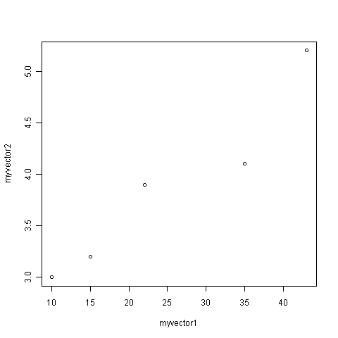
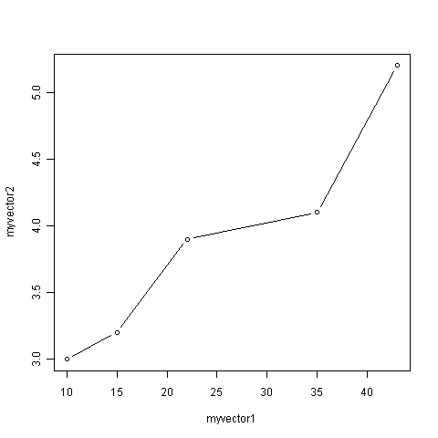
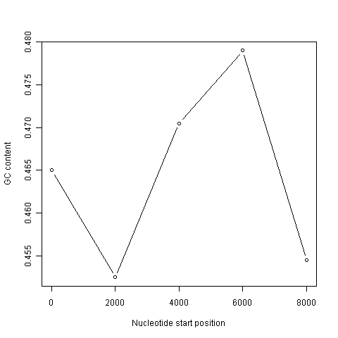
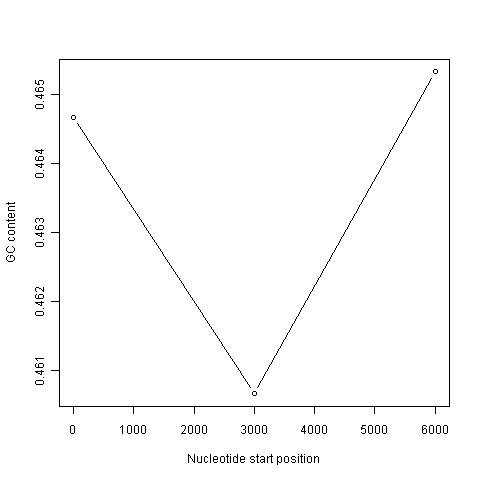
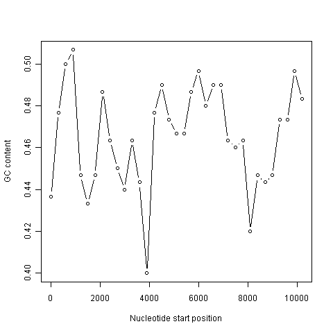

DNA Sequence Statistics (2)
===========================

A little more introduction to R
-------------------------------

In the chapter on `How to install R <./installr.html>`_,
you learnt about variables in R, such as
scalars, vectors, and lists. You also learnt how to use functions
to carry out operations on variables, for example, using the
log10() function to calculate the log to the base 10 of a scalar
variable *x*, or using the mean() function to calculate the average
of the values in a vector variable *myvector*:

.. highlight:: r

::

    > x <- 100
    > log10(x)
    [1] 2
    > myvector <- c(30,16,303,99,11,111)
    > mean(myvector)
    [1] 95

You also learnt that you can extract an element of a vector by
typing the vector name with the index of that element given in
square brackets. For example, to get the value of the 3rd element
in the vector *myvector*, we type:

::

    > myvector[3]
    [1] 303

A useful function in R is the seq() function, which can be used to
create a sequence of numbers that run from a particular number to
another particular number. For example, if we want to create the
sequence of numbers from 1-100 in steps of 1 (ie. 1, 2, 3, 4, ...
97, 98, 99, 100), we can type:

::

    > seq(1, 100, by = 1)
       1   2   3   4   5   6   7   8   9  10  11  12  13  14  15  16  17  18
     [19]  19  20  21  22  23  24  25  26  27  28  29  30  31  32  33  34  35  36
     [37]  37  38  39  40  41  42  43  44  45  46  47  48  49  50  51  52  53  54
     [55]  55  56  57  58  59  60  61  62  63  64  65  66  67  68  69  70  71  72
     [73]  73  74  75  76  77  78  79  80  81  82  83  84  85  86  87  88  89  90
     [91]  91  92  93  94  95  96  97  98  99 100

We can change the step size by altering the value of the "by"
argument given to the function seq(). For example, if we want to
create a sequence of numbers from 1-100 in steps of 2 (ie. 1, 3, 5,
7, ... 97, 99), we can type:

::

    > seq(1, 100, by = 2)
     [1]  1  3  5  7  9 11 13 15 17 19 21 23 25 27 29 31 33 35 37 39 41 43 45 47 49
    [26] 51 53 55 57 59 61 63 65 67 69 71 73 75 77 79 81 83 85 87 89 91 93 95 97 99

In R, just as in programming languages such as Python, it is
possible to write a *for loop* to carry out the same command
several times. For example, if we want to print out the square of
each number between 1 and 10, we can write the following for loop:

::

    > for (i in 1:10) { print (i*i) }
    [1] 1
    [1] 4
    [1] 9
    [1] 16
    [1] 25
    [1] 36
    [1] 49
    [1] 64
    [1] 81
    [1] 100

In the *for loop* above, the variable *i* is a counter for the
number of cycles through the loop. In the first cycle through the
loop, the value of *i* is 1, and so *i* \* *i* =1 is printed out. In
the second cycle through the loop, the value of *i* is 2, and so
*i* \* *i* =4 is printed out. In the third cycle through the loop, the
value of *i* is 3, and so *i* \* *i* =9 is printed out. The loop
continues until the value of *i* is 10. In the tenth cycle through
the loop, the value of *i* is 10, and so *i* \* *i* =100 is printed
out.

Note that the commands that are to be carried out at each cycle of
the *for loop* must be enclosed within curly brackets ("{" and
"}").

You can also give a *for loop* a vector of numbers containing the
values that you want the counter *i* to take in subsequent cycles.
For example, you can make a vector *avector* containing the numbers
2, 9, 100, and 133, and write a *for loop* to print out the square
of each number in vector *avector*:

::

    > avector <- c(2, 9, 100, 133)
    > for (i in avector) { print (i*i) }
    [1] 4
    [1] 81
    [1] 10000
    [1] 17689

How can we use a *for loop* to print out the square of every second
number between 1 and 10? The answer is to use the seq() function to
tell the *for loop* to take every second number between 1 and 10:

::

    > for (i in seq(1, 10, by = 2)) { print (i*i) } 
    [1] 1
    [1] 9
    [1] 25
    [1] 49
    [1] 81

In the first cycle of this loop, the value of *i* is 1, and so
*i* \* *i* =1 is printed out. In the second cycle through the loop,
the value of *i* is 3, and so *i* \* *i* =9 is printed out. The loop
continues until the value of *i* is 9. In the fifth cycle through
the loop, the value of *i* is 9, and so *i* \* *i* =81 is printed
out.

R allows the production of a variety of plots, including
scatterplots, histograms, piecharts, and boxplots. For example, if
you have two vectors of numbers *myvector1* and *myvector2*, you
can plot a scatterplot of the values in *myvector1* against the
values in *myvector2* using the plot() function. If you want to
label the axes on the plot, you can do this by giving the plot()
function values for its optional arguments *xlab* and *ylab*:

::

    > myvector1 <- c(10, 15, 22, 35, 43)
    > myvector2 <- c(3, 3.2, 3.9, 4.1, 5.2)
    > plot(myvector1, myvector2, xlab="myvector1", ylab="myvector2")

|image0| 

If you look at the help page for the plot() function, you
will see that there are lots of optional arguments (inputs) that it
can take that. For example, one optional argument is the *type*
argument, that determines the type of the plot. By default, plot()
will draw a dot at each data point, but if we set *type* to be "b",
then it will also draw a line between each subsequent data point:

::

    > plot(myvector1, myvector2, xlab="myvector1", ylab="myvector2", type="b")

|image1| 

We have been using built-in R functions such as mean(),
length(), print(), plot(), etc. We can also create our own
functions in R to do calculations that you want to carry out very
often on different input data sets. For example, we can create a
function to calculate the value of 20 plus the square of some input
number:

::

    > myfunction <- function(x) { return(20 + (x*x)) }

This function will calculate the square of a number (*x*), and then
add 20 to that value. The return() statement returns the calculated
value. Once you have typed in this function, the function is then
available for use. For example, we can use the function for
different input numbers (eg. 10, 25):

::

    > myfunction(10)
    [1] 120
    > myfunction(25) 
    [1] 645

You can view the code that makes up a function by typing its name
(without any parentheses). For example, we can try this by typing
"myfunction":

::

    > myfunction
    function(x) { return(20 + (x*x)) }

When you are typing R, if you want to, you can write comments by
writing the comment text after the "#" sign. This can be useful if
you want to write some R commands that other people need to read
and understand. R will ignore the comments when it is executing the
commands. For example, you may want to write a comment to explain
what the function log10() does:

::

    > x <- 100
    > log10(x) # Finds the log to the base 10 of variable x.
    [1] 2

Reading sequence data with SeqinR
---------------------------------

In the
`previous chapter <./chapter1.html>`_ 
you learnt how to use to search for and download the sequence data
for a given NCBI accession from the NCBI Sequence Database, 
either
`via the NCBI website <./chapter1.html#retrieving-genome-sequence-data-via-the-ncbi-website>`_
or `using the getncbiseq() function in R <./chapter1.html#retrieving-genome-sequence-data-using-seqinr>`_.

For example, you could have downloaded the sequence data for a the
DEN-1 Dengue virus sequence (NCBI accession NC\_001477),
and stored it on a file on your computer (eg. "den1.fasta").

Once you have downloaded the sequence data for a particular NCBI
accession, and stored it on a file on your computer, you can then
read it into R by using read.fasta function from the SeqinR R
package. For example, if you have stored the DEN-1 Dengue virus   
sequence in a file "den1.fasta", you can type:

::

    > library("seqinr")                           # Load the SeqinR package.
    > dengue <- read.fasta(file = "den1.fasta")   # Read in the file "den1.fasta".   
    > dengueseq <- dengue[[1]]                    # Put the sequence in a vector called "dengueseq". 

Once you have retrieved a sequence from the NCBI Sequence Database
and stored it in a vector variable such as *dengueseq* in the
example above, it is possible to extract subsequence of the
sequence by type the name of the vector (eg. *dengueseq*) followed
by the square brackets containing the indices for those
nucleotides. For example, to obtain nucleotides 452-535 of the
DEN-1 Dengue virus genome, we can type:

::

    > dengueseq[452:535]
     [1] "c" "g" "a" "g" "g" "g" "g" "g" "a" "g" "a" "g" "c" "c" "g" "c" "a" "c" "a"
    [20] "t" "g" "a" "t" "a" "g" "t" "t" "a" "g" "c" "a" "a" "g" "c" "a" "g" "g" "a"
    [39] "a" "a" "g" "a" "g" "g" "a" "a" "a" "a" "t" "c" "a" "c" "t" "t" "t" "t" "g"
    [58] "t" "t" "t" "a" "a" "g" "a" "c" "c" "t" "c" "t" "g" "c" "a" "g" "g" "t" "g"
    [77] "t" "c" "a" "a" "c" "a" "t" "g"
    

Local variation in GC content
-----------------------------

In the `previous chapter <./chapter1.html#gc-content-of-dna>`_, 
you learnt that to find out the GC
content of a genome sequence (percentage of nucleotides in a genome
sequence that are Gs or Cs), you can use the GC() function in the
SeqinR package. For example, to find the GC content of the
DEN-1 Dengue virus sequence that we have stored in the vector
*dengueseq*, we can type:

::

    > GC(dengueseq)
    [1] 0.4666977

The output of the GC() is the fraction of nucleotides in a sequence
that are Gs or Cs, so to convert it to a percentage we need to
multiply by 100. Thus, the GC content of the DEN-1 Dengue virus  
genome is about 0.467 or 46.7%.

Although the GC content of the whole DEN-1 Dengue virus genome
sequence is about 46.7%, there is probably local variation in GC
content within the genome. That is, some regions of the genome
sequence may have GC contents quite a bit higher than 46.7%, while
some regions of the genome sequence may have GC contents that are
quite a big lower than 46.7%. Local fluctuations in GC content
within the genome sequence can provide different interesting
information, for example, they may reveal cases of horizontal
transfer or reveal biases in mutation.

If a chunk of DNA has moved by horizontal transfer from the genome
of a species with low GC content to a species with high GC content,
the chunk of horizontally transferred DNA could be detected as a
region of unusually low GC content in the high-GC recipient
genome.

On the other hand, a region unusually low GC content in an
otherwise high-GC content genome could also arise due to biases in
mutation in that region of the genome, for example, if mutations
from Gs/Cs to Ts/As are more common for some reason in that region
of the genome than in the rest of the genome.

A sliding window analysis of GC content
---------------------------------------

In order to study local variation in GC content within a genome
sequence, we could calculate the GC content for small chunks of the
genome sequence. The DEN-1 Dengue virus genome sequence is 10735
nucleotides long. To study variation in GC content within the
genome sequence, we could calculate the GC content of chunks of the
DEN-1 Dengue virus genome, for example, for each 2000-nucleotide chunk of the
genome sequence:

::

    > GC(dengueseq[1:2000])      # Calculate the GC content of nucleotides 1-2000 of the Dengue genome
    [1] 0.465
    > GC(dengueseq[2001:4000])   # Calculate the GC content of nucleotides 2001-4000 of the Dengue genome
    [1] 0.4525
    > GC(dengueseq[4001:6000])   # Calculate the GC content of nucleotides 4001-6000 of the Dengue genome
    [1] 0.4705
    > GC(dengueseq[6001:8000])   # Calculate the GC content of nucleotides 6001-8000 of the Dengue genome
    [1] 0.479
    > GC(dengueseq[8001:10000])  # Calculate the GC content of nucleotides 8001-10000 of the Dengue genome
    [1] 0.4545 
    > GC(dengueseq[10001:10735]) # Calculate the GC content of nucleotides 10001-10735 of the Dengue genome
    [1] 0.4993197

From the output of the above calculations, we see that the region
of the DEN-1 Dengue virus genome from nucleotides 1-2000 has a GC content of
46.5%, while the region of the Dengue genome from
nucleotides 2001-4000 has a GC content of about 45.3%. Thus,
there seems to be some local variation in GC content within
the Dengue genome sequence. 

Instead of typing in the commands above to tell R to calculate the
GC content for each 2000-nucleotide chunk of the DEN-1 Dengue 
genome, we can use a *for loop* to carry out the same
calculations, but by typing far fewer commands. That is, we can use
a *for loop* to take each 2000-nucleotide chunk of the
DEN-1 Dengue virus genome, and to calculate the GC content of
each 2000-nucleotide chunk. Below we will explain the following
*for loop* that has been written for this purpose:

::

    > starts <- seq(1, length(dengueseq)-2000, by = 2000)
    > starts
    [1]    1 2001 4001 6001 8001 
    > n <- length(starts)    # Find the length of the vector "starts"
    > for (i in 1:n) { 
            chunk <- dengueseq[starts[i]:(starts[i]+1999)]
            chunkGC <- GC(chunk)
            print (chunkGC)
         }  
    [1] 0.465
    [1] 0.4525
    [1] 0.4705
    [1] 0.479
    [1] 0.4545

The command "starts <- seq(1, length(dengueseq)-2000, by = 2000)"
stores the result of the seq() command in the vector *starts*,
which contains the values 1, 2001, 4001, 6001, and 8001.

We set the variable *n* to be equal to the number of elements in
the vector *starts*, so it will be 5 here, since the vector
*starts* contains the five elements 1, 2001, 4001, 6001 and 8001. The
line "for (i in 1:n)" means that the counter *i* will take values of
1-5 in subsequent cycles of the *for loop*. The *for loop* above is
spread over several lines. However, R will not execute the commands
within the *for loop* until you have typed the final "}" at the end
of the *for loop* and pressed "Return".

Each of the three commands within the *for loop* are carried out in
each cycle of the loop. In the first cycle of the loop, *i* is 1,
the vector variable *chunk* is used to store the region from
nucleotides 1-2000 of the Dengue virus sequence, the GC content of that
region is calculated and stored in the variable *chunkGC*, and the
value of *chunkGC* is printed out.

In the second cycle of the loop, *i* is 2, the vector variable
*chunk* is used to store the region from nucleotides 2001-4000 of
the Dengue virus sequence, the GC content of that region is calculated
and stored in the variable *chunkGC*, and the value of *chunkGC* is
printed out. The loop continues until the value of *i* is 5. In the
fifth cycle through the loop, the value of *i* is 5, and so the GC
content of the region from nucleotides 8001-10000 is printed out.

Note that we stop the loop when we are looking at the region from
nucleotides 8001-10000, instead of continuing to another cycle of
the loop where the region under examiniation would be from
nucleotides 10001-12000. The reason for this is because the length
of the Dengue virus genome sequence is just 10735 nucleotides, so there
is not a full 2000-nucleotide region from nucleotide 10001 to the
end of the sequence at nucleotide 10735.

The above analysis of local variation in GC content is what is
known as a *sliding window analysis of GC content*. By calculating
the GC content in each 2000-nucleotide chunk of the Dengue virus 
genome, you are effectively sliding a 2000-nucleotide
*window* along the DNA sequence from start to end, and calculating
the GC content in each non-overlapping window (chunk of DNA).

Note that this sliding window analysis of GC content is a slightly
simplified version of the method usually carried out by
bioinformaticians. In this simplified version, we have calculated
the GC content in non-overlapping windows along a DNA sequence.
However, it is more usual to calculate GC content in overlapping
windows along a sequence, although that makes the code slightly
more complicated.

A sliding window plot of GC content
-----------------------------------

It is common to use the data generated from a sliding window
analysis to create a *sliding window plot of GC content*. To create
a sliding window plot of GC content, you plot the local GC content
in each window of the genome, versus the nucleotide position of the
start of each window. We can create a sliding window plot of GC
content by typing:

::

    > starts <- seq(1, length(dengueseq)-2000, by = 2000)
    > n <- length(starts)    # Find the length of the vector "starts"
    > chunkGCs <- numeric(n) # Make a vector of the same length as vector "starts", but just containing zeroes 
    > for (i in 1:n) { 
            chunk <- dengueseq[starts[i]:(starts[i]+1999)]
            chunkGC <- GC(chunk)
            print(chunkGC)
            chunkGCs[i] <- chunkGC 
         }  
    > plot(starts,chunkGCs,type="b",xlab="Nucleotide start position",ylab="GC content")

|image2| 

In the code above, the line "chunkGCs <- numeric(n)" makes a
new vector *chunkGCs* which has the same number of elements as the
vector *starts* (5 elements here). This vector *chunkGCs* is then
used within the *for loop* for storing the GC content of each chunk
of DNA.

After the loop, the vector *starts* can be plotted against the
vector *chunkGCs* using the plot() function, to get a plot of GC
content against nucleotide position in the genome sequence. This is
a *sliding window plot of GC content*.

You may want to use the code above to create sliding window plots
of GC content of different species' genomes, using different
windowsizes. Therefore, it makes sense to write a function to do
the sliding window plot, that can take the windowsize that the user
wants to use and the sequence that the user wants to study as
arguments (inputs):

::

    > slidingwindowplot <- function(windowsize, inputseq) 
    {
       starts <- seq(1, length(inputseq)-windowsize, by = windowsize)
       n <- length(starts)    # Find the length of the vector "starts"
       chunkGCs <- numeric(n) # Make a vector of the same length as vector "starts", but just containing zeroes 
       for (i in 1:n) { 
            chunk <- inputseq[starts[i]:(starts[i]+windowsize-1)]
            chunkGC <- GC(chunk)
            print(chunkGC)
            chunkGCs[i] <- chunkGC 
       }  
       plot(starts,chunkGCs,type="b",xlab="Nucleotide start position",ylab="GC content")
    }

This function will make a sliding window plot of GC content for a
particular input sequence *inputseq* specified by the user, using a
particular windowsize *windowsize* specified by the user. Once you
have typed in this function once, you can use it again and again to
make sliding window plots of GC contents for different input DNA
sequences, with different windowsizes. For example, you could
create two different sliding window plots of the DEN-1 Dengue 
virus genome sequence, using windowsizes of 3000 and 300
nucleotides, respectively:

::

    > slidingwindowplot(3000, dengueseq)

|image3|

::

    > slidingwindowplot(300, dengueseq)

|image4|

Over-represented and under-represented DNA words
------------------------------------------------

In the `previous chapter <./chapter1.html#dna-words>`_, you learnt that the count() function in
the SeqinR R package can calculate the frequency of all DNA words
of a certain length in a DNA sequence. For example, if you want to
know the frequency of all DNA words that are 2 nucleotides long in
the Dengue virus genome sequence, you can type:

::

    > count(dengueseq, 2)
     aa   ac   ag   at   ca   cc   cg   ct   ga   gc   gg   gt   ta   tc   tg   tt 
    1108  720  890  708  901  523  261  555  976  500  787  507  440  497  832  529 

It is interesting to identify DNA words that are two nucleotides
long ("dinucleotides", ie. "AT", "AC", etc.) that are
over-represented or under-represented in a DNA sequence. If a
particular DNA word is *over-represented* in a sequence, it means
that it occurs many more times in the sequence than you would have
expected by chance. Similarly, if a particular DNA word is
*under-represented* in a sequence, it means it occurs far fewer
times in the sequence than you would have expected.

.. include:: <isogrk1.txt>

A statistic called |rgr| (Rho) is used to measure how over- or
under-represented a particular DNA word is. For a 2-nucleotide
(dinucleotide) DNA word |rgr| is calculated as: 

|rgr|\ (xy) = f\ :sub:`xy`\ /(f\ :sub:`x`\ \*f\ :sub:`y`\ ),

where f\ :sub:`xy`\  and f\ :sub:`x`\  are the frequencies of the DNA
words *xy* and *x* in the DNA sequence under study. For example,
the value of |rgr| for the DNA word "TA" can be calculated as:
|rgr|\ (TA) = f\ :sub:`TA`\ /(f\ :sub:`T`\ \* f\ :sub:`A`\ ),
where f\ :sub:`TA`\ , f\ :sub:`T`\  and f\ :sub:`A`\  are the
frequencies of the DNA words "TA", "T" and "A" in the DNA 
sequence.

The idea behind the |rgr| statistic is that, if a DNA sequence had a
frequency f\ :sub:`x`\  of a 1-nucleotide DNA word *x*, and a
frequency f\ :sub:`y`\  of a 1-nucleotide DNA word *y*, then we
expect the frequency of the 2-nucleotide DNA word *xy* to be
f\ :sub:`x`\ \* f\ :sub:`y`\ . That is, the frequencies of the
2-nucleotide DNA words in a sequence are expected to be equal the 
products of the specific frequencies of the two nucleotides that
compose them. If this were true, then |rgr| would be equal to 1. If
we find that |rgr| is much greater than 1 for a particular
2-nucleotide word in a sequence, it indicates that that
2-nucleotide word is much more common in that sequence than
expected (ie. it is *over-represented*).

For example, say that your input sequence has only 5% Ts (ie.
f\ :sub:`T`\  = 0.05). In a random DNA sequence with 5% Ts, you
would expect to see the word "TT" very infrequently. In fact, we 
would only expect 0.05 \* 0.05=0.0025 (0.25%) of 2-nucleotide words 
to be TTs (ie. we expect f\ :sub:`TT`\  =
f\ :sub:`T`\ \*  f\ :sub:`T`\ ). This is because Ts are rare, so
they are expected to be adjacent to each other very infrequently if 
the few Ts are randomly scattered throughout the DNA. Therefore, if 
you see lots of TT 2-nucleotide words in your real input sequence
(eg. f\ :sub:`TT`\  = 0.3, so |rgr| = 0.3/0.0025 = 120), you would
suspect that natural selection has acted to increase the number of 
occurrences of the TT word in the sequence (presumably because it
has some beneficial biological function).

To find over-represented and under-represented DNA words that are 2
nucleotides long in the DEN-1 Dengue virus sequence, we can
calculate the |rgr| statistic for each 2-nucleotide word in the
sequence. For example, given the number of occurrences of the
individual nucleotides A, C, G and T in the Dengue sequence, and
the number of occurrences of the DNA word GC in the sequence (500,
from above), we can calculate the value of |rgr| for the 2-nucleotide
DNA word "GC", using the formula |rgr|\ (GC) =
f\ :sub:`GC`\ /(f\ :sub:`G`\  \* f\ :sub:`C`\ ), where
f\ :sub:`GC`\ , f\ :sub:`G`\  and f\ :sub:`C`\  are the
frequencies of the DNA words "GC", "G" and "C" in the DNA
sequence:

::

    > count(dengueseq, 1) # Get the number of occurrences of 1-nucleotide DNA words
        a     c     g     t 
       3426 2240 2770 2299
    > 2770/(3426+2240+2770+2299) # Get fG
    [1] 0.2580345
    > 2240/(3426+2240+2770+2299) # Get fC
    [1] 0.2086633
    > count(dengueseq, 2) # Get the number of occurrences of 2-nucleotide DNA words
      aa   ac   ag   at   ca   cc   cg   ct   ga   gc   gg   gt   ta   tc   tg   tt 
     1108  720  890  708  901  523  261  555  976  500  787  507  440  497  832  529 
    > 500/(1108+720+890+708+901+523+261+555+976+500+787+507+440+497+832+529) # Get fGC
    [1] 0.04658096
    > 0.04658096/(0.2580345*0.2086633) # Get rho(GC)
    [1] 0.8651364

We calculate a value of |rgr|\ (GC) of approximately 0.865. This means
that the DNA word "GC" is about 0.865 times as common in the
DEN-1 Dengue virus sequence than expected. That is, it seems to be slightly under-represented.

Note that if the ratio of the observed to expected frequency of a
particular DNA word is very low or very high, then we would suspect
that there is a statistical under-representation or
over-representation of that DNA word. However, to be sure that this
over- or under-representation is statistically significant, we
would need to do a statistical test. We will not deal with the
topic of how to carry out the statistical test here.

Summary
-------

In this chapter, you will have learnt to use the following R
functions:

#. seq() for creating a sequence of numbers
#. print() for printing out the value of a variable
#. plot() for making a plot (eg. a scatterplot)
#. numeric() for making a numeric vector of a particular length
#. function() for making a function

All of these functions belong to the standard installation of R.
You also learnt how to use *for loops* to carry out the same
operation again and again, each time on different inputs.

Links and Further Reading
-------------------------

Some links are included here for further reading. 

For background reading on DNA sequence statistics, it is
recommended to read Chapter 1 of
*Introduction to Computational Genomics: a case studies approach*
by Cristianini and Hahn (Cambridge University Press;
`www.computational-genomics.net/book/ <http://www.computational-genomics.net/book/>`_).

For more in-depth information and more examples on using the SeqinR
package for sequence analysis, look at the SeqinR documentation,
`http://pbil.univ-lyon1.fr/software/seqinr/doc.php?lang=eng <http://pbil.univ-lyon1.fr/software/seqinr/doc.php?lang=eng>`_.

There is also a very nice chapter on "Analyzing Sequences", which
includes examples of using SeqinR for sequence analysis, in the
book *Applied statistics for bioinformatics using R* by Krijnen
(available online at
`cran.r-project.org/doc/contrib/Krijnen-IntroBioInfStatistics.pdf <http://cran.r-project.org/doc/contrib/Krijnen-IntroBioInfStatistics.pdf>`_).

For a more in-depth introduction to R, a good online tutorial is
available on the "Kickstarting R" website,
`cran.r-project.org/doc/contrib/Lemon-kickstart <http://cran.r-project.org/doc/contrib/Lemon-kickstart/>`_.

There is another nice (slightly more in-depth) tutorial to R
available on the "Introduction to R" website,
`cran.r-project.org/doc/manuals/R-intro.html <http://cran.r-project.org/doc/manuals/R-intro.html>`_.

Acknowledgements
----------------

Thank you to Noel O'Boyle for helping in using Sphinx, `http://sphinx.pocoo.org <http://sphinx.pocoo.org>`_, to create
this document, and github, `https://github.com/ <https://github.com/>`_, to store different versions of the document
as I was writing it, and readthedocs, `http://readthedocs.org/ <http://readthedocs.org/>`_, to build and distribute
this document.

Many of the ideas for the examples and exercises for this chapter  
were inspired by the Matlab case studies on
*Haemophilus influenzae*
(`www.computational-genomics.net/case\_studies/haemophilus\_demo.html <http://www.computational-genomics.net/case_studies/haemophilus_demo.html>`_)
and Bacteriophage lambda
(`http://www.computational-genomics.net/case\_studies/lambdaphage\_demo.html <http://www.computational-genomics.net/case_studies/lambdaphage_demo.html>`_)
from the website that accompanies the book
*Introduction to Computational Genomics: a case studies approach*
by Cristianini and Hahn (Cambridge University Press;
`www.computational-genomics.net/book/ <http://www.computational-genomics.net/book/>`_).

Thank you to Jean Lobry and Simon Penel for helpful advice on using
the SeqinR package.

Contact
-------

I will be grateful if you will send me (`Avril Coghlan <http://www.ucc.ie/microbio/avrilcoghlan/>`_) corrections or suggestions for improvements to
my email address a.coghlan@ucc.ie 

License
-------

The content in this book is licensed under a `Creative Commons Attribution 3.0 License
<http://creativecommons.org/licenses/by/3.0/>`_.

Exercises
---------

Answer the following questions, using the R package. For each
question, please record your answer, and what you typed into R to
get this answer.

Model answers to the exercises are given in the chapter entitled
`Answers to the exercises on DNA Sequence Statistics (2) <./chapter2_answers.html>`_.

Q1. Draw a sliding window plot of GC content in the DEN-1 Dengue virus genome, using a window size of 200 nucleotides. Do you see any regions of unusual DNA content in the genome (eg. a high peak or low trough)? 
    Make a sketch of each plot that you draw.
    At what position (in base-pairs) in the genome is there the largest
    change in local GC content (approximate position is fine here)?
    Compare the sliding window plots of GC content created using window
    sizes of 200 and 2000 nucleotides. How does window
    size affect your ability to detect differences within 
    the Dengue virus genome?

Q2. Draw a sliding window plot of GC content in the genome sequence for the bacterium *Mycobacterium leprae* strain TN (accession NC\_002677) using a window size of 20000 nucleotides. Do you see any regions of unusual DNA content in the genome (eg. a high peak or low trough)? 
    Make a sketch of each plot that you draw.
    Write down the approximate nucleotide position of the highest peak or lowest trough that you see.
    Why do you think a window size of 20000 nucleotides was chosen?
    What do you see if you use a much smaller windowsize (eg. 200 nucleotides) or a much larger windowsize (eg. 200,000 nucleotides)?

Q3. Write a function to calculate the AT content of a DNA sequence (ie. the fraction of the nucleotides in the sequence that are As or Ts). What is the AT content of the *Mycobacterium leprae* TN genome? 
    Hint: use the function count() to make a table containing the
    number of As, Gs, Ts and Cs in the sequence. Remember that function
    count() produces a table object, and you can access the elements of
    a table object using double square brackets.
    Do you notice a relationship between the AT content of the
    *Mycobacterium leprae* TN genome, and its GC content?

Q4. Write a function to draw a sliding window plot of AT content. Use it to make a sliding window plot of AT content along the *Mycobacterium leprae* TN genome, using a windowsize of 20000 nucleotides. Do you notice any relationship between the sliding window plot of GC content along the *Mycobacterium leprae* genome, and the sliding window plot of AT content? 
    Make a sketch of the plot that you draw.

Q5. Is the 3-nucleotide word GAC GC over-represented or under-represented in the *Mycobacterium leprae* TN genome sequence? 
    What is the frequency of this word in the sequence?
    What is the expected frequency of this word in the sequence?
    What is the |rgr| (Rho) value for this word?
    How would you figure out whether there is already an R function to calculate |rgr| (Rho)? Is there one that you could use?

