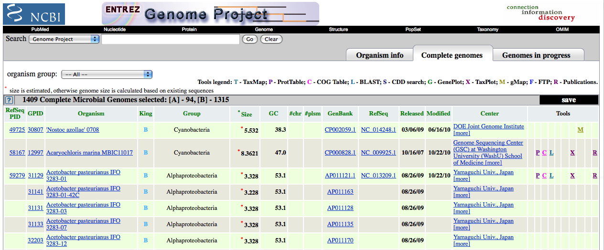

Sequence Databases
==================

The NCBI Sequence Database
--------------------------

All published genome sequences are available over the internet, as
it is a requirement of every scientific journal that any published
DNA or RNA or protein sequence must be deposited in a public
database. The main resources for storing and distributing sequence
data are three large databases: the NCBI database
(`www.ncbi.nlm.nih.gov/ <http://www.ncbi.nlm.nih.gov/>`_), the
European Molecular Biology Laboratory (EMBL) database
(`www.ebi.ac.uk/embl/ <http://www.ebi.ac.uk/embl/>`_, and the DNA
Database of Japan (DDBJ) database
(`www.ddbj.nig.ac.jp/ <http://www.ddbj.nig.ac.jp/>`_). These
databases collect all publicly available DNA, RNA and protein
sequence data and make it available for free. They exchange data
nightly, so contain essentially the same data.

In this chapter we will discuss the NCBI database. Note however
that it contains essentially the same data as in the EMBL/DDBJ
databases. The NCBI database contains several sub-databases,
including the NCBI Nucleotide database and the NCBI Protein
database. These are both sequence databases. The NCBI database also
contains sub-databases that contain non-sequence data, such as
PubMed, which contains data on scientific publications.

Sequences in the NCBI Sequence Database (or EMBL/DDBJ) are
identified by an accession number. This is a unique number that is
only associated with one sequence. For example, the accession
number NC\_001477 is for the DEN-1 Dengue virus genome
sequence. The accession number is what identifies the sequence. It
is reported in scientific papers describing that sequence.

As well as the sequence itself, for each sequence the NCBI database
(or EMBL/DDBJ databases) also stores some additional *annotation*
data, such as the name of the species it comes from, references to
publications describing that sequence, etc. Some of this annotation
data was added by the person who sequenced a sequence and submitted
it to the NCBI database, while some may have been added later by a
human curator working for NCBI.

Searching for an accession number in the NCBI database
------------------------------------------------------

In the `DNA Sequence Statistics chapter <chapter1.html>`_, 
you learnt how to obtain a FASTA file containing the DNA sequence
corresponding to a particular accession number, eg. accession
number NC\_001477 (the DEN-1 Dengue virus genome sequence).

Briefly, if you want to obtain a FASTA file containing the DNA or
protein sequence corresponding to a particular NCBI accession,
follow these steps:

#. Go to the NCBI website
   (`www.ncbi.nlm.nih.gov <http://www.ncbi.nlm.nih.gov>`_)
#. Type the accession number in the search box on the top of
   the NCBI homepage, after 'Search All Databases for', and press
   'Search'. This searches the NCBI sequence databases (nucleotide and
   protein sequence databases) for the accession number of interest.
#. The results from your search will appear in a page saying how
   many hits you found in each NCBI database. The number of hits to a
   particular database (eg. the NCBI Nucleotide database or the NCBI
   Protein database) appears to the left of the database name in a
   square box. If the accession that you searched for corresponds to a
   DNA sequence, you should get a hit to a nucleotide sequence record.
   Click on the word 'Nucleotide' to go to that record. Similarly, if
   the accession corresponds to a protein sequence, you should get a
   hit to a protein sequence record, and you should click on the word
   'Protein' to go to that record.
#. Once you are looking for the NCBI record for the sequence, to
   download the sequence, click on the 'Send' link at the top
   right of the page, and select 'File' under 'Choose Destination' in the
   box that pops up, and then choose 'FASTA' as the format that you want
   from the drop-down menu that appears. Then click 'Create File'.
   Choose a sensible name for the file, for example
   'den1.fasta' for the DEN-1 Dengue virus genome
   sequence, and save the file in an easy-to-find place so that you
   will be able to find it again later (for example, make a folder in
   the 'My Documents' folder with your name (eg. folder 'JoeBloggs')
   and save it there).

As explained in the `DNA Sequence Statistics chapter <chapter1.html>`_, 
the FASTA format is a file format commonly used to store sequence information. The first line starts
with the character '>' followed by a name and/or description for
the sequence. Subsequent lines contain the sequence itself.

::

    >mysequence1
    ACATGAGACAGACAGACCCCCAGAGACAGACCCCTAGACACAGAGAGAG
    TATGCAGGACAGGGTTTTTGCCCAGGGTGGCAGTATG

A FASTA file can contain more than one sequence. If a FASTA file
contains many sequences, then for each sequence it will have a
header line starting with '>' followed by the sequence itself.

::

    >mysequence1
    ACATGAGACAGACAGACCCCCAGAGACAGACCCCTAGACACAGAGAGAG
    TATGCAGGACAGGGTTTTTGCCCAGGGTGGCAGTATG
    >mysequence2
    AGGATTGAGGTATGGGTATGTTCCCGATTGAGTAGCCAGTATGAGCCAG
    AGTTTTTTACAAGTATTTTTCCCAGTAGCCAGAGAGAGAGTCACCCAGT
    ACAGAGAGC

NCBI Sequence Format (NCBI Format)
----------------------------------

As mentioned above, for each sequence the NCBI database stores some
extra information such as the species that it came from,
publications describing the sequence, etc. This information is
stored in the NCBI entry or NCBI record for the sequence. The NCBI
entry for a sequence can be viewed by searching the NCBI database
for the accession number for that sequence. The NCBI entries for
sequences are stored in a particular format, known as NCBI format.

To view the NCBI entry for the DEN-1 Dengue virus (which has
accession NC\_001477), follow these steps:

#. Go to the NCBI website
   (`www.ncbi.nlm.nih.gov <http://www.ncbi.nlm.nih.gov>`_).
#. Search for the accession number.
#. On the results page, if your sequence corresponds to a
   nucleotide (DNA or RNA) sequence, you should see a hit in the
   Nucleotide database, and you should click on the word 'Nucleotide'
   to view the NCBI entry for the hit. Likewise, if your sequence
   corresponds to a protein sequence, you should see a hit in the
   Protein database, and you should click on the word 'Protein' to
   view the NCBI entry for the hit.
#. After you click on 'Nucleotide' or 'Protein' in the previous
   step, the NCBI entry for the accession will appear.

The NCBI entry for an accession contains a lot of information about
the sequence, such as papers describing it, features in the
sequence, etc. The 'DEFINITION' field gives a short description for
the sequence. The 'ORGANISM' field in the NCBI entry identifies the
species that the sequence came from. The 'REFERENCE' field contains
scientific publications describing the sequence. The 'FEATURES'
field contains information about the location of features of
interest inside the sequence, such as regulatory sequences or genes
that lie inside the sequence. The 'ORIGIN' field gives the
sequence itself.

RefSeq
------

When carrying out searches of the NCBI database, it is important to
bear in mind that the database may contain redundant sequences for
the same gene that were sequenced by different laboratories. Some
of these sequences may be better quality than others.

There are also many different types of nucleotide sequences and
protein sequences in the NCBI database. With respect to nucleotide
sequences, some many be entire genomic DNA sequences, some may be
mRNAs, and some may be lower quality sequences such as expressed
sequence tags (ESTs, which are derived from parts of mRNAs), or DNA
sequences of contigs from genome projects. Furthermore, some
sequences may be manually curated so that the associated entries
contain extra information, but the majority of sequences are
uncurated.

As mentioned above, the NCBI database often contains redundant
information for a gene (because many different labs have sequenced
the gene, and submitted their sequences to the NCBI database), some
of which may be low quality. As a result, NCBI has made a special
database called RefSeq (reference sequence database), which is a
subset of the NCBI database. The data in RefSeq is manually
curated, is high quality sequence data, and is non-redundant (this means
that each gene (or splice-form of a gene, in the case of eukaryotes),
protein, or genome sequence is only represented once). 

The data in RefSeq is of much higher quality than the rest of the NCBI Sequence
Database. However, unfortunately, because of the high level of
manual curation required, RefSeq does not cover all species, and is
not comprehensive for the species that are covered so far.

You can easily tell that a sequence comes from RefSeq because its
accession number starts with particular sequence of letters. That
is, RefSeq sequences corresponding to protein records usually start with
'NP\_', and RefSeq curated complete genome sequences usually start with
'NC\_'.

Querying the NCBI Database
--------------------------

As a bioinformatician you may need to interrogate the NCBI Database
to find particular sequences or a set of sequences matching given
criteria, such as:

-  All human nucleotide sequences associated with colon cancer
-  The sequence published in *Cell* **31**:375-382
-  All sequences from *Aspergillus nidulans*
-  Sequences submitted by Peter Arctander
-  Flagellin or fibrinogen sequences
-  The glutamine synthetase gene from *Haemophilus influenzae*
-  The upstream control region of the *Bacillus subtilis spo0A* gene
-  The sequence of the *Bacillus subtilis* Spo0A protein
-  The genome sequence of *Bacillus subtilis*

Say for example that you want to find all high-quality human
nucleotide sequences associated with colon cancer. Firstly, to find
all nucleotide sequences associated with colon cancer, follow these
steps:

#. Go to the NCBI website
   (`www.ncbi.nlm.nih.gov <http://www.ncbi.nlm.nih.gov>`_).
#. As you want to search for nucleotide sequences, select
   'Nucleotide' from the drop-down list above the search box at the
   top of the NCBI homepage.
#. Type **"colon cancer"** in the search box. Note that you need to
   include the inverted commas, ie. type **"colon cancer"** and not
   **colon cancer**. This is because if you type just
   **colon cancer**, the search will be for records that contain the
   words 'colon' or 'cancer' (not necessarily both words), while you
   want records that contain the phrase 'colon cancer'. Press 'Search'.
#. The search results will include all nucleotide sequences for
   which the phrase 'colon cancer' appears somewhere in their NCBI
   records. The phrase may appear in the 'DEFINITION' field of the
   NCBI record (which gives a short description), in the title of a
   journal article on the nucleotide sequence, or elsewhere in the
   NCBI record.

The search above should have identified thousands of sequences from
many different species. Some of these may be of low quality. To
limit your search to high quality sequences, you may decide to
restrict your search to RefSeq sequences. You can do this using
NCBI search tags. NCBI search tags allow you to limit your restrict
your search to a specific data set, such as the RefSeq data set. It
also allows us to limit searches to retrieve records with certain
attributes, such as molecule type (eg. mRNAs) or species.

The NCBI search tag "[PROP]" allows you to restrict your search to
sequences form a particular subset of the NCBI Sequence Database,
such as RefSeq. To use NCBI search tags to restrict your search to
nucleotide sequences from RefSeq that are associated with colon
cancer, follow these steps:

#. Go to the NCBI website, and select 'Nucleotide' from the
   drop-down list above the search box.
#. In the search box, type
   **"colon cancer" AND srcdb\_refseq[PROP]**, and press 'Search'.

This should give you all RefSeq nucleotide sequences for which the phrase
'colon cancer' appears somehwere in the NCBI record.

Note that you should find fewer sequences than when you just
searched for **"colon cancer"**, but these should be higher quality
sequences (since they are RefSeq sequences), 
and their NCBI entries will contain manually curated
information about the sequences (eg. details of publications about
the sequences and features in them).

The search above should have identified RefSeq sequences from
several species (eg. human, mouse, etc.) that are associated with
colon cancer (or more precisely, where the phrase 'colon cancer'
appears somewhere in the NCBI records). 
What if you are only interested in human sequences
associated with colon cancer?

One way to solve this problem is to use NCBI search tags to
restrict your search to human sequences. The "[ORGN]" search tag
allows you to restrict your search to sequences from a particular
species (eg. *Mycobacteriuma leprae*, the bacterium that causes
leprosy, or set of species (eg. Bacteria). To use NCBI search tags to retrieve human RefSeq
sequences associated with colon cancer, follow these steps:

#. Go to the NCBI website, and select 'Nucleotide' from the
   drop-down list above the search box.
#. In the search box, type
   **"colon cancer" AND srcdb\_refseq[PROP] AND "Homo sapiens"[ORGN]**,
   and press 'Search'.

This will give you a list of all human nucleotide sequences from
RefSeq that are associated with colon cancer (or more precisely, all
the human nucleotide sequences from Refseq for which the phrase 'colon
cancer' appears somewhere in the NCBI record).

In the searches above you used the "[PROP]" and "[ORGN]" NCBI
sequence tags to retrict your search to a specific subset of the
NCBI Sequence Database, or to sequences from a particular taxon,
respectively. Other useful NCBI sequence tags are:

-  "[JOUR]": to restrict your search to sequences described in a
   paper published in a particular journal
-  "[VOL]": to restrict your search to sequences described in a
   paper published in a particular volume of a journal
-  "[PAGE]": to restrict your search to sequences described in a
   paper with a particular start-page in a journal
-  "[AU]": to restrict your search to sequences submitted to the
   NCBI Database by a particular person, or described in a journal
   paper by a particular person. The person's name should be in the
   form: surname first-initial (eg. Bloggs J[AU])
-  "[ORGN]": to restrict your search to sequences from a particular
   species or taxon (eg. *Mycobacterium leprae* or *Mycobacterium* or Bacteria or
   Archaea)
-  "[PROP]": to restrict your search to a particular subset of the
   NCBI database (eg. "srcdb\_refseq[PROP]" restricts your search to
   RefSeq) or to a particular type of molecule (eg. "biomol
   mrna[PROP]" restrict your search to mRNA sequences).

Finding the genome sequence for a particular species
----------------------------------------------------

Microbial genomes are generally smaller than eukaryotic genomes
(*Escherichia coli* has about 5 million base pair in its genome,
while the human genome is about 3 billion base pairs). Because they
are considerably less expensive to sequence, many microbial genome
sequencing projects have been completed.

If you don't know the accession number for a genome sequence (eg.
for *Mycobacterium leprae*, the bacterium that causes leprosy), how can you find it out? One way to
do this is to look at the NCBI Genome website, which lists all
fully sequenced genomes and gives the accession numbers for the
corresponding DNA sequences.

If you didn't know the accession number for the
*Mycobacterium leprae* genome, you could find it on the NCBI
Genome website by following these steps:

#. Go to the NCBI Genome website
   (`http://www.ncbi.nlm.nih.gov/sites/entrez?db=Genome <http://www.ncbi.nlm.nih.gov/sites/entrez?db=Genome>`_)
#. On the homepage of the NCBI Genome website, it gives links to the
   major subdivisions of the Genome database, which include
   Eukaryota, Prokaryota (Bacteria and Archaea), and Viruses.
   Click on 'Prokaryota', since
   *Mycobacterium leprae* is a bacterium. This will bring up a list
   of all fully sequenced bacterial genomes, with the corresponding
   accession numbers. Note that more than one genome (from various
   strains) may have been sequenced for a particular species.
#. Use 'Find' in the 'Edit' menu of your web browser to search for
   'Mycobacterium leprae' on the webpage. You should find that the
   genomes of several different *M. leprae* strains have been
   sequenced. One of these is *M. leprae* TN, which has
   accession number NC\_002677.

The list of sequenced genomes on the NCBI Genomes website is not a
definitive list; that is, some sequenced genomes may be missing
from this list. If you want to find out whether a particular genome
has been sequenced, but you don't find it NCBI Genomes website's
list, you should search for it by following these steps:

#. Go to the NCBI website
   (`www.ncbi.nlm.nih.gov <http://www.ncbi.nlm.nih.gov>`_).
#. Select 'Genome' from the drop-down list above the search box.
#. Type the name of the species you are interested in in the search
   box (eg. **"Mycobacterium leprae"[ORGN]**). Press 'Search'.

Note that you could also have found the *Mycobacterium leprae*
genome sequence by searching the NCBI Nucleotide database, as the
NCBI Genome database is just a subset of the NCBI Nucleotide
database.

How many genomes have been sequenced, or are being sequenced now?
-----------------------------------------------------------------

On the NCBI Genome website
(`http://www.ncbi.nlm.nih.gov/sites/entrez?db=Genome <http://www.ncbi.nlm.nih.gov/sites/entrez?db=Genome>`_),
the front page gives a link to a list of all sequenced genomes in the
groups Eukaryota, Prokaryota (Bacteria and Archaea) and Viruses.
If you click on one of these links (eg. Prokaryota), at the top of the
page it will give the number of sequenced genomes in that group (eg. number of sequenced
prokaryotic genomes). For example, in this screenshot (from January 2011), we see that there
were 1409 complete prokaryotic genomes (94 archaeal, 1315 bacterial):

|image1| 

Another useful website that lists genome sequencing projects is the
Genomes OnLine Database (GOLD), which lists genomes that have been
completely sequenced, or are currently being sequenced. To find the
number of complete or ongoing bacterial sequencing projects, follow
these steps:

#. Go to the GOLD website
   (`http://genomesonline.org/ <http://genomesonline.org/>`_).
#. Click on the yellow 'Enter GOLD' button in the centre of the
   webpage. On the subsequent page, it will give the number of ongoing
   bacterial, archaeal and eukaryotic genome sequencing projects.
#. Click on the 'Bacterial Ongoing Genomes' link to see the list of
   ongoing bacterial genome sequencing projects. By default, just the
   first 100 projects, and the rest are listed on subsequent pages.
   In one of the columns
   of the page, this gives the university or institute that the genome
   was sequenced in. Other columns give the taxonomic information for
   the organism, and links to the sequence data.
#. Find the number of published genome sequencing projects. Go back
   one page, to the page with the 'Bacterial Ongoing Genomes' link. 
   You will see that this page also lists the number of complete published
   genomes. To see a list of these genomes, click on 'Complete Published
   Genomes'. This will bring up a page that gives the number of published
   genomes at the top of the page. In one column of the page, this
   gives the university or institute that the genome was sequenced
   in.

As explained above, it is possible to identify genome sequence data
in the NCBI Genome database. The GOLD database also gives some
information about ongoing genome projects. Often, the GOLD database
lists some ongoing projects that are not yet present in the NCBI
Genome Database, because the sequence data has not yet been
submitted to the NCBI Database. If you are interested in finding
out how many genomes have been sequenced or are currently being
sequenced for a particular species (eg. *Mycobacterium leprae*), it
is a good idea to look at both the NCBI Genome database and at
GOLD.

Summary
-------

In this chapter, you have learnt how to retrieve sequences from
the NCBI Sequence database, as well as to find out how many genomes
have been sequenced or are currently being sequenced for a
particular species.

Links and Further Reading
-------------------------

There is detailed information on how to search the NCBI database on
the NCBI Help website at
`http://www.ncbi.nlm.nih.gov/bookshelf/br.fcgi?book=helpentrez?part=EntrezHelp <http://www.ncbi.nlm.nih.gov/bookshelf/br.fcgi?book=helpentrez%26part=EntrezHelp>`_.

There is more information about the GOLD database in the paper
describing GOLD by Lolios *et al*, which is available at
`http://www.ncbi.nlm.nih.gov/pmc/articles/PMC2808860/?tool=pubmed <http://www.ncbi.nlm.nih.gov/pmc/articles/PMC2808860/?tool=pubmed>`_.

Acknowledgements
----------------

Thank you to Noel O'Boyle for helping in using Sphinx, `http://sphinx.pocoo.org <http://sphinx.pocoo.org>`_, to create
this document, and github, `https://github.com/ <https://github.com/>`_, to store different versions of the document
as I was writing it, and readthedocs, `http://readthedocs.org/ <http://readthedocs.org/>`_, to build and distribute
this document.

Thank you to Andrew Lloyd and David Lynn, who generously shared their practical on sequence databases 
with me, which inspired many of the examples in this practical. 

Contact
-------

I will be grateful if you will send me (`Avril Coghlan <http://www.ucc.ie/microbio/avrilcoghlan/>`_) corrections or suggestions for improvements to
my email address a.coghlan@ucc.ie 

License
-------

The content in this book is licensed under a `Creative Commons Attribution 3.0 License
<http://creativecommons.org/licenses/by/3.0/>`_.

Exercises
---------

Answer the following questions. For each question, please record
your answer, and what you did/typed to get this answer.

Q1. What information about the Bacteriophage lambda sequence (NCBI accession NC\_001416) can you obtain from its annotations in the NCBI Sequence Database? 
    What does it say in the DEFINITION and ORGANISM fields of its NCBI
    record?
Q2. What were the nucleotide sequences published in *Proc Natl Acad Sci U S A* volume 103, page 6718? 
    What are their accession numbers in the NCBI Sequence Database?
Q3. How many nucleotide sequences are there from the fungus *Aspergillus nidulans* in the NCBI Sequence Database? 
    Remember to type **"Aspergillus nidulans"** including the inverted
    commas.
Q4. How many nucleotide sequences are there from the fungus *Aspergillus nidulans* in the *RefSeq* part of the NCBI Sequence Database? Q5. How many nucleotide sequences were submitted to NCBI by Peter Arctander? 
    Note that the name of the person who submitted a sequence is stored
    in the author field of the NCBI record, as is the name of people
    who published papers on the sequence. There may be more than one
    author fields in the NCBI record for a sequence, corresponding to
    the person who submitted the sequence and/or people who published
    papers on the sequence.
Q6. How many nucleotide sequences from Gammaproteobacteria are there in the NCBI Database? Q7. How many nucleotide sequences for flagellin genes from Gammaproteobacteria are there in the NCBI Database? 
    Hint: look at the examples above for cancer-related genes.
Q8. How many *mRNA sequences* for flagellin genes from Gammaproteobacteria are there in the NCBI Database? 
    Hint: look at the notes about the "[PROP]" search tag above.
Q9. How many *protein sequences* for flagellin proteins from Gammaproteobacteria are there in the NCBI database? Q10. What is the accession number for the *Buchnera aphidicola* chromosomal genome in NCBI? 
    Remember to ignore plasmid genomes!
    Do you see chromosomal genomes for more than one strain of
    *Buchnera aphidicola*?
Q11. How many fully sequenced Bacteria, Archaeal and Eukaryotic species are represented in the NCBI Genome database? Q12. How many ongoing genome sequencing projects are there for Bacteria, Archaea, and Eukarotes, respectively, in the GOLD database? Q13. Are there any genome sequencing projects ongoing at University College Cork, acccording to the GOLD database? 
    Hint: Use the 'Find' option in the 'Edit' menu of your web browser
    to search for 'Cork' in the GOLD database's webpage listing ongoing
    genome sequencing projects.
Q14. How many genome sequences are there for *Lactobacillus salivarius* in the NCBI Genomes database? 
    Why are there more than one?
Q15. How many complete or ongoing genome sequencing projects for *Lactobacillus salivarius* are listed in GOLD? 
    Does GOLD or NCBI Genomes have more sequencing projects for this
    species? If not, can you suggest an explanation why?

