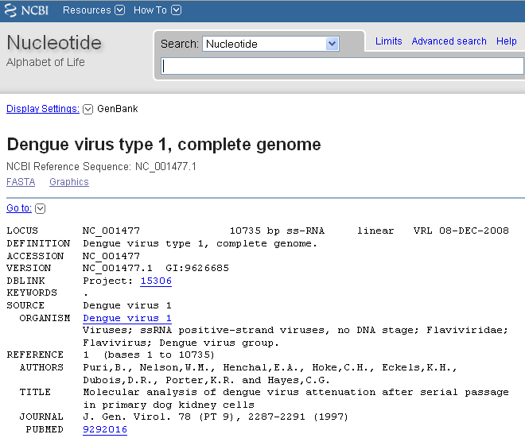
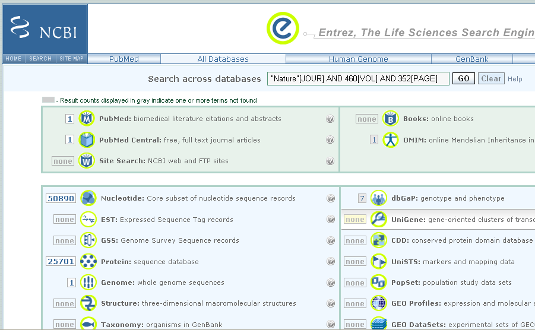
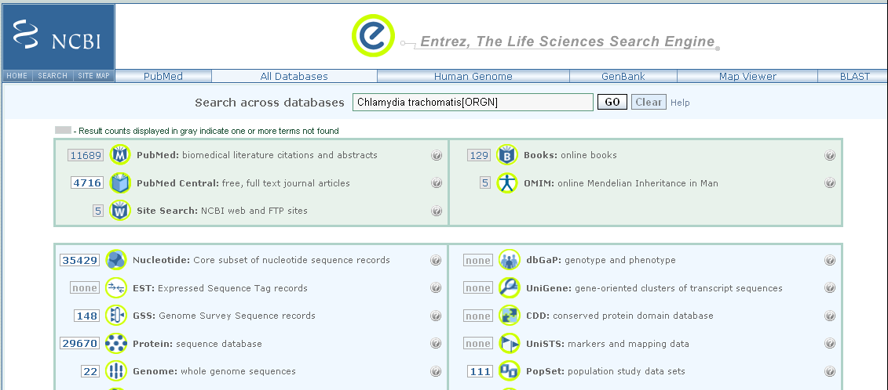
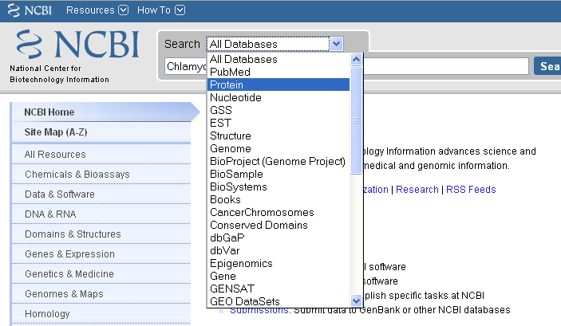

Sequence Databases
==================

The NCBI Sequence Database
--------------------------

All published genome sequences are available over the internet, as
it is a requirement of every scientific journal that any published
DNA or RNA or protein sequence must be deposited in a public
database. The main resources for storing and distributing sequence
data are three large databases: the NCBI database
(`www.ncbi.nlm.nih.gov/ <http://www.ncbi.nlm.nih.gov/>`_), the
European Molecular Biology Laboratory (EMBL) database
(`www.ebi.ac.uk/embl/ <http://www.ebi.ac.uk/embl/>`_, and the DNA
Database of Japan (DDBJ) database
(`www.ddbj.nig.ac.jp/ <http://www.ddbj.nig.ac.jp/>`_). These
databases collect all publicly available DNA, RNA and protein
sequence data and make it available for free. They exchange data
nightly, so contain essentially the same data.

In this chapter we will discuss the NCBI database. Note however
that it contains essentially the same data as in the EMBL/DDBJ
databases.

Sequences in the NCBI Sequence Database (or EMBL/DDBJ) are
identified by an accession number. This is a unique number that is
only associated with one sequence. For example, the accession
number NC\_001477 is for the DEN-1 Dengue virus genome
sequence. The accession number is what identifies the sequence. It
is reported in scientific papers describing that sequence.

As well as the sequence itself, for each sequence the NCBI database
(or EMBL/DDBJ databases) also stores some additional *annotation*
data, such as the name of the species it comes from, references to
publications describing that sequence, etc. Some of this annotation
data was added by the person who sequenced a sequence and submitted
it to the NCBI database, while some may have been added later by a
human curator working for NCBI.

The NCBI database contains several sub-databases, the most important of which are:

-  the NCBI Nucleotide database: contains DNA and RNA sequences 
-  the NCBI Protein database: contains protein sequences
-  EST: contains ESTs (expressed sequence tags), which are short sequences derived from mRNAs
-  the NCBI Genome database: contains DNA sequences for whole genomes
-  PubMed: contains data on scientific publications  

Searching for an accession number in the NCBI database
------------------------------------------------------

In the `DNA Sequence Statistics chapter (1) <./chapter1.html>`_, 
you learnt how to obtain a FASTA file containing the DNA sequence
corresponding to a particular accession number, eg. accession
number NC\_001477 (the DEN-1 Dengue virus genome sequence), either
`via the NCBI website <./chapter1.html#retrieving-genome-sequence-data-via-the-ncbi-website>`_
or `using the getncbiseq() function in R <./chapter1.html#retrieving-genome-sequence-data-using-seqinr>`_.

As explained in the `DNA Sequence Statistics (1) chapter <./chapter1.html#fasta-format>`_, 
the FASTA format is a file format commonly used to store sequence information. The first line starts
with the character '>' followed by a name and/or description for
the sequence. Subsequent lines contain the sequence itself.

.. highlight:: r

::

    >mysequence1
    ACATGAGACAGACAGACCCCCAGAGACAGACCCCTAGACACAGAGAGAG
    TATGCAGGACAGGGTTTTTGCCCAGGGTGGCAGTATG

A FASTA file can contain more than one sequence. If a FASTA file
contains many sequences, then for each sequence it will have a
header line starting with '>' followed by the sequence itself.

::

    >mysequence1
    ACATGAGACAGACAGACCCCCAGAGACAGACCCCTAGACACAGAGAGAG
    TATGCAGGACAGGGTTTTTGCCCAGGGTGGCAGTATG
    >mysequence2
    AGGATTGAGGTATGGGTATGTTCCCGATTGAGTAGCCAGTATGAGCCAG
    AGTTTTTTACAAGTATTTTTCCCAGTAGCCAGAGAGAGAGTCACCCAGT
    ACAGAGAGC

NCBI Sequence Format (NCBI Format)
----------------------------------

As mentioned above, for each sequence the NCBI database stores some
extra information such as the species that it came from,
publications describing the sequence, etc. This information is
stored in the NCBI entry or NCBI record for the sequence. The NCBI
entry for a sequence can be viewed by searching the NCBI database
for the accession number for that sequence. The NCBI entries for
sequences are stored in a particular format, known as NCBI format.

To view the NCBI entry for the DEN-1 Dengue virus (which has
accession NC\_001477), follow these steps:

#. Go to the NCBI website
   (`www.ncbi.nlm.nih.gov <http://www.ncbi.nlm.nih.gov>`_).
#. Search for the accession number.
#. On the results page, if your sequence corresponds to a
   nucleotide (DNA or RNA) sequence, you should see a hit in the
   Nucleotide database, and you should click on the word 'Nucleotide'
   to view the NCBI entry for the hit. Likewise, if your sequence
   corresponds to a protein sequence, you should see a hit in the
   Protein database, and you should click on the word 'Protein' to
   view the NCBI entry for the hit.
#. After you click on 'Nucleotide' or 'Protein' in the previous
   step, the NCBI entry for the accession will appear.

For example, the NCBI entry for the DEN-1 Dengue virus genome sequence
(NCBI accession NC\_001477) looks like this:

|image2|

The NCBI entry for an accession contains a lot of information about
the sequence, such as papers describing it, features in the
sequence, etc. The 'DEFINITION' field gives a short description for
the sequence. The 'ORGANISM' field in the NCBI entry identifies the
species that the sequence came from. The 'REFERENCE' field contains
scientific publications describing the sequence. The 'FEATURES'
field contains information about the location of features of
interest inside the sequence, such as regulatory sequences or genes
that lie inside the sequence. The 'ORIGIN' field gives the
sequence itself.

RefSeq
------

When carrying out searches of the NCBI database, it is important to
bear in mind that the database may contain redundant sequences for
the same gene that were sequenced by different laboratories (because many different labs have sequenced
the gene, and submitted their sequences to the NCBI database).

There are also many different types of nucleotide sequences and
protein sequences in the NCBI database. With respect to nucleotide
sequences, some many be entire genomic DNA sequences, some may be
mRNAs, and some may be lower quality sequences such as expressed
sequence tags (ESTs, which are derived from parts of mRNAs), or DNA
sequences of contigs from genome projects. 

Furthermore, some sequences may be manually curated so that the associated entries
contain extra information, but the majority of sequences are
uncurated.

As mentioned above, the NCBI database often contains redundant
information for a gene, contains sequences of varying quality, and contains
both uncurated and curated data. 

As a result, NCBI has made a special database called RefSeq (reference sequence database), which is a
subset of the NCBI database. The data in RefSeq is manually
curated, is high quality sequence data, and is non-redundant; this means
that each gene (or splice-form of a gene, in the case of eukaryotes),
protein, or genome sequence is only represented once. 

The data in RefSeq is curated and is of much higher quality than the rest of the NCBI Sequence
Database. However, unfortunately, because of the high level of
manual curation required, RefSeq does not cover all species, and is
not comprehensive for the species that are covered so far.

You can easily tell that a sequence comes from RefSeq because its
accession number starts with particular sequence of letters. That
is, accessions of RefSeq sequences corresponding to protein records usually start with
'NP\_', and accessions of RefSeq curated complete genome sequences usually start with
'NC\_' or 'NS\_'.

Querying the NCBI Database
--------------------------

You may need to interrogate the NCBI Database
to find particular sequences or a set of sequences matching given
criteria, such as:
  
-  The sequence with accession NC\_001477
-  The sequences published in *Nature* **460**:352-358
-  All sequences from *Chlamydia trachomatis*
-  Sequences submitted by Matthew Berriman
-  Flagellin or fibrinogen sequences
-  The glutamine synthetase gene from *Mycobacteriuma leprae*
-  The upstream control region of the *Mycobacterium leprae dnaA* gene
-  The sequence of the *Mycobacterium leprae* DnaA protein
-  The genome sequence of *Trypanosoma cruzi*
-  All human nucleotide sequences associated with malaria

There are two main ways that you can query the NCBI database to find these
sets of sequences. The first possibility is to carry out searches on the 
`NCBI website <http://www.ncbi.nlm.nih.gov>`_.
The second possiblity is to carry out searches from R. 

Below, we will explain how to use both methods to carry out
queries on the NCBI database. In general, the two methods should give the
same result, but in some cases they do not, for various reasons, as shall be explained below.

Querying the NCBI Database via the NCBI Website
-----------------------------------------------

If you are carrying out searches on the `NCBI website <http://www.ncbi.nlm.nih.gov>`_, 
to narrow down your searches to specific types of sequences or to specific organisms, 
you will need to use "search tags".

For example, the search tags "[PROP]" and "[ORGN]" 
let you restrict your search to a specific subset of the
NCBI Sequence Database, or to sequences from a particular taxon,
respectively. Here is a list of useful search tags, which we will explain how to use
below:

+------------+---------------------+------------------------------------------------------------------------+
| Search tag | Example             | Restricts your search to sequences:                                    |  
+============+=====================+========================================================================+
| [AC]       | NC_001477[AC]       | With a particular accession number                                     |
+------------+---------------------+------------------------------------------------------------------------+
| [ORGN]     | Fungi[ORGN]         | From a particular organism or taxon                                    |
+------------+---------------------+------------------------------------------------------------------------+
| [PROP]     | biomol_mRNA[PROP]   | Of a specific type (eg. mRNA) or from a specific database (eg. RefSeq) |   
+------------+---------------------+------------------------------------------------------------------------+
| [JOUR]     | Nature[JOUR]        | Described in a paper published in a particular journal                 |
+------------+---------------------+------------------------------------------------------------------------+
| [VOL]      | 531[VOL]            | Described in a paper published in a particular journal volume          |
+------------+---------------------+------------------------------------------------------------------------+
| [PAGE]     | 27[PAGE]            | Described in a paper with a particular start-page in a journal         | 
+------------+---------------------+------------------------------------------------------------------------+
| [AU]       | "Smith J"[AU]       | Described in a paper, or submitted to NCBI, by a particular author     |
+------------+---------------------+------------------------------------------------------------------------+

To carry out searches of the NCBI database, you first need to go to the `NCBI website <http://www.ncbi.nlm.nih.gov>`_,
and type your search query into the search box at the top. For example, to search for all sequences
from Fungi, you would type "Fungi[ORGN]" into the search box on the NCBI website. 

You can combine the search tags above by using "AND", to make more complex searches. For example, to
find all mRNA sequences from Fungi, you could type "Fungi[ORGN] AND biomol_mRNA[PROP]" in the search
box on the NCBI website. 

Likewise, you can also combine search tags by using "OR", for example, to search for all mRNA sequences
from Fungi or Bacteria, you would type "(Fungi[ORGN] OR Bacteria[ORGN]) AND biomol_mRNA[PROP]" in the search
box. Note that you need to put brackets around "Fungi[ORGN] OR Bacteria[ORGN]" to specify that the word "OR"
refers to these two search tags. 

Here are some examples of searches, some of them made by combining search terms using "AND":

+-------------------------------------------+------------------------------------------------------------------------+
| Typed in the search box                   | Searches for sequences:                                                |  
+===========================================+========================================================================+
| NC_001477[AC]                             | With accession number NC_001477                                        |
+-------------------------------------------+------------------------------------------------------------------------+
| Nature[JOUR] AND 460[VOL] AND 352[PAGE]   | Published in *Nature* **460**:352-358                                  |
+-------------------------------------------+------------------------------------------------------------------------+
| "Chlamydia trachomatis"[ORGN]             | From the bacterium *Chlamydia trachomatis*                             |
+-------------------------------------------+------------------------------------------------------------------------+
| "Berriman M"[AU]                          | Published in a paper, or submitted to NCBI, by M. Berriman             |
+-------------------------------------------+------------------------------------------------------------------------+
| flagellin OR fibrinogen                   | Which contain the word 'flagellin' or 'fibrinogen' in their NCBI record|
+-------------------------------------------+------------------------------------------------------------------------+
| "Mycobacterium leprae"[ORGN] AND dnaA     | Which are from *M. leprae*, and contain "dnaA" in their NCBI record    | 
+-------------------------------------------+------------------------------------------------------------------------+ 
| "Homo sapiens"[ORGN] AND "colon cancer"   | Which are from human, and contain "colon cancer" in their NCBI record  | 
+-------------------------------------------+------------------------------------------------------------------------+
| "Homo sapiens"[ORGN] AND malaria          | Which are from human, and contain "malaria" in their NCBI record       | 
+-------------------------------------------+------------------------------------------------------------------------+ 
| "Homo sapiens"[ORGN] AND biomol_mrna[PROP]| Which are mRNA sequences from human                                    | 
+-------------------------------------------+------------------------------------------------------------------------+ 
| "Bacteria"[ORGN] AND srcdb_refseq[PROP]   | Which are RefSeq sequences from Bacteria                               | 
+-------------------------------------------+------------------------------------------------------------------------+ 
| "colon cancer" AND srcdb_refseq[PROP]     | From RefSeq, which contain "colon cancer" in their NCBI record         | 
+-------------------------------------------+------------------------------------------------------------------------+

Note that if you are searching for a phrase such as "colon cancer" or "Chlamydia trachomatis, you need to put the phrase 
in inverted commas when typing it into the search box. This is because if you type the phrase in the search box without using inverted 
commas, the search will be for NCBI records that contain either of the two words 'colon' or 'cancer' (or either of the
two words 'Chlamydia' or 'trachomatis'), not necessarily both words. 

As mentioned above, the NCBI database contains several sub-databases, including the NCBI Nucleotide database and the 
NCBI Protein database. If you go to the `NCBI website <http://www.ncbi.nlm.nih.gov>`_, and type one of the search
queries above in the search box at the top of the page, the results page will tell you how many matching NCBI records
were found in each of the NCBI sub-databases. 

For example, if you search for "Chlamydia trachomatis[ORGN]", you will get matches to proteins from *C. trachomatis* in 
the NCBI Protein database, matches to DNA and RNA sequences from *C. trachomatis* in the NCBI Nucleotide database,
matches to whole genome sequences for *C. trachomatis* strains in the NCBI Genome database, and so on:

|image5|

Alternatively, if you know in advance that you want to search a particular sub-database, for example, the NCBI Protein
database, when you go to the `NCBI website <http://www.ncbi.nlm.nih.gov>`_, you can select that sub-database from
the drop-down list above the search box, so that you will search that sub-database:

|image6|

Example: finding the sequences published in *Nature* **460**:352-358
^^^^^^^^^^^^^^^^^^^^^^^^^^^^^^^^^^^^^^^^^^^^^^^^^^^^^^^^^^^^^^^^^^^^             

For example, if you want to find sequences
published in *Nature* **460**:352-358, you can use the "[JOUR]", "[VOL]" and "[PAGE]" search terms. That is, you would
go to the `NCBI website <http://www.ncbi.nlm.nih.gov>`_ and type in the search 
box on the top: "Nature"[JOUR] AND 460[VOL] AND 352[PAGE], where [JOUR] specifies the journal name, 
[VOL] the volume of the journal the paper is in, and [PAGE] the page number.

|image3|

This should bring up a results page with "50890" beside the word "Nucleotide", and "1" beside the word
"Genome", and "25701" beside the word "Protein", indicating that there were 50890 hits to sequence records in the Nucleotide database, 
which contains DNA and RNA sequences, and 1 hit to the Genome database, which contains genome sequences, and 25701
hits to the Protein database, which contains protein sequences:

|image4|

If you click on the word "Nucleotide", it will bring up a webpage with a list of links to the NCBI sequence 
records for those 50890 hits. The 50890 hits are all contigs from the schistosome worm *Schistosoma mansoni*.

Likewise, if you click on the word "Protein", it will bring up a webpage with a list of links to the NCBI
sequence records for the 25701 hits, and you will see that the hits are all predicted proteins for *Schistosoma
mansoni*.

If you click on the word "Genome", it will bring you to the NCBI record for the *Schistosoma mansoni* genome
sequence, which has NCBI accession NS\_00200. Note that the accession starts with "NS\_", which indicates that
it is a RefSeq accession. 

Therefore, in *Nature* volume 460, page 352, the *Schistosoma mansoni* genome sequence was published, along
with all the DNA sequence contigs that were sequenced for the genome project, and all the predicted proteins
for the gene predictions made in the genome sequence. You can view the original paper on the *Nature* website
at `http://www.nature.com/nature/journal/v460/n7253/abs/nature08160.html <http://www.nature.com/nature/journal/v460/n7253/abs/nature08160.html>`_.

Note: *Schistmosoma mansoni* is a parasitic worm that is responsible for causing 
`schistosomiasis <http://apps.who.int/tdr/svc/diseases/schistosomiasis>`_, 
which is classified by the WHO as a neglected tropical disease.

Querying the NCBI Database via R
--------------------------------

Instead of carrying out searches of the NCBI database on the NCBI website, you can
carry out searches directly from R by using the SeqinR R package.

It is possible to use the SeqinR R package to retrieve sequences from these databases.
The SeqinR package was written by the group that created the ACNUC database in Lyon, France
(http://pbil.univ-lyon1.fr/databases/acnuc/acnuc.html).
The ACNUC database is a database that contains most of the data from the NCBI Sequence Database,
as well as data from other sequence databases such as UniProt and Ensembl. 

An advantage of the ACNUC database is that it brings together data from various different sources, and makes
it easy to search, for example, by using the SeqinR R package.

As will be explained below, the ACNUC database is organised into various different ACNUC (sub)-databases,
which contain different parts of the NCBI database, and when you want to search the NCBI database
via R, you will need to specify which ACNUC sub-database the NCBI data that you want to query is stored in.

To obtain a full list of the ACNUC sub-databases that you can access using SeqinR, you
can use the "choosebank()" function from SeqinR:

::

    > library("seqinr") # Load the SeqinR R package
    > choosebank()      # List all the sub-databases in ACNUC
      [1] "genbank"       "embl"          "emblwgs"       "swissprot"    
      [5] "ensembl"       "hogenom"       "hogenomdna"    "hovergendna"  
      [9] "hovergen"      "hogenom4"      "hogenom4dna"   "homolens"     
      [13] "homolensdna"   "hobacnucl"     "hobacprot"     "phever2"      
      [17] "phever2dna"    "refseq"        "nrsub"         "greviews"     
      [21] "bacterial"     "protozoan"     "ensbacteria"   "ensprotists"  
      [25] "ensfungi"      "ensmetazoa"    "ensplants"     "mito"         
      [29] "polymorphix"   "emglib"        "taxobacgen"    "refseqViruses"

Alas, the ACNUC sub-databases do not have a one-to-one correspondence with the NCBI sub-databases (the
NCBI Protein database, NCBI EST database, NCBI Genome database, etc.)!

Three of the most important sub-databases in ACNUC which can be searched from R are:

-  "genbank": this contains DNA and RNA sequences from the NCBI Sequence Database, except for certain
   classes of sequences (eg. draft genome sequence data from genome sequencing projects)
-  "refseq": this contains DNA and RNA sequences from `Refseq <./chapter3.html#refseq>`_, 
   the curated part of the NCBI Sequence Database
-  "refseqViruses": this contains DNA, RNA and proteins sequences from viruses from RefSeq 

You can find more information about what each of these ACNUC databases contains by
looking at the `ACNUC website <http://pbil.univ-lyon1.fr/databases/acnuc/acnuc.html>`_. 

You can carry out complex queries using the "query()" function from
the SeqinR package. If you look at the help page for the query() function (by
typing "help(query)", you will see that it allows you to specify criteria that you
require the sequences to fulfill. 

For example, to search for a sequence with a particular NCBI accession, you can use the "AC=" argument in "query()".
The "query()" function will then search for sequences in the NCBI Sequence Database that match your criteria. 

Just as you can use "AC=" to specify an accession in a search, you can specify that you want to find 
sequences whose NCBI records contain a certain keywords by using "K=" as an argument (input) to the 
"query()" function. Likewise you can limit a search to either DNA or mRNA sequences by using the "M="
argument for the "query()" function. Here are some more possible arguments you can use in the "query()" function:

+------------+---------------------+------------------------------------------------------------------------+
| Argument   | Example             | Restricts your search to sequences:                                    |  
+============+=====================+========================================================================+
| "AC="      | "AC=NC_001477"      | With a particular accession number                                     |
+------------+---------------------+------------------------------------------------------------------------+
| "SP="      | "SP=Chlamydia"      | From a particular organism or taxon                                    |
+------------+---------------------+------------------------------------------------------------------------+
| "M="       | "M=mRNA"            | Of a specific type (eg. mRNA)                                          |   
+------------+---------------------+------------------------------------------------------------------------+
| "J="       | "J=Nature"          | Described in a paper published in a particular journal                 |
+------------+---------------------+------------------------------------------------------------------------+
| "R="       | "R=Nature/460/352"  | Described in a paper in a particular journal, volume and start-page    |
+------------+---------------------+------------------------------------------------------------------------+
| "AU="      | "AU=Smith"          | Described in a paper, or submitted to NCBI, by a particular author     |
+------------+---------------------+------------------------------------------------------------------------+

The full list of possible arguments for the "query()" funtion are given on its help page.
Here are some examples using the query function:

+-------------------------------------------+------------------------------------------------------------------------+
| Input to the query() function             | Searches for sequences:                                                |  
+===========================================+========================================================================+
| "AC=NC_001477"                            | With accession number NC_001477                                        |
+-------------------------------------------+------------------------------------------------------------------------+
| "R=Nature/460/352"                        | Published in *Nature* **460**:352-358                                  |
+-------------------------------------------+------------------------------------------------------------------------+
| "SP=Chlamydia trachomatis"                | From the bacterium *Chlamydia trachomatis*                             |
+-------------------------------------------+------------------------------------------------------------------------+
| "AU=Berriman"                             | Published in a paper, or submitted to NCBI, by someone called Berriman |
+-------------------------------------------+------------------------------------------------------------------------+
| "K=flagellin OR K=fibrinogen"             | Which have the keyword 'flagellin' or 'fibrinogen'                     |
+-------------------------------------------+------------------------------------------------------------------------+
| "SP=Mycobacterium leprae AND K=dnaA"      | Which are from *M. leprae*, and have the keyword "dnaA"                | 
+-------------------------------------------+------------------------------------------------------------------------+ 
| "SP=Homo sapiens AND K=colon cancer"      | Which are from human, and have the keyword "colon cancer"              | 
+-------------------------------------------+------------------------------------------------------------------------+
| "SP=Homo sapiens AND K=malaria"           | Which are from human, and have the keyword "malaria"                   | 
+-------------------------------------------+------------------------------------------------------------------------+ 
| "SP=Homo sapiens AND M=mrna"              | Which are mRNA sequences from human                                    | 
+-------------------------------------------+------------------------------------------------------------------------+ 
| "SP=Bacteria"                             | Which are sequences from Bacteria                                      | 
+-------------------------------------------+------------------------------------------------------------------------+ 

As explained above, the ACNUC database contains the NCBI sequence data organised into several
sub-databases, and you can view the list of those sub-databases by using the "choosebank()"
function from the SeqinR package. When you want to use "query()" to carry out a particular 
sub-database (eg. "genbank", which contains DNA and RNA sequences from the NCBI Sequence Database), you
need to first specify the database that you want to search by using the "choosebank()" function,
for example:

::

    > choosebank("genbank") # Specify that we want to search the 'genbank' ACNUC sub-database

Likewise, to specify that we want to search the 'refseq' ACNUC sub-database, which contains sequences
from the NCBI RefSeq database, we would type:

::

    > choosebank("refseq") # Specify that we want to search the 'refseq' ACNUC sub-database

Once you have specified which ACNUC sub-database you want to search, you can carry out a search of that 
sub-database by using the "query()" function. You need to pass the "query()" function both a name for your query 
(which you can make up),  and the query itself (which will be in the format of the examples in the table above). For example,
if we want to search for RefSeq sequences from Bacteria, we might decide to call our query "RefSeqBact", and we would
call the "query()" function as follows:

::

    > query("RefSeqBact", "SP=Bacteria")

As explained below, the results of the search are stored in a list variable called "RefSeqBact", and can
be retrieved from that list variable. The last thing to do once you have completed your search is to close
the connection to the ACNUC sub-database that you were searching, by typing:

::

    > closebank()

Thus, there are three steps involved in carrying out a query using SeqinR: first use "choosebank()" to select
the ACNUC sub-database to search, secondly use "query()" to query the database, and thirdly use "closebank()"
to close the connection to the ACNUC sub-database. 

Another example could be to search for mRNA sequences from the parasitic worm *Schistosoma mansoni* in the
NCBI Nucleotide database. The appropriate ACNUC sub-database to search is the "genbank" ACNUC sub-database.
We may decide to call our search "SchistosomamRNA". Therefore, to carry out the search, we type in R:

::

    > choosebank("genbank")
    > query("SchistosomamRNA", "SP=Schistosoma mansoni AND M=mrna")
    > closebank()
 

Example: finding the sequence for the DEN-1 Dengue virus genome 
^^^^^^^^^^^^^^^^^^^^^^^^^^^^^^^^^^^^^^^^^^^^^^^^^^^^^^^^^^^^^^^

Another example could be to search for the DEN-1 Dengue virus genome sequence, which has accession NC\_001477.
This is a viral genome sequence, and so should be in the ACNUC sub-database "refSeqViruses". Thus to search
for this sequence, calling our search "Dengue1", we type in R:

::

    > choosebank("refseqViruses")
    > query("Dengue1", "AC=NC_001477")

The result of the search is now stored in the list variable *Dengue1*. 
Remember that a list is an R object that is like a vector, but can contain elements
that are numeric and/or contain characters. In this case, the list *Dengue1* contains information
on the NCBI records that match the query (ie. information on the NCBI record for accession NC\_001477). 

If you look at the help page for "query()", the details of the arguments are given under the heading "Arguments",
and the details of the results (outputs) are given under the heading "Value". If you read this now, you
will see that it tells us that the result of the "query()" function is a list with six different named
elements, named "call", "name", "nelem", "typelist", "req", and "socket". The content of each of these
six named elements is explained, for example, the "nelem" element contains the number of sequences
that match the query, and the "req" element contains their accession numbers.

In our example, the list object *Dengue1* is an output of the "query()" function, and
so has each of these six named elements, as we can find out by using the "attributes()" function, 
and looking at the named elements listed under the heading "$names":

::

    > attributes(Dengue1)     
      $names
      [1] "call"     "name"     "nelem"    "typelist" "req"      "socket"  
      $class
      [1] "qaw"

As explained in the `brief introduction to R <./installr.html#a-brief-introduction-to-r>`_, we can retrieve 
the value for each of the named elements in the list *Dengue1* by using "$", followed by the element's name, 
for example, to get the value of the element named "nelem" in the list *Dengue1*, we type:

::

    > Dengue1$nelem
      [1] 1 

This tells us that there was one sequence in the 'refseqViruses' ACNUC database that matched the query.
This is what we would expect, as there should only be one sequence corresponding to accession NC\_001477.

To obtain the accession numbers of the sequence found, we can type:

::

    > Dengue1$req
      [[1]]
           name      length       frame      ncbicg 
      "NC_001477"     "10735"         "0"         "1" 

As expected, the accession number of the matching sequence is NC\_001477.

When you type "attributes(Dengue1)" you can see that there are two headings, "$names", and
"$class". As explained above, the named elements of the list variable *Dengue1* are listed
under the heading "$names". In fact, the headings "$names" and "$class" are two *attributes*
of the list variable *Dengue1*. We can retrieve the values of the attributes of a variable
using the "attr()" function. For example, to retrieve the value of the attribute "$names"
of *Dengue1*, we type:

::

    > attr(Dengue1, "names")
      [1] "call"     "name"     "nelem"    "typelist" "req"      "socket"

This gives us the value of the attribute "$names", which contains the the names of the named
elements of the list variable *Dengue1*. Similarly, we can retrieve the value of the a
attribute "$class" of *Dengue1*, we type:

::

    > attr(Dengue1, "class")
      [1] "qaw"

This tells us that the value of the attribute "$class" is "qaw".

The final step in retrieving a genomic DNA sequence is to use the "getSequence()" function to tell R to 
retrieve the sequence data. The command below uses "getSequence()" to retrieve the sequence data
for the DEN-1 Dengue virus genome, and puts the sequence into a variable *dengueseq*:

::

    > dengueseq <- getSequence(Dengue1$req[[1]])

Note that the input to the getSequence() command is Dengue1$req[[1]], which contains the name of the NCBI record 
that the list *Dengue1* contains information about. 

Once you have retrieved a sequence, you can then print it out. The variable *dengueseq* is a
vector containing the nucleotide sequence. Each element of the vector contains one nucleotide of
the sequence. Therefore, we can print out the first 50 nucleotides of 
the DEN-1 Dengue genome sequence by typing:

::

    > dengueseq[1:50]
      [1] "a" "g" "t" "t" "g" "t" "t" "a" "g" "t" "c" "t" "a" "c" "g" "t" "g" "g" "a"
      [20] "c" "c" "g" "a" "c" "a" "a" "g" "a" "a" "c" "a" "g" "t" "t" "t" "c" "g" "a"
      [39] "a" "t" "c" "g" "g" "a" "a" "g" "c" "t" "t" "g"
      

Note that dengueseq[1:50] refers to the elements of the vector *dengueseq* with
indices from 1-50. These elements contain the first 50 nucleotides of the DEN-1 Dengue virus genome
sequence. 

As well as retrieving the DNA (or RNA or protein) sequence itself, SeqinR can also
retrieve all the *annotations* for the sequence, for example, information
on when the sequence was sequenced, who sequenced it, what organism is it from,
what paper was it described in, what genes were identified in the sequence, and so on.

Once you have retrieved a sequence using SeqinR, you can retrieved its annotations
by using the "getAnnot()" function. For example, to view the annotations
for the DEN-1 Dengue virus genome sequence, we type:

::

    > annots <- getAnnot(Dengue1$req[[1]])

This stores the annotations information from the NCBI record for the DEN-1 Dengue
virus sequence in a vector variable *annots*, with one line of the NCBI
record in each element of the vector. Therefore, we can print out the first 20 lines
of the NCBI record by typing:

::

    > annots[1:20]
      [1] "LOCUS       NC_001477              10735 bp ss-RNA     linear   VRL 08-DEC-2008"
      [2] "DEFINITION  Dengue virus type 1, complete genome."                              
      [3] "ACCESSION   NC_001477"                                                          
      [4] "VERSION     NC_001477.1  GI:9626685"                                            
      [5] "DBLINK      Project: 15306"                                                     
      [6] "KEYWORDS    ."                                                                  
      [7] "SOURCE      Dengue virus 1"                                                     
      [8] "  ORGANISM  Dengue virus 1"                                                     
      [9] "            Viruses; ssRNA positive-strand viruses, no DNA stage; Flaviviridae;"
      [10] "            Flavivirus; Dengue virus group."                                    
      [11] "REFERENCE   1  (bases 1 to 10735)"                                              
      [12] "  AUTHORS   Puri,B., Nelson,W.M., Henchal,E.A., Hoke,C.H., Eckels,K.H.,"        
      [13] "            Dubois,D.R., Porter,K.R. and Hayes,C.G."                            
      [14] "  TITLE     Molecular analysis of dengue virus attenuation after serial passage"
      [15] "            in primary dog kidney cells"                                        
      [16] "  JOURNAL   J. Gen. Virol. 78 (PT 9), 2287-2291 (1997)"                         
      [17] "   PUBMED   9292016"                                                            
      [18] "REFERENCE   2  (bases 1 to 10735)"                                              
      [19] "  AUTHORS   McKee,K.T. Jr., Bancroft,W.H., Eckels,K.H., Redfield,R.R.,"         
      [20] "            Summers,P.L. and Russell,P.K."                                      

On the left of the annotations, you will see that there is a column containing the field name. 
For example, the line of the with "ACCESSION" in the left column is the accession field, which 
contains the accession for the sequence (NC_001477 for the DEN-1 Dengue virus). 

The line with "ORGANISM" in the left column is the organism field, and usually contains the Latin name 
for the organism ("Dengue virus 1" here). The line with "AUTHORS" in the
left column is the authors field, and contain the names of authors that wrote papers to
describe the sequence and/or the names of the people who submitted the sequence to the NCBI Database.  

When you have finished your running your query and getting the corresponding sequences and annotations, close
the connection to the ACNUC sub-database:

::

> closebank()

Example: finding the sequences published in *Nature* **460**:352-358
^^^^^^^^^^^^^^^^^^^^^^^^^^^^^^^^^^^^^^^^^^^^^^^^^^^^^^^^^^^^^^^^^^^^

We described above how to search for the sequences published in *Nature* **460**:352-358, using the NCBI website.
A second method is to use the SeqinR R package to search the ACNUC databases (which contain the NCBI sequence data) from R. 

If you look at the help page the "query()" function, you see that you can query for sequences 
published in a particular paper using R=refcode, specifying the reference as refcode 
such as in jcode/volume/page (e.g., JMB/13/5432 or R=Nature/396/133). For the
paper *Nature* **460**:352-358, we would need to use the refcode 'R=Nature/460/352'.

First we need to specify which of the ACNUC databases we want to search. For example, to specify
that we want to search the "genbank" ACNUC database, which contains DNA and RNA sequences
from the NCBI Nucleotide database, we type:

::

    > choosebank("genbank") # Specify that we want to search the 'genbank' ACNUC sub-database

We can then search the 'genbank' database for sequences that match a specific set of criteria
by using the "query()" function. For example, to search for sequences that were published in
*Nature* **460**:352-358, we type:

::

    > query('naturepaper', 'R=Nature/460/352')

The line above tells R that we want to store the results of the query in an R list variable called
*naturepaper*. To get the value of the element named "nelem" in the list *naturepaper*, we type:

::

    > naturepaper$nelem
      [1] 19022

This tells us that there were 19022 sequences in the 'genbank' ACNUC database that matched the query.
The 'genbank' ACNUC database contains DNA or RNA sequences from the NCBI Nucleotide database. 
Why don't we get the same number of sequences as found by carrying out the search on the NCBI website
(where we found 50890 hits to the NCBI Nucleotide database)? The reason is that the ACNUC 'genbank'
database does not contain all the sequences in the NCBI Nucleotide database, for example, it does
not contain sequences that are in RefSeq or many short DNA sequences from sequencing projects.

To obtain the accession numbers of the first five of the 19022 sequences, we can type:

::

    > accessions <- naturepaper$req
    > accessions[1:5]
      [[1]]
           name     length      frame     ncbicg 
      "FN357292"  "4179495"        "0"        "1" 
      [[2]]
           name     length      frame     ncbicg 
      "FN357293"  "2211188"        "0"        "1" 
      [[3]]
           name     length      frame     ncbicg 
      "FN357294"  "1818661"        "0"        "1" 
      [[4]]
           name     length      frame     ncbicg 
      "FN357295"  "2218116"        "0"        "1" 
      [[5]]
           name     length      frame     ncbicg 
      "FN357296"  "3831198"        "0"        "1" 

This tells us that the NCBI accessions of the first five sequences (of the 19022
DNA or RNA sequences found that were published in *Nature* **460**:352-358) are FN357292,
FN357293, FN357294, FN357295, and FN357296. 

To retrieve these first five sequences, and print out the first 10 nucleotide
bases of each sequence, we use the getSequence() command, typing:

::

    > for (i in 1:5)
      {
         seqi <- getSequence(naturepaper$req[[i]]) 
         print(seqi[1:10])
      }
      [1] "t" "t" "g" "t" "c" "g" "a" "t" "t" "a"
      [1] "g" "g" "t" "c" "c" "t" "t" "a" "a" "g"
      [1] "g" "c" "c" "t" "g" "a" "c" "c" "a" "t"
      [1] "t" "a" "t" "t" "t" "c" "c" "a" "a" "t"
      [1] "c" "a" "a" "t" "c" "a" "c" "t" "c" "a"     

Note that the input to the getSequence() command is Dengue1$req[[i]], which contains the name of *i* th NCBI record 
that the list *naturepaper* contains information about. 

Once we have carried out our queries and retrieved the sequences, the final step is to close
the connection to the ACNUC sub-database that we searched ("genbank" here):

::

    > closebank()

Saving sequence data in a FASTA-format file
^^^^^^^^^^^^^^^^^^^^^^^^^^^^^^^^^^^^^^^^^^^

Once you have retrieved a sequence, or set of sequences from the NCBI Database, using SeqinR,
it is conveninent to save the sequences in a file in FASTA format.
This can be done using the "write.fasta()" function in the SeqinR package, which was
introduced in `Chapter 1 <./chapter1.html#writing-sequence-data-out-as-a-fasta-file>`_.

If you look at the help page for the "write.fasta()" function, you will see
that as input it takes a list of vectors, where each vector contains one DNA, RNA or
protein sequence. 

For example, if you retrieve the sequences of human tRNAs from the NCBI Database by querying the
ACNUC "genbank" sub-database, you can save the sequences in a FASTA format file called "humantRNAs.fasta"
by typing:

::

    > choosebank("genbank")                             # select the ACNUC sub-database to be searched
    > query("humtRNAs", "SP=homo sapiens AND M=TRNA")   # specify the query
    > myseqs <- getSequence(humtRNAs)                   # get the sequences
    > mynames <- getName(humtRNAs)                      # get the names of the sequences
    > write.fasta(myseqs, mynames, file.out="humantRNAs.fasta")
    > closebank()

In the above code, we get the sequences of the human tRNAs using the function "getSequence()"    
from the SeqinR package. We also use a function "getName()"
from the SeqinR package to get the sequences' names. Then we use the "write.fasta()" function to
write the sequences to a FASTA file "humantRNAs.fasta". The "write.fasta()" takes as arguments:
the list *myseqs* containing the sequences, the list *mynames* containing the names of the sequences,
and the name of the output file ("humantRNAs.fasta" here).

Finding the genome sequence for a particular species
----------------------------------------------------

Microbial genomes are generally smaller than eukaryotic genomes
(*Escherichia coli* has about 5 million base pair in its genome,
while the human genome is about 3 billion base pairs). Because they
are considerably less expensive to sequence, many microbial genome
sequencing projects have been completed.

If you don't know the accession number for a genome sequence (eg.
for *Mycobacterium leprae*, the bacterium that causes leprosy), how can you find it out? 

The easiest way to do this is to look at the NCBI Genome website, which lists all
fully sequenced genomes and gives the accession numbers for the
corresponding DNA sequences.

If you didn't know the accession number for the
*Mycobacterium leprae* genome, you could find it on the NCBI
Genome website by following these steps:

#. Go to the NCBI Genome website
   (`http://www.ncbi.nlm.nih.gov/sites/entrez?db=Genome <http://www.ncbi.nlm.nih.gov/sites/entrez?db=Genome>`_)
#. On the homepage of the NCBI Genome website, it gives links to the
   major subdivisions of the Genome database, which include
   Eukaryota, Prokaryota (Bacteria and Archaea), and Viruses.
   Click on 'Prokaryota', since
   *Mycobacterium leprae* is a bacterium. This will bring up a list
   of all fully sequenced bacterial genomes, with the corresponding
   accession numbers. Note that more than one genome (from various
   strains) may have been sequenced for a particular species.
#. Use 'Find' in the 'Edit' menu of your web browser to search for
   'Mycobacterium leprae' on the webpage. You should find that the
   genomes of several different *M. leprae* strains have been
   sequenced. One of these is *M. leprae* TN, which has
   accession number NC\_002677.

The list of sequenced genomes on the NCBI Genomes website is not a
definitive list; that is, some sequenced genomes may be missing
from this list. If you want to find out whether a particular genome
has been sequenced, but you don't find it NCBI Genomes website's
list, you should search for it by following these steps:

#. Go to the NCBI website
   (`www.ncbi.nlm.nih.gov <http://www.ncbi.nlm.nih.gov>`_).
#. Select 'Genome' from the drop-down list above the search box.
#. Type the name of the species you are interested in in the search
   box (eg. **"Mycobacterium leprae"[ORGN]**). Press 'Search'.

Note that you could also have found the *Mycobacterium leprae*
genome sequence by searching the NCBI Nucleotide database, as the
NCBI Genome database is just a subset of the NCBI Nucleotide
database.

How many genomes have been sequenced, or are being sequenced now?
-----------------------------------------------------------------

On the NCBI Genome website
(`http://www.ncbi.nlm.nih.gov/sites/entrez?db=Genome <http://www.ncbi.nlm.nih.gov/sites/entrez?db=Genome>`_),
the front page gives a link to a list of all sequenced genomes in the
groups Eukaryota, Prokaryota (Bacteria and Archaea) and Viruses.
If you click on one of these links (eg. Prokaryota), at the top of the
page it will give the number of sequenced genomes in that group (eg. number of sequenced
prokaryotic genomes). For example, in this screenshot (from January 2011), we see that there
were 1409 complete prokaryotic genomes (94 archaeal, 1315 bacterial):

|image1| 

Another useful website that lists genome sequencing projects is the
Genomes OnLine Database (GOLD), which lists genomes that have been
completely sequenced, or are currently being sequenced. To find the
number of complete or ongoing bacterial sequencing projects, follow
these steps:

#. Go to the GOLD website
   (`http://genomesonline.org/ <http://genomesonline.org/>`_).
#. Click on the yellow 'Enter GOLD' button in the centre of the
   webpage. On the subsequent page, it will give the number of ongoing
   bacterial, archaeal and eukaryotic genome sequencing projects.
#. Click on the 'Bacterial Ongoing' link to see the list of
   ongoing bacterial genome sequencing projects. By default, just the
   first 100 projects are listed, and the rest are listed on subsequent pages.
   In one of the columns
   of the page, this gives the university or institute that the genome
   was sequenced in. Other columns give the taxonomic information for
   the organism, and links to the sequence data.
#. Find the number of published genome sequencing projects. Go back
   one page, to the page with the 'Bacterial Ongoing' link. 
   You will see that this page also lists the number of complete published
   genomes. To see a list of these genomes, click on 'Complete Published'.
   This will bring up a page that gives the number of published
   genomes at the top of the page. In one column of the page, this
   gives the university or institute that the genome was sequenced
   in.

As explained above, it is possible to identify genome sequence data
in the NCBI Genome database. The GOLD database also gives some
information about ongoing genome projects. Often, the GOLD database
lists some ongoing projects that are not yet present in the NCBI
Genome Database, because the sequence data has not yet been
submitted to the NCBI Database. If you are interested in finding
out how many genomes have been sequenced or are currently being
sequenced for a particular species (eg. *Mycobacterium leprae*), it
is a good idea to look at both the NCBI Genome database and at
GOLD.

Summary
-------

In this chapter, you have learnt how to retrieve sequences from
the NCBI Sequence database, as well as to find out how many genomes
have been sequenced or are currently being sequenced for a
particular species.

Links and Further Reading
-------------------------

There is detailed information on how to search the NCBI database on
the NCBI Help website at
`http://www.ncbi.nlm.nih.gov/bookshelf/br.fcgi?book=helpentrez?part=EntrezHelp <http://www.ncbi.nlm.nih.gov/bookshelf/br.fcgi?book=helpentrez%26part=EntrezHelp>`_.

There is more information about the GOLD database in the paper
describing GOLD by Liolios *et al*, which is available at
`http://www.ncbi.nlm.nih.gov/pmc/articles/PMC2808860/?tool=pubmed <http://www.ncbi.nlm.nih.gov/pmc/articles/PMC2808860/?tool=pubmed>`_.

For more in-depth information and more examples on using the SeqinR
package for sequence analysis, look at the SeqinR documentation,
`http://pbil.univ-lyon1.fr/software/seqinr/doc.php?lang=eng <http://pbil.univ-lyon1.fr/software/seqinr/doc.php?lang=eng>`_.

There is also a very nice chapter on "Analyzing Sequences", which
includes examples of using SeqinR for sequence analysis, in the
book *Applied statistics for bioinformatics using R* by Krijnen
(available online at
`cran.r-project.org/doc/contrib/Krijnen-IntroBioInfStatistics.pdf <http://cran.r-project.org/doc/contrib/Krijnen-IntroBioInfStatistics.pdf>`_).

Acknowledgements
----------------

Thank you to Noel O'Boyle for helping in using Sphinx, `http://sphinx.pocoo.org <http://sphinx.pocoo.org>`_, to create
this document, and github, `https://github.com/ <https://github.com/>`_, to store different versions of the document
as I was writing it, and readthedocs, `http://readthedocs.org/ <http://readthedocs.org/>`_, to build and distribute
this document.

Thank you to Andrew Lloyd and David Lynn, who generously shared their practical on sequence databases 
with me, which inspired many of the examples in this practical. 

Thank you to Jean Lobry and Simon Penel for helpful advice on using the SeqinR package.

Contact
-------

I will be grateful if you will send me (`Avril Coghlan <http://www.sanger.ac.uk/research/projects/parasitegenomics/>`_) corrections or suggestions for improvements to
my email address alc@sanger.ac.uk

License
-------

The content in this book is licensed under a `Creative Commons Attribution 3.0 License
<http://creativecommons.org/licenses/by/3.0/>`_.

Exercises
---------

Answer the following questions. For each question, please record
your answer, and what you did/typed to get this answer.

Model answers to the exercises are given in 
`Answers to the exercises on Sequence Databases <./chapter_answers.html#sequence-databases>`_.

Q1. What information about the rabies virus sequence (NCBI accession NC\_001542) can you obtain from its annotations in the NCBI Sequence Database? 
    What does it say in the DEFINITION and ORGANISM fields of its NCBI record?
    Note: rabies virus is the virus responsible for `rabies <http://www.who.int/rabies/en/>`_, which is classified by the WHO as a neglected
    tropical disease.

Q2. How many nucleotide sequences are there from the bacterium *Chlamydia trachomatis* in the NCBI Sequence Database? 
    Note: the bacterium *Chlamydia trachomatis* is responsible for causing `trachoma <http://www.who.int/blindness/causes/priority/en/index2.html>`_, 
    which is classified by the WHO as a neglected tropical disease.

Q3. How many nucleotide sequences are there from the bacterium *Chlamydia trachomatis* in the *RefSeq* part of the NCBI Sequence Database? 

Q4. How many nucleotide sequences were submitted to NCBI by Matthew Berriman?

Q5. How many nucleotide sequences from nematode worms are there in the RefSeq Database? 
    Note that several parasitic nematode worms cause neglected tropical diseases, including 
    *Brugia malayi* and *Wucheria bancrofti*, which cause `lymphatic filariasis <http://www.who.int/lymphatic_filariasis/en/>`_;
    *Loa loa*, which causes subcutaneous filariasis; *Onchocerca volvulus*, which causes
    `onchocerciasis <http://www.who.int/topics/onchocerciasis/en/>`_; and *Necator americanus*, which
    causes `soil-transmitted helminthiasis <http://www.who.int/intestinal_worms/en/index.html>`_.

Q6. How many nucleotide sequences for collagen genes from nematode worms are there in the NCBI Database?  

Q7. How many *mRNA sequences* for collagen genes from nematode worms are there in the NCBI Database? 

Q8. How many *protein sequences* for collagen proteins from nematode worms are there in the NCBI database? 

Q9. What is the accession number for the *Trypanosoma cruzi* genome in NCBI? 
    Do you see genome sequences for more than one strain of *Trypanosoma cruzi*?
    Note that the *Trypanosoma cruzi* causes `Chagas disease <http://www.who.int/topics/chagas_disease/en/>`_,
    which is classified as a neglected tropical disease by the WHO.

Q10. How many fully sequenced nematode worm species are represented in the NCBI Genome database? 
    
.. |image1| image:: ../_static/P3_image1.png
            :width: 900

