Answers to the exercises on Sequence Databases
==============================================   

Q1. 
---
*What information about the rabies virus sequence (NCBI accession NC\_001542) can you obtain from its annotations in the NCBI Sequence Database?*

To do this, you need to go to the `www.ncbi.nlm.nih.gov <http://www.ncbi.nlm.nih.gov>`_ website 
and type the rabies virus genome sequence accession (NC\_001542) in the search box, and press 'Search'. 

On the search results page, you should see '1' beside the word 'Nucleotide', meaning that there was one hit to a sequence record in the NCBI Nucleotide database, which contains DNA and RNA sequences. If you click on the word 'Nucleotide', it will bring you to the sequence record, which should be the NCBI sequence record for the rabies virus' genome (ie. for accession NC\_001542):

|image7|

On the webpage (above), you can see the DEFINITION, ORGANISM and REFERENCE fields of the NCBI record:

DEFINITION: Rabies virus, complete genome.

ORGANISM: Rabies virus 

REFERENCE: There are several papers (the first is):
AUTHORS: Tordo,N., Poch,O., Ermine,A., Keith,G. and Rougeon,F.

TITLE: Completion of the rabies virus genome sequence determination: highly conserved domains among the L (polymerase) proteins of unsegmented negative-strand RNA viruses

JOURNAL: Virology 165 (2), 565-576 (1988)

There are also some other references, for papers published about the rabies virus genome sequence. 

An alternative way of retrieving the annotations for the rabies virus sequence is to use the SeqinR R package.
As the rabies virus is a virus, its genome sequence should be in the "refseqViruses" ACNUC sub-database.
Therefore, we can perform the following query to retrieve the annotations for the rabies virus
genome sequence (accession NC\_001542):

::

    > library("seqinr")                                 # load the SeqinR R package
    > choosebank("refseqViruses")                       # select the ACNUC sub-database to be searched
    > query("rabies", "AC=NC_001542")                   # specify the query
    > annots <- getAnnot(rabies$req[[1]])               # retrieve the annotations
    > annots[1:20]                                      # print out the first 20 lines of the annotations
      [1] "LOCUS       NC_001542              11932 bp ss-RNA     linear   VRL 08-DEC-2008"
      [2] "DEFINITION  Rabies virus, complete genome."                                     
      [3] "ACCESSION   NC_001542"                                                          
      [4] "VERSION     NC_001542.1  GI:9627197"                                            
      [5] "DBLINK      Project: 15144"                                                     
      [6] "KEYWORDS    ."                                                                  
      [7] "SOURCE      Rabies virus"                                                       
      [8] "  ORGANISM  Rabies virus"                                                       
      [9] "            Viruses; ssRNA negative-strand viruses; Mononegavirales;"           
      [10] "            Rhabdoviridae; Lyssavirus."                                         
      [11] "REFERENCE   1  (bases 5388 to 11932)"                                           
      [12] "  AUTHORS   Tordo,N., Poch,O., Ermine,A., Keith,G. and Rougeon,F."              
      [13] "  TITLE     Completion of the rabies virus genome sequence determination:"      
      [14] "            highly conserved domains among the L (polymerase) proteins of"      
      [15] "            unsegmented negative-strand RNA viruses"                            
      [16] "  JOURNAL   Virology 165 (2), 565-576 (1988)"                                   
      [17] "   PUBMED   3407152"                                                            
      [18] "REFERENCE   2  (bases 1 to 5500)"                                               
      [19] "  AUTHORS   Tordo,N., Poch,O., Ermine,A., Keith,G. and Rougeon,F."              
      [20] "  TITLE     Walking along the rabies genome: is the large G-L intergenic region"
    > closebank()

Q2. 
---
*How many nucleotide sequences are there from the bacterium Chlamydia trachomatis in the NCBI Sequence Database?*

To answer this, you need to go to `www.ncbi.nlm.nih.gov <http://www.ncbi.nlm.nih.gov>`_
and select "Nucleotide" from the drop-down list at the top 
of the webpage, as you want to search for nucleotide (DNA or RNA) sequences.

Then in the search box, type "Chlamydia trachomatis"[ORGN] and press 'Search':

|image8|

Here [ORGN] specifies the organism you are interested in, that is, the species name in Latin.

The results page should give you a list of the hits to sequence records in the NCBI Nucleotide database: 

|image9|

It will say "Found 35577 nucleotide sequences.   Nucleotide (35429)   GSS (148)". 
This means that 35,577 sequences were found, of which 35429 are DNA or RNA sequences, and 
148 are DNA sequences from the Genome Sequence Surveys (GSS), that is, from 
genome sequencing projects [as of 15-Jun-2011]. Note that there are new sequences 
being added to the database continuously, so if you check this again in a couple of months, you will 
probably find a higher number of sequences (eg. 36,000 sequences).

Note: if you just go to the `www.ncbi.nlm.nih.gov <http://www.ncbi.nlm.nih.gov>`_ database, 
and search for "Chlamydia trachomatis"[ORGN] 
(without choosing "Nucleotide" from the drop-down list), you will see 35429 hits to the Nucleotide 
database and 148 to the GSS (Genome Sequence Survey) database:

|image10|

Note also that if you search for "Chlamydia trachomatis", without using [ORGN] to specify the organism, 
you will get 56032 hits to the Nucleotide database and 149 to the GSS database, but some of these might 
not be *Chlamydia trachomatis* sequences - some could be sequences from other species for which the NCBI sequence 
record contains the phrase "Chlamydia trachomatis" somewhere.

An alternative way to search for nucleotide sequences from the bacterium *Chlamydia trachomatis* is to
use the SeqinR package. We want to find nucleotide sequences, so the correct ACNUC sub-database to search
is the "genbank" sub-database. Thus, we can carry out our search by typing:

::

    > library("seqinr")                                 # load the SeqinR R package
    > choosebank("genbank")                             # select the ACNUC sub-database to be searched
    > query("Ctrachomatis", "SP=Chlamydia trachomatis") # specify the query
    > Ctrachomatis$nelem                                # print out the number of matching sequences
      [1] 35471
    > closebank()

We find 35,471 nucleotide sequences from *Chlamydia trachomatis*. We do not get exactly the same number
of sequences as we got when we searched via the NCBI website (35,577 sequences), but the numbers are very close.
The likely reasons for the differences could be that the ACNUC "genbank" sub-database excludes some sequences from
whole genome sequencing projects from the NCBI Nucleotide database, and in addition, the ACNUC databases
are updated very regularly, but may be missing a few sequences that were added to the NCBI database
in the last day or two.

Q3. 
---
*How many nucleotide sequences are there from the bacterium Chlamydia trachomatis in the RefSeq part of the NCBI Sequence Database?*

To answer this, you need to go to `www.ncbi.nlm.nih.gov <http://www.ncbi.nlm.nih.gov>`_ 
and select "Nucleotide" from the drop-down list 
at the top of the webpage, as you want to search for nucleotide sequences.

Then in the search box, type "Chlamydia trachomatis"[ORGN] AND srcdb_refseq[PROP] and press 'Search':

|image11|

Here [ORGN] specifies the organism, and [PROP] specifies a property of the sequences (in this case that 
they belong to the RefSeq subsection of the NCBI database).

At the top of the results page, it should say "Results: 1 to 20 of 29 sequences", so there were
29 matching sequences [as of 15-Jun-2011]. 
As for Q2, if you try this again in a couple of months, the number will probably be higher, due to extra 
sequences added to the database. 

Note that the sequences in Q2 are all *Chlamydia trachomatis* DNA and RNA sequences in the NCBI database. 
The sequences in Q3 gives the *Chlamydia trachomatis* DNA and RNA sequences in the RefSeq part of the NCBI 
database, which is a subsection of the database for high-quality manually-curated data. 

The number of sequences in RefSeq is much fewer than the total number of *C. trachomatis* sequences, 
partly because low quality sequences are never added to RefSeq, but also because RefSeq curators have 
probably not had time to add all high-quality sequences to RefSeq (this is a time-consuming process, 
as the curators add additional information to the NCBI Sequence records in RefSeq, such as references to 
papers that discuss a particular sequence). 

An alternative way to search for nucleotide sequences from the bacterium *Chlamydia trachomatis* in RefSeq
use the SeqinR package. We want to find RefSeq sequences, so the correct ACNUC sub-database to search
is the "refseq" sub-database. Thus, we can carry out our search by typing:

::

    > library("seqinr")                                  # load the SeqinR R package
    > choosebank("refseq")                               # select the ACNUC sub-database to be searched
    > query("Ctrachomatis2", "SP=Chlamydia trachomatis") # specify the query
    > Ctrachomatis2$nelem                                # print out the number of matching sequences
      [1] 1
    > closebank()

We find 1 RefSeq sequence from *Chlamydia trachomatis*. We do not get exactly the same number
of sequences as we got when we searched via the NCBI website (29 sequences). This is because the
29 sequences found via the NCBI website include whole genome sequences, but the whole genome sequences
from bacteria are stored in the ACNUC "bacterial" sub-database, and so are not in the ACNUC "refseq" 
sub-database.

Q4. 
---
*How many nucleotide sequences were submitted to NCBI by Matthew Berriman?*

To answer this, you need to go to `www.ncbi.nlm.nih.gov <http://www.ncbi.nlm.nih.gov>`_, 
and select "Nucleotide" from the drop-down list, 
as you want to search for nucleotide sequences.

Then in the search box, type "Berriman M"[AU] and press 'Search'.

Here [AU] specifies the name of the person who either submitted the sequence to the NCBI database, 
or wrote a paper describing the sequence. 

The results page should look like this:

|image12|

On the top of the results page, it says [as of 15-Jun-2011]: "Found 487270 nucleotide sequences.   Nucleotide (277546)   EST (121075)   GSS (88649)". This means that 487270 DNA/RNA sequences were either submitted to the NCBI database by someone called M. Berriman, or were described in a paper by someone called M. Berriman. Of these, 277546 were DNA/RNA sequences, 121075 were EST sequences (part of mRNAs), and 88649 were DNA sequences from genome sequencing projects (GSS or Genome Sequence Survey sequences).

Note that unfortunately the NCBI website does not allow us to search for "Berriman Matthew"[AU] so we 
cannot be sure that all of these sequences were submitted by Matthew Berriman. 

Note also that the search above will find sequences that were either submitted to the NCBI database
by M. Berriman, or described in a paper on which M. Berriman was an author. Therefore, not all of the
sequences found were necessarily submitted by M. Berriman.

An alternative way to search for nucleotide sequences submitted by M. Berriman is to use the SeqinR
package. We want to find nucleotide sequences, so the appropriate ACNUC sub-database to search is
"genbank". Therefore, we type:

::

    > library("seqinr")                  # load the SeqinR R package
    > choosebank("genbank")              # select the ACNUC sub-database to be searched
    > query("mberriman", "AU=Berriman")  # specify the query
    > mberriman$nelem                    # print out the number of matching sequences
     [1] 169701
    > closebank()

We find 169,701 matching sequences. This is less than the number found by searching via the NCBI
website (487,270 sequences). The difference is probably due to the fact that the "genbank" ACNUC
sub-database excludes some sequences from the NCBI Nucleotide database (eg. short sequences from
genome sequencing projects). 

Note that the "AU=Berriman" query will find sequences submitted or published by someone called Berriman.
We are not able to specify the initial of the first name of this person using the "query()" command, so
we cannot specify that the person is called "M. Berriman". 

Q5. 
---
*How many nucleotide sequences from the nematode worms are there in the RefSeq Database?*

To answer this, you need to go to `www.ncbi.nlm.nih.gov <http://www.ncbi.nlm.nih.gov>`_ 
and select "Nucleotide" from the drop-down list, as you want to search for nucleotide sequences.

Then in the search box, type Nematoda[ORGN] AND srcdb_refseq[PROP] and press 'Search'.

Here [ORGN] specifies the group of species that you want to search for sequences from. 
In Q3, [ORGN] was used to specify the name of one organism (*Chlamydia trachomatis*). 
However, you can also use [ORGN] to specify the name of a group of 
organisms, for example, Fungi[ORGN] would search for fungal sequences or Mammalia[ORGN] 
would search for mammalian sequences. The name of the group of species that you want to 
search for must be given in Latin, so to search for sequences
from nematode worms we use the Latin name Nematoda.

The search page should say at the top 'Results: 1 to 20 of 145355' [as of 15-Jun-2011].
This means that 145,355 DNA or RNA sequences were found from nematode worm species in the RefSeq database.
These sequences are probably from a wide range of nematode worm species, including the model nematode worm
*Caenorhabditis elegans*, as well as parasitic nematode species.

An alternative way to search for RefSeq nucleotide sequences from nematode worms is to use the SeqinR package.
We want to find nucleotide sequences that are in RefSeq, so the appropriate ACNUC sub-database to search is
"refseq". Therefore, we type:

::

    > library("seqinr")                  # load the SeqinR R package
    > choosebank("refseq")               # select the ACNUC sub-database to be searched
    > query("nematodes", "SP=Nematoda")  # specify the query
    > nematodes$nelem                    # print out the number of matching sequences
     [1] 55241
    > closebank()

That is, using SeqinR, we find 55,241 DNA or RNA sequences from nematode worms in the RefSeq database.
This is less than the number of sequences found by searching via the NCBI website (145,355 sequences).
This is because the "refseq" ACNUC sub-database does not contain all of the sequences in the NCBI
RefSeq database, for various reasons, for example, some of the sequences in the NCBI RefSeq database 
(eg. whole genome sequences) are in other ACNUC sub-databases. 

Q6. 
---
*How many nucleotide sequences for collagen genes from nematode worms are there in the NCBI Database?*

To answer this, you need to go to `www.ncbi.nlm.nih.gov <http://www.ncbi.nlm.nih.gov>`_ 
and select "Nucleotide" from the drop-down list, as you want to search for nucleotide sequences.

Then in the search box, type Nematoda[ORGN] AND collagen.

Here [ORGN] specifies that we want sequences from nematode worms. The phrase "AND collagen" means that the word collagen 
must appear somewhere in the NCBI entries for those sequences, for example, in the sequence name, or in a description 
of the sequence, or in the title of a paper describing the sequence, etc.

On the results page, you should see 'Found 8437 nucleotide sequences.   Nucleotide (1642)   EST (6795)' [as of 15-Jun-2011].
This means that 8437 DNA or RNA sequences for collagen genes from nematode worms were found, of which 6795 are EST sequences
(parts of mRNAs). Note that these 8437 nucleotide sequences may not all necessarily be for collagen genes, as some of the
NCBI records found may be for other genes but contain the word "collagen" somewhere in the NCBI record (for example, in
the title of a cited paper). However, a good number of them are probably collagen sequences from nematodes.

An alternative way to search for collagen nucleotide sequences from nematode worms is to use the SeqinR package.
We want to find nucleotide sequences, so the appropriate ACNUC sub-database to search is "genbank". 
To search for collagen genes, we can specify "collagen" as a keyword by using "K=collagen" in our query.
Therefore, we type:

::

    > library("seqinr")                                # load the SeqinR R package
    > choosebank("genbank")                            # select the ACNUC sub-database to be searched
    > query("collagen", "SP=Nematoda AND K=collagen")  # specify the query
    > collagen$nelem                                   # print out the number of matching sequences
     [1] 60 
    > closebank()

That is, using SeqinR, we find 60 DNA or RNA sequences with the keyword "collagen" from nematode worms.
This is less than the number of sequences found by searching via the NCBI website (8437 sequences).
This is probably partly because the ACNUC "genbank" sub-database excludes some sequences that are in the NCBI
Nucleotide database (eg. short sequences from genome sequencing projects), but also partly because 
the method used to assign keywords to sequences in ACNUC is quite conservative and relatively few
sequences seem to be assigned the keyword "collagen". However, presumably most of the sequences tagged
with the keyword "collagen" are collagen genes (while the search via the NCBI website may have picked
up many non-collagen genes, as explained above).

Q7. 
---
*How many mRNA sequences for collagen genes from nematode worms are there in the NCBI Database?*

To answer this, you need to go to `www.ncbi.nlm.nih.gov <http://www.ncbi.nlm.nih.gov>`_, 
and select "Nucleotide" from the drop-down sequences, as you want to search for nucleotide sequences 
(nucleotide sequences include DNA sequences and RNA sequences, such as mRNAs). 

Then in the search box, type Nematoda[ORGN] AND collagen AND "biomol mRNA"[PROP].

Here [ORGN] specifies the name of the group of species, collagen specifies that we want to find NCBI entries 
that include the word collagen, and [PROP] specifies a property of those sequences (that they are mRNAs, in this case).

The search page should say 'Found 7751 nucleotide sequences.   Nucleotide (956)   EST (6795)' [as of 15-Jun-2011].
This means that 7751 mRNA sequences from nematodes were found that contain the word 'collagen' in the NCBI record. Of the
7751, 6795 are EST sequences (parts of mRNAs). 

Note that in Q6 we found 8437 nucleotide (DNA or RNA) sequences from nematode worms. In this question, we found out that 
only 7751 of those sequences are mRNA sequences. This means that the other (8437-7751=) 686 sequences must be DNA sequences, 
or other types of RNA sequences (not mRNAs) such as tRNAs or rRNAs.

An alternative way to search for collagen mRNA sequences from nematode worms is to use the SeqinR package.
mRNA sequences are nucleotide sequences, so the appropriate ACNUC sub-database to search is "genbank". 
To search for mRNAs, we can specify "M=mRNA" in our query. Therefore, we type:

::

    > library("seqinr")                                            # load the SeqinR R package
    > choosebank("genbank")                                        # select the ACNUC sub-database to be searched
    > query("collagen2", "SP=Nematoda AND K=collagen AND M=mRNA")  # specify the query
    > collagen2$nelem                                              # print out the number of matching sequences
     [1] 14  
    > closebank()

We find 14 nematode mRNA sequences labelled with the keyword "collagen". Again, we find less sequences than found
when searching via the NCBI website (7751 sequences), but as in Q6, the search using the keyword "collagen" in the 
SeqinR package may be more likely to pick up true collagen sequences (rather than other sequences that just happen
to contain the word "collagen" somewhere in their NCBI entries).

Q8. 
---
*How many protein sequences for collagen proteins from nematode worms are there in the NCBI database?*

To answer this, you need to go to `www.ncbi.nlm.nih.gov <http://www.ncbi.nlm.nih.gov>`_, 
and select "Protein" from the drop-down list, as you want to search for protein sequences.

Then type in the search box: Nematoda[ORGN] AND collagen and press 'Search':

|image13|

On the results page, you should see '1 to 20 of 1982'. This means that 1982 protein sequences from nematode
worms were found that include the word collagen in the NCBI sequence entries [as of 15-Jun-2011].

As far as I know, there is not an ACNUC sub-database that contains all the protein sequences from the
NCBI Protein database, and therefore it is not currently possible to carry out the same query using SeqinR.

Q9. 
---
*What is the accession number for the Trypanosoma cruzi genome in NCBI?*

There are two ways that you can answer this.

The first method is to go to `www.ncbi.nlm.nih.gov <http://www.ncbi.nlm.nih.gov>`_ 
and select "Genome" from the drop-down list, as you want to search for genome sequences.

Then type in the search box: "Trypanosoma cruzi"[ORGN] and press 'Search':

|image14|

This will search the NCBI Genome database, which contains fully sequenced genome sequences.

The results page says 'All:1', and lists just one NCBI record, the genome sequence for *Trypanosoma cruzi*
strain CL Brener, which has accession NZ\_AAHK00000000:

|image15|

The second method of answering the question is to go directly to the `NCBI Genomes webpage
<http://www.ncbi.nlm.nih.gov/sites/entrez?db=Genome>`_.

Click on the 'Eukaryota' link at the middle the page, as *Trypanosoma cruzi* is a eukaryotic species.

This will give you a complete list of all the eukaryotic genomes that have been fully sequenced.

Go to the 'Edit' menu of your web browser, and choose 'Find', and search for 'Trypanosoma cruzi':

|image16| 

You should find *Trypanosoma cruzi* strain CL Brener.
You will also find that there are several ongoing genome sequencing projects listed for other strains of
*Trypanosoma cruzi*: strains JR cl. 4, Sylvio X10/1, Y, and Esmeraldo Esmeraldo cl. 3.

If you look 7th column of the table, you will see that it says "Assembly" for strains CL Brener and Sylvio X10/1,
meaning that genome assemblies are available for these two strains. Presumably the other strains are still being
sequenced, and genome assemblies are not yet available.

The link 'GB' (in green) at the far right of the webpage gives a link to the NCBI record for the sequence.
In this case, the link for *Trypanosoma cruzi* strain CL Brener leads us to the NCBI record for accession
AAHK01000000. This is actually an accession for the *T. cruzi* strain CL Brener sequencing project, rather than
for the genome sequence itself. On the top right of the page, you will see a link "Genome", and if you click
on it, it will bring you to the NCBI accession NZ\_AAHK00000000, the genome sequence for *Trypanosoma cruzi* strain CL Brener.

Of the other *T. cruzi* strains listed, there is only a 'GB' link for one other strain, Sylvio X10/1.
If you click on the link for *Trypanosoma cruzi* strain Sylvio X10/1, it will bring you to the
NCBI record for accession ADWP01000000, the accession for the *T. cruzi* strain Sylvio X10/1 sequencing
project. 

Note that the answer is slightly different for the answer from the first method above, which 
did not find the information on the genome projects for strains JR cl. 4, Sylvio X10/1, Y, and Esmeraldo Esmeraldo cl. 3,
because the sequencing projects for these species are still ongoing.

Q10. 
----
*How many fully sequenced nematode worm species are represented in the NCBI Genome database?*

To answer this question, you need to go to the `NCBI Genome webpage <http://www.ncbi.nlm.nih.gov/sites/entrez?db=Genome>`_. 

In the search box at the top of the page, type Nematoda[ORGN] to search for genome sequences from nematode   
worms, using the Latin name for the nematode worms. 

On the results page, you will see 'Items 1 - 20 of 63', indicating that 63 genome sequences from nematode worms
have been found. If you look down the page, you will see however that many of these are mitochondrial genome
sequences, rather than chromosomal genome sequences.

If you are just interested in chromosomal genome sequences, you can type 'Nematoda[ORGN] NOT mitochondrion' in the
search box, to search for non-mitochondrial sequences. This should give you 16 sequences, which are all chromosomal
genome sequences for nematode worms, including the species *Caenorhabditis elegans*, *Caenorhabditis remanei*,
*Caenorhabditis briggsae*, *Loa loa* (which causes subcutaneous filariasis), and *Brugia malayi* 
(which causes `lymphatic filariasis <http://www.who.int/lymphatic_filariasis/en/>`_). 

Thus, there are nematode genome sequences from five different
species that have been fully sequenced (as of 15-Jun-2011). Because nematode worms are multi-chromosomal species, 
there may be several chromosomal sequences for each species.

Note that when you search the `NCBI Genome database <http://www.ncbi.nlm.nih.gov/sites/entrez?db=Genome>`_, you will
find the NCBI records for completely sequenced genomes (completely sequenced nematode genomes in this case).

If you are interested in partially sequenced genomes, that is sequences from genome sequencing projects that are
still in progress, you can go to the `NCBI Genome Projects website <http://www.ncbi.nlm.nih.gov/genomeprj>`_. If you
search the NCBI Genome Projects database for Nematoda[ORGN], you will find that genome
sequencing projects for many other nematode species are ongoing, including for the species *Onchocerca volvulus*
(which causes `onchocerciasis <http://www.who.int/topics/onchocerciasis/en/>`_), 
*Wuchereria bancrofti* (which causes `lymphatic filariasis <http://www.who.int/lymphatic_filariasis/en/>`_), and 
*Necator americanus* (which causes `soil-transmitted helminthiasis <http://www.who.int/intestinal_worms/en/>`_). 

Contact
-------

I will be grateful if you will send me (`Avril Coghlan <http://www.sanger.ac.uk/research/projects/parasitegenomics/>`_) corrections or suggestions for improvements to
my email address alc@sanger.ac.uk

License
-------

The content in this book is licensed under a `Creative Commons Attribution 3.0 License
<http://creativecommons.org/licenses/by/3.0/>`_.

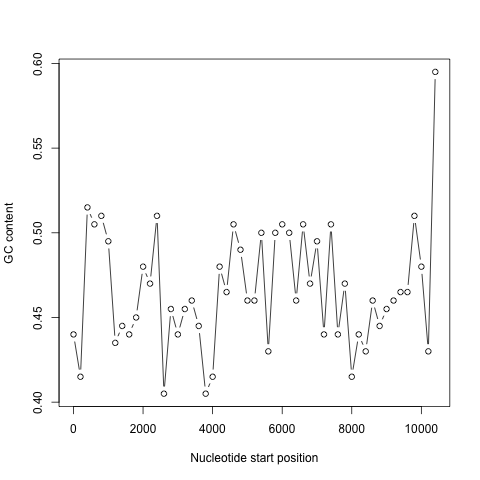
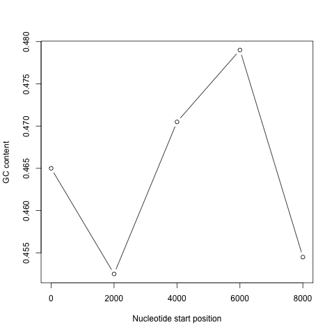
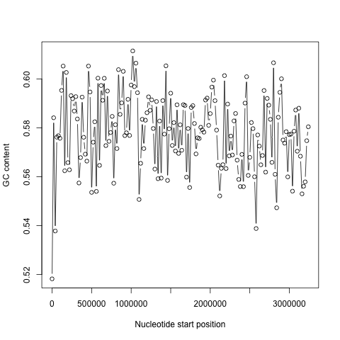
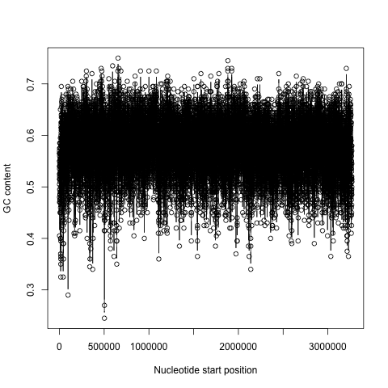
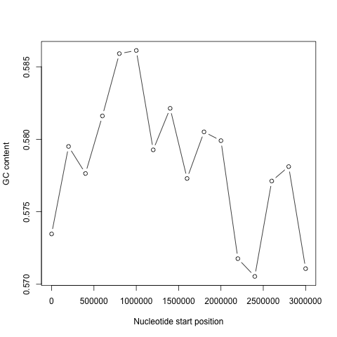
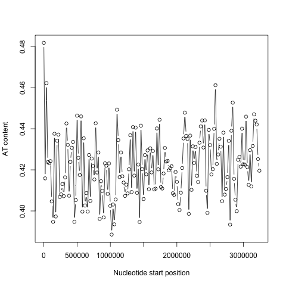
.. |image6| image:: ../_static/A2_image6.png
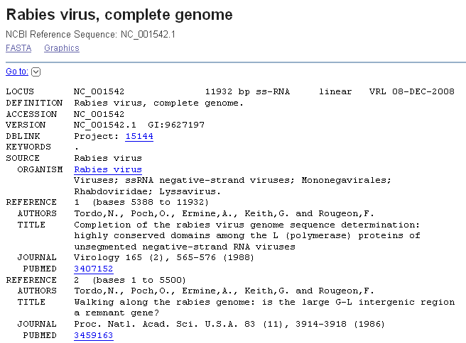
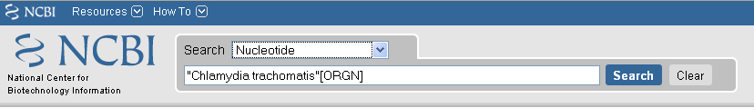
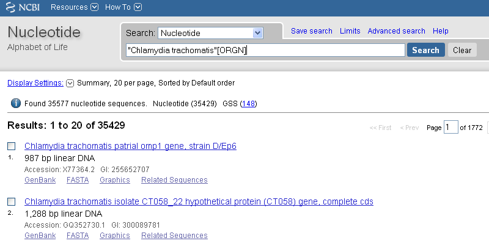
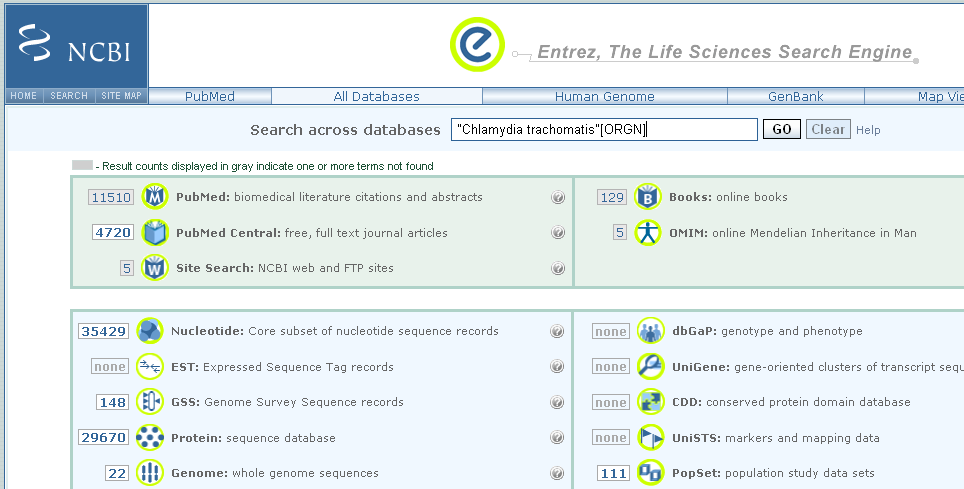

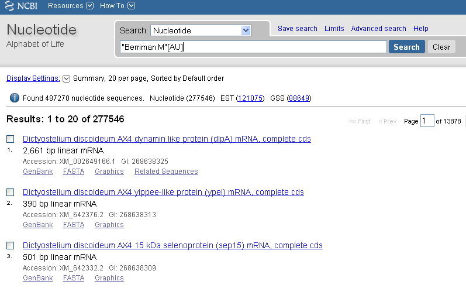

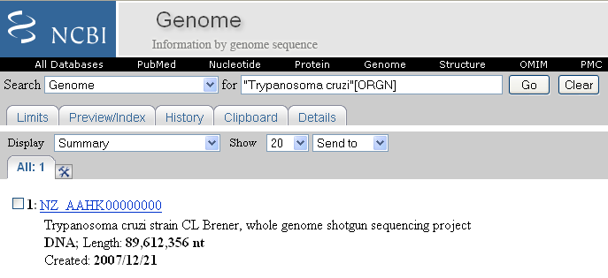
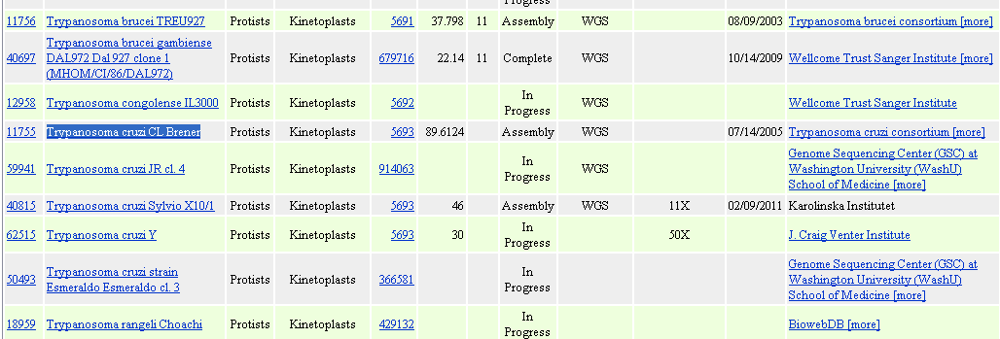
