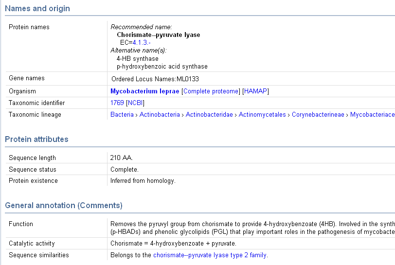
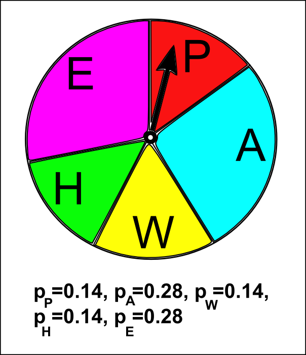
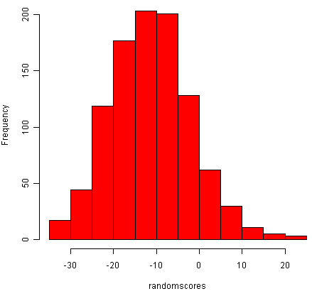
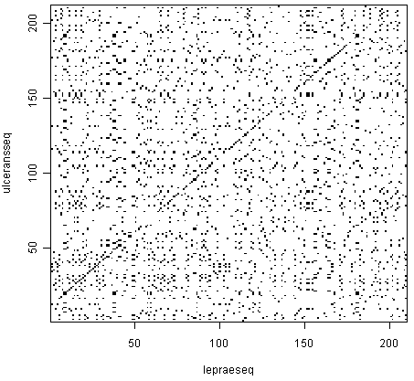

Pairwise Sequence Alignment
===========================

UniProt
-------

In `the previous chapter <./chapter3.html>`_ you learnt how to retrieve DNA and protein
sequences from the NCBI database. The NCBI database is a key database in bioinformatics 
because it contains essentially all DNA sequences ever sequenced.

As mentioned in `the previous chapter <./chapter3.html>`_, a subsection of the NCBI
database called `RefSeq <./chapter3.html#refseq>`_ consists of high quality DNA and protein
sequence data. Furthermore, the NCBI entries for the RefSeq
sequences have been *manually curated*, which means that biologists
employed by NCBI have added additional information to the NCBI
entries for those sequences, such as details of scientific papers
that describe the sequences.

Another extremely important manually curated database is UniProt
(`www.uniprot.org <http://www.uniprot.org>`_), which focuses on
protein sequences. UniProt aims to contains manually curated
information on all known protein sequences. While many of the
protein sequences in UniProt are also present in RefSeq, the amount
and quality of manually curated information in UniProt is much
higher than that in RefSeq.

For each protein in UniProt, the UniProt curators read all the
scientific papers that they can find about that protein, and add
information from those papers to the protein's UniProt entry. For
example, for a human protein, the UniProt entry for the protein
usually includes information about the biological function of the
protein, in what human tissues it is expressed, whether it
interacts with other human proteins, and much more. All this
information has been manually gathered by the UniProt curators from
scientific papers, and the papers in which the found the
information are always listed in the UniProt entry for the
protein.

Just like NCBI, UniProt also assigns an *accession* to each
sequence in the UniProt database. Although the same protein
sequence may appear in both the NCBI database and the UniProt
database, it will have different NCBI and UniProt accessions.
However, there is usually a link on the NCBI entry for the protein
sequence to the UniProt entry, and vice versa.

Viewing the UniProt webpage for a protein sequence
--------------------------------------------------

If you are given the UniProt accession for a protein, to find the
UniProt entry for the protein, you first need to go the UniProt
website, `www.uniprot.org <http://www.uniprot.org>`_. At the top of
the UniProt website, you will see a search box, and you can type
the accession of the protein that you are looking for in this
search box, and then click on the "Search" button to search for
it.

For example, if you want to find the sequence for the chorismate
lyase protein from *Mycobacterium leprae* (the bacterium which
causes `leprosy <http://apps.who.int/tdr/svc/diseases/leprosy>`_), which has UniProt accession
Q9CD83, you would type just "Q9CD83" in the search box and press "Search":

|image0|

The UniProt entry for UniProt accession Q9CD83 will then appear in
your web browser. The picture below shows the top part of the
UniProt entry for accession Q9CD83. You can see there is a lot of
information about the protein in its UniProt entry.

Beside the heading "Organism" you can see the organism is given as
*Mycobacterium leprae*. Beside the heading "Taxonomic
lineage", you can see "Bacteria > Actinobacteria > Actinobacteridae > Actinomycetales > Corynebacterineae > Mycobacteriaceae > Mycobacterium".

This tells us that *Mycobacterium* is a species of
bacteria, which belongs to a group of related bacteria called the
Mycobacteriaceae, which itself belongs to a larger group of
related bacteria called the Corynebacterineae, which itself belongs
to an even larger group of related bacteria called the
Actinomycetales, which itself belongs to the Actinobacteridae,
which itself belongs to a huge group of bacteria called the
Actinobacteria.

Beside the heading "Sequence length" we see that the sequence is
210 amino acids long (210 letters long). Further down, beside the
heading "Function", it says that the function of this protein is
that it "Removes the pyruvyl group from chorismate to provide 4-hydroxybenzoate (4HB)".
This tells us this protein is an
enzyme (a protein that increases the rate of a specific biochemical
reaction), and tells us what is the particular biochemical reaction
that this enzyme is involved in.

Further down the UniProt page for this protein, you will see a lot
more information, as well as many links to webpages in other
biological databases, such as NCBI. The huge amount of information
about proteins in UniProt means that if you want to find out about
a particular protein, the UniProt page for that protein is a great
place to start.

|image1|

Retrieving a UniProt protein sequence via the UniProt website
-------------------------------------------------------------

To retrieve a FASTA-format file containing the sequence for a
particular protein, you need to look at the top right of the
UniProt entry for the protein on the `UniProt website <http://www.uniprot.org>`_. 

You will see a small orange button labelled "FASTA", which you should click on:

|image2|

The FASTA-format sequence for the accession will now appear in your
web browser. To save it as a file, go to the "File" menu of your
web browser, choose "Save page as", and save the file. Remember to
give the file a sensible name (eg. "Q9CD83.fasta" for accession
Q9CD83), and in a place that you will remember (eg. in the "My
Documents" folder).

For example, you can retrieve the protein sequences for the
chorismate lyase protein from *Mycobacterium leprae* (which
has UniProt accession Q9CD83) and for the chorismate lyase protein
from *Mycobacterium ulcerans* (UniProt accession A0PQ23), and save them
as FASTA-format files (eg. "Q9CD83.fasta" and "A0PQ23.fasta", as
described above.

Note that *Mycobacterium leprae* is the bacterium which
causes `leprosy <http://apps.who.int/tdr/svc/diseases/leprosy>`_,
while *Mycobacterium ulcerans* is a related bacterium which
causes `Buruli ulcer <http://www.who.int/buruli/en/>`_, both of which
are classified by the WHO as neglected tropical diseases. 

Note that the *M. leprae* and *M. ulcerans* chorismate
lyase proteins are an example of a pair of homologous (related)
proteins in two related species of bacteria. 

Once you have downloaded the protein sequences for UniProt
accessions Q9CD83 and A0PQ23 and saved them as FASTA-format files
(eg. "Q9CD83.fasta" and "A0PQ23.fasta"), you can read them into R
using the read.fasta() function in the SeqinR R package (as
described in `chapter 1 <./chapter1.html#reading-sequence-data-into-r>`_).

Remember that the read.fasta() function expects that you have put
your FASTA-format files in the "My Documents" folder on your
computer.

For example, the following commands will read the FASTA-format
files Q9CD83.fasta and A0PQ23.fasta into R, and store the two
protein sequences in two vectors *lepraeseq* and *ulceransseq*:

.. highlight:: r

::

    > library("seqinr")
    > leprae <- read.fasta(file = "Q9CD83.fasta")
    > ulcerans <- read.fasta(file = "A0PQ23.fasta")
    > lepraeseq <- leprae[[1]]
    > ulceransseq <- ulcerans[[1]]
    > lepraeseq # Display the contents of the vector "lepraeseq"
      [1] "m" "t" "n" "r" "t" "l" "s" "r" "e" "e" "i" "r" "k" "l" "d" "r" "d" "l"
      [19] "r" "i" "l" "v" "a" "t" "n" "g" "t" "l" "t" "r" "v" "l" "n" "v" "v" "a"
      [37] "n" "e" "e" "i" "v" "v" "d" "i" "i" "n" "q" "q" "l" "l" "d" "v" "a" "p"
      [55] "k" "i" "p" "e" "l" "e" "n" "l" "k" "i" "g" "r" "i" "l" "q" "r" "d" "i"
      [73] "l" "l" "k" "g" "q" "k" "s" "g" "i" "l" "f" "v" "a" "a" "e" "s" "l" "i"
      [91] "v" "i" "d" "l" "l" "p" "t" "a" "i" "t" "t" "y" "l" "t" "k" "t" "h" "h"
      [109] "p" "i" "g" "e" "i" "m" "a" "a" "s" "r" "i" "e" "t" "y" "k" "e" "d" "a"
      [127] "q" "v" "w" "i" "g" "d" "l" "p" "c" "w" "l" "a" "d" "y" "g" "y" "w" "d"
      [145] "l" "p" "k" "r" "a" "v" "g" "r" "r" "y" "r" "i" "i" "a" "g" "g" "q" "p"
      [163] "v" "i" "i" "t" "t" "e" "y" "f" "l" "r" "s" "v" "f" "q" "d" "t" "p" "r"
      [181] "e" "e" "l" "d" "r" "c" "q" "y" "s" "n" "d" "i" "d" "t" "r" "s" "g" "d"
      [199] "r" "f" "v" "l" "h" "g" "r" "v" "f" "k" "n" "l"

Retrieving a UniProt protein sequence using SeqinR
--------------------------------------------------

An alternative method of retrieving a UniProt protein sequence is to use the
SeqinR package to query the ACNUC sub-database "swissprot", which contains protein
sequences from UniProt. 

We use the query() function from SeqinR to query this database, as described
in `chapter3 <./chapter3.html>`_.

For example to retrieve the protein sequences for UniProt accessions Q9CD83
and A0PQ23, we type in R:

::

    > library("seqinr")
    > choosebank("swissprot")
    > query("leprae", "AC=Q9CD83")
    > lepraeseq <- getSequence(leprae$req[[1]])
    > query("ulcerans", "AC=A0PQ23")
    > ulceransseq <- getSequence(ulcerans$req[[1]])
    > closebank()
    > lepraeseq # Display the contents of "lepraeseq"
      [1] "M" "T" "N" "R" "T" "L" "S" "R" "E" "E" "I" "R" "K" "L" "D" "R" "D" "L"
      [19] "R" "I" "L" "V" "A" "T" "N" "G" "T" "L" "T" "R" "V" "L" "N" "V" "V" "A"
      [37] "N" "E" "E" "I" "V" "V" "D" "I" "I" "N" "Q" "Q" "L" "L" "D" "V" "A" "P"
      [55] "K" "I" "P" "E" "L" "E" "N" "L" "K" "I" "G" "R" "I" "L" "Q" "R" "D" "I"
      [73] "L" "L" "K" "G" "Q" "K" "S" "G" "I" "L" "F" "V" "A" "A" "E" "S" "L" "I"
      [91] "V" "I" "D" "L" "L" "P" "T" "A" "I" "T" "T" "Y" "L" "T" "K" "T" "H" "H"
      [109] "P" "I" "G" "E" "I" "M" "A" "A" "S" "R" "I" "E" "T" "Y" "K" "E" "D" "A"
      [127] "Q" "V" "W" "I" "G" "D" "L" "P" "C" "W" "L" "A" "D" "Y" "G" "Y" "W" "D"
      [145] "L" "P" "K" "R" "A" "V" "G" "R" "R" "Y" "R" "I" "I" "A" "G" "G" "Q" "P"
      [163] "V" "I" "I" "T" "T" "E" "Y" "F" "L" "R" "S" "V" "F" "Q" "D" "T" "P" "R"
      [181] "E" "E" "L" "D" "R" "C" "Q" "Y" "S" "N" "D" "I" "D" "T" "R" "S" "G" "D"
      [199] "R" "F" "V" "L" "H" "G" "R" "V" "F" "K" "N" "L"

Comparing two sequences using a dotplot
---------------------------------------

As a first step in comparing two protein, RNA or DNA sequences, it is a good idea to make a *dotplot*.
A dotplot is a graphical method that allows the comparison of two protein or DNA sequences and identify regions of close similarity between them. A dotplot is essentially a two-dimensional matrix (like a grid), which has the sequences of the proteins being compared along the vertical and horizontal axes. 

In order to make a simple dotplot to represent of the similarity between two sequences, individual cells in the matrix can be shaded black if residues are identical, so that matching sequence segments appear as runs of diagonal lines across the matrix. Identical proteins will have a line exactly on the main diagonal of the dotplot, that spans across the whole matrix. 

For proteins that are not identical, but share regions of similarity, the dotplot will have shorter lines that may be on the main diagonal, or off the main diagonal of the matrix. 
In essence, a dotplot will reveal if there are any regions 
that are clearly very similar in two protein (or DNA) sequences. 

We  can create a dotplot for two sequences using the "dotPlot()" function in the SeqinR R package.

For example, if we want to create a dotplot of the sequences for the 
chorismate lyase proteins from *Mycobacterium leprae* and *Mycobacterium ulcerans*, we would
type:

::

    > dotPlot(lepraeseq, ulceransseq) 

|image5|

In the dotplot above, the *M. leprae* sequence is plotted along the *x*-axis (horizontal axis), and
the *M. ulcerans* sequence is plotted along the *y*-axis (vertical axis). The dotplot displays a dot
at points where there is an identical amino acid in the two sequences.

For example, if amino acid 53 in the *M. leprae* sequence is the same amino acid (eg. "W")
as amino acid 70 in the *M. ulcerans* sequence, then the dotplot will show a dot the position in
the plot where *x* =50 and *y* =53. 

In this case you can see a lot of dots along a diagonal
line, which indicates that the two protein sequences contain many identical amino acids at the 
same (or very similar) positions along their lengths. This is what you would expect, 
because we know that these two proteins are homologues (related proteins).

Pairwise global alignment of DNA sequences using the Needleman-Wunsch algorithm
-------------------------------------------------------------------------------

If you are studying a particular pair of genes or proteins, an
important question is to what extent the two sequences are similar.

To quantify similarity, it is necessary to *align* the two
sequences, and then you can calculate a similarity score based on
the alignment.

There are two types of alignment in general. A *global* alignment
is an alignment of the full length of two sequences, for example,
of two protein sequences or of two DNA sequences. A *local*
alignment is an alignment of part of one sequence to part of
another sequence.

The first step in computing a alignment (global or local) is to
decide on a scoring system. For example, we may decide to give a
score of +2 to a match and a penalty of -1 to a mismatch, and a
penalty of -2 to a gap. Thus, for the alignment:

::

    G A A T T C
    G A T T - A

we would compute a score of 2 + 2 -1 + 2 -2 - 1 = 2. Similarly, the
score for the following alignment is 2 + 2 -2 + 2 + 2 -1 = 5:

::

    G A A T T C
    G A - T T A

The scoring system above can be represented by a *scoring matrix*
(also known as a *substitution matrix*). The scoring matrix 
has one row and one column for each possible
letter in our alphabet of letters (eg. 4 rows and 4 columns for DNA
sequences). The *(i,j)* element of the matrix has a value of +2
in case of a match and -1 in case of a mismatch.

We can make a scoring matrix in R by using the
nucleotideSubstitutionMatrix() function in the Biostrings()
package. The Biostrings package is part of a set of R packages for
bioinformatics analysis known as Bioconductor
(`www.bioconductor.org/ <http://www.bioconductor.org/>`_). 

To use the Biostrings package, you will first need to install the
package (see the instructions `here <./installr.html#how-to-install-a-bioconductor-r-package>`_).

The arguments (inputs) for the nucleotideSubstitutionMatrix() function
are the score that we want to assign to a match and the score that
we want to assign to a mismatch. We can also specify that we want
to use only the four letters representing the four nucleotides (ie.
A, C, G, T) by setting 'baseOnly=TRUE', or whether we also want to
use the letters that represent ambiguous cases where we are not
sure what the nucleotide is (eg. 'N' = A/C/G/T).

To make a scoring matrix which assigns a score of +2 to a match and
-1 to a mismatch, and store it in the variable *sigma*, we type:

::

    > library(Biostrings)
    > sigma <- nucleotideSubstitutionMatrix(match = 2, mismatch = -1, baseOnly = TRUE)
    > sigma # Print out the matrix
       A  C  G  T
    A  2 -1 -1 -1
    C -1  2 -1 -1
    G -1 -1  2 -1
    T -1 -1 -1  2

Instead of assigning the same penalty (eg. -8) to every gap
position, it is common instead to assign a *gap opening penalty* to
the first position in a gap (eg. -8), and a smaller
*gap extension penalty* to every subsequent position in the same
gap. 

The reason for doing this is that it is likely that adjacent
gap positions were created by the same insertion or deletion event,
rather than by several independent insertion or deletion events.
Therefore, we don't want to penalise a 3-letter gap as much as we
would penalise three separate 1-letter gaps, as the 3-letter gap
may have arisen due to just one insertion or deletion event, while
the 3 separate 1-letter gaps probably arose due to three
independent insertion or deletion events.

For example, if we want to compute the score for a global alignment
of two short DNA sequences 'GAATTC' and 'GATTA', we can use the
Needleman-Wunsch algorithm to calculate the highest-scoring
alignment using a particular scoring function. 

The "pairwiseAlignment()" function in the Biostrings R package finds the
score for the optimal global alignment between two sequences using
the Needleman-Wunsch algorithm, given a particular scoring system.

As arguments (inputs), the pairwiseAlignment() function takes the
two sequences that you want to align, the scoring matrix, the gap
opening penalty, and the gap extension penalty. You can also tell
the function that you want to just have the optimal global
alignment's score by setting "scoreOnly = TRUE", or that you want
to have both the optimal global alignment and its score by setting
"scoreOnly = FALSE". 

For example, to find the score for the optimal
global alignment between the sequences 'GAATTC' and 'GATTA', we
type:

::

    > s1 <- "GAATTC"
    > s2 <- "GATTA"
    > globalAligns1s2 <- pairwiseAlignment(s1, s2, substitutionMatrix = sigma, gapOpening = -2, 
    gapExtension = -8, scoreOnly = FALSE)
    > globalAligns1s2 # Print out the optimal alignment and its score
    Global Pairwise Alignment (1 of 1)
    pattern: [1] GAATTC 
    subject: [1] GA-TTA 
    score: -3

The above commands print out the optimal global alignment for the
two sequences and its score. 

Note that we set "gapOpening" to be -2 and "gapExtension" to be -8, which means that
the first position of a gap is assigned a score of (-8-2=)-10, and every subsequent
position in a gap is given a score of -8. Here the alignment contains four matches,
one mismatch, and one gap of length 1, so its score is (4*2)+(1*-1)+(1*-10) = -3.

Pairwise global alignment of protein sequences using the Needleman-Wunsch algorithm
-----------------------------------------------------------------------------------

As well as DNA alignments, it is also possible to make alignments
of protein sequences. In this case it is necessary to use a scoring
matrix for amino acids rather than for nucleotides. 

There are several well known scoring matrices that come with R, such as the
BLOSUM series of matrices. Different BLOSUM matrices exist, named
with different numbers. BLOSUM with high numbers are designed for
comparing closely related sequences, while BLOSUM with low numbers
are designed for comparing distantly related sequences. For
example, BLOSUM62 is used for less divergent alignments (alignments
of sequences that differ little), and BLOSUM30 is used for more
divergent alignments (alignments of sequences that differ a lot).

Many R packages come with example data sets or data files. The
"data()" function is used to load these data files. You can use the
data() function in R to load a data set of BLOSUM matrices that
comes with R Biostrings() package. 

To load the BLOSUM50 matrix, we type:

::

    > data(BLOSUM50)
    > BLOSUM50 # Print out the data
       A  R  N  D  C  Q  E  G  H  I  L  K  M  F  P  S  T  W  Y  V  B  Z  X  *
    A  5 -2 -1 -2 -1 -1 -1  0 -2 -1 -2 -1 -1 -3 -1  1  0 -3 -2  0 -2 -1 -1 -5
    R -2  7 -1 -2 -4  1  0 -3  0 -4 -3  3 -2 -3 -3 -1 -1 -3 -1 -3 -1  0 -1 -5
    N -1 -1  7  2 -2  0  0  0  1 -3 -4  0 -2 -4 -2  1  0 -4 -2 -3  4  0 -1 -5
    D -2 -2  2  8 -4  0  2 -1 -1 -4 -4 -1 -4 -5 -1  0 -1 -5 -3 -4  5  1 -1 -5
    C -1 -4 -2 -4 13 -3 -3 -3 -3 -2 -2 -3 -2 -2 -4 -1 -1 -5 -3 -1 -3 -3 -2 -5
    Q -1  1  0  0 -3  7  2 -2  1 -3 -2  2  0 -4 -1  0 -1 -1 -1 -3  0  4 -1 -5
    E -1  0  0  2 -3  2  6 -3  0 -4 -3  1 -2 -3 -1 -1 -1 -3 -2 -3  1  5 -1 -5
    G  0 -3  0 -1 -3 -2 -3  8 -2 -4 -4 -2 -3 -4 -2  0 -2 -3 -3 -4 -1 -2 -2 -5
    H -2  0  1 -1 -3  1  0 -2 10 -4 -3  0 -1 -1 -2 -1 -2 -3  2 -4  0  0 -1 -5
    I -1 -4 -3 -4 -2 -3 -4 -4 -4  5  2 -3  2  0 -3 -3 -1 -3 -1  4 -4 -3 -1 -5
    L -2 -3 -4 -4 -2 -2 -3 -4 -3  2  5 -3  3  1 -4 -3 -1 -2 -1  1 -4 -3 -1 -5
    K -1  3  0 -1 -3  2  1 -2  0 -3 -3  6 -2 -4 -1  0 -1 -3 -2 -3  0  1 -1 -5
    M -1 -2 -2 -4 -2  0 -2 -3 -1  2  3 -2  7  0 -3 -2 -1 -1  0  1 -3 -1 -1 -5
    F -3 -3 -4 -5 -2 -4 -3 -4 -1  0  1 -4  0  8 -4 -3 -2  1  4 -1 -4 -4 -2 -5
    P -1 -3 -2 -1 -4 -1 -1 -2 -2 -3 -4 -1 -3 -4 10 -1 -1 -4 -3 -3 -2 -1 -2 -5
    S  1 -1  1  0 -1  0 -1  0 -1 -3 -3  0 -2 -3 -1  5  2 -4 -2 -2  0  0 -1 -5
    T  0 -1  0 -1 -1 -1 -1 -2 -2 -1 -1 -1 -1 -2 -1  2  5 -3 -2  0  0 -1  0 -5
    W -3 -3 -4 -5 -5 -1 -3 -3 -3 -3 -2 -3 -1  1 -4 -4 -3 15  2 -3 -5 -2 -3 -5
    Y -2 -1 -2 -3 -3 -1 -2 -3  2 -1 -1 -2  0  4 -3 -2 -2  2  8 -1 -3 -2 -1 -5
    V  0 -3 -3 -4 -1 -3 -3 -4 -4  4  1 -3  1 -1 -3 -2  0 -3 -1  5 -4 -3 -1 -5
    B -2 -1  4  5 -3  0  1 -1  0 -4 -4  0 -3 -4 -2  0  0 -5 -3 -4  5  2 -1 -5
    Z -1  0  0  1 -3  4  5 -2  0 -3 -3  1 -1 -4 -1  0 -1 -2 -2 -3  2  5 -1 -5
    X -1 -1 -1 -1 -2 -1 -1 -2 -1 -1 -1 -1 -1 -2 -2 -1  0 -3 -1 -1 -1 -1 -1 -5
    * -5 -5 -5 -5 -5 -5 -5 -5 -5 -5 -5 -5 -5 -5 -5 -5 -5 -5 -5 -5 -5 -5 -5  1

You can get a list of the available scoring matrices that come with
the Biostrings package by using the data() function, which takes as
an argument the name of the package for which you want to know the
data sets that come with it:

::

    > data(package="Biostrings")
    Data sets in package 'Biostring':
    BLOSUM100                                 Scoring matrices
    BLOSUM45                                  Scoring matrices
    BLOSUM50                                  Scoring matrices
    BLOSUM62                                  Scoring matrices
    BLOSUM80                                  Scoring matrices

To find the optimal global alignment between the protein sequences
"PAWHEAE" and "HEAGAWGHEE" using the Needleman-Wunsch algorithm
using the BLOSUM50 matrix, we type:

::

    > data(BLOSUM50)
    > s3 <- "PAWHEAE"
    > s4 <- "HEAGAWGHEE"
    > globalAligns3s4 <- pairwiseAlignment(s3, s4, substitutionMatrix = "BLOSUM50", gapOpening = -2,
    gapExtension = -8, scoreOnly = FALSE)
    > globalAligns3s4 # Print out the optimal global alignment and its score
    Global Pairwise Alignment (1 of 1)
    pattern: [1] P---AWHEAE 
    subject: [1] HEAGAWGHEE 
    score: -5 

We set "gapOpening" to be -2 and "gapExtension" to be -8, which means that
the first position of a gap is assigned a score of (-8-2=)-10, and every subsequent
position in a gap is given a score of -8. This means that the gap will be given
a score of -10-8-8 = -26.

Aligning UniProt sequences
--------------------------

We discussed above how you can search for UniProt accessions and retrieve
the corresponding protein sequences, either via the UniProt website or using the
SeqinR R package.

In the examples given above, you learnt how to retrieve the sequences for the
chorismate lyase proteins from
*Mycobacterium leprae* (UniProt Q9CD83) and
*Mycobacterium ulcerans* (UniProt A0PQ23), and read them into R, and
store them as vectors *lepraeseq* and *ulceransseq*.

You can align these sequences using pairwiseAlignment() from the Biostrings package.

As its input, the pairwiseAlignment() function requires that the
sequences be in the form of a single string (eg. "ACGTA"), rather
than as a vector of characters (eg. a vector with the first element
as "A", the second element as "C", etc.). Therefore, to align the
*M. leprae* and *M. ulcerans* chorismate lyase proteins, we first need
to convert the vectors *lepraeeq* and *ulceransseq* into strings. We
can do this using the c2s() function in the SeqinR package:

::

    > lepraeseqstring <- c2s(lepraeseq)     # Make a string that contains the sequence in "lepraeseq"
    > ulceransseqstring <- c2s(ulceransseq) # Make a string that contains the sequence in "ulceransseq"

Furthermore, pairwiseAlignment() requires that the sequences be
stored as uppercase characters. Therefore, if they are not already in uppercase, we need to use the
toupper() function to convert *lepraeseqstring* and *ulceransseqstring*
to uppercase:

::

    > lepraeseqstring <- toupper(lepraeseqstring)
    > ulceransseqstring <- toupper(ulceransseqstring)
    > lepraeseqstring # Print out the content of "lepraeseqstring"
      [1] "MTNRTLSREEIRKLDRDLRILVATNGTLTRVLNVVANEEIVVDIINQQLLDVAPKIPELENLKIGRILQRDILLKGQKSGILFVAAESLIVIDLLPTAITTYLTKTHHPIGEIMAASRIETYKEDAQVWIGDLPCWLADYGYWDLPKRAVGRRYRIIAGGQPVIITTEYFLRSVFQDTPREELDRCQYSNDIDTRSGDRFVLHGRVFKNL"
 
We can now align the the *M. leprae* and *M. ulcerans* chorismate lyase
protein sequences using the pairwiseAlignment() function:

::

    > globalAlignLepraeUlcerans <- pairwiseAlignment(lepraeseqstring, ulceransseqstring,
      substitutionMatrix = BLOSUM50, gapOpening = -2, gapExtension = -8, scoreOnly = FALSE)
    > globalAlignLepraeUlcerans # Print out the optimal global alignment and its score
      Global PairwiseAlignedFixedSubject (1 of 1)
      pattern: [1] MT-----NR--T---LSREEIRKLDRDLRILVATN...QDTPREELDRCQYSNDIDTRSGDRFVLHGRVFKN 
      subject: [1] MLAVLPEKREMTECHLSDEEIRKLNRDLRILIATN...EDNSREEPIRHQRS--VGT-SA-R---SGRSICT 
      score: 627 
      
As the alignment is very long, when you type
*globalAlignLepraeUlcerans*, you only see the start and the end of the
alignment (see above). Therefore, we need to have a function to
print out the whole alignment (see below).

Viewing a long pairwise alignment
---------------------------------

If you want to view a long pairwise alignment such as that between
the *M. leprae* and *M. ulerans* chorismate lyase proteins, it is
convenient to print out the alignment in blocks. 

The R function "printPairwiseAlignment()" below will do this for you:

::

    > printPairwiseAlignment <- function(alignment, chunksize=60, returnlist=FALSE)
      {
         library(Biostrings)
         seq1aln <- pattern(alignment) # Get the alignment for the first sequence
         seq2aln <- subject(alignment) # Get the alignment for the second sequence
         alnlen  <- nchar(seq1aln)     # Find the number of columns in the alignment
         starts  <- seq(1, alnlen, by=chunksize)
         n       <- length(starts)     
         seq1alnresidues <- 0
         seq2alnresidues <- 0
         for (i in 1:n) {
            chunkseq1aln <- substring(seq1aln, starts[i], starts[i]+chunksize-1)
            chunkseq2aln <- substring(seq2aln, starts[i], starts[i]+chunksize-1)
            # Find out how many gaps there are in chunkseq1aln:
            gaps1 <- countPattern("-",chunkseq1aln) # countPattern() is from Biostrings package 
            # Find out how many gaps there are in chunkseq2aln:                  
            gaps2 <- countPattern("-",chunkseq2aln) # countPattern() is from Biostrings package 
            # Calculate how many residues of the first sequence we have printed so far in the alignment:
            seq1alnresidues <- seq1alnresidues + chunksize - gaps1
            # Calculate how many residues of the second sequence we have printed so far in the alignment:
            seq2alnresidues <- seq2alnresidues + chunksize - gaps2
            if (returnlist == 'FALSE')
            {
               print(paste(chunkseq1aln,seq1alnresidues))
               print(paste(chunkseq2aln,seq2alnresidues))
               print(paste(' '))
            }
         }
         if (returnlist == 'TRUE')
         {
            vector1 <- s2c(substring(seq1aln, 1, nchar(seq1aln)))
            vector2 <- s2c(substring(seq2aln, 1, nchar(seq2aln)))
            mylist <- list(vector1, vector2) 
            return(mylist)
         }
    }

To use this function you first need to copy and paste this function into R.
You can then use our function printPairwiseAlignment() to print out
the alignment between the *M. leprae* and *M. ulcerans* chorismate lyase
proteins (we stored this alignment in the
*globalAlignLepraeUlcerans* variable, see above), in blocks of 60
alignment columns:

::

    > printPairwiseAlignment(globalAlignLepraeUlcerans, 60)
      [1] "MT-----NR--T---LSREEIRKLDRDLRILVATNGTLTRVLNVVANEEIVVDIINQQLL 50"
      [1] "MLAVLPEKREMTECHLSDEEIRKLNRDLRILIATNGTLTRILNVLANDEIVVEIVKQQIQ 60"
      [1] " "
      [1] "DVAPKIPELENLKIGRILQRDILLKGQKSGILFVAAESLIVIDLLPTAITTYLTKTHHPI 110"
      [1] "DAAPEMDGCDHSSIGRVLRRDIVLKGRRSGIPFVAAESFIAIDLLPPEIVASLLETHRPI 120"
      [1] " "
      [1] "GEIMAASRIETYKEDAQVWIGDLPCWLADYGYWDLPKRAVGRRYRIIAGGQPVIITTEYF 170"
      [1] "GEVMAASCIETFKEEAKVWAGESPAWLELDRRRNLPPKVVGRQYRVIAEGRPVIIITEYF 180"
      [1] " "
      [1] "LRSVFQDTPREELDRCQYSNDIDTRSGDRFVLHGRVFKN 230"
      [1] "LRSVFEDNSREEPIRHQRS--VGT-SA-R---SGRSICT 233"
      [1] " "
      
The position in the protein of the amino acid that is at the end of
each line of the printed alignment is shown after the end of the
line. For example, the first line of the alignment above finishes
at amino acid position 50 in the *M. leprae* protein and also at
amino acid position 60 in the *M. ulcerans* protein.

Since we are printing out an alignment that contained gaps in the
first 60 alignment columns, the first 60 alignment columns ends
before the 60th amino acid in the *M. leprae* sequence.

Pairwise local alignment of protein sequences using the Smith-Waterman algorithm
--------------------------------------------------------------------------------

You can use the pairwiseAlignment() function to find the optimal local alignment of two
sequences, that is the best alignment of parts (subsequences) of those sequences, by using
the "type=local" argument in pairwiseAlignment(). This uses the Smith-Waterman algorithm
for local alignment, the classic bioinformatics algorithm for finding optimal local alignments.

For example, to find the best local alignment between the *M. leprae* and *M. ulcerans*
chorismate lyase proteins, we can type:

::

    > localAlignLepraeUlcerans <- pairwiseAlignment(lepraeseqstring, ulceransseqstring,
      substitutionMatrix = BLOSUM50, gapOpening = -2, gapExtension = -8, scoreOnly = FALSE, type="local")
    > localAlignLepraeUlcerans # Print out the optimal local alignment and its score
      Local PairwiseAlignedFixedSubject (1 of 1)
      pattern:  [1] MTNRTLSREEIRKLDRDLRILVATNGTLTRVLNVV...IITTEYFLRSVFQDTPREELDRCQYSNDIDTRSG 
      subject: [11] MTECHLSDEEIRKLNRDLRILIATNGTLTRILNVL...IIITEYFLRSVFEDNSREEPIRHQRSVGTSARSG 
      score: 761 
    > printPairwiseAlignment(localAlignLepraeUlcerans, 60)
      [1] "MTNRTLSREEIRKLDRDLRILVATNGTLTRVLNVVANEEIVVDIINQQLLDVAPKIPELE 60"
      [1] "MTECHLSDEEIRKLNRDLRILIATNGTLTRILNVLANDEIVVEIVKQQIQDAAPEMDGCD 60"
      [1] " "
      [1] "NLKIGRILQRDILLKGQKSGILFVAAESLIVIDLLPTAITTYLTKTHHPIGEIMAASRIE 120"
      [1] "HSSIGRVLRRDIVLKGRRSGIPFVAAESFIAIDLLPPEIVASLLETHRPIGEVMAASCIE 120"
      [1] " "
      [1] "TYKEDAQVWIGDLPCWLADYGYWDLPKRAVGRRYRIIAGGQPVIITTEYFLRSVFQDTPR 180"
      [1] "TFKEEAKVWAGESPAWLELDRRRNLPPKVVGRQYRVIAEGRPVIIITEYFLRSVFEDNSR 180"
      [1] " "
      [1] "EELDRCQYSNDIDTRSG 240"
      [1] "EEPIRHQRSVGTSARSG 240"
      [1] " "

We see that the optimal local alignment is quite similar to the optimal global alignment in this case,
except that it excludes a short region of poorly aligned sequence at the start and at the ends of the
two proteins.

Calculating the statistical significance of a pairwise global alignment
-----------------------------------------------------------------------

We have seen that when we align the 'PAWHEAE' and 'HEAGAWGHEE'
protein sequences, they have some similarity, and the score for
their optimal global alignment is -5. 

But is this alignment
*statistically significant*? In other words, is this alignment
better than we would expect between any two random proteins? 

The Needleman-Wunsch alignment algorithm will produce a global
alignment even if we give it two unrelated random protein
sequences, although the alignment score would be low. 

Therefore, we
should ask: is the score for our alignment better than expected
between two random sequences of the same lengths and amino acid
compositions?

It is reasonable to expect that if the alignment score is
statistically significant, then it will be higher than the scores
obtained from aligning pairs of random protein sequences that have
the same lengths and amino acid compositions as our original two
sequences. 

Therefore, to assess if the score for our alignment
between the 'PAWHEAE' and 'HEAGAWGHEE' protein sequence is
statistically significant, a first step is to make some random
sequences that have the same amino acid composition and length as
one of our initial two sequences, for example, as the same amino
acid composition and length as the sequence 'PAWHEAE'.

How can we obtain random sequences of the same amino acid
composition and length as the sequence 'PAWHEAE'? One way is to
generate sequences using a
*multinomial model for protein sequences* in which the
probabilities of the different amino acids set to be equal to their
frequencies in the sequence 'PAWHEAE'. 

That is, we can generate
sequences using a multinomial model for proteins, in which the
probability of 'P' is set to 0.1428571 (1/7); the
probability of 'A' is set to 0.2857143 (2/7); the
probability of 'W' is set to 0.1428571 (1/7); the
probability of 'H' is set to 0.1428571 (1/7); and
the probabilty of 'E' is set to 0.2857143 (2/7),
and the probabilities of the other 15 amino acids are set to 0.

To generate a sequence with this multinomial model, we choose the
letter for each position in the sequence according to those
probabilities. This is as if we have made a roulette wheel in which
1/7*th* of the circle is taken up by a pie labelled "P", 2/7*ths*
by a pie labelled "A", 1/7*th* by a pie labelled "W", 1/7*th* by a
pie labelled "H", and 2/7*ths* by a pie labelled "E":

|image3|

To generate a sequence using the multinomial model, we keep
spinning the arrow in the centre of the roulette wheel, and write
down the letter that the arrow stops on after each spin. To
generate a sequence that is 7 letters long, we can spin the arrow 7
times. To generate 1000 sequences that are each 7 letters long, we
can spin the arrow 7000 times, where the letters chosen form 1000
7-letter amino acid sequences.

To generate a certain number (eg.1000) random amino acid sequences of a certain
length using a multinomial model, you can use the function 
generateSeqsWithMultinomialModel() below:

::

    > generateSeqsWithMultinomialModel <- function(inputsequence, X)
      {
         # Change the input sequence into a vector of letters
         library("seqinr") # Load in the SeqinR package, so we can use function "s2c".
         inputsequencevector <- s2c(inputsequence)
         # Find the frequencies of the letters in the input sequence "inputsequencevector":
         mylength <- length(inputsequencevector)
         mytable <- table(inputsequencevector)
         # Find the names of the letters in the sequence
         letters <- rownames(mytable)
         numletters <- length(letters)
         probabilities <- numeric() # Make a vector to store the probabilities of letters
         for (i in 1:numletters)
         {
            letter <- letters[i]
            count <- mytable[[i]]
            probabilities[i] <- count/mylength
         } 
         # Make X random sequences using the multinomial model with probabilities "probabilities"
         seqs <- numeric(X)
         for (j in 1:X)
         {
            seq <- sample(letters, mylength, rep=TRUE, prob=probabilities) # Sample with replacement
            seq <- c2s(seq)
            seqs[j] <- seq
         }
         # Return the vector of random sequences
         return(seqs)
      }

The function generateSeqsWithMultinomialModel() generates X random sequences with a 
multinomial model, where the probabilities of the different letters are set equal to their frequencies
in an input sequence, which is passed to the function as a string of characters
(eg. 'PAWHEAE').

The function returns X random sequences in the form of a vector which has X elements, the first
element of the vector contains the first sequence, the second element contains the second sequence,
and so on.

You will need to copy and paste this function into R before you can use it.

We can use this function to generate 1000 7-letter amino acid sequences using a multinomial
model in which the probabilities of the letters are set equal to their frequencies in 'PAWHEAE'
(ie. probabilities 1/7 for P, 2/7 for A, 1/7 for W, 1/7 for H and 2/7 for E), by typing:

::

    > randomseqs <- generateSeqsWithMultinomialModel('PAWHEAE',1000) 
    > randomseqs[1:10] # Print out the first 10 random sequences
      [1] "EHHEWEA" "EAEEEAH" "WAHAWEP" "PPAPAAW" "HEPWWAA" "APAAAAA" "EAHAPHP"
      [8] "AAPEEWE" "HEAAAAP" "EWAAPEP"
      
The 1000 random sequences are stored in a vector *randomseqs* that has 1000 elements,
each of which contains one of the random sequences.

We can then use the Needleman-Wunsch algorithm to align the
sequence 'HEAGAWGHEE' to one of the 1000 random sequences generated
using the multinomial model with probabilities 1/7 for P, 2/7 for A, 1/7 for W, 1/7 for H and 2/7 for E.

For example, to align 'HEAGAWGHEE' to the first of the 1000 random
sequences ('EEHAAAE'), we type:

::

    > s4 <- "HEAGAWGHEE"
    > pairwiseAlignment(s4, randomseqs[1], substitutionMatrix = "BLOSUM50", gapOpening = -2,
      gapExtension = -8, scoreOnly = FALSE)
      Global PairwiseAlignedFixedSubject (1 of 1)
      pattern: [2] EAGAWGHEE 
      subject: [1] EHHEW--EA 
      score: -7 

If we use the pairwiseAlignment() function with the argument 'scoreOnly=TRUE', it will just give 
us the score for the alignment:

::

    > pairwiseAlignment(s4, randomseqs[1], substitutionMatrix = "BLOSUM50", gapOpening = -2,
      gapExtension = -8, scoreOnly = TRUE)
      [1] -7

If we repeat this 1000 times, that is, for each of the 1000 random
sequences in vector *randomseqs*, we can get a distribution of
alignment scores expected for aligning 'HEAGAWGHEE' to random
sequences of the same length and (approximately the same) amino
acid composition as 'PAWHEAE'. 

We can then compare the actual score for aligning 'PAWHEAE' to 'HEAGAWGHEE' (ie. -5) to the distribution
of scores for aligning 'HEAGAWGHEE' to the random sequences.

::

    > randomscores <- double(1000) # Create a numeric vector with 1000 elements
    > for (i in 1:1000) 
      {
         score <- pairwiseAlignment(s4, randomseqs[i], substitutionMatrix = "BLOSUM50", 
           gapOpening = -2, gapExtension = -8, scoreOnly = TRUE)
         randomscores[i] <- score
      }

The code above first uses the double() function to create a numeric
vector *randomscores* for storing real numbers (ie. not integers),
with 1000 elements. This will be used to store the alignment scores
for 1000 alignments between 'HEAGAWGHEE' and the 1000 different
random sequences generated using the multinomial model. 

The 'for loop' takes each of the 1000 different random sequences, aligns
each one to 'HEAGAWGHEE', and stores the 1000 alignment scores in
the *randomscores* vector. 

Once we have run the 'for loop', we can make a histogram plot of the 1000 scores 
in vector *randomscores* by typing:

::

    > hist(randomscores, col="red") # Draw a red histogram

|image4| 

We can see from the histogram that quite a lot of the random
sequences seem to have higher alignment scores than -5 when aligned
to 'HEAGAWGHEE' (where -5 is the alignment score for 'PAWHEAE' and
'HEAGAWGHEE').

We can use the vector *randomscores* of scores for 1000 alignments
of random sequences to 'HEAGAWGHEE' to calculate the probability of
getting a score as large as the real alignment score for 'PAWHEAE'
and 'HEAGAWGHEE' (ie. -5) by chance.

::

    > sum(randomscores >= -5)
    [1] 266

We see that 266 of the 1000 alignments of random sequences to
'HEAGAWGHEE' had alignment scores that were equal to or greater
than -5. Thus, we can estimate that the probability of getting a
score as large as the real alignment score by chance is (266/1000
=) 0.266. In other words, we can calculate a *P-value* of 0.266.
This probability or *P*-value is quite high (almost 30%, or 1 in
3), so we can conclude that it is quite probable that we could get
an alignment score as high as -5 by chance alone. This indicates
that the sequences 'HEAGAWGHEE' and 'PAWHEAE' are not more similar
than any two random sequences, and so they are probably not related
sequences.

.. include:: <isoamsr.txt>

Another way of saying this is that the *P*-value that we calculated
is high (0.266), and as a result we conclude that the alignment
score for the sequences 'HEAGAWGHEE' and 'PAWHEAE' is not
*statistically significant*. Generally, if the *P*-value that we
calculate for an alignment of two sequences is >0.05, we conclude
that the alignment score is not statistically significant, and that
the sequences are probably not related. On the other hand, if the
*P*-value is less than or equal to 0.05, we conclude that the alignment score is
statistically significant, and the sequences are very probably
related (homologous).

Summary
-------

In this practical, you will have learnt to use the following R
functions:

#. data() for reading in data that comes with an R package
#. double() for creating a numeric vector for storing real
   (non-integer) numbers
#. toupper() for converting a string of characters from lowercase
   to uppercase

All of these functions belong to the standard installation of R.

You have also learnt the following R functions that belong to the
bioinformatics packages:

#. nucleotideSubstitutionMatrix() in the Biostrings package for
   making a nucleotide scoring matrix
#. pairwiseAlignment() in the Biostrings package for making a
   global alignment between two sequences
#. c2s() in the SeqinR package for converting a sequence stored in
   a vector to a string of characters

Links and Further Reading
-------------------------

Some links are included here for further reading. 

For background reading on sequence alignment, it is recommended to
read Chapter 3 of
*Introduction to Computational Genomics: a case studies approach*
by Cristianini and Hahn (Cambridge University Press;
`www.computational-genomics.net/book/ <http://www.computational-genomics.net/book/>`_).

For more in-depth information and more examples on using the SeqinR
package for sequence analysis, look at the SeqinR documentation,
`http://pbil.univ-lyon1.fr/software/seqinr/doc.php?lang=eng <http://pbil.univ-lyon1.fr/software/seqinr/doc.php?lang=eng>`_.

There is also a very nice chapter on "Analyzing Sequences", which
includes examples of using SeqinR and Biostrings for sequence analysis, as well as details
on how to implement algorithms such as Needleman-Wunsch and Smith-Waterman in R yourself, in the
book *Applied statistics for bioinformatics using R* by Krijnen
(available online at
`cran.r-project.org/doc/contrib/Krijnen-IntroBioInfStatistics.pdf <http://cran.r-project.org/doc/contrib/Krijnen-IntroBioInfStatistics.pdf>`_).

For a more in-depth introduction to R, a good online tutorial is
available on the "Kickstarting R" website,
`cran.r-project.org/doc/contrib/Lemon-kickstart <http://cran.r-project.org/doc/contrib/Lemon-kickstart/>`_.

There is another nice (slightly more in-depth) tutorial to R
available on the "Introduction to R" website,
`cran.r-project.org/doc/manuals/R-intro.html <http://cran.r-project.org/doc/manuals/R-intro.html>`_.

For more information on and examples using the Biostrings package,
see the Biostrings documentation at
`http://www.bioconductor.org/packages/release/bioc/html/Biostrings.html <http://www.bioconductor.org/packages/release/bioc/html/Biostrings.html>`_.

Acknowledgements
----------------

Many of the ideas for the examples and exercises for this practical
were inspired by the Matlab case study on the Eyeless protein
(`www.computational-genomics.net/case\_studies/eyeless\_demo.html <http://www.computational-genomics.net/case_studies/eyeless_demo.html>`_)
from the website that accompanies the book
*Introduction to Computational Genomics: a case studies approach*
by Cristianini and Hahn (Cambridge University Press;
`www.computational-genomics.net/book/ <http://www.computational-genomics.net/book/>`_).

The examples of DNA sequences and protein sequences to align
('GAATTC' and 'GATTA', and sequences 'PAWHEAE' and 'HEAGAWGHEE'),
as well as some ideas related to finding the statistical
significance of a pairwise alignment, were inspired by the chapter
on "Analyzing Sequences" in the book
*Applied statistics for bioinformatics using R* by Krijnen
(`cran.r-project.org/doc/contrib/Krijnen-IntroBioInfStatistics.pdf <http://cran.r-project.org/doc/contrib/Krijnen-IntroBioInfStatistics.pdf>`_).

Thank you to Jean Lobry and Simon Penel for helpful advice on using
the SeqinR package.

Contact
-------

I will be grateful if you will send me (`Avril Coghlan <http://www.ucc.ie/microbio/avrilcoghlan/>`_) corrections or suggestions for improvements to
my email address a.coghlan@ucc.ie 

License
-------

The content in this book is licensed under a `Creative Commons Attribution 3.0 License
<http://creativecommons.org/licenses/by/3.0/>`_.

Exercises
---------

Answer the following questions, using the R package. For each
question, please record your answer, and what you typed into R to
get this answer.

Model answers to the exercises are given in
`Answers to the exercises on Sequence Alignment <./chapter_answers.html#sequence-alignment>`_.

Q1. Download FASTA-format files of the *Brugia malayi* Vab-3 protein (UniProt accession A8PZ80) and the *Loa loa* Vab-3 protein (UniProt accession E1FTG0) sequences from UniProt.
    Note: the *vab-3* gene of *Brugia malayi* and the *vab-3* gene of *Loa loa* are related genes that
    control eye development in these two species. 
    *Brugia malayi* and *Loa loa* are both parasitic nematode worms, which both
    cause `filariasis <http://www.who.int/topics/filariasis/en/>`_, which is classified
    by the WHO as a neglected tropical disease.

Q2. What is the alignment score for the optimal global alignment between the *Brugia malayi* Vab-3 protein and the *Loa loa* Vab-3 protein, when you use the *BLOSUM50* scoring matrix, a gap opening penalty of -10 and a gap extension penalty of -0.5? 
    Note: to specify a gap opening penalty of -10 and a gap extension penalty of -0.5,
    set the "gapOpening" argument to -9.5, and the "gapExtension" penalty to -0.5 in the
    pairwiseAlignment() function.

Q3. Use the printPairwiseAlignment() function to view the optimal global alignment between *Brugia malayi* Vab-3 protein and the *Loa loa* Vab-3 protein, using the *BLOSUM50* scoring matrix, a gap opening penalty of -10 and a gap extension penalty of -0.5. 
    Do you see any regions where the alignment is very good (lots of identities and few gaps)?

Q4. What global alignment score do you get for the two Vab-3 proteins, when you use the *BLOSUM62* alignment matrix, a gap opening penalty of -10 and a gap extension penalty of -0.5? 
    Which scoring matrix do you think is more appropriate for using for this pair of proteins: BLOSUM50 or BLOSUM62?

Q5. What is the statistical significance of the optimal global alignment for the *Brugia malayi* and *Loa loa* Vab-3 proteins made using the *BLOSUM50* scoring matrix, with a gap opening penalty of -10 and a gap extension penalty of -0.5? 
    In other words, what is the probability of getting a score as large
    as the real alignment score for Vab-3 by chance?

Q6. What is the optimal global alignment score between the *Brugia malayi* Vab-6 protein and the *Mycobacterium leprae* chorismate lyase protein? 
    Is the alignment score statistically significant (what is the *P-* value?)?
    Does this surprise you?

