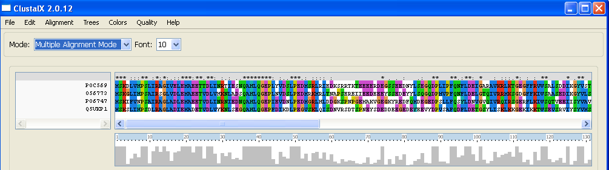
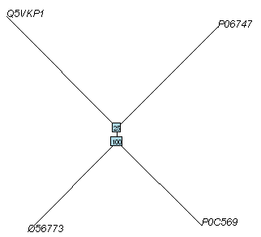
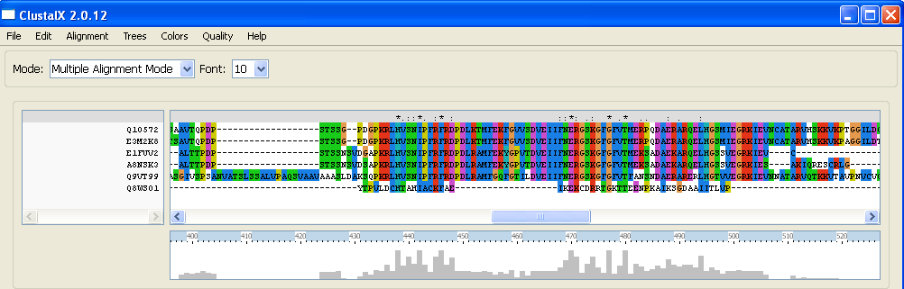
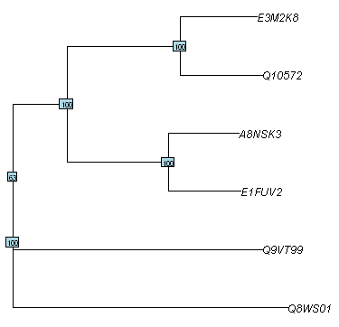
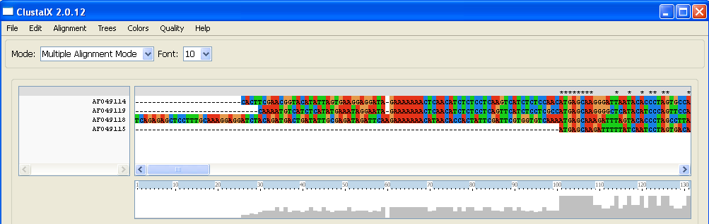
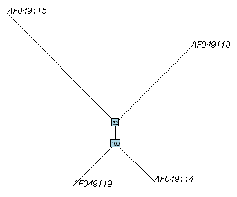

Multiple Alignment and Phylogenetic trees
=========================================

Retrieving a list of sequences from UniProt
-------------------------------------------

In previous chapters, you learnt how to search for DNA or protein sequences
in sequence databases such as the NCBI database and UniProt, using the
SeqinR package (see `chapter3.html <chapter3.html>`_).

For example, in the `previous chapter <chapter4.html#retrieving-a-uniprot-protein-sequence-via-the-uniprot-website>`_), 
you learnt how to retrieve a single sequence from UniProt.

Oftentimes, it is useful to retrieve several sequences from UniProt at once
if you have a list of UniProt accessions. The R function "retrieveseqs()" 
below is useful for this purpose:

.. highlight:: r

::

    > retrieveseqs <- function(seqnames,acnucdb)
      {
         myseqs <- list() # Make a list to store the sequences
         library("seqinr")  # Load the SeqinR R package
         choosebank(acnucdb)
         for (i in 1:length(seqnames))
         {
            seqname <- seqnames[i]
            print(paste("Retrieving sequence",seqname,"..."))
            queryname <- "query2"
            query <- paste("AC=",seqname,sep="")
            query(`queryname`,`query`)
            seq <- getSequence(query2$req[[1]]) # Makes a vector "seq" containing the sequence
            myseqs[[i]] <- seq
         }
         closebank()
         return(myseqs)
      }

You need to cut and paste this function into R to use it.
As its input, you need to give it the function a vector containing
the accessions for the sequences you wish to retrieve, as well as the name of the ACNUC
sub-database that the sequences should be retrieved from. In this case, we want to
retrieve sequences from UniProt, so the sequences should be in the "swissprot" ACNUC sub-database. 

The retrieveseqs() function returns a list variable, in which
each element is a vector containing one of the sequences.

For example, to retrieve the protein sequences for UniProt
accessions P06747, P0C569, O56773 and Q5VKP1 (the accessions for rabies virus phosphoprotein,  Mokola
virus phosphoprotein, Lagos bat virus phosphoprotein and Western Caucasian bat virus phosphoprotein, 
respectively), you can type:

::

    > seqnames <- c("P06747", "P0C569", "O56773", "Q5VKP1")  # Make a vector containing the names of the sequences
    > seqs <- retrieveseqs(seqnames,"swissprot")             # Retrieve the sequences and store them in list variable "seqs"
    > length(seqs)                                 # Print out the number of sequences retrieved
     [1] 4
    > seq1 <- seqs[[1]]                            # Get the first sequence
    > seq1[1:20]                                   # Print out the first 20 letters of the first sequence  
     [1] "M" "S" "K" "I" "F" "V" "N" "P" "S" "A" "I" "R" "A" "G" "L" "A" "D" "L" "E"
     [20] "M"
    > seq2 <- seqs[[2]]                            # Get the second sequence
    > seq2[1:20]                                   # Print out the first 20 letters of the second sequence
     [1] "M" "S" "K" "D" "L" "V" "H" "P" "S" "L" "I" "R" "A" "G" "I" "V" "E" "L" "E"
     [20] "M"
     
The commands above use the function retrieveseqs() to retrieve two UniProt sequences. 
The sequences are returned in a list variable *seqs*. To access the elements in an R list variable, 
you need to use double square brackets. Therefore, the second element of the list
variable is accessed by typing *seqs[[2]]*. Each element of the list variable *seqs* contains a 
vector which stores one of the sequences.

Rabies virus is the virus responsible for `rabies <http://www.who.int/rabies/en/>`_, which is classified by the WHO as a neglected tropical disease. Mokola virus and rabies virus are closely related viruses that both belong to a group of viruses called the Lyssaviruses. Mokola virus causes a rabies-like infection in mammals including humans.

Once you have retrieved the sequences using retrieveseqs(), you can then use the function 
write.fasta() from the SeqinR package to write the sequences to a FASTA-format file. As its arguments
(inputs), the write.fasta() function takes the list variable containing the sequences, and a vector 
containing the names of the sequences, and the name that you want to give to the FASTA-format
file. For example:

::

    > write.fasta(seqs, seqnames, file="phosphoproteins.fasta")

The command above will write the sequences in list variable *seqs*
to a FASTA-format file called "phosphoproteins.fasta" in the "My Documents"
folder on your computer.

Installing the CLUSTAL multiple alignment software 
--------------------------------------------------

A common task in bioinformatics is to download a set of related sequences from a database, and then
to align those sequences using multiple alignment software. This is the first step in most phylogenetic analyses.

One commonly used multiple alignment software package is CLUSTAL. In order to build an alignment
using CLUSTAL, you first need to install the CLUSTAL program on your computer.

To install CLUSTAL on your computer, you need to follow these steps:

* Go to the `http://www.clustal.org/download/current/ <http://www.clustal.org/download/current/>`_ website.
* Right-click on the link to file clustalx-Z.Z.Z-win.msi (where Z represents some number) 
  and choose "Save link as..." and then save the file in your "My Documents" folder.
* Once the file has downloaded, double-click on the icon for file clustalx-Z.Z.Z-win.msi (where Z is some number). 
* You will be asked "Are you sure you want to run this software?" Press "Run".
* You will then see "Welcome to the ClustalX2 setup wizard". Press "Next".
* You will be asked where to install ClustalX2. Select your "My Documents" folder.
* Keep pressing 'yes' or 'Next' until the screen says "Completing the ClustalX2 setup wizard". Then press "Finish".

CLUSTAL should now be installed on your computer. 

Creating a multiple alignment of protein, DNA or mRNA sequences using CLUSTAL
-----------------------------------------------------------------------------

Once you have installed CLUSTAL, you can now align your sequences using CLUSTAL by following these steps:

* Go to the "Start" menu on the bottom left of your Windows screen. Select "All Programs" from the menu, then select 
  "ClustalX2" from the menu that appears. This will start up CLUSTAL.
* The CLUSTAL window should appear. To load the DNA or protein sequences that you want to align into CLUSTAL, go to the 
  CLUSTAL "File" menu, and choose "Load sequences". 
* Select the FASTA-format file containing your sequences (eg. phosphoproteins.fasta) to load it into CLUSTAL.
* This should read the sequences into CLUSTAL. They have not been aligned yet, but will be displayed in the CLUSTAL window. 
* You can use the scrollbar on the right to scroll down and look at all the sequences. You can use the scrollbar on the 
  bottom to scroll from left to right, and look along the length of the sequences. 
* Before you align the sequences using CLUSTAL, you need to tell CLUSTAL to make the output alignment file in
  PHYLIP alignment format, so that you can read it into R. To do this, go to the "Alignment" menu in CLUSTAL, choose
  "Output Format Options". A form will appear, and in this form you should select "PHYLIP format" and deselect "CLUSTAL format",
  and then press "OK".
* To now align the sequences using CLUSTAL, go to the CLUSTAL "Alignment" menu, and choose "Do Complete Alignment". 
* A menu box will pop up, asking you where to save the output guide-tree file (eg. "phosphoproteins.dnd") and the output 
  alignment file (called "phosphoproteins.phy"). You should choose to save them in your "My Documents" folder (so that you can 
  easily read them into R from "My Documents" at a later stage).
* CLUSTAL will now align the sequences. This will take a couple of minutes (eg. 2-5 minutes). You will see that at the bottom 
  of the CLUSTAL window, it tells you which pair of sequences it is aligning at a particular point in time. If the numbers 
  keep changing, it means that CLUSTAL is still working away, and the alignment is not finished yet. Be patient!

Once CLUSTAL has finished making the alignment, it will be displayed in the CLUSTAL window. For example, here
is the CLUSTAL alignment for rabies virus phosphoprotein, Mokola
virus phosphoprotein, and Lagos bat virus phosphoprotein:

|image8|

The alignment displayed in CLUSTAL has a row for each of your sequences. CLUSTAL colours sets of chemically similar amino acids
in similar colours. For example, tyrosine (Y) is coloured blue-green, while the chemically similar amino acid phenylalanine
(F) is coloured blue. You can scroll to the right and left along the alignment using the scrollbar at the bottom of the Jalview
window. 

Below the alignment, you can see a grey plot, showing the level of conservation at each point of the sequence.
This shows a high grey bar if the conservation in a region is high (there is high percent identity between the sequence),
and a low grey bar if it is low (there is low percent identity). This can give you an idea of which are the best conserved
regions of the alginment. 

For example, for the alignment of the four virus phosphoproteins, we can see that the region in alignment columns 35
to 45 approximately is very well conserved, while the region in alignment columns 60 to 70 is poorly conserved.

The CLUSTAL alignment will have been saved in a file in your "My Documents" folder called "something.phy" (eg. phosphoproteins.phy).
This is a PHYLIP-format alignment file, which you can now read into R for further analysis.

Reading a multiple alignment file into R
----------------------------------------

To read a sequence alignment into R from a file, you can use the read.alignment() function in the SeqinR package. For
example, to read in the multiple sequence alignment of the virus phosphoproteins into R, we type:

::

    > virusaln  <- read.alignment(file = "phosphoproteins.phy", format = "phylip")

The *virusaln* variable is a list variable that stores the alignment.

An R list variable can have named elements, and you can access the named elements of a list 
variable by typing the variable name, followed by "$", followed by the name of the named element.

The list variable *virusaln* has named elements "nb", "nam", "seq", and "com". 

In fact, the named element "seq" contains the alignment, which you can view by typing:

::

    > virusaln$seq
      [[1]]
      [1] "mskdlvhpsliragivelemaeettdlinrtiesnqahlqgeplyvdslpedmsrlriedksrrtk...
      [[2]]
      [1] "mskglihpsairsglvdlemaeetvdlvhknladsqahlqgeplnvdslpedmrkmrltnapsere...
      [[3]]
      [1] "mskifvnpsairagladlemaeetvdlinrniednqahlqgepievdnlpedmgrlhlddgkspnp...
      [[4]]
      [1] "mskslihpsdlragladiemadetvdlvyknlsegqahlqgepfdikdlpegvsklqisdnvrsdt...

Only the first part of the alignment stored in *virusaln$seq* is shown here, as
it is very long.

Viewing a long multiple alignment
---------------------------------

If you want to view a long multiple alignment, it is convenient to view the multiple alignment in blocks.

The R function "printMultipleAlignment()" below will do this for you:

::

    > printMultipleAlignment <- function(alignment, chunksize=60)
      { 
         # load the Biostrings package
         library("Biostrings")
         # find the number of sequences in the alignment
         numseqs <- length(alignment)
         # find the length of the alignment
         alignmentlen <- nchar(alignment$seq[[1]])
         starts <- seq(1, alignmentlen, by=chunksize)
         n <- length(starts)
         # get the alignment for each of the sequences:
         aln <- vector()
         lettersprinted <- vector()
         for (j in 1:numseqs)
         {
            alignmentj <- alignment$seq[[j]]
            aln[j] <- alignmentj
            lettersprinted[j] <- 0
         }
         # print out the alignment in blocks of 'chunksize' columns:
         for (i in 1:n) { # for each of n chunks
            for (j in 1:numseqs)
            {
               alnj <- aln[j]
               chunkseqjaln <- substring(alnj, starts[i], starts[i]+chunksize-1)
               chunkseqjaln <- toupper(chunkseqjaln)
               # Find out how many gaps there are in chunkseqjaln:
               gapsj <- countPattern("-",chunkseqjaln) # countPattern() is from Biostrings package
               # Calculate how many residues of the first sequence we have printed so far in the alignment:
               lettersprinted[j] <- lettersprinted[j] + chunksize - gapsj
               print(paste(chunkseqjaln,lettersprinted[j]))
            }
            print(paste(' '))
         }
      }

As its inputs, the function "printMultipleAlignment()" takes the input alignment, and the number of columns
to print out in each block.

For example, to print out the multiple alignment of virus phosphoproteins (which we stored in variable
*virusaln*, see above) in blocks of 60 columns, we type:

::

    > printMultipleAlignment(virusaln, 60)
      [1] "MSKDLVHPSLIRAGIVELEMAEETTDLINRTIESNQAHLQGEPLYVDSLPEDMSRLRIED 60"
      [1] "MSKGLIHPSAIRSGLVDLEMAEETVDLVHKNLADSQAHLQGEPLNVDSLPEDMRKMRLTN 60"
      [1] "MSKIFVNPSAIRAGLADLEMAEETVDLINRNIEDNQAHLQGEPIEVDNLPEDMGRLHLDD 60"
      [1] "MSKSLIHPSDLRAGLADIEMADETVDLVYKNLSEGQAHLQGEPFDIKDLPEGVSKLQISD 60"
      [1] " "
      [1] "KSRRTKTEEEERDEGSSEEDNYLSEGQDPLIPFQNFLDEIGARAVKRLKTGEGFFRVWSA 120"
      [1] "APSEREIIEEDEEEYSSEDEYYLSQGQDPMVPFQNFLDELGTQIVRRMKSGDGFFKIWSA 120"
      [1] "GKSPNPGEMAKVGEGKYREDFQMDEGEDPSLLFQSYLDNVGVQIVRQIRSGERFLKIWSQ 120"
      [1] "NVRSDTSPNEYSDEDDEEGEDEYEEVYDPVSAFQDFLDETGSYLISKLKKGEKIKKTWSE 120"
      [1] " "
      [1] "LSDDIKGYVSTNIM-TSGERDTKSIQIQTEPTASVSSGNESRHDSESMHDPNDKKDHTPD 179"
      [1] "ASEDIKGYVLSTFM-KPETQATVSKPTQTDSLSVPRPSQGYTSVPRDKPSNSESQGGGVK 179"
      [1] "TVEEIISYVAVNFP-NPPGKSSEDKSTQTTGRELKKETTPTPSQRESQSSKARMAAQTAS 179"
      [1] "VSRVIYSYVMSNFPPRPPKPTTKDIAVQADLKKPNEIQKISEHKSKSEPSPREPVVEMHK 180"
      [1] " "
      [1] "HDVVPDIESSTDKGEIRDIEGEVAHQVAESFSKKYKFPSRSSGIFLWNFEQLKMNLDDIV 239"
      [1] "PKKVQKSEWTRDTDEISDIEGEVAHQVAESFSKKYKFPSRSSGIFLWNFEQLKMNLDDIV 239"
      [1] "GPPALEWSATNEEDDLS-VEAEIAHQIAESFSKKYKFPSRSSGILLYNFEQLKMNLDDIV 238"
      [1] "HATLE-----NPEDDEGALESEIAHQVAESYSKKYKFPSKSSGIFLWNFEQLKMNLDDIV 235"
      [1] " "
      [1] "KAAMNVPGVERIAEKGGKLPLRCILGFVALDSSKRFRLLADNDKVARLIQEDINSYMARL 299"
      [1] "KTSMNVPGVDKIAEKGGKLPLRCILGFVSLDSSKRFRLLADTDKVARLMQDDIHNYMTRI 299"
      [1] "KEAKNVPGVTRLARDGSKLPLRCVLGWVALANSKKFQLLVESNKLSKIMQDDLNRYTSC- 297"
      [1] "QVARGVPGISQIVERGGKLPLRCMLGYVGLETSKRFRSLVNQDKLCKLMQEDLNAYSVSS 295"
      [1] " "
      [1] "EEAE-- 357"
      [1] "EEIDHN 359"
      [1] "------ 351"
      [1] "NN---- 351"
      [1] " "

Discarding very poorly conserved regions from an alignment
----------------------------------------------------------

It is often a good idea to discard very poorly conserved regions from a mulitple 
alignment before building a phylogenetic tree, as the very poorly conserved regions are
likely to be regions that are either not homologous between the sequences being considered
(and so do not add any phylogenetic signal), or are homologous but are so diverged that
they are very difficult to align accurately (and so may add noise to the phylogenetic analysis,
and decrease the accuracy of the inferred tree).

To discard very poorly conserved regions from a multiple alignment, you can use the following
R function, "cleanAlignment()":

::

    > cleanAlignment <- function(alignment, minpcnongap, minpcid)
      {
         # make a copy of the alignment to store the new alignment in:
         newalignment <- alignment
         # find the number of sequences in the alignment
         numseqs <- length(alignment)
         # empty the alignment in "newalignment")
         for (j in 1:numseqs) { newalignment$seq[[j]] <- "" }
         # find the length of the alignment
         alignmentlen <- nchar(alignment$seq[[1]])
         # look at each column of the alignment in turn:
         for (i in 1:alignmentlen)
         {
            # see what percent of the letters in this column are non-gaps:
            nongap <- 0
            for (j in 1:(numseqs-1))
            {
               seqj <- alignment$seq[[j]]
               letterij <- substr(seqj,i,i)
               if (letterij != "-") { nongap <- nongap + 1}
            }
            pcnongap <- (nongap*100)/numseqs
            # Only consider this column if at least minpcnongap % of the letters are not gaps:
            if (pcnongap >= minpcnongap)
            {
               # see what percent of the pairs of letters in this column are identical:
               numpairs <- 0; numid <- 0
               # find the letters in all of the sequences in this column:
               for (j in 1:(numseqs-1))
               {
                  seqj <- alignment$seq[[j]]
                  letterij <- substr(seqj,i,i)
                  for (k in (j+1):numseqs)
                  {
                     seqk <- alignment$seq[[k]]
                     letterkj <- substr(seqk,i,i)
                     if (letterij != "-" && letterkj != "-")
                     {
                        numpairs <- numpairs + 1
                        if (letterij == letterkj) { numid <- numid + 1} 
                     }
                  }
               }
               pcid <- (numid*100)/(numpairs)
               # Only consider this column if at least %minpcid of the pairs of letters are identical:
               if (pcid >= minpcid) 
               {
                   for (j in 1:numseqs)
                   {
                      seqj <- alignmentseq[[j]] 
                      letterij <- substr(seqj,i,i) 
                      newalignmentj <- newalignment$seq[[j]]
                      newalignmentj <- paste(newalignmentj,letterij,sep="") 
                      newalignment$seq[[j]] <- newalignmentj
                   }
               }
            } 
         }
         return(newalignment)
      }

The function cleanAlignment() takes three arguments (inputs): the input alignment; the minimum percent of
letters in an alignment column that must be non-gap characters for the column to be kept; and the 
minimum percent of pairs of letters in an alignment column that must be identical for the column to be kept.

For example, if we have a column with letters "T", "A", "T", "-" (in four sequences), then 75\% of the letters are
non-gap characters; and the pairs of letters are "T,A", "T,T", and "A,T", and 33\% of the pairs of letters are identical. 

We can use the function cleanAlignment() to discard the very poorly aligned columns from a multiple alignment.

For example, if you look at the multiple alignment for the virus phosphoprotein sequences (which we 
printed out using function printMultipleAlignment(), see above), we can see that the last few columns are
poorly aligned (contain many gaps and mismatches), and probably add noise to the phylogenetic analysis.

Therefore, to filter out the well conserved columns of the alignment, and discard the very poorly conserved
columns, we can type:

::

    > cleanedvirusaln <- cleanAlignment(virusaln, 30, 30) 

In this case, we required that at least 30\% of letters in a column are not gap characters for that column to be kept,
and that at least 30\% of pairs of letters in an alignment column must be identical for the column to be kept.

We can print out the filtered alignment by typing:

::

    > printMultipleAlignment(cleanedvirusaln)
      [1] "MSKLVHPSIRAGIVELEMAEETTDLIRTIQAHLQGEPVDLPEDMRLIDREEEDEGDPFQF 60"
      [1] "MSKLIHPSIRSGLVDLEMAEETVDLVKNLQAHLQGEPVDLPEDMKMLNSEEEEQGDPFQF 60"
      [1] "MSKFVNPSIRAGLADLEMAEETVDLIRNIQAHLQGEPVDLPEDMRLLDSAERDEGDPFQY 60"
      [1] "MSKLIHPSLRAGLADIEMADETVDLVKNLQAHLQGEPIKLPEGVKLIDREEEEEVDPFQF 60"
      [1] " "
      [1] "LDEGVKGEFRWSSIGYVNIMSTSIQTHSDESGEDEEVAHQVAESFSKKYKFPSRSSGIFL 120"
      [1] "LDEGVKGDFKWSSIGYVTFMPTSKQTSDSETDEDEEVAHQVAESFSKKYKFPSRSSGIFL 120"
      [1] "LDNGVRGEFKWSVISYVNFPPSDKQTSSSSTDD-EEIAHQIAESFSKKYKFPSRSSGILL 119"
      [1] "LDEGIKGEIKWSSISYVNFPPTDIQAHSS--DDAEEIAHQVAESYSKKYKFPSKSSGIFL 118"
      [1] " "
      [1] "WNFEQLKMNLDDIVKANVPGVIAEGGKLPLRCLGVLSKRFRLLADKVRLIQEDINYEE 180"
      [1] "WNFEQLKMNLDDIVKSNVPGVIAEGGKLPLRCLGVLSKRFRLLADKVRLMQDDIHYEE 180"
      [1] "YNFEQLKMNLDDIVKANVPGVLARGSKLPLRCLGVLSKKFQLLVNKLKIMQDDLNY-- 177"
      [1] "WNFEQLKMNLDDIVQAGVPGIIVEGGKLPLRCLGVLSKRFRSLVDKLKLMQEDLNYNN 178"
      [1] " "

The filtered alignment is shorter, but is missing some of the poorly conserved regions of the original
alignment. 

Calculating genetic distances between protein sequences
-------------------------------------------------------

A common first step in performing a phylogenetic analysis is to calculate the pairwise genetic distances between sequences. The
genetic distance is an estimate of the divergence between two sequences, and is usually measured in quantity of evolutionary
change (an estimate of the number of mutations that have occurred since the two sequences shared a common ancestor).

We can calculate the genetic distances between protein sequences using the "dist.alignment()" function in the SeqinR package. The
dist.alignment() function takes a multiple alignment as input. Based on the multiple alignment that you give it, dist.alignment()
calculates the genetic distance between each pair of proteins in the multiple alignment. For example, to calculate genetic distances
between the virus phosphoproteins based on the multiple sequence alignment stored in *virusaln*, we type:

::

    > virusdist <- dist.alignment(virusaln)                            # Calculate the genetic distances
    > virusdist                                                        # Print out the genetic distance matrix
                    P0C569     O56773     P06747    
      O56773      0.4142670                      
      P06747      0.4678196  0.4714045           
      Q5VKP1      0.4828127  0.5067117  0.5034130

The genetic distance matrix above shows the genetic distance between each pair of proteins. 

The sequences are referred to by their UniProt accessions. If you remember from above, P06747
is rabies virus phosphoprotein, P0C569 is Mokola virus phosphoprotein, O56773 is Lagos bat
virus phosphoprotein and Q5VKP1 is Western Caucasian bat virus phosphoprotein.

Based on the genetic distance matrix above, we can see that the genetic distance between 
Lagos bat virus phosphoprotein (O56773) and Mokola virus phosphoprotein (P0C569) is smallest (about 0.414).

Similarly, the genetic distance between Western Caucasian bat virus phosphoprotein (Q5VKP1) and
Lagos bat virus phosphoprotein (O56773) is the biggest (about 0.507).

The larger the genetic distance between two sequences, the more amino acid changes or indels that have occurred since 
they shared a common ancestor, and the longer ago their common ancestor probably lived.

Calculating genetic distances between DNA/mRNA sequences
--------------------------------------------------------

Just like for protein sequences, you can calculate genetic distances between DNA (or mRNA) sequences
based on an alignment of the sequences.

For example, the NCBI accession AF049118 contains mRNA sequence for Mokola virus phosphoprotein,
RefSeq AF049114 contains mRNA sequence for Mokola virus phosphoprotein, and AF049119 contains
the mRNA sequence for Lagos bat virus phosphoprotein, while AF049115 contains the mRNA
sequence for Duvenhage virus phosphoprotein.

To retrieve these sequences from the NCBI database, we can search the ACNUC "genbank" sub-database
(since these are nucleotide sequences), by typing:

::

    > seqnames <- c("AF049118", "AF049114", "AF049119", "AF049115")  # Make a vector containing the names of the sequences
    > seqs <- retrieveseqs(seqnames,"genbank")                       # Retrieve the sequences and store them in list variable "seqs"

We can then write out the sequences to a FASTA-format file by typing:

::

    > write.fasta(seqs, seqnames, file="virusmRNA.fasta")

We can then use CLUSTAL to create a PHYLIP-format alignment of the sequences, and store it in the
alignment file "virusmRNA.phy". This picture shows part of the alignment:

|image12|

We can then read the alignment into R:

::

    > virusmRNAaln  <- read.alignment(file = "virusmRNA.phy", format = "phylip")

We saw above that the function dist.alignment() can be used to calculate a genetic
distance matrix based on a protein sequence alignment.

You can calculate a genetic distance for DNA or mRNA sequences
using the dist.dna() function in the Ape R package. 
dist.dna()</tt> takes a multiple alignment 
of DNA or mRNA sequences as its input, and calculates the genetic distance between each pair of DNA sequences 
in the multiple alignment. 

The dist.dna() function requires the input alignment to be in a
special format known as "DNAbin" format, so we must use the as.DNAbin() function to convert
our DNA alignment into this format before using the dist.dna() function.

For example, to calculate the genetic distance between each pair of mRNA sequences for the virus
phosphoproteins, we type:

::

    > virusmRNAalnbin <- as.DNAbin(virusmRNAaln) # Convert the alignment to "DNAbin" format
    > virusmRNAdist <- dist.dna(virusmRNAalnbin) # Calculate the genetic distance matrix
    > virusmRNAdist                              # Print out the genetic distance matrix
                AF049114  AF049119  AF049118
      AF049119 0.3400576                    
      AF049118 0.5235850 0.5637372          
      AF049115 0.6854129 0.6852311 0.7656023

Building an unrooted phylogenetic tree for protein sequences 
------------------------------------------------------------

Once we have a distance matrix that gives the pairwise distances between all our protein sequences, 
we can build a phylogenetic tree based on that distance matrix. One method for using this is the
*neighbour-joining algorithm*.

You can build a phylogenetic tree using the neighbour-joining algorithm with the the 
Ape R package. First you will need to install the "ape" package (see `instructions on how to
install R packages <./installr.html#how-to-install-an-r-package>`_).

The following R function "unrootedNJtree()" builds a phylogenetic tree based on an alignment of
sequences, using the neighbour-joining algorithm, using functions from the "ape" package.

The "unrootedNJtree()" function takes an alignment of sequences its
input, calculates pairwise distances between the sequences based on the alignment, and then builds
a phylogenetic tree based on the pairwise distances:

::

    > unrootedNJtree <- function(alignment,type)
      {
         # load the ape and seqinR packages:
         library("ape")
         library("seqinr")
         # define a function for making a tree:
         makemytree <- function(alignmentmat)
         {
            alignment <- ape::as.alignment(alignmentmat)
            if      (type == "protein")  
            {
               mydist <- dist.alignment(alignment)
            }
            else if (type == "DNA")
            {
               alignmentbin <- as.DNAbin(alignment)
               mydist <- dist.dna(alignmentbin)
            }
            mytree <- nj(mydist)
            mytree <- makeLabel(mytree, space="") # get rid of spaces in tip names.
            return(mytree)   
         }
         # infer a tree
         mymat  <- as.matrix.alignment(alignment)
         mytree <- makemytree(mymat)
         # bootstrap the tree
         myboot <- boot.phylo(mytree, mymat, makemytree)
         # plot the tree:
         plot.phylo(mytree,type="u")   # plot the unrooted phylogenetic tree
         nodelabels(myboot,cex=0.7)    # plot the bootstrap values
      }

To use the function to make a phylogenetic tree, you must first copy and paste the function into R.
You can then use it to make a tree, for example of the virus phosphoproteins, based on the sequence
alignment:

::

    > unrootedNJtree(virusaln,type="protein")

|image9|

Note that you need to specify that the type of sequences that you are using are protein sequences
when you use unrootedNJtree(), by setting "type=protein".

We can see that Q5VKP1 (Western Caucasian bat virus phosphoprotein) and P06747 
(rabies virus phosphoprotein) have been grouped together in the tree, and that
O56773 (Lagos bat virus phosphoprotein) and P0C569 (Mokola virus phosphoprotein) are grouped together in the tree.

This is consistent with what we saw above in the genetic distance matrix, which showed that 
the genetic distance between Lagos bat virus phosphoprotein (O56773) and Mokola virus phosphoprotein 
(P0C569) is relatively small.

The numbers in blue boxes are *bootstrap values* for the nodes in the tree.
    
A bootstrap value for a particular node in the tree gives an idea of the confidence that we have
in the clade (group) defined by that node in the tree. If a node has a high bootstrap value (near 100\%) then we are
very confident that the clade defined by the node is correct, while if it has a low bootstrap value (near 0\%) then we
are not so confident. 

Note that the fact that a bootstrap value for a node is high does not necessarily
guarantee that the clade defined by the node is correct, but just tells us that it is quite likely that it is correct. 

The bootstrap values are calculated by making many (for example,
100) random "resamples" of the alignment that the phylogenetic tree was based upon. Each "resample" of the alignment consists of a
certain number *x* (eg. 200) of randomly sampled columns from the alignment. Each "resample" of the alignment (eg. 200 randomly
sampled columns) forms a sort of fake alignment of its own, and a phylogenetic tree can be based upon the "resample". We can make 100
random resamples of the alignment, and build 100 phylogenetic trees based on the 100 resamples. These 100 trees are known as the
"bootstrap trees". For each clade (grouping) that we see in our original phylogenetic tree, we can count in how many of the 100 bootstrap
trees it appears. This is known as the "bootstrap value" for the clade in our original phylogenetic tree.

For example, if we calculate 100 random resamples of the virus phosphoprotein alignment, and build 100 phylogenetic trees based on these
resamples, we can calculate the bootstrap values for each clade in the virus phosphoprotein phylogenetic tree.

In this case, the bootstrap value for the node defining the clade containing Q5VKP1 (Western Caucasian bat virus phosphoprotein) 
and P06747 (rabies virus phosphoprotein) is 25\%, while the bootstrap value for node defining the clade containg of 
Lagos bat virus phosphoprotein (O56773) and Mokola virus phosphoprotein 
(P0C569) is 100\%. The bootstrap values for each of these clades is the percent of
100 bootstrap trees that the clade appears in. 

Therefore, we are very confident that Lagos bat virus and Mokola virus phosphoproteins
should be grouped together in the tree. However, we are not so confident that the Western Caucasian
bat virus and rabies virus phosphoproteins should be grouped together.

The lengths of the branches in the plot of the tree are proportional to the amount of evolutionary change 
(estimated number of mutations) along the branches.

In this case, the branches leading to Lagos bat virus phosphoprotein (O56773) and Mokola virus phosphoprotein 
(P0C569) from the node representing their common ancestor are slightly shorter than the branches leading to the 
Western Caucasian bat virus (Q5VKP1) and rabies virus (P06747) phosphoproteins from the node representing their common ancestor.

This suggests that there might have been more mutations in the Western Caucasian bat virus (Q5VKP1) and rabies virus (P06747) 
phosphoproteins since they shared a common ancestor, than in the  Lagos bat virus phosphoprotein (O56773) and Mokola 
virus phosphoprotein (P0C569) since they shared a common ancestor.

The tree above of the virus phosphoproteins is an *unrooted* phylogenetic
tree as it does not contain an *outgroup* sequence, that is a sequence of a protein that is known to be
more distantly related to the other proteins in the tree than they are to each other. 

As a result, we cannot tell which direction evolutionary time ran in along the
internal branches of the tree. For example, we cannot tell whether the node representing the common ancestor
of (O56773, P0C569) was an ancestor of the node representing the common ancestor of (Q5VKP1, P06747), or the
other way around.

In order to build a *rooted* phylogenetic tree, we need to have an outgroup sequence in our tree.
In the case of the virus phosphoproteins, this is unfortunately not possible, as (as far as I know) there
is not any protein known that is more distantly related to the four proteins already in our tree than 
they are to each other. 

However, in many other cases, an outgroup - a sequence known to be more distantly relatd to the other
sequences in the tree than they are to each other - is known, and so it is possible to build a rooted phylogenetic
tree.

We discussed above that it is a good idea to investigate whether discarding the poorly
conserved regions of a multiple alignment has an effect on the phylogenetic analysis.
In this case, we made a filtered copy of the multiple alignment and stored it in the variable
*cleanedvirusaln* (see above). We can make a phylogenetic tree based this filtered alignment,
and see if it agrees with the phylogenetic tree based on the original alignment:

::

    > unrootedNJtree(cleanedvirusaln,type="protein")

|image14|

Here O56773 and P0C569 are grouped together, and Q5VKP1 and P06747 are grouped together, as in the
phylogenetic tree based on the raw (unfiltered) multiple alignment (see above). Thus, filtering
the multiple alignment does not have an effect on the tree. 

If we had found a difference in the trees made using the unfiltered and filtered multiple alignments, 
we would have to examine the multiple alignments closely, to see if the unfiltered multiple alignment
contains a lot of very poorly aligned regions that might be adding noise to the phylogenetic analysis (if
this is true, the tree based on the filtered alignment is likely to be more reliable).

Building a rooted phylogenetic tree for protein sequences 
---------------------------------------------------------

In order to convert the unrooted tree into a rooted tree, we need to add an outgroup sequence. 
Normally, the outgroup sequence is a sequence that we know from some prior knowledge to be more
distantly related to the other sequences under study than they are to each other.

For example, the protein Fox-1 is involved in determining the sex (gender) of an embryo in the
nematode worm *Caenorhabditis elegans* (UniProt accession Q10572). Related proteins are found in
other nematodes, including *Caenorhabditis remanei* (UniProt E3M2K8), *Caenorhabditis briggsae* (A8WS01),
*Loa loa* (E1FUV2), and *Brugia malayi* (UniProt A8NSK3).

Note that *Caenorhabditis elegans* is a model organism commonly studied in molecular biology.
The nematodes *Loa loa*, and *Brugia malayi* are parasitic nematodes that cause 
`filariasis <http://www.who.int/topics/filariasis/en/>`_, which is classified by the WHO as
a neglected tropical disease.

The UniProt database contains a distantly related sequence from the fruitfly *Drosophila melanogaster*
(UniProt accession Q9VT99). If we were to build a phylogenetic tree of the nematode worm Fox-1 homologues,
the distantly related sequence from fruitfly would probably be a good choice of outgroup, since the
protein is from a different animal group (insects) than the nematode worms. Thus, it is likely that the 
fruitfly protein is more distantly related to all the nematode proteins than they are to each other. 

To retrieve the sequences from UniProt we can use the "retrieveseqs()" function (see above):

::

    > seqnames <- c("Q10572","E3M2K8","Q8WS01","E1FUV2","A8NSK3","Q9VT99")  
    > seqs <- retrieveseqs(seqnames,"swissprot")        
  
We can then write out the sequences to a FASTA file:

::

    > write.fasta(seqs, seqnames, file="fox1.fasta")

We can then use CLUSTAL to create a PHYLIP-format alignment of the sequences, and store it in the
alignment file "fox1.phy". This picture shows part of the alignment (the alignment is quite long,
so not all of it is shown):

|image10|

We can then read the alignment into R:

::

    > fox1aln  <- read.alignment(file = "fox1.phy", format = "phylip")

The next step is to build a phylogenetic tree of the proteins, which again we can do using
the neighbour-joining algorithm.

This time we have an outgroup in our set of sequences, so we can build a rooted tree. The function "rootedNJtree()"
can be used to build a rooted tree:

::

    > rootedNJtree <- function(alignment, theoutgroup, type)
      {
         # load the ape and seqinR packages:
         library("ape")
         library("seqinr")
         # define a function for making a tree:
         makemytree <- function(alignmentmat, outgroup=`theoutgroup`)
         {
            alignment <- ape::as.alignment(alignmentmat)
            if      (type == "protein")  
            {
               mydist <- dist.alignment(alignment)
            }
            else if (type == "DNA")
            {
               alignmentbin <- as.DNAbin(alignment)
               mydist <- dist.dna(alignmentbin)
            }
            mytree <- nj(mydist)
            mytree <- makeLabel(mytree, space="") # get rid of spaces in tip names.
            myrootedtree <- root(mytree, outgroup, r=TRUE)
            return(myrootedtree)   
         }
         # infer a tree
         mymat  <- as.matrix.alignment(alignment)
         myrootedtree <- makemytree(mymat, outgroup=theoutgroup)
         # bootstrap the tree
         myboot <- boot.phylo(myrootedtree, mymat, makemytree)
         # plot the tree:
         plot.phylo(myrootedtree, type="p")  # plot the rooted phylogenetic tree
         nodelabels(myboot,cex=0.7)          # plot the bootstrap values
      }

The function takes the alignment and the name of the outgroup as its inputs.
For example, to use it to make a phylogenetic tree of the *C. elegans* Fox-1
protein and its homologues, using the fruitfly protein (UniProt Q9VT99) as the outgroup, we type:

::

    > rootedNJtree(fox1aln, "Q9VT99",type="protein") 

|image11|

Here we can see that E3M2K8 (*C. remanei* Fox-1 homologue) and Q10572 (*C. elegans* Fox-1)
have been grouped together with bootstrap 100\%, and A8NSK3 (*Brugia malayi* Fox-1 homologue) and
E1FUV2 (*Loa loa* Fox-1 homologue) have been grouped together with bootstrap 100\%. These
four proteins have also been grouped together in a larger clade with bootstrap 100\%.

Compared to these four proteins, the Q8WS01 (*C. briggsae* Fox-1 homologue) and Q9VT99 (fruitfly
outgroup) seem to be relatively distantly related. 

As this is a rooted tree, we know the direction that evolutionary time ran.
Say we call the ancestor of the four sequences (E3M2K8, Q10572, A8NSK3, E1FUV2) *ancestor1*,
the ancestor of the two sequences (E3M2K8, Q10572) *ancestor2*, and the ancestor of the
two sequences (A8NSK3, E1FUV2) *ancestor3*. 

Because it is a rooted tree, we know that time ran from left to right along the branches of the tree, so that *ancestor1* was the
ancestor of *ancestor2*, and *ancestor1* was also the ancestor of *ancestor3*.
In other words, *ancestor1* lived before *ancestor2* or *ancestor3*; *ancestor2*
and *ancestor3* were descendants of *ancestor1*.

Another way of saying this is that E3M2K8 and Q10572 shared a common ancestor
with each other more recently than they did with A8NSK3 and E1FUV2.

The lengths of branches in this tree are proportional to the amount
of evolutionary change (estimated number of mutations) that occurred along the branches. The
branches leading back from E3M2K8 and Q10572 to their
last common ancestor are slightly longer than the
branches leading back from A8NSK3 and E1FUV2 to
their last common ancestor. 

This indicates that there has been more evolutionary change in E3M2K8 (*C. remanei* Fox-1 homologue) and Q10572 (*C. elegans* Fox-1) 
proteins since they diverged, than there has been in A8NSK3 (*Brugia malayi* Fox-1 homologue) and E1FUV2 (*Loa loa* Fox-1 homologue)
since they diverged.

Building a phylogenetic tree for DNA or mRNA sequences 
------------------------------------------------------

In the example above, a phylogenetic tree was built for protein sequences.
The genomes of distantly related organisms such as vertebrates will have accumulated many 
mutations since they diverged. Sometimes, so many mutations have occurred since the organisms 
diverged that their DNA sequences are hard to align correctly and it is also hard to accurately 
estimate evolutionary distances from alignments of those DNA sequences. 

In contrast, as many mutations at the DNA level are synonymous at the protein level, protein sequences diverge at 
a slower rate than DNA sequences. This is why for reasonably distantly related organisms 
such as vertebrates, it is usually preferable to use protein sequences for phylogenetic analyses.

If you are studying closely related organisms such as primates, few mutations will have occurred 
since they diverged. As a result, if you use protein sequences for a phylogenetic analysis, 
there may be too few amino acid substitutions to provide enough 'signal' to use for the phylogenetic 
analysis. Therefore, it is often preferable to use DNA sequences for a phylogenetic analysis of 
closely related organisms such as primates. 

We can use the functions unrootedNJtree() and rootedNJtree() described above to build unrooted or rooted neighbour-joining
phylogenetic trees based on an alignment of DNA or mRNA sequences. In this case, we need to use "type=DNA"
as an argument in these functions, to tell them that we are making a tree of nucleotide sequences, not protein sequences.

For example, to build an unrooted phylogenetic tree based on the alignment of the virus phosphoprotein mRNA sequences,
we type in R:

::

    > virusmRNAaln  <- read.alignment(file = "virusmRNA.phy", format = "phylip")
    > unrootedNJtree(virusmRNAaln, type="DNA") 

|image13|

Summary
-------

In this practical, you have learnt the following R functions that
belong to the bioinformatics packages:

#. read.alignment() from the SeqinR package for reading in a
   multiple alignment
#. dist.alignment() from the SeqinR package for calculating genetic
   distances between protein sequences
#. dist.dna() from the Ape package for calculating genetic
   distances between DNA or mRNA sequences

Links and Further Reading
-------------------------

Some links are included here for further reading. 

For background reading on phylogenetic trees, it is recommended to
read Chapter 7 of
*Introduction to Computational Genomics: a case studies approach*
by Cristianini and Hahn (Cambridge University Press;
`www.computational-genomics.net/book/ <http://www.computational-genomics.net/book/>`_).

For more in-depth information and more examples on using the SeqinR
package for sequence analysis, look at the SeqinR documentation,
`http://pbil.univ-lyon1.fr/software/seqinr/doc.php?lang=eng <http://pbil.univ-lyon1.fr/software/seqinr/doc.php?lang=eng>`_.

For more in-depth information and more examples on the Ape package
for phylogenetic analysis, look at the Ape documentation,
`ape.mpl.ird.fr/ <http://ape.mpl.ird.fr/>`_.

If you are using the Ape package for a phylogenetic analysis
project, it would be worthwhile to obtain a copy of the book
*Analysis of Phylogenetics and Evolution with R* by Emmanuel
Paradis, published by Springer, which has many nice examples of
using R for phylogenetic analyses.

For a more in-depth introduction to R, a good online tutorial is
available on the "Kickstarting R" website,
`cran.r-project.org/doc/contrib/Lemon-kickstart <http://cran.r-project.org/doc/contrib/Lemon-kickstart/>`_.

There is another nice (slightly more in-depth) tutorial to R
available on the "Introduction to R" website,
`cran.r-project.org/doc/manuals/R-intro.html <http://cran.r-project.org/doc/manuals/R-intro.html>`_.

Acknowledgements
----------------

Many of the ideas for the examples and exercises for this practical
were inspired by the Matlab case study on SARS
(`www.computational-genomics.net/case\_studies/sars\_demo.html <http://www.computational-genomics.net/case_studies/sars_demo.html>`_)
from the website that accompanies the book
*Introduction to Computational Genomics: a case studies approach*
by Cristianini and Hahn (Cambridge University Press;
`www.computational-genomics.net/book/ <http://www.computational-genomics.net/book/>`_).

Thank you to Jean Lobry and Simon Penel for helpful advice on using
the SeqinR package.

Thank you to Emmanuel Paradis and François Michonneau for help in
using the Ape package.

Contact
-------

I will be grateful if you will send me (`Avril Coghlan <http://www.ucc.ie/microbio/avrilcoghlan/>`_) corrections or suggestions for improvements to
my email address a.coghlan@ucc.ie 

License
-------

The content in this book is licensed under a `Creative Commons Attribution 3.0 License
<http://creativecommons.org/licenses/by/3.0/>`_.

Exercises
---------

Answer the following questions, using the R package. For each
question, please record your answer, and what you typed into R to
get this answer.

Model answers to the exercises are given in
`Answers to the exercises on Multiple Alignment and Phylogenetic Trees <./chapter_answers.html#multiple-alignment-and-phylogenetic-trees>`_.

Q1. Calculate the genetic distances between the following NS1 proteins from different Dengue virus strains: Dengue virus 1 NS1 protein (Uniprot Q9YRR4), Dengue virus 2 NS1 protein (UniProt Q9YP96), Dengue virus 3 NS1 protein (UniProt B0LSS3), and Dengue virus 4 NS1 protein (UniProt Q6TFL5). Which are the most closely related proteins, and which are the least closely related, based on the genetic distances?
     Note: Dengue virus causes `Dengue fever <http://www.who.int/topics/dengue/en/>`_, which is classified by the WHO as a neglected
     tropical disease. There are four main types of Dengue virus, Dengue virus 1, Dengue virus 2, Dengue virus 3, and Dengue virus 4.

Q2. Build an unrooted phylogenetic tree of the NS1 proteins from Dengue virus 1, Dengue virus 2, Dengue virus 3 and Dengue virus 4,
using the neighbour-joining algorithm. Which are the most closely related proteins, based on the tree? Based on the bootstrap values in the tree, how confident are you of this?

Q3. The Zika virus is related to Dengue viruses, but is not a Dengue virus, and so therefore can be used as an outgroup in phylogenetic trees of Dengue virus sequences. UniProt accession Q32ZE1 consists of a sequence with similarity to the Dengue NS1 protein, so seems to be a related protein from Zika virus. Build a rooted phylogenetic tree of the Dengue NS1 proteins, using the Zika virus protein as the outgroup. Which are the most closely related Dengue virus proteins, based on the tree? What extra information does this tree tell you, compared to the unrooted tree in Q2?

.. |image0| image:: ../_static/P5_image0.png
.. |image1| image:: ../_static/P5_image2b.png
.. |image2| image:: ../_static/P5_image3b.png
.. |image3| image:: ../_static/P5_image4.png
.. |image4| image:: ../_static/P5_image7b.png
.. |image5| image:: ../_static/P5_image7.png

