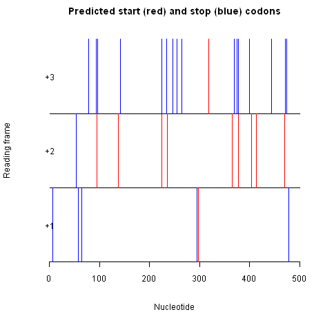
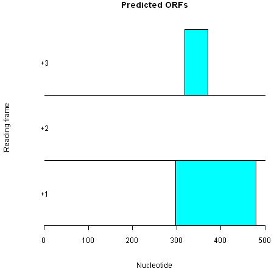
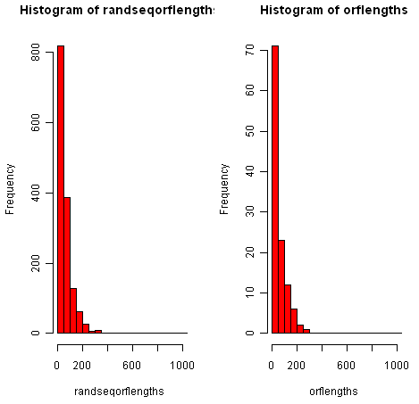

Computational Gene-finding
==========================

The genetic code
----------------

A protein-coding gene starts with an "ATG", which is followed by an
integer (whole) number of codons (DNA triplets) that code for amino
acids, and ends with a "TGA", "TAA", or "TAG". That is, the
*start codon* of a gene is always "ATG", while the *stop codon* of
a gene can be "TGA", "TAA" or "TAG".

In R, you can view the *standard genetic code*, the correspondence
between codons and the amino acids that they are translated into,
by using the tablecode() function in the SeqinR package:

.. highlight:: r

::

    > library(seqinr)
    > tablecode() 

|image2|

You can see from this table that "ATG" is translated to Met (the
amino acid methionine), and that "TAA", "TGA" and "TAG" correspond
to Stp (stop codons, which are not translated to any amino acid,
but signal the end of translation).

Finding start and stop codons in a DNA sequence
-----------------------------------------------

To look for all the potential start and stop codons in a DNA
sequence, we need to find all the "ATG"s, "TGA"s, "TAA"s, and
"TAG"s in the sequence.

To do this, we can use the "matchPattern()" function from the
Biostrings R package, which identifies all occurrences of a
particular motif (eg. "ATG") in a sequence. As input, the
matchPattern() function requires that the sequences be in the form
of a string of single characters.

For example, we can look for all "ATG"s in the sequence
"AAAATGCAGTAACCCATGCCC" by typing:

::

    > library("Biostrings")
    > s1 <- "aaaatgcagtaacccatgccc"
    > matchPattern("atg", s1) # Find all ATGs in the sequence s1
      Views on a 21-letter BString subject
    subject: aaaatgcagtaacccatgccc
    views:
        start end width
    [1]     4   6     3 [atg]
    [2]    16  18     3 [atg]

The output from matchPattern() tells us that there are two "ATG"s
in the sequence, at nucleotides 4-6, and at nucleotides 16-18. In
fact, we can see these by looking at the sequence
"AAAATGCAGTAACCCATGCCC".

Similarly, if you use matchPattern() to find the positions of
"TAA"s, "TGA"s, and "TAG"s in the sequence "AAAATGCAGTAACCCATGCCC",
you will find that it has one "TAA" at nucleotides 10-12, but no
"TAG"s or "TGA"s.

The following R function "findPotentialStartsAndStops()" can be used
to find all potential start and stop codons in a DNA
sequence:

::

    > findPotentialStartsAndStops <- function(sequence)
      {
         # Define a vector with the sequences of potential start and stop codons
         codons            <- c("atg", "taa", "tag", "tga")   
         # Find the number of occurrences of each type of potential start or stop codon
         for (i in 1:4)                                     
         {
            codon <- codons[i]
            # Find all occurrences of codon "codon" in sequence "sequence" 
            occurrences <- matchPattern(codon, sequence) 
            # Find the start positions of all occurrences of "codon" in sequence "sequence"
            codonpositions <- attr(occurrences,"start")     
            # Find the total number of potential start and stop codons in sequence "sequence"
            numoccurrences <- length(codonpositions)        
            if (i == 1) 
            {
               # Make a copy of vector "codonpositions" called "positions"
               positions <- codonpositions                
               # Make a vector "types" containing "numoccurrences" copies of "codon"   
               types <- rep(codon, numoccurrences)    
            } 
            else
            {
               # Add the vector "codonpositions" to the end of vector "positions":
               positions   <- append(positions, codonpositions, after=length(positions))
               # Add the vector "rep(codon, numoccurrences)" to the end of vector "types":
               types       <- append(types, rep(codon, numoccurrences), after=length(types))
            }
         }
         # Sort the vectors "positions" and "types" in order of position along the input sequence:
         indices <- order(positions)
         positions <- positions[indices]
         types <- types[indices] 
         # Return a list variable including vectors "positions" and "types":
         mylist <- list(positions,types)
         return(mylist)
      }

To use the function, you will need to copy and paste it into R.
For example, we can use this function to find potential
start and stop codons in sequence *s1*:

::

    > s1 <- "aaaatgcagtaacccatgccc"
    > findPotentialStartsAndStops(s1)
    [[1]]
    [1]  4 10 16
    
    [[2]]
    [1] "atg" "taa" "atg"

The result of the function is returned as a list variable that
contains two elements: the first element of the list is a vector
containing the positions of potential start and stop codons in the
input sequence, and the second element of the list is a vector
containing the type of those start/stop codons ("atg", "taa",
"tag", or "tga"). 

The output for sequence *s1* tells us that
sequence *s1* has an "ATG" starting at nucleotide 4, a "TAA"
starting at nucleotide 10, and another "ATG" starting at nucleotide
16.

We can use the function findPotentialStartsAndStops() to find all
potential start and stop codons in longer sequences. For example,
say we want to find all potential start and stop codons in the
first 500 nucleotides of the genome sequence of the DEN-1 Dengue virus
(NCBI accession NC\_001477).

In a `previous chapter <./chapter1.html#retrieving-genome-sequence-data-using-seqinr>`_, you
learnt that you can retrieve a sequence for an NCBI accession using the
"getncbiseq()" function. Thus, to retrieve the genome sequence of the DEN-1
Dengue virus (NCBI accession NC\_001477), we can type:

::

    > dengueseq <- getncbiseq("NC_001477")

The variable *dengueseq* is a vector variable, and each letter in
the DEN-1 Dengue virus DNA sequence is stored in one element of
this vector. 

Dengue virus causes `Dengue fever <http://apps.who.int/tdr/svc/diseases/dengue>`_, 
which is classified as a neglected tropical disease by the WHO.

To cut out the first 500 nucleotides of the
DEN-1 Dengue virus sequence, we can just take the first 500 elements of this
vector:

::

    > dengueseqstart <- dengueseq[1:500] # Take the first 500 nucleotides of the DEN-1 Dengue sequence
    > length(dengueseqstart)             # Find the length of the "dengueseqstart" start vector
    [1] 500

Next we want to find potential start and stop codons in the first
500 nucleotides of the Dengue virus sequence. We can do this using the
findPotentialStartsAndStops() function described above. However,
the findPotentialStartsAndStops() function requires that the input
sequence be in the format of a string of characters, rather than a
vector. Therefore, we first need to convert the vector
*dengueseqstart* into a string of characters. We can do that using
the c2s() function in the SeqinR package:

::

    > library("seqinr")                 # Load the SeqinR package
    > dengueseqstart                    # Print out the vector dengueseqstart
      [1] "a" "g" "t" "t" "g" "t" "t" "a" "g" "t" "c" "t" "a" "c" "g" "t" "g" "g" "a"
      [20] "c" "c" "g" "a" "c" "a" "a" "g" "a" "a" "c" "a" "g" "t" "t" "t" "c" "g" "a"
      [39] "a" "t" "c" "g" "g" "a" "a" "g" "c" "t" "t" "g" "c" "t" "t" "a" "a" "c" "g"
      [58] "t" "a" "g" "t" "t" "c" "t" "a" "a" "c" "a" "g" "t" "t" "t" "t" "t" "t" "a"
      [77] "t" "t" "a" "g" "a" "g" "a" "g" "c" "a" "g" "a" "t" "c" "t" "c" "t" "g" "a"
      [96] "t" "g" "a" "a" "c" "a" "a" "c" "c" "a" "a" "c" "g" "g" "a" "a" "a" "a" "a"
      [115] "g" "a" "c" "g" "g" "g" "t" "c" "g" "a" "c" "c" "g" "t" "c" "t" "t" "t" "c"
      [134] "a" "a" "t" "a" "t" "g" "c" "t" "g" "a" "a" "a" "c" "g" "c" "g" "c" "g" "a"
      [153] "g" "a" "a" "a" "c" "c" "g" "c" "g" "t" "g" "t" "c" "a" "a" "c" "t" "g" "t"
      [172] "t" "t" "c" "a" "c" "a" "g" "t" "t" "g" "g" "c" "g" "a" "a" "g" "a" "g" "a"
      [191] "t" "t" "c" "t" "c" "a" "a" "a" "a" "g" "g" "a" "t" "t" "g" "c" "t" "t" "t"
      [210] "c" "a" "g" "g" "c" "c" "a" "a" "g" "g" "a" "c" "c" "c" "a" "t" "g" "a" "a"
      [229] "a" "t" "t" "g" "g" "t" "g" "a" "t" "g" "g" "c" "t" "t" "t" "t" "a" "t" "a"
      [248] "g" "c" "a" "t" "t" "c" "c" "t" "a" "a" "g" "a" "t" "t" "t" "c" "t" "a" "g"
      [267] "c" "c" "a" "t" "a" "c" "c" "t" "c" "c" "a" "a" "c" "a" "g" "c" "a" "g" "g"
      [286] "a" "a" "t" "t" "t" "t" "g" "g" "c" "t" "a" "g" "a" "t" "g" "g" "g" "g" "c"
      [305] "t" "c" "a" "t" "t" "c" "a" "a" "g" "a" "a" "g" "a" "a" "t" "g" "g" "a" "g"
      [324] "c" "g" "a" "t" "c" "a" "a" "a" "g" "t" "g" "t" "t" "a" "c" "g" "g" "g" "g"
      [343] "t" "t" "t" "c" "a" "a" "g" "a" "a" "a" "g" "a" "a" "a" "t" "c" "t" "c" "a"
      [362] "a" "a" "c" "a" "t" "g" "t" "t" "g" "a" "a" "c" "a" "t" "a" "a" "t" "g" "a"
      [381] "a" "c" "a" "g" "g" "a" "g" "g" "a" "a" "a" "a" "g" "a" "t" "c" "t" "g" "t"
      [400] "g" "a" "c" "c" "a" "t" "g" "c" "t" "c" "c" "t" "c" "a" "t" "g" "c" "t" "g"
      [419] "c" "t" "g" "c" "c" "c" "a" "c" "a" "g" "c" "c" "c" "t" "g" "g" "c" "g" "t"
      [438] "t" "c" "c" "a" "t" "c" "t" "g" "a" "c" "c" "a" "c" "c" "c" "g" "a" "g" "g"
      [457] "g" "g" "g" "a" "g" "a" "g" "c" "c" "g" "c" "a" "c" "a" "t" "g" "a" "t" "a"
      [476] "g" "t" "t" "a" "g" "c" "a" "a" "g" "c" "a" "g" "g" "a" "a" "a" "g" "a" "g"
      [495] "g" "a" "a" "a" "a" "t"
    > dengueseqstartstring <- c2s(dengueseqstart) # Convert the vector "dengueseqstart" to a string of characters
    > dengueseqstartstring                        # Print out the variable string of characters "dengueseqstartstring"
      [1] "agttgttagtctacgtggaccgacaagaacagtttcgaatcggaagcttgcttaacgtagttctaacagttttttattagagagcagatctctgatgaacaaccaacggaaaaagacgggtcgaccgtctttcaatatgctgaaacgcgcgagaaaccgcgtgtcaactgtttcacagttggcgaagagattctcaaaaggattgctttcaggccaaggacccatgaaattggtgatggcttttatagcattcctaagatttctagccatacctccaacagcaggaattttggctagatggggctcattcaagaagaatggagcgatcaaagtgttacggggtttcaagaaagaaatctcaaacatgttgaacataatgaacaggaggaaaagatctgtgaccatgctcctcatgctgctgcccacagccctggcgttccatctgaccacccgagggggagagccgcacatgatagttagcaagcaggaaagaggaaaat"

We can then find potential start and stop codons in the first 500
nucleotides of the DEN-1 Dengue virus sequence by typing:

::

    > findPotentialStartsAndStops(dengueseqstartstring)
      [[1]]
      [1]   7  53  58  64  78  93  95  96 137 141 224 225 234 236 246 255 264 295 298 318
      [21] 365 369 375 377 378 399 404 413 444 470 471 474 478
      [[2]]
      [1] "tag" "taa" "tag" "taa" "tag" "tga" "atg" "tga" "atg" "tga" "atg" "tga" "tga"
      [14] "atg" "tag" "taa" "tag" "tag" "atg" "atg" "atg" "tga" "taa" "atg" "tga" "tga"
      [27] "atg" "atg" "tga" "atg" "tga" "tag" "tag"

We see that the lambda sequence has many different potential start
and stop codons, for example, a potential stop codon (TAG) at
nucleotide 7, a potential stop codon (TAA) at nucleotide 53, a
potential stop codon (TAG) at nucleotide 58, and so on.

Reading frames
--------------

Potential start and stop codons in a DNA sequence can be in three
different possible reading frames. A potential start/stop codon is
said to be in the *+1 reading frame* if there is an integer number
of triplets *x* between the first nucleotide of the sequence and
the start of the start/stop codon. Thus, a potential start/stop
codon that begins at nucleotides 1 (0 triplets), 4 (1 triplet), 7
(2 triplets)... will be in the +1 reading frame.

If there is an integer number of triplets *x*, plus one nucleotide
(ie. *x.3* triplets), between the first nucleotide of the sequence
and the start of the start/stop codon, then the start/stop codon is
said to be in the +2 reading frame. A potential start/stop codon
that begins at nucleotides 2 (0.3 triplets), 5 (1.3 triplets), 8
(2.3 triplets) ... is in the +2 reading frame.

Similarly, if there is an integer number of triplets *x*, plus two
nucleotides (ie. *x.6* triplets), between the first nucleotides of
the sequence and the start of the start/stop codon, the start/stop
codon is in the +3 reading frame. So a potential start/stop codon
that begins at nucleotides 3 (0.6 triplets), 6 (1.6 triplets), 9
(2.6 triplets)... is in the +3 reading frame.

For a potential start and stop codon to be part of the same gene,
they must be in the same reading frame.

From the output of findPotentialStartsAndStops() for the first 500
nucleotides of the genome of DEN-1 Dengue virus (see above), you can see that there is a
potential start codon (ATG) that starts at nucleotide 137, and a
potential stop codon (TGA) that starts at nucleotide 141. That is,
the potential start codon is from nucleotides 137-139 and the
potential stop codon is from nucleotides 141-143. Could the region
from nucleotides 137 to 143 possibly be a gene?

We can cut out the region from nucleotides 137 to 143 of the sequence
*dengueseqstartstring* to have a look, by using the substring()
function. If you look at the help page for the substring()
function, you will see that its arguments (inputs) are the name of
the variable containing the string of characters (ie., the DNA
sequence), and the coordinates of the substring that you want:

::

    > substring(dengueseqstartstring,137,143)
      [1] "atgctga"

If we look at the sequence from nucleotides 137-143,
"ATGCTGA", we see that it starts with a potential
start codon (ATG) and ends with a potential stop codon (TGA).

However, the ribosome reads the sequence by scanning the codons
(triplets) one-by-one from left to right, and when we break up the
sequence into codons (triplets) we see that it does not contain an
integer (whole) number of triplets: "ATG CTG A".

This means that even if the ribosome will not recognise the region
from 137-143 as a potential gene, as the ATG at nucleotide 137 is not
separated from the TGA at nucleotide 141 by an integer number of
codons. That is, this ATG and TGA are not in the same
*reading frame*, and so cannot be the start and stop codon of the
same gene.

The potential start codon at nucleotide 137 of the
*lambdaseqstartstring* sequence is in the +2 reading frame, as
there is an integer number of triplets, plus one nucleotide, between the start of the
sequence and the start of the start codon (ie. triplets 1-3, 4-6,
7-9, 10-12, 13-15, 16-18, 19-21, 22-24, 25-27, 28-30, ..., 133-135, and a single nucleotide 136).

However, the potential stop codon at nucleotide 141 is the +3
reading frame, as there are two nucleotides plus an integer number
of triplets between the start of the sequence and the start of the
stop codon (ie. triplets 1-3, 4-6, 7-9, 10-12, 13-15, 16-18, 19-21,
22-24, 25-27, 28-30, 31-33, 34-36, 37-39, 40-42, 43-45, ..., 133-135, 136-138, and two
nucleotides 139, 140). 

As the potential start codon at nucleotide 137 and the potential
stop codon at nucleotide 141 are in different reading frames, they
are not separated by an integer number of codons, and therefore
cannot be part of the same gene.

Finding open reading frames on the forward strand of a DNA sequence
-------------------------------------------------------------------

To find potential genes, we need to look for a potential start
codon, followed by an integer number of codons, followed by a
potential stop codon. This is eqivalent to looking for a potential
start codon followed by a potential stop codon that is in the same
reading frame. Such a stretch of DNA is known as an
*open reading frame* (ORF), and is a good candidate for a potential
gene.

The following function plotPotentialStartsAndStops() plots the potential start and 
stop codons in the three different reading frames of a DNA
sequence: 

::

    > plotPotentialStartsAndStops <- function(sequence)
      {
         # Define a vector with the sequences of potential start and stop codons
         codons <- c("atg", "taa", "tag", "tga") 
         # Find the number of occurrences of each type of potential start or stop codon
         for (i in 1:4)                                     
         {
            codon <- codons[i]
            # Find all occurrences of codon "codon" in sequence "sequence" 
            occurrences <- matchPattern(codon, sequence) 
            # Find the start positions of all occurrences of "codon" in sequence "sequence"
            codonpositions <- attr(occurrences,"start")     
            # Find the total number of potential start and stop codons in sequence "sequence"
            numoccurrences <- length(codonpositions)        
            if (i == 1) 
            {
               # Make a copy of vector "codonpositions" called "positions"
               positions   <- codonpositions                
               # Make a vector "types" containing "numoccurrences" copies of "codon"  
               types       <- rep(codon, numoccurrences)     
            } 
            else
            {
               # Add the vector "codonpositions" to the end of vector "positions":
               positions   <- append(positions, codonpositions, after=length(positions))
               # Add the vector "rep(codon, numoccurrences)" to the end of vector "types":
               types       <- append(types, rep(codon, numoccurrences), after=length(types))
            }
         }
         # Sort the vectors "positions" and "types" in order of position along the input sequence:
         indices <- order(positions)
         positions <- positions[indices]
         types <- types[indices] 
         # Make a plot showing the positions of the start and stop codons in the input sequence:
         # Draw a line at y=0 from 1 to the length of the sequence:
         x  <- c(1,nchar(sequence))
         y <- c(0,0)
         plot(x, y, ylim=c(0,3), type="l", axes=FALSE, xlab="Nucleotide", ylab="Reading frame", 
            main="Predicted start (red) and stop (blue) codons")
         segments(1,1,nchar(sequence),1)
         segments(1,2,nchar(sequence),2)
         # Add the x-axis at y=0: 
         axis(1, pos=0) 
         # Add the y-axis labels:
         text(0.9,0.5,"+1")
         text(0.9,1.5,"+2")
         text(0.9,2.5,"+3")
         # Draw in each predicted start/stop codon:
         numcodons <- length(positions)
         for (i in 1:numcodons)
         {
            position <- positions[i]
            type <- types[i]
            remainder <- (position-1) %% 3
            if    (remainder == 0) # +1 reading frame
            {
               if (type == "atg") { segments(position,0,position,1,lwd=1,col="red") }
               else               { segments(position,0,position,1,lwd=1,col="blue")}
            }
            else if (remainder == 1)
            {
               if (type == "atg") { segments(position,1,position,2,lwd=1,col="red") }
               else               { segments(position,1,position,2,lwd=1,col="blue")}
            }
            else if (remainder == 2)
            { 
               if (type == "atg") { segments(position,2,position,3,lwd=1,col="red") }
               else               { segments(position,2,position,3,lwd=1,col="blue")}
            }
         }
       }

To use this function, you will first need to copy and paste it into R.

For example, to plot the potential start and stop codons
in the first 500 nucleotides of the DEN-1 Dengue virus genome, we
type:

::

    > plotPotentialStartsAndStops(dengueseqstartstring)

|image3|

In the picture produced by plotPotentialStartsAndStops(), the
x-axis represents the input sequence (*dengueseqstartstring* here).
The potential start codons are represented by vertical red lines,
and potential stop codons are represented by vertical blue lines.

Three different layers in the picture show potential start/stop
codons in the +1 reading frame (bottom layer), +2 reading frame
(middle layer), and +3 reading frame (top layer).

We can see that the start codon at nucleotide 137 is represented by
a vertical red line in the layer corresponding to the +2 reading
frame (middle layer). There are no potential stop codons in the +2
reading frame to the right of that start codon. Thus, the start codon
at nucleotide 137 does not seem to be part of an open reading frame.

We can see however that in the +3 reading frame (top layer) there is
a predicted start codon (red line) at position 318 and that this is
followed by a predicted stop codon (blue line) at position 371. 
Thus, the region from nucleotides 318 to 371
could be a potential gene in the +3 reading frame. In other words,
the region from nucleotides 318 to 371 is an open reading frame, or
ORF.

The following function findORFsinSeq() finds ORFs in an input sequence:

::

    > findORFsinSeq <- function(sequence)
      {
         library(Biostrings)
         # Make vectors "positions" and "types" containing information on the positions of ATGs in the sequence:
         mylist <- findPotentialStartsAndStops(sequence)
         positions <- mylist[[1]]
         types <- mylist[[2]]
         # Make vectors "orfstarts" and "orfstops" to store the predicted start and stop codons of ORFs
         orfstarts <- numeric()
         orfstops <- numeric() 
         # Make a vector "orflengths" to store the lengths of the ORFs
         orflengths <- numeric()
         # Print out the positions of ORFs in the sequence:
         # Find the length of vector "positions"
         numpositions <- length(positions) 
         # There must be at least one start codon and one stop codon to have an ORF.
         if (numpositions >= 2)                
         {
            for (i in 1:(numpositions-1))
            {
               posi <- positions[i]
               typei <- types[i]
               found <- 0
               while (found == 0)
               {
                  for (j in (i+1):numpositions)
                  {
                     posj  <- positions[j]
                     typej <- types[j]
                     posdiff <- posj - posi
                     posdiffmod3 <- posdiff %% 3
                     # Add in the length of the stop codon
                     orflength <- posj - posi + 3 
                     if (typei == "atg" && (typej == "taa" || typej == "tag" || typej == "tga") && posdiffmod3 == 0) 
                     {
                        # Check if we have already used the stop codon at posj+2 in an ORF
                        numorfs <- length(orfstops)
                        usedstop <- -1    
                        if (numorfs > 0)
                        {
                          for (k in 1:numorfs)
                          {
                              orfstopk <- orfstops[k] 
                              if (orfstopk == (posj + 2)) { usedstop <- 1 }
                          }
                        }
                        if (usedstop == -1)
                        {
                           orfstarts <- append(orfstarts, posi, after=length(orfstarts))
                           orfstops <- append(orfstops, posj+2, after=length(orfstops)) # Including the stop codon.
                           orflengths <- append(orflengths, orflength, after=length(orflengths))
                        }
                        found <- 1
                        break
                     }
                     if (j == numpositions) { found <- 1 }
                  }
               }
            }
         }
         # Sort the final ORFs by start position:
         indices <- order(orfstarts)
         orfstarts <- orfstarts[indices] 
         orfstops <- orfstops[indices]
         # Find the lengths of the ORFs that we have
         orflengths <- numeric()
         numorfs <- length(orfstarts)
         for (i in 1:numorfs)
         {
            orfstart <- orfstarts[i]
            orfstop <- orfstops[i]
            orflength <- orfstop - orfstart + 1
            orflengths <- append(orflengths,orflength,after=length(orflengths))
         }
         mylist <- list(orfstarts, orfstops, orflengths)
         return(mylist)                    
      }

You will need to copy and paste this function into R before you can use it.
For example, we can use it to find all ORFs in the sequence *s1*:

::

    > s1 <- "aaaatgcagtaacccatgccc"
    > findORFsinSeq(s1)
    [[1]]
    [1] 4
    
    [[2]]
    [1] 12
    
    [[3]]
    [1] 9

The function findORFsinSeq() returns a list variable, where the
first element of the list is a vector of the start positions of
ORFs, the second element of the list is a vector of the end
positions of those ORFs, and the third element is a vector
containing the lengths of the ORFs. 

The output for the
findORFsinSeq() function for *s1* tells us that there is one ORF in
the sequence *s1*, and that the predicted start codon starts at
nucleotide 4 in the sequence, and that the predicted stop codon
ends at nucleotide 12 in the sequence.

We can use the function findORFsinSeq() to find the ORFs in the
first 500 nucleotides of the DEN-1 Dengue virus genome sequence
by typing:

::

    > findORFsinSeq(dengueseqstartstring)
      [[1]]
      [1] 298 318
      [[2]]
      [1] 480 371
      [[3]]
      [1] 183  54

The result from findORFsinSeq() indicates that there are two ORFs
in the first 500 nucleotides of the DEN-1 Dengue virus genome, at nucleotides
298-480 (start codon at 298-300, stop codon at 478-480), and 318-371 (start codon
at 318-320, stop codon at 369-371).

The following function "plotORFsinSeq()" plots the positions of ORFs in a sequence:

::

    > plotORFsinSeq <- function(sequence)
      {
         # Make vectors "positions" and "types" containing information on the positions of ATGs in the sequence:
         mylist <- findPotentialStartsAndStops(sequence)
         positions <- mylist[[1]]
         types <- mylist[[2]]
         # Make vectors "orfstarts" and "orfstops" to store the predicted start and stop codons of ORFs
         orfstarts <- numeric()
         orfstops <- numeric() 
         # Make a vector "orflengths" to store the lengths of the ORFs
         orflengths <- numeric()
         # Print out the positions of ORFs in the sequence:
         numpositions <- length(positions) # Find the length of vector "positions"
         # There must be at least one start codon and one stop codon to have an ORF.
         if (numpositions >= 2)                
         {
            for (i in 1:(numpositions-1))
            {
               posi <- positions[i]
               typei <- types[i]
               found <- 0
               while (found == 0)
               {
                  for (j in (i+1):numpositions)
                  {
                     posj <- positions[j]
                     typej <- types[j]
                     posdiff <- posj - posi
                     posdiffmod3 <- posdiff %% 3
                     orflength <- posj - posi + 3 # Add in the length of the stop codon
                     if (typei == "atg" && (typej == "taa" || typej == "tag" || typej == "tga") && posdiffmod3 == 0) 
                     {
                        # Check if we have already used the stop codon at posj+2 in an ORF
                        numorfs <- length(orfstops)
                        usedstop <- -1    
                        if (numorfs > 0)
                        {
                           for (k in 1:numorfs)
                           {
                              orfstopk <- orfstops[k] 
                              if (orfstopk == (posj + 2)) { usedstop <- 1 }
                           }
                        }
                        if (usedstop == -1)
                        {
                           orfstarts <- append(orfstarts, posi, after=length(orfstarts))
                           orfstops <- append(orfstops, posj+2, after=length(orfstops)) # Including the stop codon.
                           orflengths <- append(orflengths, orflength, after=length(orflengths))
                        }
                        found <- 1
                        break
                     }
                     if (j == numpositions) { found <- 1 }
                  }
               }
            }
         }
         # Sort the final ORFs by start position:
         indices <- order(orfstarts)
         orfstarts <- orfstarts[indices] 
         orfstops <- orfstops[indices]
         # Make a plot showing the positions of ORFs in the input sequence:
         # Draw a line at y=0 from 1 to the length of the sequence:
         x <- c(1,nchar(sequence))
         y <- c(0,0)
         plot(x, y, ylim=c(0,3), type="l", axes=FALSE, xlab="Nucleotide", ylab="Reading frame", main="Predicted ORFs")
         segments(1,1,nchar(sequence),1)
         segments(1,2,nchar(sequence),2)
         # Add the x-axis at y=0: 
         axis(1, pos=0) 
         # Add the y-axis labels:
         text(0.9,0.5,"+1")
         text(0.9,1.5,"+2")
         text(0.9,2.5,"+3")
         # Make a plot of the ORFs in the sequence:
         numorfs <- length(orfstarts)
         for (i in 1:numorfs)
         {
            orfstart <- orfstarts[i]
            orfstop <- orfstops[i]
            remainder <- (orfstart-1) %% 3
            if    (remainder == 0) # +1 reading frame
            {
               rect(orfstart,0,orfstop,1,col="cyan",border="black")
            }
            else if (remainder == 1)
            {
               rect(orfstart,1,orfstop,2,col="cyan",border="black")
            }
            else if (remainder == 2)
            { 
               rect(orfstart,2,orfstop,3,col="cyan",border="black")
            }
         }
      }

To use this function, you will first need to copy and paste it into R.
You can then use this function to plot the positions of the ORFs in
*dengueseqstartstring* by typing:

::

    > plotORFsinSeq(dengueseqstartstring)

|image4|

The picture produced by plotORFsinSeq() represents the two ORFs in
the first 500 nucleotides of the lambda genome as blue rectangles.

One of the ORFs is in the +3 reading frame, and one is in the
+1 reading frame. There are no ORFs in the +2 reading frame, as
there are no potential stop codons to the right (3') of the
potential start codons in the +2 reading frame, as we can see from
the picture produced by plotPotentialStartsAndStops() above.

Predicting the protein sequence for an ORF
------------------------------------------

If you find an ORF in a DNA sequence, it is interesting to find the
DNA sequence of the ORF. For example, the function findORFsinSeq()
indicates that there is an ORF from nucleotides 4-12 of the
sequence *s1* (aaaatgcagtaacccatgccc). To look at the DNA sequence
for just the ORF, we can use the substring() function to cut out
that piece of DNA. For example, to cut out the substring of
sequence *s1* that corresponds to the ORF from nucleotides 4-12, we
type:

::

    > s1 <- "aaaatgcagtaacccatgccc"
    > myorf <- substring(s1, 4, 12)
    > myorf # Print out the sequence of "myorf"
      [1] "atgcagtaa"

As you can see, the ORF starts with a predicted start codon (ATG),
is followed by an integer number of codons (just one codon, CAG, in
this case), and ends with a predicted stop codon (TAA).

If you have the DNA sequence of an ORF, you can predict the protein
sequence for the ORF by using the translate() function from the
SeqinR package. Note that as there is a function called translate()
in both the Biostrings and SeqinR packages, we need to type
seqinr::translate() to specify that we want to use the SeqinR
translate() function.

The translate() function requires that the input sequence be in the
form of a vector of characters. If your sequence is in the form of
a string of characters, you can convert it to a vector of
characters using the s2c() function from the SeqinR package. For
example, to predict the protein sequence of the ORF *myorf*, you
would type:

::

    > myorfvector <- s2c(myorf) # Convert the sequence of characters to a vector
    > myorfvector               # Print out the value of "myorfvector"
    [1] "a" "t" "g" "c" "a" "g" "t" "a" "a"
    > seqinr::translate(myorfvector)
    [1] "M" "Q" "*"

From the output of the seqinr::translate() function, we see that
the predicted start codon (ATG) is translated as a Methionine (M),
and that this is followed by a Glutamine (Q). The predicted stop
codon is represented as "\*" as it is not translated into any amino
acid.

Finding open reading frames on the reverse strand of a DNA sequence
-------------------------------------------------------------------

Genes in a genome sequence can occur either on the forward (plus)
strand of the DNA, or on the reverse (minus) strand. To find ORFs
on the reverse strand of a sequence, we must first infer the
reverse strand sequence, and then use our findORFsinSeq() function
to find ORFs on the reverse strand.

The reverse strand sequence easily can be inferred from the forward
strand sequence, as it is always the reverse complement sequence of
the forward strand sequence. We can use the comp() function from
the SeqinR package to calculate the complement of a sequence, and
the rev() function to reverse that sequence in order to give us the
reverse complement sequence.

The comp() and rev() functions require that the input sequence is
in the form of a vector of characters. The s2c() function can be
used to convert a sequence in the form of a string of characters to
a vector, while the c2s() function is useful for convering a vector
back to a string of characters. 

For example, if our forward strand
sequence is "AAAATGCTTAAACCATTGCCC", and we want to find the
reverse strand sequence, we type:

::

    > forward <- "AAAATGCTTAAACCATTGCCC"
    > forwardvector <- s2c(forward)                # Convert the string of characters to a vector
    > forwardvector                                # Print out the vector containing the forward strand sequence
     [1] "A" "A" "A" "A" "T" "G" "C" "T" "T" "A" "A" "A" "C" "C" "A" "T" "T" "G" "C" "C" "C"
    > reversevector <- rev(comp(forwardvector))    # Find the reverse strand sequence, by finding the reverse complement
    > reversevector                                # Print out the vector containing the reverse strand sequence
     [1] "g" "g" "g" "c" "a" "a" "t" "g" "g" "t" "t" "t" "a" "a" "g" "c" "a" "t" "t" "t" "t"
    > reverse <- c2s(reversevector)                # Convert the vector to a string of characters
    > reverse                                      # Print out the string of characters containing the reverse strand sequence
    [1] "gggcaatggtttaagcatttt"

In the command reversevector <- rev(comp(forwardvector)) above, we
are first using the comp() function to find the complement of the
forward strand sequence. We are then using the rev() function to
take the output sequence given by comp() and reverse the order of
the letters in that sequence. An equivalent way of doing the same
thing would be to type:

::

    > complement <- comp(forwardvector)            # Find the complement of the forward strand sequence
    > reversevector <- rev(complement)             # Reverse the order of the letters in sequence "complement", to
                                                      # find the reverse strand sequence (the reverse complement sequence)

Once we have inferred the reverse strand sequence, we can then use
the findORFsinSeq() function to find ORFs in the reverse strand
sequence:

::

    > findORFsinSeq(reverse)             
    [[1]]
    [1] 6
    
    [[2]]
    [1] 14
    
    [[3]]
    [1] 9

This indicates that there is one ORF of length 9 bp in the reverse
strand of sequence "AAAATGCTTAAACCATTGCCC", that has a predicted start codon that
starts at nucleotide 6 in the reverse strand sequence and a
predicted stop codon that ends at nucleotide 14 in the reverse
strand sequence.

Lengths of open reading frames
------------------------------

As you can see from the picture displaying the genetic code made
using tablecode() (above), three of the 64 different codons are
stop codons. This means that in a random DNA sequence the
probability that any codon is a potential stop codon is 3/64, or
about 1/21 (about 5\%). 

Therefore, you might expect that sometimes
potential start and stop codons can occur in a DNA sequence just
due to chance alone, not because they are actually part of any real
gene that is transcribed and translated into a protein. 

As a result, many of the ORFs in a DNA sequence may not correspond to
real genes, but just be stretches of DNA between potential start
and stop codons that happened by chance to be found in the
sequence.

In other words, an open reading frame (ORF) is just a
*gene prediction*, or a potential gene. It may correspond to a real
gene (may be a true positive gene prediction), but it may not (may
be a false positive gene prediction).

How can we tell whether the potential start and stop codons of an
ORF are probably real start and stop codons, that is, whether an
ORF probably corresponds to a real gene that is transcribed and
translated into a protein? 

In fact, we cannot tell using
bioinformatics methods alone (we actually need to do some lab
experiments to know), but we can make a fairly confident
prediction. We can make our prediction based on the length of the
ORF. 

y definition, an ORF is a stretch of DNA that starts with a
potential start codon, and ends with a potential stop codon in the
same reading frame, and so has no internal stop codons in that
reading frame. Because about 1/21 of codons (~5\%) in a random DNA
sequence are expected to be potential stop codons just by chance
alone, if we see a very long ORF of hundreds of codons, it would be
surprising that there would be no internal stop codons in such a
long stretch of DNA if the ORF were not a real gene. 

In other
words, long ORFs that are hundreds of codons long are unlikely to
occur due to chance alone, and therefore we can be fairly confident
that such long ORFs probably correspond to real genes.

Identifying significant open reading frames
-------------------------------------------

How long does an ORF need to be in order for us to be confident
that it probably corresponds to a real gene? This is a difficult
question. 

One approach to answer this is to ask: what is the
longest ORF found in a random sequence of the same length and
nucleotide composition as our original sequence? 

The ORFs in a
random sequence do not correspond to real genes, but are just due
to potential start and stop codons that have occurred by chance in
those sequences (since, by definition, a random sequence is one
that was generated randomly, rather than by evolution as in a real
organism).

Thus, by looking at the lengths of ORFs in the random
sequence, we can see what is the longest ORF that is likely to
occur by chance alone.

But where can we get random sequences from? In a `previous chapter
<./chapter4.html#calculating-the-statistical-significance-of-a-pairwise-global-alignment>`_,
you learnt that you can generate random sequences using a
multinomial model with a particular probability of each letter (a
particular probability of A, C, G, and T in the case of random DNA
sequences).

In that `previous chapter
<./chapter4.html#calculating-the-statistical-significance-of-a-pairwise-global-alignment>`_,
we used the function generateSeqsWithMultinomialModel() to generate random sequences 
using a multinomial model in which the probability of each letter is set equal to the
fraction of an input sequence that consists of that letter. This
function takes two arguments, the input sequence, and the number of
the random sequences that you want to generate.

For example, to create a random sequence of the same length as
'AAAATGCTTAAACCATTGCCC', using a multinomial model in which the
probabilities of A, C, G and T are set equal to their fractions in
this sequence, we copy and paste the generateSeqsWithMultinomialModel() into R, then type:

::

    > myseq    <- "AAAATGCTTAAACCATTGCCC"
    > generateSeqsWithMultinomialModel(myseq, 1) # Generate one random sequence using the multinomial model
    [1] "AACAATTCTACCCTATTCTTC"

We can then use the findORFsinSeq() function to find ORFs in this
random sequence. If we repeat this 10 times, we can find the
lengths of the ORFs found in the 10 random sequences. We can then
compare the lengths of the ORFs found in the original sequence, to
the lengths of the ORFs found in the random sequences. 

For example,
to compare the lengths of ORFs found in the DEN-1 Dengue virus genome
sequence *dengueseq* to the lengths of ORFs found in 10 random
sequences generated using a multinomial model in which the
probabilities of the four bases are set equal to their fractions in
the DEN-1 Dengue virus sequence, we type:

::

    > dengueseqstring <- c2s(dengueseq)           # Convert the Dengue sequence to a string of characters
    > mylist <- findORFsinSeq(dengueseqstring)    # Find ORFs in "dengueseqstring"
    > orflengths <- mylist[[3]]                   # Find the lengths of ORFs in "dengueseqstring"
    > randseqs <- generateSeqsWithMultinomialModel(dengueseqstring, 10) # Generate 10 random sequences using the multinomial model
    > randseqorflengths <- numeric()              # Tell R that we want to make a new vector of numbers
    > for (i in 1:10)
      {
         print(i)
         randseq <- randseqs[i]                     # Get the ith random sequence
         mylist <- findORFsinSeq(randseq)           # Find ORFs in "randseq"
         lengths <- mylist[[3]]                     # Find the lengths of ORFs in "randseq"
         randseqorflengths <- append(randseqorflengths, lengths, after=length(randseqorflengths))
      }

This may take a little time to run, however, the for loop above
prints out the value of *i* each time that it starts the loop, so
you can see how far it has got. 

In the code above, we retrieve the
lengths of the ORFs found by function findORFsinSeq() by taking the
third element of the list returned by this function. As mentioned
above, the third element of the list returned by this function is a
vector containing the lengths of all the ORFs found in the input
sequence.

We can then plot a histogram of the lengths of the ORFs in the real
DEN-1 Dengue genome sequence (*orflengths*) beside a
histogram of the lengths of the ORFs in the 10 random sequences
(*randseqorflengths*):

::

    > par(mfrow = c(1,2))                      # Make a picture with two plots side-by-side (one row, two columns)
    > bins <- seq(0,11000,50)                  # Set the bins for the histogram
    > hist(randseqorflengths, breaks=bins, col="red", xlim=c(0,1000))
    > hist(orflengths, breaks=bins, col="red", xlim=c(0,1000))

|image5|

In other words, the histogram of the lengths of the ORFs in the 10
random sequences gives us an idea of the length distribution of
ORFs that you would expect by chance alone in a random DNA sequence
(generated by a multinomial model in which the probabilities of the
four bases are set equal to their frequencies in the DEN-1 Dengue 
virus genome sequence).

We can calculate the longest of the ORFs that occurs in the random
sequences, using the max() function, which can be used to find the
largest element in a vector of numbers:

::

    > max(randseqorflengths)
    [1] 342

This indicates that the longest ORF that occurs in the random
sequences is 342 nucleotides long. Thus, it is possible for an ORF
of up to 342 nucleotides to occur by chance alone in a random
sequence of the same length and roughly the same composition as the
DEN-1 Dengue virus genome. 

Therefore, we could use 342
nucleotides as a threshold, and discard all ORFs found in the
DEN-1 Dengue virus genome that are shorter than this, under the
assumption that they probably arose by chance and probably do not
correspond to real genes. How many ORFs would be left in the
DEN-1 Dengue virus genome sequence if we used 342 nucleotides as
a threshold?

::

    > summary(orflengths > 342)
         Mode   FALSE    TRUE    NA's 
      logical     115       1       0

If we did use 342 nucleotides as a threshold, there would only be
1 ORF left in the DEN-1 Dengue virus genome. Some of the 115
shorter ORFs that we discarded may correspond to real genes.

Generally, we don't want to miss many real genes, we may want to
use a more tolerant threshold. For example, instead of discarding
all Dengue ORFs that are shorter than the longest ORF found in the
10 random sequences, we could discard all Dengue ORFs that are
shorter than the longest 99% of ORFs in the random sequences.

We can use the quantile() function to find *quantiles* of a set of
numbers. The *99th* quantile for a set of numbers is the value *x*
such that 99% of the numbers in the set have values less than *x*.

For example, to find the 99th quantile of *randomseqorflengths*, we
type:

::

    > quantile(randseqorflengths, probs=c(0.99))
    99% 
    248.07

This means that 99\% of the ORFs in the random sequences have
lengths less than 248 nucleotides long. In other words, the longest
of the longest 99\% of ORFs in the random sequences is 248
nucleotides. 

Thus, if we were using this as a threshold, we would
discard all ORFs from the DEN-1 Dengue genome that are 248
nucleotides or shorter. This will result in fewer ORFs being
discarded than if we used the more stringent threshold of 342
nucleotides (ie. discarding all ORFs of <342 nucleotides), so we
will probably have discarded fewer ORFs that correspond to real
genes. Unfortunately, it probably means that we will also have kept
more false positives at the same time, that is, ORFs that do not
correspond to real genes.

Summary
-------

In this practical, you will have learnt to use the following R
functions:

#. substring() for cutting out a substring of a string of
   characters (eg. a subsequence of a DNA sequence)
#. rev() for reversing the order of the elements in a vector
#. hist() to make a histogram plot
#. max() to find the largest element in a vector of numbers
#. quantile() to find quantiles of a set of numbers that correspond
   to particular probabilities

All of these functions belong to the standard installation of R.

You have also learnt the following R functions that belong to the
bioinformatics packages:

#. tablecode() in the SeqinR package for viewing the genetic code
#. MatchPattern() in the Biostrings package for finding all
   occurrences of a motif in a sequence
#. translate() in the SeqinR package to get the predicted protein
   sequence for an ORF
#. s2c() in the SeqinR package to convert a sequence stored as a
   string of characters into a vector
#. c2s() in the SeqinR package to convert a sequence stored in a
   vector into a string of characters
#. comp() in the SeqinR package to find the complement of a DNA
   sequence

Links and Further Reading
-------------------------

Some links are included here for further reading.

For background reading on computational gene-finding, it is
recommended to read Chapter 2 of
*Introduction to Computational Genomics: a case studies approach*
by Cristianini and Hahn (Cambridge University Press;
`www.computational-genomics.net/book/ <http://www.computational-genomics.net/book/>`_).

For more in-depth information and more examples on using the SeqinR
package for sequence analysis, look at the SeqinR documentation,
`http://pbil.univ-lyon1.fr/software/seqinr/doc.php?lang=eng <http://pbil.univ-lyon1.fr/software/seqinr/doc.php?lang=eng>`_.

For more information on and examples using the Biostrings package,
see the Biostrings documentation at
`http://www.bioconductor.org/packages/release/bioc/html/Biostrings.html <http://www.bioconductor.org/packages/release/bioc/html/Biostrings.html>`_.

There is also a very nice chapter on "Analyzing Sequences", which
includes examples of using the SeqinR and Biostrings packages for
sequence analysis, in the book
*Applied statistics for bioinformatics using R* by Krijnen
(available online at
`cran.r-project.org/doc/contrib/Krijnen-IntroBioInfStatistics.pdf <http://cran.r-project.org/doc/contrib/Krijnen-IntroBioInfStatistics.pdf>`_).

For a more in-depth introduction to R, a good online tutorial is
available on the "Kickstarting R" website,
`cran.r-project.org/doc/contrib/Lemon-kickstart <http://cran.r-project.org/doc/contrib/Lemon-kickstart/>`_.

There is another nice (slightly more in-depth) tutorial to R
available on the "Introduction to R" website,
`cran.r-project.org/doc/manuals/R-intro.html <http://cran.r-project.org/doc/manuals/R-intro.html>`_.

Acknowledgements
----------------

Many of the ideas for the examples and exercises for this practical
were inspired by the Matlab case study on the
*Haemophilus influenzae* genome
(`www.computational-genomics.net/case\_studies/haemophilus\_demo.html <http://www.computational-genomics.net/case_studies/haemophilus_demo.html>`_)
from the website that accompanies the book
*Introduction to Computational Genomics: a case studies approach*
by Cristianini and Hahn (Cambridge University Press;
`www.computational-genomics.net/book/ <http://www.computational-genomics.net/book/>`_).

Thank you to Jean Lobry and Simon Penel for helpful advice on using
the SeqinR package.

Exercises
---------

Answer the following questions, using the R package. For each
question, please record your answer, and what you typed into R to
get this answer.

Model answers to the exercises are given in
`Answers to the exercises on Computational Gene-finding <./chapter_answers.html#computational-gene-finding>`_.

Q1. How many ORFs are there on the forward strand of the DEN-1 Dengue virus genome (NCBI accession NC\_001477)?

Q2. What are the coordinates of the rightmost (most 3', or last) ORF in the forward strand of the DEN-1 Dengue virus genome?

Q3. What is the predicted protein sequence for the rightmost (most 3', or last) ORF in the forward strand of the DEN-1 Dengue virus genome?

Q4. How many ORFs are there of 30 nucleotides or longer in the forward strand of the DEN-1 Dengue virus genome sequence?

Q5. How many ORFs longer than 248 nucleotides are there in the forward strand of the DEN-1 Dengue genome sequence?

Q6. If an ORF is 248 nucleotides long, what length in amino acids will its predicted protein sequence be?

Q7. How many ORFs are there on the forward strand of the rabies virus genome (NCBI accession NC\_001542)?
    Note: rabies virus is the virus responsible for `rabies <http://www.who.int/rabies/en/>`_, which is classified by the 
    WHO as a neglected tropical disease.

Q8. What is the length of the longest ORF among the 99% of longest ORFs in 10 random sequences of the same lengths and composition as
the rabies virus genome sequence?

Q9. How many ORFs are there in the rabies virus genome that are longer than the threshold length that you found in Q8?

.. |image0| image:: ../_static/P7_image6.png
.. |image1| image:: ../_static/P7_image7.png
.. |image2| image:: ../_static/P7_image1.png

