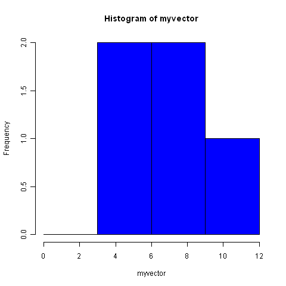
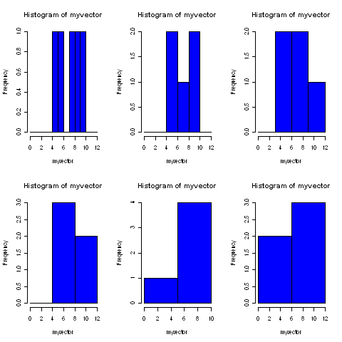
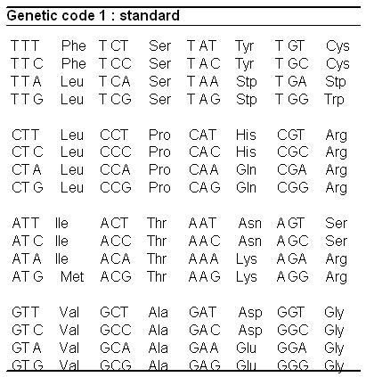
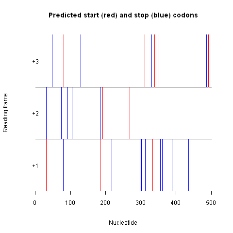
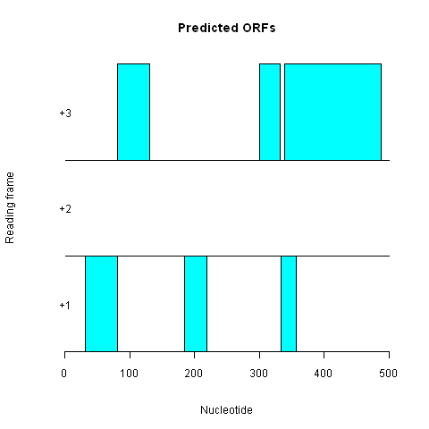
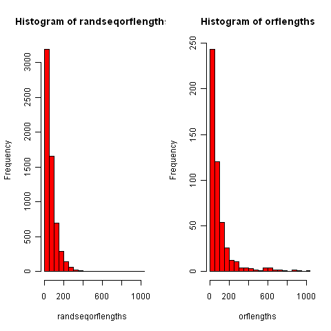

Computational Gene-finding
==========================

The genetic code
----------------

A protein-coding gene starts with an "ATG", which is followed by an
integer (whole) number of codons (DNA triplets) that code for amino
acids, and ends with a "TGA", "TAA", or "TAG". That is, the
*start codon* of a gene is always "ATG", while the *stop codon* of
a gene can be "TGA", "TAA" or "TAG".

In R, you can view the *standard genetic code*, the correspondence
between codons and the amino acids that they are translated into,
by using the tablecode() function in the SeqinR library:

::

    > library(seqinr)
    > par(mfrow = c(1,1)) # Make plots with just 1 column and 1 row again
    > library("seqinr")
    > tablecode() 

|image2|

You can see from this table that "ATG" is translated to Met (the
amino acid methionine), and that "TAA", "TGA" and "TAG" correspond
to Stp (stop codons, which are not translated to any amino acid,
but signal the end of translation).

Finding start and stop codons in a DNA sequence
-----------------------------------------------

To look for all the potential start and stop codons in a DNA
sequence, we need to find all the "ATG"s, "TGA"s, "TAA"s, and
"TAG"s in the sequence.

To do this, we can use the matchPattern function from the
Biostrings R library, which identifies all occurrences of a
particular motif (eg. "ATG") in a sequence. As input, the
matchPattern() function requires that the sequences be in the form
of a string of single characters.

For example, we can look for all "ATG"s in the sequence
"AAAATGCAGTAACCCATGCCC" by typing:

::

    > library("Biostrings")
    > s1 <- "aaaatgcagtaacccatgccc"
    > matchPattern("atg", s1) # Find all ATGs in the sequence s1
      Views on a 21-letter BString subject
    subject: aaaatgcagtaacccatgccc
    views:
        start end width
    [1]     4   6     3 [atg]
    [2]    16  18     3 [atg]

The output from matchPattern() tells us that there are two "ATG"s
in the sequence, at nucleotides 4-6, and at nucleotides 16-18. In
fact, we can see these by looking at the sequence
"AAAATGCAGTAACCCATGCCC".

Similarly, if you use matchPattern() to find the positions of
"TAA"s, "TGA"s, and "TAG"s in the sequence "AAAATGCAGTAACCCATGCCC",
you will find that it has one "TAA" at nucleotides 10-12, but no
"TAG"s or "TGA"s.

In previous practicals, you learnt that you can read in your own or
other people's R functions from a text file by using the source()
command. The file
`www.ucc.ie/microbio/MB6301/Rfunctions.R <http://www.ucc.ie/microbio/MB6301/Rfunctions.R>`_)
contains a function findPotentialStartsAndStops() that contains a
function for finding all potential start and stop codons in a DNA
sequence. For example, we can use this function to find potential
start and stop codons in sequence *s1*:

::

    > source("Rfunctions.R")
    > findPotentialStartsAndStops(s1)
    [[1]]
    [1]  4 10 16
    
    [[2]]
    [1] "atg" "taa" "atg"

The result of the function is returned as a list variable that
contains two elements: the first element of the list is a vector
containing the positions of potential start and stop codons in the
input sequence, and the second element of the list is a vector
containing the type of those start/stop codons ("atg", "taa",
"tag", or "tga"). The output for sequence *s1* tells us that
sequence *s1* has an "ATG" starting at nucleotide 4, a "TAA"
starting at nucleotide 10, and another "ATG" starting at nucleotide
16.

We can use the function findPotentialStartsAndStops() to find all
potential start and stop codons in longer sequences. For example,
say we want to find all potential start and stop codons in the
first 500 nucleotides of the genome sequence of Bacteriophage
lambda. We would first need to retrieve the sequence from the NCBI
Sequence Database.

In previous practicals (see Practical 5,
`http://www.ucc.ie/microbio/MB6301/practical5\_trees.html <http://www.ucc.ie/microbio/MB6301/practical5_trees.html>`_),
you learnt about the functions retriveuniprotseqs() and
retreivegenbankseqs() in file Rfunctions.R for retrieving protein
sequences from UniProt, or DNA sequences from the NCBI database,
respectively. Bacteriophage lambda is a virus, and the file
"Rfunctions.R" contains a special function retrievevirusseqs() for
retrieving virus DNA sequences from the NCBI database.

The NCBI accession for the Bacteriophage lambda genome sequence is
NC\_001416, and we can retrieve the sequence using
retrievevirusseqs() by typing:

::

    > source("Rfunctions.R")
    > seqnames <- c("NC_001416")
    > seqs <- retrievevirusseqs(seqnames)
    > lambdaseq <- seqs[[1]] # The first (and only, in this case) sequence retrieved is the Bacteriophage lambda sequence

The variable *lambdaseq* is a vector variable, and each letter in
the Bacteriophage lambda DNA sequence is stored in one element of
this vector. Thus, to cut out the first 500 nucleotides of the
lambda sequence, we can just take the first 500 elements of this
vector:

::

    > lambdaseqstart <- lambdaseq[1:500] # Take the first 500 nucleotides of the lambda sequence
    > length(lambdaseqstart)             # Find the length of the "lambdaseq" start vector
    [1] 500

Next we want to find potential start and stop codons in the first
500 nucleotides of the lambda sequence. We can do this using the
findPotentialStartsAndStops() function described above. However,
the findPotentialStartsAndStops() function requires that the input
sequence be in the format of a string of characters, rather than a
vector. Therefore, we first need to convert the vector
*lambdaseqstart* into a string of characters. We can do that using
the c2s() function in the SeqinR library:

::

    > lambdaseqstart                    # Print out the vector lambdaseqstart
      [1] "g" "g" "g" "c" "g" "g" "c" "g" "a" "c" "c" "t" "c" "g" "c" "g" "g" "g" "t" "t" "t" "t" "c" "g" "c" "t" "a" "t" "t" "t" "a"
     [32] "t" "g" "a" "a" "a" "a" "t" "t" "t" "t" "c" "c" "g" "g" "t" "t" "t" "a" "a" "g" "g" "c" "g" "t" "t" "t" "c" "c" "g" "t" "t"
     [63] "c" "t" "t" "c" "t" "t" "c" "g" "t" "c" "a" "t" "a" "a" "c" "t" "t" "a" "a" "t" "g" "t" "t" "t" "t" "t" "a" "t" "t" "t" "a"
     [94] "a" "a" "a" "t" "a" "c" "c" "c" "t" "c" "t" "g" "a" "a" "a" "a" "g" "a" "a" "a" "g" "g" "a" "a" "a" "c" "g" "a" "c" "a" "g"
    [125] "g" "t" "g" "c" "t" "g" "a" "a" "a" "g" "c" "g" "a" "g" "g" "c" "t" "t" "t" "t" "t" "g" "g" "c" "c" "t" "c" "t" "g" "t" "c"
    [156] "g" "t" "t" "t" "c" "c" "t" "t" "t" "c" "t" "c" "t" "g" "t" "t" "t" "t" "t" "g" "t" "c" "c" "g" "t" "g" "g" "a" "a" "t" "g"
    [187] "a" "a" "c" "a" "a" "t" "g" "g" "a" "a" "g" "t" "c" "a" "a" "c" "a" "a" "a" "a" "a" "g" "c" "a" "g" "c" "t" "g" "g" "c" "t"
    [218] "g" "a" "c" "a" "t" "t" "t" "t" "c" "g" "g" "t" "g" "c" "g" "a" "g" "t" "a" "t" "c" "c" "g" "t" "a" "c" "c" "a" "t" "t" "c"
    [249] "a" "g" "a" "a" "c" "t" "g" "g" "c" "a" "g" "g" "a" "a" "c" "a" "g" "g" "g" "a" "a" "t" "g" "c" "c" "c" "g" "t" "t" "c" "t"
    [280] "g" "c" "g" "a" "g" "g" "c" "g" "g" "t" "g" "g" "c" "a" "a" "g" "g" "g" "t" "a" "a" "t" "g" "a" "g" "g" "t" "g" "c" "t" "t"
    [311] "t" "a" "t" "g" "a" "c" "t" "c" "t" "g" "c" "c" "g" "c" "c" "g" "t" "c" "a" "t" "a" "a" "a" "a" "t" "g" "g" "t" "a" "t" "g"
    [342] "c" "c" "g" "a" "a" "a" "g" "g" "g" "a" "t" "g" "c" "t" "g" "a" "a" "a" "t" "t" "g" "a" "g" "a" "a" "c" "g" "a" "a" "a" "a"
    [373] "g" "c" "t" "g" "c" "g" "c" "c" "g" "g" "g" "a" "g" "g" "t" "t" "g" "a" "a" "g" "a" "a" "c" "t" "g" "c" "g" "g" "c" "a" "g"
    [404] "g" "c" "c" "a" "g" "c" "g" "a" "g" "g" "c" "a" "g" "a" "t" "c" "t" "c" "c" "a" "g" "c" "c" "a" "g" "g" "a" "a" "c" "t" "a"
    [435] "t" "t" "g" "a" "g" "t" "a" "c" "g" "a" "a" "c" "g" "c" "c" "a" "t" "c" "g" "a" "c" "t" "t" "a" "c" "g" "c" "g" "t" "g" "c"
    [466] "g" "c" "a" "g" "g" "c" "c" "g" "a" "c" "g" "c" "a" "c" "a" "g" "g" "a" "a" "c" "t" "g" "a" "a" "g" "a" "a" "t" "g" "c" "c"
    [497] "a" "g" "a" "g"
    > library("seqinr")                 # Load the SeqinR library
    > lambdaseqstartstring <- c2s(lambdaseqstart) # Convert the vector "lambdaseqstart" to a string of characters
    > lambdaseqstartstring              # Print out the variable string of characters "lambdaseqstartstring"
    [1] "gggcggcgacctcgcgggttttcgctatttatgaaaattttccggtttaaggcgtttccgttcttcttcgtcataacttaatgtttttatttaaaataccctctgaaaagaaaggaaacgacaggtgctgaaagcgaggctttttggcctctgtcgtttcctttctctgtttttgtccgtggaatgaacaatggaagtcaacaaaaagcagctggctgacattttcggtgcgagtatccgtaccattcagaactggcaggaacagggaatgcccgttctgcgaggcggtggcaagggtaatgaggtgctttatgactctgccgccgtcataaaatggtatgccgaaagggatgctgaaattgagaacgaaaagctgcgccgggaggttgaagaactgcggcaggccagcgaggcagatctccagccaggaactattgagtacgaacgccatcgacttacgcgtgcgcaggccgacgcacaggaactgaagaatgccagag"

We can then find potential start and stop codons in the first 500
nucleotides of the lambda sequence by typing:

::

    > findPotentialStartsAndStops(lambdaseqstartstring)
    [[1]]
     [1]  31  32  48  74  79  81  92 104 129 184 185 191 217 269 298 300 301 312 313 330 334 339 351 355 361
    [26] 388 436 486 492
    
    [[2]]
     [1] "atg" "tga" "taa" "taa" "taa" "atg" "taa" "tga" "tga" "atg" "tga" "atg" "tga" "atg" "taa" "atg"
    [17] "tga" "atg" "tga" "taa" "atg" "atg" "atg" "tga" "tga" "tga" "tga" "tga" "atg"

We see that the lambda sequence has many different potential start
and stop codons, for example, a potential start codon (ATG) at
nucleotide 31, a potential stop codon (TGA) at nucleotide 32, a
potential stop codon (TAA) at nucleotide 48, and so on.

Reading frames
--------------

Potential start and stop codons in a DNA sequence can be in three
different possible reading frames. A potential start/stop codon is
said to be in the *+1 reading frame* if there is an integer number
of triplets *x* between the first nucleotide of the sequence and
the start of the start/stop codon. Thus, a potential start/stop
codon that begins at nucleotides 1 (0 triplets), 4 (1 triplet), 7
(2 triplets)... will be in the +1 reading frame.

If there is an integer number of triplets *x*, plus one nucleotide
(ie. *x.3* triplets), between the first nucleotide of the sequence
and the start of the start/stop codon, then the start/stop codon is
said to be in the +2 reading frame. A potential start/stop codon
that begins at nucleotides 2 (0.3 triplets), 5 (1.3 triplets), 8
(2.3 triplets) ... is in the +2 reading frame.

Similarly, if there is an integer number of triplets *x*, plus two
nucleotides (ie. *x.6* triplets), between the first nucleotides of
the sequence and the start of the start/stop codon, the start/stop
codon is in the +3 reading frame. So a potential start/stop codon
that begins at nucleotides 3 (0.6 triplets), 6 (1.6 triplets), 9
(2.6 triplets)... is in the +3 reading frame.

For a potential start and stop codon to be part of the same gene,
they must be in the same reading frame.

From the output of findPotentialStartsAndStops() for the first 500
nucleotides of the genome of lambda, you can see that there is a
potential start codon (ATG) that starts at nucleotide 31, and a
potential stop codon (TAA) that starts at nucleotide 48. That is,
the potential start codon is from nucleotides 31-33 and the
potential stop codon is from nucleotides 48-50. Could the region
from nucleotides 31 to 50 possibly be a gene?

We can cut out the region from nucleotides 31 to 50 of the sequence
*lambdaseqstartstring* to have a look, by using the substring()
function. If you look at the help page for the substring()
function, you will see that its arguments (inputs) are the name of
the variable containing the string of characters (ie., the DNA
sequence), and the coordinates of the substring that you want:

::

    > substring(lambdaseqstartstring,31,50)
    [1] "atgaaaattttccggtttaa" 

If we look at the sequence from nucleotides 31-50,
"ATGAAAATTTTCCGGTTTAA", we see that it starts with a potential
start codon (ATG) and ends with a potential stop codon (TAA).
However, the ribosome reads the sequence by scanning the codons
(triplets) one-by-one from left to right, and when we break up the
sequence into codons (triplets) we see that it does not contain an
integer (whole) number of triplets: "ATG AAA ATT TTC CGG TTT AA".

This means that even if the ribosome will not recognise the region
from 31-50 as a potential gene, as the ATG at nucleotide 31 is not
separated from the TAA at nucleotide 48 by an integer number of
codons. That is, this ATG and TAA are not in the same
*reading frame*, and so cannot be the start and stop codon of the
same gene.

The potential start codon at nucleotide 31 of the
*lambdaseqstartstring* sequence is in the +1 reading frame, as
there is an integer number of triplets between the start of the
sequence and the start of the start codon (ie. triplets 1-3, 4-6,
7-9, 10-12, 13-15, 16-18, 19-21, 22-24, 25-27, 28-30).

However, the potential stop codon at nucleotide 48 is the +3
reading frame, as there are two nucleotides plus an integer number
of triplets between the start of the sequence and the start of the
stop codon (ie. triplets 1-3, 4-6, 7-9, 10-12, 13-15, 16-18, 19-21,
22-24, 25-27, 28-30, 31-33, 34-36, 37-39, 40-42, 43-45, and
nucleotides 46, 47).

As the potential start codon at nucleotide 31 and the potential
stop codon at nucleotide 48 are in different reading frames, they
are not separated by an integer number of codons, and therefore
cannot be part of the same gene.

Finding open reading frames on the forward strand of a DNA sequence
-------------------------------------------------------------------

To find potential genes, we need to look for a potential start
codon, followed by an integer number of codons, followed by a
potential stop codon. This is eqivalent to looking for a potential
start codon followed by a potential stop codon that is in the same
reading frame. Such a stretch of DNA is known as an
*open reading frame* (ORF), and is a good candidate for a potential
gene.

The file "Rfunctions.R" contains a function
plotPotentialStartsAndStops() for plotting the potential start and
stop codons in the three different reading frames of a DNA
sequence. For example, to plot the potential start and stop codons
in the first 500 nucleotides of the Bacteriophage lambda genome, we
type:

::

    > source("Rfunctions.R")
    > plotPotentialStartsAndStops(lambdaseqstartstring)

|image3|

In the picture produced by plotPotentialStartsAndStops(), the
x-axis represents the input sequence (*lambdaseqstartstring* here).
The potential start codons are represented by vertical red lines,
and potential stop codons are represented by vertical blue lines.

Three different layers in the picture show potential start/stop
codons in the +1 reading frame (bottom layer), +2 reading frame
(middle layer), and +3 reading frame (top layer).

We can see that the start codon at nucleotide 31 is represented by
a vertical red line in the layer corresponding to the +1 reading
frame (bottom layer). The next potential stop codon in the +1
reading frame to the right of that start codon is a potential stop
codon that begins at nucleotide 79 (ie. the stop codon is from
nucleotides 79-81). Thus, the region from nucleotides 31 to 81
could be a potential gene in the +1 reading frame. In other words,
the region from nucleotides 31 to 81 is an open reading frame, or
ORF.

The file Rfunctions.R contains a function findORFsinSeq() that
finds ORFs in an input sequence. For example, we can use it to find
all ORFs in the sequence *s1*:

::

    > s1 <- "aaaatgcagtaacccatgccc"
    > findORFsinSeq(s1)
    [[1]]
    [1] 4
    
    [[2]]
    [1] 12
    
    [[3]]
    [1] 9

The function findORFsinSeq() returns a list variable, where the
first element of the list is a vector of the start positions of
ORFs, the second element of the list is a vector of the end
positions of those ORFs, and the third element is a vector
containing the lengths of the ORFs. The output for the
findORFsinSeq() function for *s1* tells us that there is one ORF in
the sequence *s1*, and that the predicted start codon starts at
nucleotide 4 in the sequence, and that the predicted stop codon
ends at nucleotide 12 in the sequence.

We can use the function findORFsinSeq() to find the ORFs in the
first 500 nucleotides of the Bacteriophage lambda genome sequence
by typing:

::

    > findORFsinSeq(lambdaseqstartstring)
    [[1]]
    [1]  31  81 184 300 334 339
    
    [[2]]
    [1]  81 131 219 332 357 488
    
    [[3]]
    [1]  51  51  36  33  24 150

The result from findORFsinSeq() indicates that there are six ORFs
in the first 500 nucleotides of the lambda genome, at nucleotides
31-81, 81-131, 184-219, 300-332, 334-357, and 339-488.

The file "Rfunctions.R" contains a function plotORFsinSeq() for
plotting the positions of ORFs in a sequence. We can use this
function to plot the positions of the ORFs in
*lambdaseqstartstring* by typing:

::

    > plotORFsinSeq(lambdaseqstartstring)

|image4|

The picture produced by plotORFsinSeq() represents the six ORFs in
the first 500 nucleotides of the lambda genome as blue rectangles.
Three of the ORFs are in the +1 reading frame, and three are in the
+3 reading frame. There are no ORFs in the +2 reading frame, as
there are no potential stop codons to the right (3') of the
potential start codons in the +2 reading frame, as we can see from
the picture produced by plotPotentialStartsAndStops() above.

Predicting the protein sequence for an ORF
------------------------------------------

If you find an ORF in a DNA sequence, it is interesting to find the
DNA sequence of the ORF. For example, the function findORFsinSeq()
indicates that there is an ORF from nucleotides 4-12 of the
sequence *s1* (aaaatgcagtaacccatgccc). To look at the DNA sequence
for just the ORF, we can use the substring() function to cut out
that piece of DNA. For example, to cut out the substring of
sequence *s1* that corresponds to the ORF from nucleotides 4-12, we
type:

::

    > myorf <- substring(s1, 4, 12)
    > myorf # Print out the sequence of "myorf"
    [1] "atgcagtaa"

As you can see, the ORF starts with a predicted start codon (ATG),
is followed by an integer number of codons (just one codon, CAG, in
this case), and ends with a predicted stop codon (TAA).

If you have the DNA sequence of an ORF, you can predict the protein
sequence for the ORF by using the translate() function from the
SeqinR library. Note that as there is a function called translate()
in both the Biostrings and SeqinR libraries, we need to type
seqinr::translate() to specify that we want to use the SeqinR
translate() function.

The translate() function requires that the input sequence be in the
form of a vector of characters. If your sequence is in the form of
a string of characters, you can convert it to a vector of
characters using the s2c() function from the SeqinR library. For
example, to predict the protein sequence of the ORF *myorf*, you
would type:

::

    > myorfvector <- s2c(myorf) # Convert the sequence of characters to a vector
    > myorfvector               # Print out the value of "myorfvector"
    [1] "a" "t" "g" "c" "a" "g" "t" "a" "a"
    > seqinr::translate(myorfvector)
    [1] "M" "Q" "*"

From the output of the seqinr::translate() function, we see that
the predicted start codon (ATG) is translated as a Methionine (M),
and that this is followed by a Glutamine (Q). The predicted stop
codon is represented as "\*" as it is not translated into any amino
acid.

Finding open reading frames on the reverse strand of a DNA sequence
-------------------------------------------------------------------

Genes in a genome sequence can occur either on the forward (plus)
strand of the DNA, or on the reverse (minus) strand. To find ORFs
on the reverse strand of a sequence, we must first infer the
reverse strand sequence, and then use our findORFsinSeq() function
to find ORFs on the reverse strand.

The reverse strand sequence easily can be inferred from the forward
strand sequence, as it is always the reverse complement sequence of
the forward strand sequence. We can use the comp() function from
the SeqinR library to calculate the complement of a sequence, and
the rev() function to reverse that sequence in order to give us the
reverse complement sequence.

The comp() and rev() functions require that the input sequence is
in the form of a vector of characters. The s2c() function can be
used to convert a sequence in the form of a string of characters to
a vector, while the c2s() function is useful for convering a vector
back to a string of characters. For example, if our forward strand
sequence is "AAAATGCTTAAACCATTGCCC", and we want to find the
reverse strand sequence, we type:

::

    > forward <- "AAAATGCTTAAACCATTGCCC"
    > forwardvector <- s2c(forward)                # Convert the string of characters to a vector
    > forwardvector                                # Print out the vector containing the forward strand sequence
     [1] "A" "A" "A" "A" "T" "G" "C" "T" "T" "A" "A" "A" "C" "C" "A" "T" "T" "G" "C" "C" "C"
    > reversevector <- rev(comp(forwardvector))    # Find the reverse strand sequence, by finding the reverse complement
    > reversevector                                # Print out the vector containing the reverse strand sequence
     [1] "g" "g" "g" "c" "a" "a" "t" "g" "g" "t" "t" "t" "a" "a" "g" "c" "a" "t" "t" "t" "t"
    > reverse <- c2s(reversevector)                # Convert the vector to a string of characters
    > reverse                                      # Print out the string of characters containing the reverse strand sequence
    [1] "gggcaatggtttaagcatttt"

In the command reversevector <- rev(comp(forwardvector)) above, we
are first using the comp() function to find the complement of the
forward strand sequence. We are then using the rev() function to
take the output sequence given by comp() and reverse the order of
the letters in that sequence. An equivalent way of doing the same
thing would be to type:

::

    > complement <- comp(forwardvector)            # Find the complement of the forward strand sequence
    > reversevector <- rev(complement)             # Reverse the order of the letters in sequence "complement", to
                                                      # find the reverse strand sequence (the reverse complement sequence)

Once we have inferred the reverse strand sequence, we can then use
the findORFsinSeq() function to find ORFs in the reverse strand
sequence:

::

    > findORFsinSeq(reverse)             
    [[1]]
    [1] 6
    
    [[2]]
    [1] 14
    
    [[3]]
    [1] 9

This indicates that there is one ORF of length 9 bp in the reverse
strand of sequence *s2*, that has a predicted start codon that
starts at nucleotide 6 in the reverse strand sequence and a
predicted stop codon that ends at nucleotide 14 in the reverse
strand sequence.

Lengths of open reading frames
------------------------------

As you can see from the picture displaying the genetic code made
using tablecode() (above), three of the 64 different codons are
stop codons. This means that in a random DNA sequence the
probability that any codon is a potential stop codon is 3/64, or
about 1/21 (about 5%). Therefore, you might expect that sometimes
potential start and stop codons can occur in a DNA sequence just
due to chance alone, not because they are actually part of any real
gene that is transcribed and translated into a protein. As a
result, many of the ORFs in a DNA sequence may not correspond to
real genes, but just be stretches of DNA between potential start
and stop codons that happened by chance to be found in the
sequence.

In other words, an open reading frame (ORF) is just a
*gene prediction*, or a potential gene. It may correspond to a real
gene (may be a true positive gene prediction), but it may not (may
be a false positive gene prediction).

How can we tell whether the potential start and stop codons of an
ORF are probably real start and stop codons, that is, whether an
ORF probably corresponds to a real gene that is transcribed and
translated into a protein? In fact, we cannot tell using
bioinformatics methods alone (we actually need to do some lab
experiments to know), but we can make a fairly confident
prediction. We can make our prediction based on the length of the
ORF. By definition, an ORF is a stretch of DNA that starts with a
potential start codon, and ends with a potential stop codon in the
same reading frame, and so has no internal stop codons in that
reading frame. Because about 1/21 of codons (~5%) in a random DNA
sequence are expected to be potential stop codons just by chance
alone, if we see a very long ORF of hundreds of codons, it would be
surprising that there would be no internal stop codons in such a
long stretch of DNA if the ORF were not a real gene. In other
words, long ORFs that are hundreds of codons long are unlikely to
occur due to chance alone, and therefore we can be fairly confident
that such long ORFs probably correspond to real genes.

Identifying significant open reading frames
-------------------------------------------

How long does an ORF need to be in order for us to be confident
that it probably corresponds to a real gene? This is a difficult
question. One approach to answer this is to ask: what is the
longest ORF found in a random sequence of the same length and
nucleotide composition as our original sequence? The ORFs in a
random sequence do not correspond to real genes, but are just due
to potential start and stop codons that have occurred by chance in
those sequences (since, by definition, a random sequence is one
that was generated randomly, rather than by evolution as in a real
organism). Thus, by looking at the lengths of ORFs in the random
sequence, we can see what is the longest ORF that is likely to
occur by chance alone.

But where can we get random sequences from? In previous practicals
(see Practical 4,
`http://www.ucc.ie/microbio/MB6301/practical4\_aln\_revised.html <http://www.ucc.ie/microbio/MB6301/practical4_aln_revised.html>`_),
you learnt that you can generate random sequences using a
multinomial model with a particular probability of each letter (a
particular probability of A, C, G, and T in the case of random DNA
sequences).

The function generateSeqsWithMultinomialModel() in file
"Rfunctions.R" will generate random sequences using a multinomial
model in which the probability of each letter is set equal to the
fraction of an input sequence that consists of that letter. This
function takes two arguments, the input sequence, and the number of
the random sequences that you want to generate.

For example, to create a random sequence of the same length as
'AAAATGCTTAAACCATTGCCC', using a multinomial model in which the
probabilities of A, C, G and T are set equal to their fractions in
this sequence, we type:

::

    > source("Rfunctions.R")
    > myseq    <- "AAAATGCTTAAACCATTGCCC"
    > generateSeqsWithMultinomialModel(myseq, 1) # Generate one random sequence using the multinomial model
    [1] "CTCAATAAACAACTCAACTAC"

We can then use the findORFsinSeq() function to find ORFs in this
random sequence. If we repeat this 10 times, we can find the
lengths of the ORFs found in the 10 random sequences. We can then
compare the lengths of the ORFs found in the original sequence, to
the lengths of the ORFs found in the random sequences. For example,
to compare the lengths of ORFs found in the Bacteriophage lambda
sequence *lambdaseq* to the lengths of ORFs found in 10 random
sequences generated using a multinomial model in which the
probabilities of the four bases are set equal to their fractions in
the lambda sequence, we type:

::

    > lambdaseqstring <- c2s(lambdaseq)           # Convert the lambda sequence to a string of characters
    > mylist <- findORFsinSeq(lambdaseqstring)    # Find ORFs in "lambdaseqstring"
    > orflengths <- mylist[[3]]                   # Find the lengths of ORFs in "lambdaseqstring"
    > randseqs <- generateSeqsWithMultinomialModel(lambdaseqstring, 10) # Generate 10 random sequences using the multinomial model
    > randseqorflengths <- numeric()              # Tell R that we want to make a new vector of numbers
    > for (i in 1:10)
    {
       print(i)
       randseq <- randseqs[i]                     # Get the ith random sequence
       mylist <- findORFsinSeq(randseq)           # Find ORFs in "randseq"
       lengths <- mylist[[3]]                     # Find the lengths of ORFs in "randseq"
       randseqorflengths <- append(randseqorflengths, lengths, after=length(randseqorflengths))
    }

This may take a little time to run, however, the for loop above
prints out the value of *i* each time that it starts the loop, so
you can see how far it has got. In the code above, we retrieve the
lengths of the ORFs found by function findORFsinSeq() by taking the
third element of the list returned by this function. As mentioned
above, the third element of the list returned by this function is a
vector containing the lengths of all the ORFs found in the input
sequence.

We can then plot a histogram of the lengths of the ORFs in the real
Bacteriophage lambda genome sequence (*orflengths*) beside a
histogram of the lengths of the ORFs in the 10 random sequences
(*randseqorflengths*):

::

    > par(mfrow = c(1,2))                      # Make a picture with two plots side-by-side (one row, two columns)
    > bins <- seq(0,3500,50)                   # Set the bins for the histogram
    > hist(randseqorflengths, breaks=bins, col="red", xlim=c(0,1000))
    > hist(orflengths, breaks=bins, col="red", xlim=c(0,1000))

|image5|

In other words, the histogram of the lengths of the ORFs in the 10
random sequences gives us an idea of the length distribution of
ORFs that you would expect by chance alone in a random DNA sequence
(generated by a multinomial model in which the probabilities of the
four bases are set equal to their frequencies in the Bacteriophage
lambda genome sequence).

We can calculate the longest of the ORFs that occurs in the random
sequences, using the max() function, which can be used to find the
largest element in a vector of numbers:

::

    > max(randseqorflengths)
    [1] 531

This indicates that the longest ORF that occurs in the random
sequences is 531 nucleotides long. Thus, it is possible for an ORF
of up to 531 nucleotides to occur by chance alone in a random
sequence of the same length and roughly the same composition as the
Bacteriophage lambda genome. Therefore, we could use 531
nucleotides as a threshold, and discard all ORFs found in the
Bacteriophage lambda genome that are shorter than this, under the
assumption that they probably arose by chance and probably do not
correspond to real genes. How many ORFs would be left in the
Bacteriophage lambda genome sequence if we used 531 nucleotides as
a threshold?

::

    > summary(orflengths > 531)
       Mode   FALSE    TRUE    NA's 
    logical     479      24       0 

If we did use 531 nucleotides as a threshold, there would only be
24 ORFs left in the Bacteriophage lambda genome. Some of the 479
shorter ORFs that we discarded may correspond to real genes.
Generally, we don't want to miss many real genes, we may want to
use a more tolerant threshold. For example, instead of discarding
all lambda ORFs that are shorter than the longest ORF found in the
10 random sequences, we could discard all lambda ORFs that are
shorter than the longest 99% of ORFs in the random sequences.

We can use the quantile() function to find *quantiles* of a set of
numbers. The *99th* quantile for a set of numbers is the value *x*
such that 99% of the numbers in the set have values less than *x*.
For example, to find the 99th quantile of *randomseqorflengths*, we
type:

::

    > quantile(randseqorflengths, probs=c(0.99))
    99% 
    282.87

This means that 99% of the ORFs in the random sequences have
lengths less than 282 nucleotides long. In other words, the longest
of the longest 99% of ORFs in the random sequences is 282
nucleotides. Thus, if we were using this as a threshold, we would
discard all ORFs from the Bacteriophage lambda genome that are 282
nucleotides or shorter. This will result in fewer ORFs being
discarded than if we used the more stringent threshold of 531
nucleotides (ie. discarding all ORFs of <531 nucleotides), so we
will probably have discarded fewer ORFs that correspond to real
genes. Unfortunately, it probably means that we will also have kept
more false positives at the same time, that is, ORFs that do not
correspond to real genes.

Summary
-------

In this practical, you will have learnt to use the following R
functions:

#. c() (combine) for making a vector
#. length() for finding the length of a vector
#. append() for appending the elements in one vector onto another
   vector
#. source() for reading in R functions from a file on your computer
#. substring() for cutting out a substring of a string of
   characters (eg. a subsequence of a DNA sequence)
#. rev() for reversing the order of the elements in a vector
#. hist() to make a histogram plot
#. par() to set the number of plots to fit in one page of plots
#. seq() to generate a regular sequence of numbers
#. max() to find the largest element in a vector of numbers
#. quantile() to find quantiles of a set of numbers that correspond
   to particular probabilities

All of these functions belong to the standard installation of R.

You have also learnt the following R functions that belong to the
bioinformatics libraries:

#. tablecode() in the SeqinR library for viewing the genetic code
#. MatchPattern() in the Biostrings library for finding all
   occurrences of a motif in a sequence
#. retrievevirusseqs() (in file "Rfunctions.R") for retrieving
   virus DNA sequences from the NCBI database
#. translate() in the SeqinR library to get the predicted protein
   sequence for an ORF
#. s2c() in the SeqinR library to convert a sequence stored as a
   string of characters into a vector
#. c2s() in the SeqinR library to convert a sequence stored in a
   vector into a string of characters
#. comp() in the SeqinR library to find the complement of a DNA
   sequence
#. generateSeqsWithMultinomialModel() (in file "Rfunctions.R") to
   generate a random sequence using a multinomial model

Links and Further Reading
-------------------------

Some links are included here for further reading, which will be
especially useful if you need to use the R package for your project
or assignments.

For background reading on computational gene-finding, it is
recommended to read Chapter 2 of
*Introduction to Computational Genomics: a case studies approach*
by Cristianini and Hahn (Cambridge University Press;
`www.computational-genomics.net/book/ <http://www.computational-genomics.net/book/>`_).

For more in-depth information and more examples on using the SeqinR
library for sequence analysis, look at the SeqinR documentation,
`seqinr.r-forge.r-project.org/seqinr\_2\_0-1.pdf <http://seqinr.r-forge.r-project.org/seqinr_2_0-1.pdf>`_.

For more information on and examples using the Biostrings library,
see the Biostrings documentation at
`bioconductor.org/packages/2.5/bioc/html/Biostrings.html <http://bioconductor.org/packages/2.5/bioc/html/Biostrings.html>`_.

There is also a very nice chapter on "Analyzing Sequences", which
includes examples of using the SeqinR and Biostrings libraries for
sequence analysis, in the book
*Applied statistics for bioinformatics using R* by Krijnen
(available online at
`cran.r-project.org/doc/contrib/Krijnen-IntroBioInfStatistics.pdf <http://cran.r-project.org/doc/contrib/Krijnen-IntroBioInfStatistics.pdf>`_).

Acknowledgements
----------------

Many of the ideas for the examples and exercises for this practical
were inspired by the Matlab case study on the
*Haemophilus influenzae* genome
(`www.computational-genomics.net/case\_studies/haemophilus\_demo.html <http://www.computational-genomics.net/case_studies/haemophilus_demo.html>`_)
from the website that accompanies the book
*Introduction to Computational Genomics: a case studies approach*
by Cristianini and Hahn (Cambridge University Press;
`www.computational-genomics.net/book/ <http://www.computational-genomics.net/book/>`_).

Thank you to Jean Lobry and Simon Penel for helpful advice on using
the SeqinR library.

Exercises
---------

Answer the following questions, using the R package. For each
question, please record your answer, and what you typed into R to
get this answer.

Model answers to the exercises are given in
`Answers to the exercises on Computational Gene-finding <./chapter_answers.html#computational-gene-finding>`_.

Q1. How many ORFs are there on the forward strand of the
Bacteriophage lambda genome (NCBI accession NC\_001416)?

Q2. What are the coordinates of the rightmost (most 3', or last)
ORF in the forward strand of the Bacteriophage lambda genome?

Q3. What is the predicted protein sequence for the rightmost (most
3', or last) ORF in the forward strand of the Bacteriophage lambda
genome?

Q4. How many ORFs are there of 30 nucleotides or longer in the
forward strand of the Bacteriophage lambda genome sequence?
Hint: use a for loop to to calculate the length of each ORF in
turn.

Q5. How many ORFs longer than 267 nucleotides are there in the
forward strand of the Bacteriophage lambda genome sequence?

Q6. If an ORF is 267 nucleotides long, what length in amino acids
will its predicted protein sequence be?

Q7. How many ORFs are there on the forward strand of the HIV virus
genome (NCBI accession NC\_001802)?

Q8. What is the length of the longest ORF among the 99% of longest
ORFs in 10 random sequences of the same lengths and composition as
the HIV sequence?
        Hint: generate 10 random sequences using a multinomial model in
        which the probabilities of the 4 bases are set equal to their
        frequencies in the HIV sequence.

        Q9. How many ORFs are there in the HIV genome that are longer than
the threshold length that you found in Q8?

