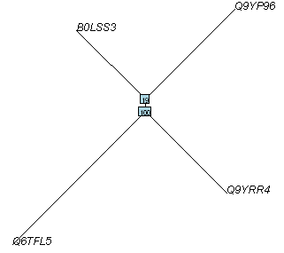
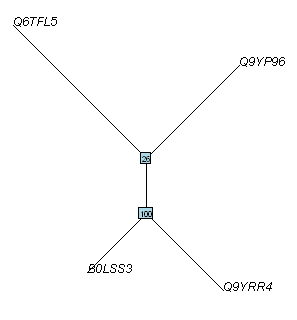
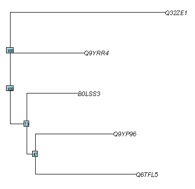

Answers to the End-of-chapter Exercises 
=======================================

DNA Sequence Statistics (1)
---------------------------

Q1. 
^^^
*What are the last twenty nucleotides of the DEN-1 Dengue virus genome sequence?*

To answer this, you first need to install the "SeqinR" R package, and download
the DEN-1 Dengue genome sequence from the NCBI database and save it as
a file "den1.fasta" in the "My Documents" folder. 

Then to find the length of the DEN-1 Dengue virus genome sequence, type in the R console:

.. highlight:: r

::

    > library("seqinr")
    > dengue <- read.fasta(file="den1.fasta")
    > dengueseq <- dengue[[1]]
    > length(dengueseq) 
    [1] 10735

This tells us that the length of the sequence is 10735 nucleotides.
Therefore, the last 20 nucleotides are from 10716 to 10735. You can
extract the sequence of these nucleotides by typing:

::

    > dengueseq[10716:10735]
    [1] "c" "t" "g" "t" "t" "g" "a" "a" "t" "c" "a" "a" "c" "a" "g" "g" "t" "t" "c"
    [20] "t"
    
Q2. 
^^^
*What is the length in nucleotides of the genome sequence for the bacterium Mycobacterium leprae strain TN (accession NC\_002677)?*

To answer this question, you first need to retrieve the *Mycobacterium leprae* TN genome
sequence from the NCBI database. You can use this by going to the NCBI website and searching
for it via the NCBI website, or alternatively by using the getncbiseq() function in R.

To get the *Mycobacterium leprae* TN genome via the NCBI website, it�s necessary to first go to the NCBI website (www.ncbi.nlm.nih.gov) and search for NC\_002677 and download it as a fasta format file (eg. "leprae.fasta") and save it in the "My Documents" folder. You can then read the sequence into
R from the file by typing:

Then in R type:

::

    > leprae <- read.fasta(file="leprae.fasta")
    > lepraeseq <- leprae[[1]]

Alternatively, to get the *Mycobacterium leprae* TN genome using the getncbiseq() function in R,
you first need to copy the getncbiseq() function and paste it into R, and then you can retrieve
the sequence (accession NC_\002677) by typing in R:

::

    > lepraeseq <-  getncbiseq("NC_002677")

Now we have the *Mycobacterium leprae* TN genome sequence stored in the vector *lepraseq* in R.
We can get the length of the sequence by getting the length of the vector: 

::

    > length(lepraeseq)
    [1] 3268203

Q3. 
^^^
*How many of each of the four nucleotides A, C, T and G, and any other symbols, are there in the Mycobacterium leprae TN genome sequence?*

Type:

::

    > table(lepraeseq)
    lepraeseq
         a      c      g      t 
    687041 938713 950202 692247 

Q4. 
^^^
*What is the GC content of the Mycobacterium leprae TN genome sequence, when (i) all non-A/C/T/G nucleotides are included, (ii) non-A/C/T/G nucleotides are discarded?*  

Find out how the GC function deals with non-A/C/T/G nucleotides, type:

::

    > help("GC")

Type:

::

    > GC(lepraeseq)
    [1] 0.5779675
    > GC(lepraeseq, exact=FALSE)
    [1] 0.5779675

This gives 0.5779675 or 57.79675%. This is the GC content when non-A/C/T/G nucleotides are not taken into account.  

The length of the *M. leprae* sequence is 3268203 bp, and it has 938713 Cs and 950202 Gs, and 687041 As and 692247 Ts. So to calculating the GC content when only considering As, Cs, Ts and Gs, we can also 
type:

::

    > (938713+950202)/(938713+950202+687041+692247)
    [1] 0.5779675

To take non-A/C/T/G nucleotides into account when calculating GC, type:

::

    > GC(lepraeseq, exact=TRUE)
    [1] 0.5779675

We get the same answer as when we ignored non-A/C/G/T nucleotides. This is actually because the *M. leprae* TN sequence does not have any non-A/C/G/T nucleotides. 

However, many other genome sequences do contain non-A/C/G/T nucleotides. Note that under 'Details' in the box that appears when you type 'help('GC')', it says : "When exact is set to TRUE the G+C content is estimated with ambiguous bases taken into account. Note that this is time expensive. A first pass is made on non-ambiguous bases to estimate the probabilities of the four bases in the sequence. They are then used to weight the contributions of ambiguous bases to the G+C content."

Q5. 
^^^
*How many of each of the four nucleotides A, C, T and G are there in the complement of the Mycobacterium leprae TN genome sequence?*

First you need to search for a function to calculate reverse complement, eg. by typing:

::

    > help.search("complement")

You will find that there is a function seqinr::comp that complements a nucleic acid sequence. This means it is a function in the SeqinR package.

Find out how to use this function by typing:

::

    > help("comp")

The help says "Undefined values are returned as NA". This means that the complement of non-A/C/T/G symbols will be returned as NA.

To find the number of A, C, T, and G in the reverse complement type:

::

    > complepraeseq <- comp(lepraeseq)
    > table(complepraeseq)
     complepraeseq
          a      c      g      t 
     692247 950202 938713 687041 

Note that in the *M. leprae* sequence we had 687041 As, in the complement have 687041 Ts.
In the *M. leprae* sequence we had 938713 Cs, in the complement have 938713 Gs.
In the *M. leprae* sequence we had 950202 Gs, in the complement have 950202 Cs.
In the *M. leprae* sequence we had 692247 Ts, in the complement have 692247 As.

Q6. 
^^^
*How many occurrences of the DNA words CC, CG and GC occur in the Mycobacterium leprae TN genome sequence?*

::

    > count(lepraeseq, 2)
        aa     ac     ag     at     ca     cc     cg     ct     ga     gc     gg 
     149718 206961 170846 159516 224666 236971 306986 170089 203397 293261 243071 
        gt     ta     tc     tg     tt 
     210473 109259 201520 229299 152169 

Get count for CC is 236,971; count for CG is 306,986; count for GC is 293,261.

Q7. 
^^^
*How many occurrences of the DNA words CC, CG and GC occur in the (i) first 1000 and (ii) last 1000 nucleotides of the Mycobacterium leprae TN genome sequence?*

Type:

::

    > length(lepraeseq)
    [1] 3268203

to find the length of the *M. leprae* genome sequence.  It is 3,268,203 bp. Therefore the first 1000 nucleotides will have indices 1-1000, and the last thousand nucleotides will have indices 3267204-3268203. We find the count of DNA words of length 2 by typing:

::

    > count(lepraeseq[1:1000],2)
     aa ac ag at ca cc cg ct ga gc gg gt ta tc tg tt 
     78 95 51 49 85 82 92 54 68 63 39 43 42 73 31 54 
    > count(lepraeseq[3267204:3268203],2)
     aa ac ag at ca cc cg ct ga gc gg gt ta tc tg tt 
     70 85 44 55 94 81 87 50 53 75 49 51 36 72 48 49 

To check that the subsequences that you looked at are 1000 nucleotides long, you can type:

::

    > length(lepraeseq[1:1000])
    [1] 1000
    > length(lepraeseq[3267204:3268203])
    [1] 1000

DNA Sequence Statistics (2)
---------------------------

Q1. 
^^^
*Draw a sliding window plot of GC content in the DEN-1 Dengue virus genome, using a window size of 200 nucleotides. Do you see any regions of unusual DNA content in the genome (eg. a high peak or low trough)?*

To do this, you first need to download the DEN-1 Dengue virus sequence from the NCBI database. 
To do this follow the steps in the chapter `DNA Sequence Statistics (1) <./chapter1.html>`_.

Then read the sequence into R using the SeqinR package:

.. highlight:: r

::

    > library("seqinr")
    > dengue <- read.fasta(file = "den1.fasta")
    > dengueseq <- dengue[[1]]

Then write a function to make a sliding window plot:

::
   
    > slidingwindowplot <- function(windowsize, inputseq) 
      {
         starts <- seq(1, length(inputseq)-windowsize, by = windowsize)
         n <- length(starts)    
         chunkGCs <- numeric(n)
         for (i in 1:n) { 
            chunk <- inputseq[starts[i]:(starts[i]+windowsize-1)]
            chunkGC <- GC(chunk)
            chunkGCs[i] <- chunkGC 
         }  
         plot(starts,chunkGCs,type="b",xlab="Nucleotide start position",ylab="GC content")
      }

Then make a sliding window plot with a window size of 200 nucleotides: 

::

    > slidingwindowplot(200, dengueseq)

|image0|

The GC content varies from about 45% to about 50% throughout the DEN-1 Dengue virus genome, with
some noticeable troughs at about 2500 bases and at about 4000 bases along the sequence, where the
GC content drops to about 40%. There is no strong difference between the start and end of the
genome, although from around bases 4000-7000 the GC content is quite high (about 50%), and from
about 2500-3500 and 7000-9000 bases the GC content is relatively low (about 43-47%).   

We can also make a sliding window plot of GC content using a window size of 2000 nucleotides:

::

    > slidingwindowplot(2000, dengueseq)

|image1|

In this picture it is much more noticeable that the GC content is relatively high from around
4000-7000 bases, and lower on either side (from 2500-3500 and 7000-9000 bases).

Q2. 
^^^
*Draw a sliding window plot of GC content in the genome sequence for the bacterium Mycobacterium leprae strain TN (accession NC_002677) using a window size of 20000 nucleotides. Do you see any regions of unusual DNA content in the genome (eg. a high peak or low trough)?*

To do this, you first need to download the *Mycobacterium leprae* sequence from the NCBI 
database.
To do this follow the steps in the chapter `DNA Sequence Statistics (1) <./chapter1.html>`_.

Then read the sequence into R using the SeqinR package:

.. highlight:: r

::

    > leprae <- read.fasta(file = "leprae.fasta")
    > lepraeseq <- leprae[[1]]

Then make a sliding window plot with a window size of 20000 nucleotides:

::

    > slidingwindowplot(20000, lepraeseq) 

|image2|

We see the highest peak in GC content at about 1 Mb into the *M. leprae* genome. We also 
see troughs in GC content at about 1.1 Mb, and at about 2.6 Mb. 

With a window size of 200 nucleotides, the plot is very messy, and we cannot see the peaks and troughs
in GC content so easily:

::

    > slidingwindowplot(200, lepraeseq)

|image3|

With a window size of 200,000 nucleotides, the plot is very smooth, and we cannot see the peaks and troughs
in GC content very easily:

::

    > slidingwindowplot(200000, lepraeseq)
 
|image4|

Q3. 
^^^
*Write a function to calculate the AT content of a DNA sequence (ie. the fraction of the nucleotides in the sequence that are As or Ts). What is the AT content of the Mycobacterium leprae TN genome?*

Here is a function to calculate the AT content of a genome sequence:

::

    > AT <- function(inputseq)
      {
         mytable <- count(inputseq, 1) # make a table with the count of As, Cs, Ts, and Gs
         mylength <- length(inputseq) # find the length of the whole sequence
         myAs <- mytable[[1]] # number of As in the sequence
         myTs <- mytable[[4]] # number of Ts in the sequence
         myAT <- (myAs + myTs)/mylength
         return(myAT)
      }

We can then use the function to calculate the AT content of the *M. leprae* genome:

::

    > AT(lepraeseq)
    [1] 0.4220325
   
You should notice that the AT content is (1 minus GC content), ie. (AT content + GC content = 1):

::
   
    > GC(lepraeseq)
    [1] 0.5779675
    > 0.4220325 + 0.5779675
    [1] 1

Q4. 
^^^
*Write a function to draw a sliding window plot of AT content. Use it to make a sliding window plot of AT content along the Mycobacterium leprae TN genome, using a windowsize of 20000 nucleotides. Do you notice any relationship between the sliding window plot of GC content along the Mycobacterium leprae genome, and the sliding window plot of AT content?*

We can write a function to write a sliding window plot of AT content:

::

    > slidingwindowplotAT <- function(windowsize, inputseq) 
      {
         starts <- seq(1, length(inputseq)-windowsize, by = windowsize)
         n <- length(starts)    
         chunkATs <- numeric(n)
         for (i in 1:n) { 
            chunk <- inputseq[starts[i]:(starts[i]+windowsize-1)]
            chunkAT <- AT(chunk)
            chunkATs[i] <- chunkAT 
         }  
         plot(starts,chunkATs,type="b",xlab="Nucleotide start position",ylab="AT content")
     }

We can then use this function to make a sliding window plot with a window size of 20000 nucleotides:

::

    > slidingwindowplotAT(20000, lepraeseq)

|image5|

This is the mirror image of the plot of GC content (because AT equals 1 minus GC):
 
::

    > slidingwindowplot(20000, lepraeseq)

|image6|
  
Q5. 
^^^
*Is the 3-nucleotide word GAC GC over-represented or under-represented in the Mycobacterium leprae TN genome sequence?*

We can get the number of counts of each of the 3-nucleotide words by typing:

::

    > count(lepraeseq, 3)
       aaa   aac   aag   aat   aca   acc   acg   act   aga   agc   agg   agt   ata   atc   atg 
     32093 48714 36319 32592 44777 67449 57326 37409 31957 62473 38946 37470 25030 57245 44268 
       att   caa   cac   cag   cat   cca   ccc   ccg   cct   cga   cgc   cgg   cgt   cta   ctc 
     32973 52381 64102 64345 43838 64869 46037 87560 38504 78120 82057 89358 57451 29004 39954 
       ctg   ctt   gaa   gac   gag   gat   gca   gcc   gcg   gct   gga   ggc   ggg   ggt   gta 
     64730 36401 43486 61174 40728 58009 66775 80319 83415 62752 44002 81461 47651 69957 33139 
       gtc   gtg   gtt   taa   tac   tag   tat   tca   tcc   tcg   tct   tga   tgc   tgg   tgt 
     60958 65955 50421 21758 32971 29454 25076 48245 43166 78685 31424 49318 67270 67116 45595 
       tta   ttc   ttg   ttt 
     22086 43363 54346 32374

There are 61,174 GACs in the sequence. 

The total number of 3-nucleotide words is calculated by typing:

::

    > sum(count(lepraeseq,3))
    [1] 3268201

Therefore, the observed frequency of GAC is 61174/3268201 = 0.01871794.

To calculate the expected frequency of GAC, first we need to get the number of counts of 1-nucleotide words by typing:

::

    > count(lepraeseq, 1)
        a      c      g      t 
     687041 938713 950202 692247 

The sequence length is 3268203 bp.
The frequency of G is 950202/3268203 = 0.2907414.
The frequency of A is 687041/3268203 = 0.2102198.
The frequency of C is 938713/3268203 = 0.2872260.
The expected frequency of GAC is therefore 0.2907414*0.2102198*0.2872260 = 0.01755514.

The value of Rho is therefore the observed frequency/expected frequency = 0.01871794/0.01755514 = 1.066237.
That, is there are about 1.1 times as many GACs as expected. This means that GAC is slightly over-represented in this sequence.
The difference from 1 is so little however that it might not be statistically significant.

We can search for a function to calculate rho by typing:

::

    > help.search("rho")
      base::getHook                          Functions to Get and Set Hooks for Load, Attach, Detach and Unload
      seqinr::rho                            Statistical over- and under- representation of dinucleotides in a sequence
      stats::cor.test                        Test for Association/Correlation Between Paired Samples
      survival::pbc                          Mayo Clinic Primary Biliary Cirrhosis Dat

There is a function rho in the SeqinR package. For example, we can use it to calculate Rho for 
words of length 3 in the *M. leprae* genome by typing:

::

    > rho(lepraeseq, wordsize=3)
           aaa       aac       aag       aat       aca       acc       acg       act       aga 
      1.0570138 1.1742862 0.8649101 1.0653761 1.0793820 1.1899960 0.9991680 0.8949893 0.7610323 
           agc       agg       agt       ata       atc       atg       att       caa       cac 
      1.0888781 0.6706048 0.8856096 0.8181874 1.3695545 1.0462815 1.0697245 1.2626819 1.1309452 
           cag       cat       cca       ccc       ccg       cct       cga       cgc       cgg 
      1.1215062 1.0487995 1.1444773 0.5944657 1.1169725 0.6742135 1.3615987 1.0467726 1.1261261 
           cgt       cta       ctc       ctg       ctt       gaa       gac       gag       gat 
      0.9938162 0.6939044 0.6996033 1.1197319 0.8643241 1.0355868 1.0662370 0.7012887 1.3710523 
           gca       gcc       gcg       gct       gga       ggc       ggg       ggt       gta 
      1.1638601 1.0246015 1.0512300 1.0855155 0.7576632 1.0266049 0.5932565 1.1955191 0.7832457 
           gtc       gtg       gtt       taa       tac       tag       tat       tca       tcc 
      1.0544820 1.1271276 1.1827465 0.7112314 0.7888126 0.6961501 0.8135266 1.1542345 0.7558461 
           tcg       tct       tga       tgc       tgg       tgt       tta       ttc       ttg 
      1.3611325 0.7461477 1.1656391 1.1636701 1.1469683 1.0695410 0.7165237 1.0296334 1.2748168 
           ttt 
      1.0423929 
    
The Rho value for GAC is given as 1.0662370, in agreement with our calculation above.

Sequence Databases
------------------

Q1. 
^^^
*What information about the rabies virus sequence (NCBI accession NC\_001542) can you obtain from its annotations in the NCBI Sequence Database?*

To do this, you need to go to the `www.ncbi.nlm.nih.gov <http://www.ncbi.nlm.nih.gov>`_ website 
and type the rabies virus genome sequence accession (NC\_001542) in the search box, and press 'Search'. 

On the search results page, you should see '1' beside the word 'Nucleotide', meaning that there was one hit to a sequence record in the NCBI Nucleotide database, which contains DNA and RNA sequences. If you click on the word 'Nucleotide', it will bring you to the sequence record, which should be the NCBI sequence record for the rabies virus' genome (ie. for accession NC\_001542):

|image7|

On the webpage (above), you can see the DEFINITION, ORGANISM and REFERENCE fields of the NCBI record:

DEFINITION: Rabies virus, complete genome.

ORGANISM: Rabies virus 

REFERENCE: There are several papers (the first is):
AUTHORS: Tordo,N., Poch,O., Ermine,A., Keith,G. and Rougeon,F.

TITLE: Completion of the rabies virus genome sequence determination: highly conserved domains among the L (polymerase) proteins of unsegmented negative-strand RNA viruses

JOURNAL: Virology 165 (2), 565-576 (1988)

There are also some other references, for papers published about the rabies virus genome sequence. 

An alternative way of retrieving the annotations for the rabies virus sequence is to use the SeqinR R package.
As the rabies virus is a virus, its genome sequence should be in the "refseqViruses" ACNUC sub-database.
Therefore, we can perform the following query to retrieve the annotations for the rabies virus
genome sequence (accession NC\_001542):

::

    > library("seqinr")                                 # load the SeqinR R package
    > choosebank("refseqViruses")                       # select the ACNUC sub-database to be searched
    > query("rabies", "AC=NC_001542")                   # specify the query
    > annots <- getAnnot(rabies$req[[1]])               # retrieve the annotations
    > annots[1:20]                                      # print out the first 20 lines of the annotations
      [1] "LOCUS       NC_001542              11932 bp ss-RNA     linear   VRL 08-DEC-2008"
      [2] "DEFINITION  Rabies virus, complete genome."                                     
      [3] "ACCESSION   NC_001542"                                                          
      [4] "VERSION     NC_001542.1  GI:9627197"                                            
      [5] "DBLINK      Project: 15144"                                                     
      [6] "KEYWORDS    ."                                                                  
      [7] "SOURCE      Rabies virus"                                                       
      [8] "  ORGANISM  Rabies virus"                                                       
      [9] "            Viruses; ssRNA negative-strand viruses; Mononegavirales;"           
      [10] "            Rhabdoviridae; Lyssavirus."                                         
      [11] "REFERENCE   1  (bases 5388 to 11932)"                                           
      [12] "  AUTHORS   Tordo,N., Poch,O., Ermine,A., Keith,G. and Rougeon,F."              
      [13] "  TITLE     Completion of the rabies virus genome sequence determination:"      
      [14] "            highly conserved domains among the L (polymerase) proteins of"      
      [15] "            unsegmented negative-strand RNA viruses"                            
      [16] "  JOURNAL   Virology 165 (2), 565-576 (1988)"                                   
      [17] "   PUBMED   3407152"                                                            
      [18] "REFERENCE   2  (bases 1 to 5500)"                                               
      [19] "  AUTHORS   Tordo,N., Poch,O., Ermine,A., Keith,G. and Rougeon,F."              
      [20] "  TITLE     Walking along the rabies genome: is the large G-L intergenic region"
    > closebank()

Q2. 
^^^
*How many nucleotide sequences are there from the bacterium Chlamydia trachomatis in the NCBI Sequence Database?*

To answer this, you need to go to `www.ncbi.nlm.nih.gov <http://www.ncbi.nlm.nih.gov>`_
and select "Nucleotide" from the drop-down list at the top 
of the webpage, as you want to search for nucleotide (DNA or RNA) sequences.

Then in the search box, type "Chlamydia trachomatis"[ORGN] and press 'Search':

|image8|

Here [ORGN] specifies the organism you are interested in, that is, the species name in Latin.

The results page should give you a list of the hits to sequence records in the NCBI Nucleotide database: 

|image9|

It will say "Found 35577 nucleotide sequences.   Nucleotide (35429)   GSS (148)". 
This means that 35,577 sequences were found, of which 35429 are DNA or RNA sequences, and 
148 are DNA sequences from the Genome Sequence Surveys (GSS), that is, from 
genome sequencing projects [as of 15-Jun-2011]. Note that there are new sequences 
being added to the database continuously, so if you check this again in a couple of months, you will 
probably find a higher number of sequences (eg. 36,000 sequences).

Note: if you just go to the `www.ncbi.nlm.nih.gov <http://www.ncbi.nlm.nih.gov>`_ database, 
and search for "Chlamydia trachomatis"[ORGN] 
(without choosing "Nucleotide" from the drop-down list), you will see 35429 hits to the Nucleotide 
database and 148 to the GSS (Genome Sequence Survey) database:

|image10|

Note also that if you search for "Chlamydia trachomatis", without using [ORGN] to specify the organism, 
you will get 56032 hits to the Nucleotide database and 149 to the GSS database, but some of these might 
not be *Chlamydia trachomatis* sequences - some could be sequences from other species for which the NCBI sequence 
record contains the phrase "Chlamydia trachomatis" somewhere.

An alternative way to search for nucleotide sequences from the bacterium *Chlamydia trachomatis* is to
use the SeqinR package. We want to find nucleotide sequences, so the correct ACNUC sub-database to search
is the "genbank" sub-database. Thus, we can carry out our search by typing:

::

    > library("seqinr")                                 # load the SeqinR R package
    > choosebank("genbank")                             # select the ACNUC sub-database to be searched
    > query("Ctrachomatis", "SP=Chlamydia trachomatis") # specify the query
    > Ctrachomatis$nelem                                # print out the number of matching sequences
      [1] 35471
    > closebank()

We find 35,471 nucleotide sequences from *Chlamydia trachomatis*. We do not get exactly the same number
of sequences as we got when we searched via the NCBI website (35,577 sequences), but the numbers are very close.
The likely reasons for the differences could be that the ACNUC "genbank" sub-database excludes some sequences from
whole genome sequencing projects from the NCBI Nucleotide database, and in addition, the ACNUC databases
are updated very regularly, but may be missing a few sequences that were added to the NCBI database
in the last day or two.

Q3. 
^^^
*How many nucleotide sequences are there from the bacterium Chlamydia trachomatis in the RefSeq part of the NCBI Sequence Database?*

To answer this, you need to go to `www.ncbi.nlm.nih.gov <http://www.ncbi.nlm.nih.gov>`_ 
and select "Nucleotide" from the drop-down list 
at the top of the webpage, as you want to search for nucleotide sequences.

Then in the search box, type "Chlamydia trachomatis"[ORGN] AND srcdb_refseq[PROP] and press 'Search':

|image11|

Here [ORGN] specifies the organism, and [PROP] specifies a property of the sequences (in this case that 
they belong to the RefSeq subsection of the NCBI database).

At the top of the results page, it should say "Results: 1 to 20 of 29 sequences", so there were
29 matching sequences [as of 15-Jun-2011]. 
As for Q2, if you try this again in a couple of months, the number will probably be higher, due to extra 
sequences added to the database. 

Note that the sequences in Q2 are all *Chlamydia trachomatis* DNA and RNA sequences in the NCBI database. 
The sequences in Q3 gives the *Chlamydia trachomatis* DNA and RNA sequences in the RefSeq part of the NCBI 
database, which is a subsection of the database for high-quality manually-curated data. 

The number of sequences in RefSeq is much fewer than the total number of *C. trachomatis* sequences, 
partly because low quality sequences are never added to RefSeq, but also because RefSeq curators have 
probably not had time to add all high-quality sequences to RefSeq (this is a time-consuming process, 
as the curators add additional information to the NCBI Sequence records in RefSeq, such as references to 
papers that discuss a particular sequence). 

An alternative way to search for nucleotide sequences from the bacterium *Chlamydia trachomatis* in RefSeq
use the SeqinR package. We want to find RefSeq sequences, so the correct ACNUC sub-database to search
is the "refseq" sub-database. Thus, we can carry out our search by typing:

::

    > library("seqinr")                                  # load the SeqinR R package
    > choosebank("refseq")                               # select the ACNUC sub-database to be searched
    > query("Ctrachomatis2", "SP=Chlamydia trachomatis") # specify the query
    > Ctrachomatis2$nelem                                # print out the number of matching sequences
      [1] 1
    > closebank()

We find 1 RefSeq sequence from *Chlamydia trachomatis*. We do not get exactly the same number
of sequences as we got when we searched via the NCBI website (29 sequences). This is because the
29 sequences found via the NCBI website include whole genome sequences, but the whole genome sequences
from bacteria are stored in the ACNUC "bacterial" sub-database, and so are not in the ACNUC "refseq" 
sub-database.

Q4. 
^^^
*How many nucleotide sequences were submitted to NCBI by Matthew Berriman?*

To answer this, you need to go to `www.ncbi.nlm.nih.gov <http://www.ncbi.nlm.nih.gov>`_, 
and select "Nucleotide" from the drop-down list, 
as you want to search for nucleotide sequences.

Then in the search box, type "Berriman M"[AU] and press 'Search'.

Here [AU] specifies the name of the person who either submitted the sequence to the NCBI database, 
or wrote a paper describing the sequence. 

The results page should look like this:

|image12|

On the top of the results page, it says [as of 15-Jun-2011]: "Found 487270 nucleotide sequences.   Nucleotide (277546)   EST (121075)   GSS (88649)". This means that 487270 DNA/RNA sequences were either submitted to the NCBI database by someone called M. Berriman, or were described in a paper by someone called M. Berriman. Of these, 277546 were DNA/RNA sequences, 121075 were EST sequences (part of mRNAs), and 88649 were DNA sequences from genome sequencing projects (GSS or Genome Sequence Survey sequences).

Note that unfortunately the NCBI website does not allow us to search for "Berriman Matthew"[AU] so we 
cannot be sure that all of these sequences were submitted by Matthew Berriman. 

Note also that the search above will find sequences that were either submitted to the NCBI database
by M. Berriman, or described in a paper on which M. Berriman was an author. Therefore, not all of the
sequences found were necessarily submitted by M. Berriman.

An alternative way to search for nucleotide sequences submitted by M. Berriman is to use the SeqinR
package. We want to find nucleotide sequences, so the appropriate ACNUC sub-database to search is
"genbank". Therefore, we type:

::

    > library("seqinr")                  # load the SeqinR R package
    > choosebank("genbank")              # select the ACNUC sub-database to be searched
    > query("mberriman", "AU=Berriman")  # specify the query
    > mberriman$nelem                    # print out the number of matching sequences
     [1] 169701
    > closebank()

We find 169,701 matching sequences. This is less than the number found by searching via the NCBI
website (487,270 sequences). The difference is probably due to the fact that the "genbank" ACNUC
sub-database excludes some sequences from the NCBI Nucleotide database (eg. short sequences from
genome sequencing projects). 

Note that the "AU=Berriman" query will find sequences submitted or published by someone called Berriman.
We are not able to specify the initial of the first name of this person using the "query()" command, so
we cannot specify that the person is called "M. Berriman". 

Q5. 
^^^
*How many nucleotide sequences from the nematode worms are there in the RefSeq Database?*

To answer this, you need to go to `www.ncbi.nlm.nih.gov <http://www.ncbi.nlm.nih.gov>`_ 
and select "Nucleotide" from the drop-down list, as you want to search for nucleotide sequences.

Then in the search box, type Nematoda[ORGN] AND srcdb_refseq[PROP] and press 'Search'.

Here [ORGN] specifies the group of species that you want to search for sequences from. 
In Q3, [ORGN] was used to specify the name of one organism (*Chlamydia trachomatis*). 
However, you can also use [ORGN] to specify the name of a group of 
organisms, for example, Fungi[ORGN] would search for fungal sequences or Mammalia[ORGN] 
would search for mammalian sequences. The name of the group of species that you want to 
search for must be given in Latin, so to search for sequences
from nematode worms we use the Latin name Nematoda.

The search page should say at the top 'Results: 1 to 20 of 145355' [as of 15-Jun-2011].
This means that 145,355 DNA or RNA sequences were found from nematode worm species in the RefSeq database.
These sequences are probably from a wide range of nematode worm species, including the model nematode worm
*Caenorhabditis elegans*, as well as parasitic nematode species.

An alternative way to search for RefSeq nucleotide sequences from nematode worms is to use the SeqinR package.
We want to find nucleotide sequences that are in RefSeq, so the appropriate ACNUC sub-database to search is
"refseq". Therefore, we type:

::

    > library("seqinr")                  # load the SeqinR R package
    > choosebank("refseq")               # select the ACNUC sub-database to be searched
    > query("nematodes", "SP=Nematoda")  # specify the query
    > nematodes$nelem                    # print out the number of matching sequences
     [1] 55241
    > closebank()

That is, using SeqinR, we find 55,241 DNA or RNA sequences from nematode worms in the RefSeq database.
This is less than the number of sequences found by searching via the NCBI website (145,355 sequences).
This is because the "refseq" ACNUC sub-database does not contain all of the sequences in the NCBI
RefSeq database, for various reasons, for example, some of the sequences in the NCBI RefSeq database 
(eg. whole genome sequences) are in other ACNUC sub-databases. 

Q6. 
^^^
*How many nucleotide sequences for collagen genes from nematode worms are there in the NCBI Database?*

To answer this, you need to go to `www.ncbi.nlm.nih.gov <http://www.ncbi.nlm.nih.gov>`_ 
and select "Nucleotide" from the drop-down list, as you want to search for nucleotide sequences.

Then in the search box, type Nematoda[ORGN] AND collagen.

Here [ORGN] specifies that we want sequences from nematode worms. The phrase "AND collagen" means that the word collagen 
must appear somewhere in the NCBI entries for those sequences, for example, in the sequence name, or in a description 
of the sequence, or in the title of a paper describing the sequence, etc.

On the results page, you should see 'Found 8437 nucleotide sequences.   Nucleotide (1642)   EST (6795)' [as of 15-Jun-2011].
This means that 8437 DNA or RNA sequences for collagen genes from nematode worms were found, of which 6795 are EST sequences
(parts of mRNAs). Note that these 8437 nucleotide sequences may not all necessarily be for collagen genes, as some of the
NCBI records found may be for other genes but contain the word "collagen" somewhere in the NCBI record (for example, in
the title of a cited paper). However, a good number of them are probably collagen sequences from nematodes.

An alternative way to search for collagen nucleotide sequences from nematode worms is to use the SeqinR package.
We want to find nucleotide sequences, so the appropriate ACNUC sub-database to search is "genbank". 
To search for collagen genes, we can specify "collagen" as a keyword by using "K=collagen" in our query.
Therefore, we type:

::

    > library("seqinr")                                # load the SeqinR R package
    > choosebank("genbank")                            # select the ACNUC sub-database to be searched
    > query("collagen", "SP=Nematoda AND K=collagen")  # specify the query
    > collagen$nelem                                   # print out the number of matching sequences
     [1] 60 
    > closebank()

That is, using SeqinR, we find 60 DNA or RNA sequences with the keyword "collagen" from nematode worms.
This is less than the number of sequences found by searching via the NCBI website (8437 sequences).
This is probably partly because the ACNUC "genbank" sub-database excludes some sequences that are in the NCBI
Nucleotide database (eg. short sequences from genome sequencing projects), but also partly because 
the method used to assign keywords to sequences in ACNUC is quite conservative and relatively few
sequences seem to be assigned the keyword "collagen". However, presumably most of the sequences tagged
with the keyword "collagen" are collagen genes (while the search via the NCBI website may have picked
up many non-collagen genes, as explained above).

Q7. 
^^^
*How many mRNA sequences for collagen genes from nematode worms are there in the NCBI Database?*

To answer this, you need to go to `www.ncbi.nlm.nih.gov <http://www.ncbi.nlm.nih.gov>`_, 
and select "Nucleotide" from the drop-down sequences, as you want to search for nucleotide sequences 
(nucleotide sequences include DNA sequences and RNA sequences, such as mRNAs). 

Then in the search box, type Nematoda[ORGN] AND collagen AND "biomol mRNA"[PROP].

Here [ORGN] specifies the name of the group of species, collagen specifies that we want to find NCBI entries 
that include the word collagen, and [PROP] specifies a property of those sequences (that they are mRNAs, in this case).

The search page should say 'Found 7751 nucleotide sequences.   Nucleotide (956)   EST (6795)' [as of 15-Jun-2011].
This means that 7751 mRNA sequences from nematodes were found that contain the word 'collagen' in the NCBI record. Of the
7751, 6795 are EST sequences (parts of mRNAs). 

Note that in Q6 we found 8437 nucleotide (DNA or RNA) sequences from nematode worms. In this question, we found out that 
only 7751 of those sequences are mRNA sequences. This means that the other (8437-7751=) 686 sequences must be DNA sequences, 
or other types of RNA sequences (not mRNAs) such as tRNAs or rRNAs.

An alternative way to search for collagen mRNA sequences from nematode worms is to use the SeqinR package.
mRNA sequences are nucleotide sequences, so the appropriate ACNUC sub-database to search is "genbank". 
To search for mRNAs, we can specify "M=mRNA" in our query. Therefore, we type:

::

    > library("seqinr")                                            # load the SeqinR R package
    > choosebank("genbank")                                        # select the ACNUC sub-database to be searched
    > query("collagen2", "SP=Nematoda AND K=collagen AND M=mRNA")  # specify the query
    > collagen2$nelem                                              # print out the number of matching sequences
     [1] 14  
    > closebank()

We find 14 nematode mRNA sequences labelled with the keyword "collagen". Again, we find less sequences than found
when searching via the NCBI website (7751 sequences), but as in Q6, the search using the keyword "collagen" in the 
SeqinR package may be more likely to pick up true collagen sequences (rather than other sequences that just happen
to contain the word "collagen" somewhere in their NCBI entries).

Q8. 
^^^
*How many protein sequences for collagen proteins from nematode worms are there in the NCBI database?*

To answer this, you need to go to `www.ncbi.nlm.nih.gov <http://www.ncbi.nlm.nih.gov>`_, 
and select "Protein" from the drop-down list, as you want to search for protein sequences.

Then type in the search box: Nematoda[ORGN] AND collagen and press 'Search':

|image13|

On the results page, you should see '1 to 20 of 1982'. This means that 1982 protein sequences from nematode
worms were found that include the word collagen in the NCBI sequence entries [as of 15-Jun-2011].

As far as I know, there is not an ACNUC sub-database that contains all the protein sequences from the
NCBI Protein database, and therefore it is not currently possible to carry out the same query using SeqinR.

Q9. 
^^^
*What is the accession number for the Trypanosoma cruzi genome in NCBI?*

There are two ways that you can answer this.

The first method is to go to `www.ncbi.nlm.nih.gov <http://www.ncbi.nlm.nih.gov>`_ 
and select "Genome" from the drop-down list, as you want to search for genome sequences.

Then type in the search box: "Trypanosoma cruzi"[ORGN] and press 'Search':

|image14|

This will search the NCBI Genome database, which contains fully sequenced genome sequences.

The results page says 'All:1', and lists just one NCBI record, the genome sequence for *Trypanosoma cruzi*
strain CL Brener, which has accession NZ\_AAHK00000000:

|image15|

The second method of answering the question is to go directly to the `NCBI Genomes webpage
<http://www.ncbi.nlm.nih.gov/sites/entrez?db=Genome>`_.

Click on the 'Eukaryota' link at the middle the page, as *Trypanosoma cruzi* is a eukaryotic species.

This will give you a complete list of all the eukaryotic genomes that have been fully sequenced.

Go to the 'Edit' menu of your web browser, and choose 'Find', and search for 'Trypanosoma cruzi':

|image16| 

You should find *Trypanosoma cruzi* strain CL Brener.
You will also find that there are several ongoing genome sequencing projects listed for other strains of
*Trypanosoma cruzi*: strains JR cl. 4, Sylvio X10/1, Y, and Esmeraldo Esmeraldo cl. 3.

If you look 7th column of the table, you will see that it says "Assembly" for strains CL Brener and Sylvio X10/1,
meaning that genome assemblies are available for these two strains. Presumably the other strains are still being
sequenced, and genome assemblies are not yet available.

The link 'GB' (in green) at the far right of the webpage gives a link to the NCBI record for the sequence.
In this case, the link for *Trypanosoma cruzi* strain CL Brener leads us to the NCBI record for accession
AAHK01000000. This is actually an accession for the *T. cruzi* strain CL Brener sequencing project, rather than
for the genome sequence itself. On the top right of the page, you will see a link "Genome", and if you click
on it, it will bring you to the NCBI accession NZ\_AAHK00000000, the genome sequence for *Trypanosoma cruzi* strain CL Brener.

Of the other *T. cruzi* strains listed, there is only a 'GB' link for one other strain, Sylvio X10/1.
If you click on the link for *Trypanosoma cruzi* strain Sylvio X10/1, it will bring you to the
NCBI record for accession ADWP01000000, the accession for the *T. cruzi* strain Sylvio X10/1 sequencing
project. 

Note that the answer is slightly different for the answer from the first method above, which 
did not find the information on the genome projects for strains JR cl. 4, Sylvio X10/1, Y, and Esmeraldo Esmeraldo cl. 3,
because the sequencing projects for these species are still ongoing.

Q10. 
^^^^
*How many fully sequenced nematode worm species are represented in the NCBI Genome database?*

To answer this question, you need to go to the `NCBI Genome webpage <http://www.ncbi.nlm.nih.gov/sites/entrez?db=Genome>`_. 

In the search box at the top of the page, type Nematoda[ORGN] to search for genome sequences from nematode   
worms, using the Latin name for the nematode worms. 

On the results page, you will see 'Items 1 - 20 of 63', indicating that 63 genome sequences from nematode worms
have been found. If you look down the page, you will see however that many of these are mitochondrial genome
sequences, rather than chromosomal genome sequences.

If you are just interested in chromosomal genome sequences, you can type 'Nematoda[ORGN] NOT mitochondrion' in the
search box, to search for non-mitochondrial sequences. This should give you 16 sequences, which are all chromosomal
genome sequences for nematode worms, including the species *Caenorhabditis elegans*, *Caenorhabditis remanei*,
*Caenorhabditis briggsae*, *Loa loa* (which causes subcutaneous filariasis), and *Brugia malayi* 
(which causes `lymphatic filariasis <http://www.who.int/lymphatic_filariasis/en/>`_). 

Thus, there are nematode genome sequences from five different
species that have been fully sequenced (as of 15-Jun-2011). Because nematode worms are multi-chromosomal species, 
there may be several chromosomal sequences for each species.

Note that when you search the `NCBI Genome database <http://www.ncbi.nlm.nih.gov/sites/entrez?db=Genome>`_, you will
find the NCBI records for completely sequenced genomes (completely sequenced nematode genomes in this case).

If you are interested in partially sequenced genomes, that is sequences from genome sequencing projects that are
still in progress, you can go to the `NCBI Genome Projects website <http://www.ncbi.nlm.nih.gov/genomeprj>`_. If you
search the NCBI Genome Projects database for Nematoda[ORGN], you will find that genome
sequencing projects for many other nematode species are ongoing, including for the species *Onchocerca volvulus*
(which causes `onchocerciasis <http://www.who.int/topics/onchocerciasis/en/>`_), 
*Wuchereria bancrofti* (which causes `lymphatic filariasis <http://www.who.int/lymphatic_filariasis/en/>`_), and 
*Necator americanus* (which causes `soil-transmitted helminthiasis <http://www.who.int/intestinal_worms/en/>`_). 

Sequence Alignment
------------------

Q1. 
^^^
*Download FASTA-format files of the Brugia malayi Vab-3 protein (UniProt accession A8PZ80) and the Loa loa Vab-3 protein (UniProt accession E1FTG0) sequences from UniProt.*

We can use SeqinR to retrieve these sequences by typing:

::

    > library("seqinr")                           # load the SeqinR package
    > choosebank("swissprot")                     # select the ACNUC sub-database to be searched
    > query("brugia", "AC=A8PZ80")                # search for the Brugia sequence
    > brugiaseq <- getSequence(brugia$req[[1]])   # get the Brugia sequence
    > query("loa", "AC=E1FTG0")                   # search for the Loa sequence
    > loaseq <- getSequence(loa$req[[1]])         # get the Loa sequence
    > closebank()                                 # close the connection to the ACNUC sub-database

Q2. 
^^^
*What is the alignment score for the optimal global alignment between the Brugia malayi Vab-3 protein and the Loa loa Vab-3 protein, when you use the BLOSUM50 scoring matrix, a gap opening penalty of -10 and a gap extension penalty of -0.5?*

We can use the Biostrings R package to answer this, by typing:

::

    > library("Biostrings")                       # load the Biostrings package
    > data(BLOSUM50)                              # load the BLOSUM50 scoring matrix
    > brugiaseqstring <- c2s(brugiaseq)           # convert the Brugia sequence to a string 
    > loaseqstring <- c2s(loaseq)                 # convert the Loa sequence to a string
    > brugiaseqstring <- toupper(brugiaseqstring) # convert the Brugia sequence to uppercase
    > loaseqstring <- toupper(loaseqstring)       # convert the Loa sequence to a string
    > myglobalAlign <- pairwiseAlignment(brugiaseqstring, loaseqstring, substitutionMatrix = "BLOSUM50", 
      gapOpening = -9.5, gapExtension = -0.5, scoreOnly = FALSE) # align the two sequences
    > myglobalAlign
      Global PairwiseAlignedFixedSubject (1 of 1)
      pattern: [1] MK--LIVDSGHTGVNQLGGVFVNGRPLPDSTRQKI...IESYKREQPSIFAWEIRDKLLHEKVCSPDTIPSA 
      subject: [1] SSSNLFADSGHTGVNQLGGVFVNGRPLPDSTRQKI...IESYKREQPSIFAWEIRDKLLHEKVCSPDTIPSV 
      score: 777.5

The alignment score is 777.5.

Q3. 
^^^
*Use the printPairwiseAlignment() function to view the optimal global alignment between Brugia malayi Vab-3 protein and the Loa loa Vab-3 protein, using the BLOSUM50 scoring matrix, a gap opening penalty of -10 and a gap extension penalty of -0.5.*

To do this, first you must copy and paste the printPairwiseAlignment() function into R. 

Then you can use it to view the alignment that you obtained in Q2:

::

    > printPairwiseAlignment(myglobalAlign)
      [1] "MK--LIVDSGHTGVNQLGGVFVNGRPLPDSTRQKIVDLAHQGARPCDISRILQVSNGCVS 58"
      [1] "SSSNLFADSGHTGVNQLGGVFVNGRPLPDSTRQKIVDLAHQGARPCDISRILQVSNGCVS 60"
      [1] " "
      [1] "KILCRYYESGTIRPRAIGGSKPRVATVSVCDKIESYKREQPSIFAWEIRDKLLHEKVCSP 118"
      [1] "KILCRYYESGTIRPRAIGGSKPRVATVSVCDKIESYKREQPSIFAWEIRDKLLHEKVCSP 120"
      [1] " "
      [1] "DTIPSA 178"
      [1] "DTIPSV 180"
      [1] " "
     
The two proteins are very similar over their whole lengths, with few gaps and mostly identities (few mismatches).

Q4. 
^^^
*What global alignment score do you get for the two Vab-3 proteins, when you use the BLOSUM62 alignment matrix, a gap opening penalty of -10 and a gap extension penalty of -0.5?*

Again, we can use the Biostrings R package to answer this, by typing:

::

    > data(BLOSUM62)                              # load the BLOSUM62 scoring matrix
    > myglobalAlign2 <- pairwiseAlignment(brugiaseqstring, loaseqstring, substitutionMatrix = "BLOSUM62", 
      gapOpening = -9.5, gapExtension = -0.5, scoreOnly = FALSE) # align the two sequences
    > myglobalAlign2
      Global PairwiseAlignedFixedSubject (1 of 1)
      pattern: [1] MK--LIVDSGHTGVNQLGGVFVNGRPLPDSTRQKI...IESYKREQPSIFAWEIRDKLLHEKVCSPDTIPSA 
      subject: [1] SSSNLFADSGHTGVNQLGGVFVNGRPLPDSTRQKI...IESYKREQPSIFAWEIRDKLLHEKVCSPDTIPSV 
      score: 593.5 

The alignment score when BLOSUM62 is used is 593.5, while the score when BLOSUM50 is used is 777.5 (from Q2). 

We can print out the alignment and see if the alignment made using BLOSUM62 is different from that
when BLOSUM50 is used:

::

    > printPairwiseAlignment(myglobalAlign2)
      [1] "MK--LIVDSGHTGVNQLGGVFVNGRPLPDSTRQKIVDLAHQGARPCDISRILQVSNGCVS 58"
      [1] "SSSNLFADSGHTGVNQLGGVFVNGRPLPDSTRQKIVDLAHQGARPCDISRILQVSNGCVS 60"
      [1] " "
      [1] "KILCRYYESGTIRPRAIGGSKPRVATVSVCDKIESYKREQPSIFAWEIRDKLLHEKVCSP 118"
      [1] "KILCRYYESGTIRPRAIGGSKPRVATVSVCDKIESYKREQPSIFAWEIRDKLLHEKVCSP 120"
      [1] " "
      [1] "DTIPSA 178"
      [1] "DTIPSV 180"
      [1] " "

The alignment made using BLOSUM62 is actually the same as that made using BLOSUM50, so it doesn't
matter which scoring matrix we use in this case.

Q5.
^^^
*What is the statistical significance of the optimal global alignment for the Brugia malayi and Loa loa Vab-3 proteins made using the BLOSUM50 scoring matrix, with a gap opening penalty of -10 and a gap extension penalty of -0.5?*

To answer this, we can first make 1000 random sequences using a multinomial model in which the probabilities
of the 20 amino acids are set equal to their frequencies in the *Brugia malayi* Vab-3 protein.

First you need to first copy and paste the generateSeqsWithMultinomialModel() function into R,
and then you can use it as follows:

::

    > randomseqs <- generateSeqsWithMultinomialModel(brugiaseqstring,1000) 

This makes a vector *randomseqs*, containing 1000 random sequences, each of 
the same length as the *Brugia malayi* Vab-3 protein.

We can then align each of the 1000 random sequences to the *Loa loa* Vab-3 protein, and store
the scores for each of the 1000 alignments in a vector *randomscores*:

::

    > randomscores <- double(1000) # Create a numeric vector with 1000 elements
    > for (i in 1:1000) 
      {
         score <- pairwiseAlignment(loaseqstring, randomseqs[i], substitutionMatrix = "BLOSUM50", 
           gapOpening = -9.5, gapExtension = -0.5, scoreOnly = TRUE)
         randomscores[i] <- score
      }

The score for aligning the *Brugia malayi* and *Loa loa* Vab-3 proteins using BLOSUM50 with a 
gap opening penalty of -10 and gap extension penalty of -0.5 was 777.5 (from Q2).

We can see what fraction of the 1000 alignments between the random sequences (of the same
composition as *Brugia malayi* Vab-3) and *Loa loa* Vab-3 had scores equal to or higher than 777.5:

::

    > sum(randomscores >= 777.5)
    [1] 0 

We see that none of the 1000 alignments had scores equal to or higher than 777.5.

Thus, the *p*-value for the alignment of *Brugia malayi* and *Loa loa* Vab-3 proteins is 0, and 
we can therefore conclude that the alignment score is statistically significant (as it is less than 0.05).
Therefore, it is very likely that the *Brugia malayi* Vab-3 and *Loa loa* Vab-3 proteins are
homologous (related).

Q6.
^^^
*What is the optimal global alignment score between the Brugia malayi Vab-6 protein and the Mycobacterium leprae chorismate lyase protein?*

To calculate the optimal global alignment score, we must first retrieve the *M. leprae* 
chorismate lyase sequence:

::

    > choosebank("swissprot")
    > query("leprae", "AC=Q9CD83")
    > lepraeseq <- getSequence(leprae$req[[1]])
    > closebank()
    > lepraeseqstring <- c2s(lepraeseq)     
    > lepraeseqstring <- toupper(lepraeseqstring)

We can then align the *Brugia malayi* Vab-3 protein sequence to the *M. leprae* chorismate
lyase sequence:

::

    > myglobalAlign3 <- pairwiseAlignment(brugiaseqstring, lepraeseqstring, substitutionMatrix = "BLOSUM50", 
      gapOpening = -9.5, gapExtension = -0.5, scoreOnly = FALSE) # align the two sequences
    > myglobalAlign3
      Global PairwiseAlignedFixedSubject (1 of 1)
      pattern: [1] M-----------------KLIVDSGHTGVNQLGGV...------INYAKQNNNLL----DRFILP---FSKL 
      subject: [1] MTNRTLSREEIRKLDRDLRILVATNGT-LTRVLNV...DTPREELDRCQYSNDIDTRSGDRFVLHGRVFKNL 
      score: 67.5 

The alignment score is 67.5. 

We can print out the alignment as follows:

::

    > printPairwiseAlignment(myglobalAlign3)
      [1] "M-----------------KLIVDSGHTGVNQLGGVFVNGRPLPDSTRQKIVDLAHQGARP 43"
      [1] "MTNRTLSREEIRKLDRDLRILVATNGT-LTRVLNVVANEEIVVDIINQQLLDVA-----P 54"
      [1] " "
      [1] "-------CDISRILQ---VSNGCVSKILCRYYESGTI---RPRAIGG-----SKPRVATV 85"
      [1] "KIPELENLKIGRILQRDILLKGQKSGILFVAAESLIVIDLLPTAITTYLTKTHHP-IGEI 113"
      [1] " "
      [1] "SVCDKIESYKREQ-------PSIFA----WEIRDKLLHEKVCSPDTIPSAVV-------- 126"
      [1] "MAASRIETYKEDAQVWIGDLPCWLADYGYWDL---------------PKRAVGRRYRIIA 158"
      [1] " "
      [1] "--EAIIV-----------------INYAKQNNNLL----DRFILP---FSKL 160"
      [1] "GGQPVIITTEYFLRSVFQDTPREELDRCQYSNDIDTRSGDRFVLHGRVFKNL 218"
      [1] " "

The alignment does not look very good, it contains many gaps and mismatches and few matches.

In Q5, we made a vector *randomseqs* that contains 1000 random sequences generated using a multinomial
model in which the probabilities of the 20 amino acids are set equal to their frequencies in 
the *Brugia malayi* Vab-3 protein.

To calculate a statistical significance for the alignment between *Brugia malayi* Vab-3 and
*M. leprae* chorismate lyase, we can calculate the alignment scores for the 1000 random sequences
to *M. leprae* chorismate lyase:

::

    > randomscores <- double(1000) # Create a numeric vector with 1000 elements
    > for (i in 1:1000) 
      {
         score <- pairwiseAlignment(lepraeseqstring, randomseqs[i], substitutionMatrix = "BLOSUM50", 
           gapOpening = -9.5, gapExtension = -0.5, scoreOnly = TRUE)
         randomscores[i] <- score
      }

We can then see how many of the 1000 alignment score exceed the actual alignment score for
*B. malayi* Vab-3 and *M. leprae* chorismate lyase (67.5):

::

    > sum(randomscores >= 67.5)
    [1] 22

We see that 22 of the 1000 scores for the 1000 random sequences to *M. leprae* chorismate lyase
are higher than the actual alignment score of 67.5. Therefore the *P-value* for the alignment score
is 22/1000 = 0.022. This is just under 0.05, and so is quite near to the general cutoff for statistical
significance (0.05). However, in fact it is close enough to 0.05 that we should have some doubt
about whether the alignment is statistically significant.

In fact, the *B. malayi* Vab-3 and *M. leprae* chorismate lyase proteins are not known to be 
homologous (related), and so it is likely that the relatively high alignment score (67.5) is
just due to chance alone.

Multiple Alignment and Phylogenetic Trees
-----------------------------------------

Q1. 
^^^
*Calculate the genetic distances between the following NS1 proteins from different Dengue virus strains: Dengue virus 1 NS1 protein (Uniprot Q9YRR4), Dengue virus 2 NS1 protein (UniProt Q9YP96), Dengue virus 3 NS1 protein (UniProt B0LSS3), and Dengue virus 4 NS1 protein (UniProt Q6TFL5). Which are the most closely related proteins, and which are the least closely related, based on the genetic distances?*

To retrieve the sequences of the four proteins, we can use the retrieveseqs() function in R, to retrieve
the sequences from the "swissprot" ACNUC sub-database:

::

    > library("seqinr")                                      # Load the SeqinR package
    > seqnames <- c("Q9YRR4", "Q9YP96", "B0LSS3", "Q6TFL5")  # Make a vector containing the names of the sequences
    > seqs <- retrieveseqs(seqnames,"swissprot")             # Retrieve the sequences and store them in list variable "seqs"

We then can write out the sequences to a FASTA-format file called "NS1.fasta", by typing:

::

    > write.fasta(seqs, seqnames, file="NS1.fasta")

We can then use the CLUSTAL software to make a multiple alignment of the protein sequences
in NS1.fasta, and store it in a PHYLIP-format alignment file called "NS1.phy", 
as `described in the chapter <./chapter5.html#creating-a-multiple-alignment-of-protein-dna-or-mrna-sequences-using-clustal>`_.

The next step is to read the PHYLIP-format alignment into R, and calculate the genetic distances
between the protein sequences, by typing:

::

    > NS1aln  <- read.alignment(file = "NS1.phy", format = "phylip")
    > NS1dist <- dist.alignment(NS1aln) 
    > NS1dist 
                    Q9YRR4     Q9YP96     B0LSS3    
      Q9YP96      0.2544567                      
      B0LSS3      0.2302831  0.2268713           
      Q6TFL5      0.3058189  0.3328595  0.2970443

We see that the two sequences with the greatest genetic distance are Q6TFL5 (Dengue virus 4 NS1) and Q9YP96 (Dengue virus 2 NS1), which
have a genetic distance of about 0.33. The two sequences with the smallest genetic distance are
Q9YRR4 (Dengue virus 1 NS1) and B0LSS3 (Dengue virus 3 NS1), which have a genetic distance of about 0.23. 

Q2.
^^^
*Build an unrooted phylogenetic tree of the NS1 proteins from Dengue virus 1, Dengue virus 2, Dengue virus 3 and Dengue virus 4,
using the neighbour-joining algorithm. Which are the most closely related proteins, based on the tree? Based on the bootstrap values in the tree, how confident are you of this?*

We can build an unrooted phylogenetic tree of the NS1 proteins using the neighbour-joining algorithm by typing:

::

    > NS1alntree <- unrootedNJtree(NS1aln,type="protein")

|image17|

We see in the tree that Q6TFL5 (Dengue virus 4 NS1) and Q9YRR4 (Dengue virus 1 NS1) are grouped together, with
a bootstrap value of 100\%, which is a high bootstrap value, so we are reasonably confident of this grouping.

The other two proteins, B0LSS3 (Dengue virus 3 NS1) and Q9YP96 (Dengue virus 2 NS1) are grouped together, but
the bootstrap value for the node representing the ancestor of this clade is just 19\%. 

One thing that is surprising is that Q6TFL5 and Q9YRR4 were not the two closest proteins when we calculated
the genetic distance (in Q1), and we should bear this in mind, as it should make us a little bit cautious in
trusting this phylogenetic tree.

Q3.
^^^
*Build an unrooted phylogenetic tree of the NS1 proteins from Dengue viruses 1-4, based on a filtered alignment of the four proteins (keeping alignment columns in which at least 30\% of letters are not gaps, and in which at least 30\% of pairs of letters are identical). Does this differ from the tree based on the unfiltered alignment (in Q2)? Can you explain why?*

To filter the alignment of the NS1 proteins, we can use the "cleanAlignment()" function:

::

    > cleanedNS1aln <- cleanAlignment(NS1aln, 30, 30) 

We can then build an unrooted tree based on the filtered alignment:

::

    > cleanedNS1alntree <- unrootedNJtree(cleanedNS1aln,type="protein")

|image18|

We find that B0LSS3 (Dengue virus 3 NS1) and Q9YRR4 (Dengue virus 1 NS1) are grouped together with bootstrap of 100\%.
This disagrees with what we found in the phylogenetic tree based on the unfiltered alignment (in Q2), in which 
B0LSS3 was grouped with Q9YP96. However, it agrees with what we found when we calculated the genetic distance matrix
(in Q1), which suggested that B0LSS3 is most closely related to Q9YRR4.

Why do the filtered and unfiltered alignments disagree? To find out, it is a good idea to print out both
alignments:

::

    > printMultipleAlignment(NS1aln)
      [1] "------------------------------------------------------------ 0"
      [1] "DSGCVVSWKNKELKCGSGIFITDNVHTWTEQYKFQPESPSKLASAIQKAQEEGICGIRSV 60"
      [1] "------------------------------------------------------------ 0"
      [1] "DMGCVVSWNGKELKCGSGIFVIDNVHTRTEQYKFQPESPARLASAILNAHKDGVCGVRST 60"
      [1] " "
      [1] "------------------------------------------------------------ 0"
      [1] "TRLENLMWKQITPELNHILSENEVKLTIMTGDIKGIMQAGKRSLRPQPTELKYSWKAWGK 120"
      [1] "------------------------------------------------------------ 0"
      [1] "TRLENVMWKQITNELNYVLWEGGHDLTVVAGDVKGVLTEGKRALTPPVNDLKYSWKTWGK 120"
      [1] " "
      [1] "------------------------------------------------------------ 0"
      [1] "AKMLSTESHNQTFLIDGPETAECPNTNRAWNSLEVEDYGFGVFTTNIWLKLKEKQDAFCD 180"
      [1] "------------------------------------------------------------ 0"
      [1] "AKIFTLEARNSTFLIDGPDTSECPNERRAWNFLEVEDYGFGMFTTNIWMKFREGSSEVCD 180"
      [1] " "
      [1] "----------------DMGYWIESEKNETWKLARASFIEVKTCIWPKSHTLWSNGVWESE 44"
      [1] "SKLMSAAIKDNRAVHADMGYWIESALNDTWKIEKASFIEVKNCHWPKSHTLWSNGVLESE 240"
      [1] "------------ASHADMGYWIESQKNGSWKLEKASLIEVKTCTWPKSHTLWSNGVLESD 48"
      [1] "HRLMSAAIKDQKAVHADMGYWIESSKNQTWQIEKASLIEVKTCLWPKTHTLWSNGVLESQ 240"
      [1] " "
      [1] "MIIPKIYGGPISQHNYRPGYFTQTAGPWHLGKLELDFDLCEGTTVVVDEHCGNRGPSLRT 104"
      [1] "MIIPKNFAGPVSQHNYRPGYHTQIAGPWHLGKLEMDFDFCDGTTVVVTEDCGNRGPSLRT 300"
      [1] "MIIPKSLAGPISQHNYRPGYHTQTAGPWHLGKLELDFNYCEGTTVVITENCGTRGPSLRT 108"
      [1] "MLIPRSYAGPFSQHNYRQGYATQTMGPWHLGKLEINFGECPGTTVAIQEDCGHRGPSLRT 300"
      [1] " "
      [1] "TTVTGKIIHEWCCRFCTLPPLRFRGEDGCWYGMEI----------------- 147"
      [1] "TTASGKLITEWCCRSCTLPPLRYRGEDGCWYGMEIRPLKEKEENLVNSLVTA 360"
      [1] "TTVSGKLIHEWCCRSCTLPPLRYMGEDG------------------------ 144"
      [1] "TTASGKLVTQWCCRSCAMPPLRFLGEDGCWYGMEIRPLSEKEENMVKSQVTA 360"
      [1] " "

We can see that the unfiltered (original) alignment (above) contains a lot of columns with gaps in them.
This could possibly be adding noise to the phylogenetic analysis. 

Let's print out the filtered alignment now:

::

    > printMultipleAlignment(cleanedNS1aln)
      [1] "------------------------------------------------------------ 0"
      [1] "DGCVVSWKELKCGSGIFDNVHTTEQYKFQPESPLASAIAGCGRSTRLENMWKQITELNLE 60"
      [1] "------------------------------------------------------------ 0"
      [1] "DGCVVSWKELKCGSGIFDNVHTTEQYKFQPESPLASAIAGCGRSTRLENMWKQITELNLE 60"
      [1] " "
      [1] "------------------------------------------------------------ 0"
      [1] "LTGDKGGKRLPLKYSWKWGKAKENTFLIDGPTECPNRAWNLEVEDYGFGFTTNIWKECDL 120"
      [1] "------------------------------------------------------------ 0"
      [1] "LTGDKGGKRLPLKYSWKWGKAKENTFLIDGPTECPNRAWNLEVEDYGFGFTTNIWKECDL 120"
      [1] " "
      [1] "-----------DMGYWIESKNTWKLARASFIEVKTCWPKSHTLWSNGVWESMIIPKGGPS 49"
      [1] "MSAAIKDAVHADMGYWIESLNTWKIEKASFIEVKNCWPKSHTLWSNGVLESMIIPKAGPS 180"
      [1] "-------ASHADMGYWIESKNSWKLEKASLIEVKTCWPKSHTLWSNGVLESMIIPKAGPS 53"
      [1] "MSAAIKDAVHADMGYWIESKNTWQIEKASLIEVKTCWPKTHTLWSNGVLESMLIPRAGPS 180"
      [1] " "
      [1] "QHNYRPGYTQTAGPWHLGKLEDFCGTTVVVECGRGPSLRTTTVTGKIIHEWCCRFCTLPP 109"
      [1] "QHNYRPGYTQIAGPWHLGKLEDFCGTTVVVECGRGPSLRTTTASGKLITEWCCRSCTLPP 240"
      [1] "QHNYRPGYTQTAGPWHLGKLEDFCGTTVVIECGRGPSLRTTTVSGKLIHEWCCRSCTLPP 113"
      [1] "QHNYRQGYTQTMGPWHLGKLENFCGTTVAIECGRGPSLRTTTASGKLVTQWCCRSCAMPP 240"
      [1] " "
      [1] "LRFGEDGCWYGMEI------------- 156"
      [1] "LRYGEDGCWYGMEIRPLEKEENVSVTA 300"
      [1] "LRYGEDG-------------------- 153"
      [1] "LRFGEDGCWYGMEIRPLEKEENVSVTA 300"
      [1] " "

The unfiltered alignment contains far fewer "gappy" columns (columns where two
or more sequences have gaps) compared to the original unfiltered alignment. It is
likely that the gappy columns in the original unfiltered alignment were adding noise
to the phylogenetic analysis, and that the phylogenetic tree based on the filtered
alignment is more reliable in this case.

Q4.
*Build a rooted phylogenetic tree of the Dengue NS1 proteins based on a filtered alignment, using the Zika virus protein as the outgroup. Which are the most closely related Dengue virus proteins, based on the tree? What extra information does this tree tell you, compared to the unrooted tree in Q2?*

First we need to obtain the Zika virus protein (UniProt accession Q32ZE1):

::

    > seqnames <- c("Q9YRR4", "Q9YP96", "B0LSS3", "Q6TFL5", "Q32ZE1")  # Make a vector containing the names of the sequences
    > seqs <- retrieveseqs(seqnames,"swissprot")                       # Retrieve the sequences and store them in list variable "seqs"

We then write out the sequences to a FASTA-format file called "NS1b.fasta":

::

    > write.fasta(seqs, seqnames, file="NS1b.fasta")

We then use CLUSTAL to make a PHYLIP-format alignment, and save it as "NS1b.phy".

We then read the alignment into R:

::

    > NS1baln  <- read.alignment(file = "NS1b.phy", format = "phylip")

We then discard unreliable columns from the alignment:

::

    > cleanedNS1baln <- cleanAlignment(NS1baln, 30, 30) 

We then can build a rooted phylogenetic tree using the Zika virus protein (accession Q32ZE1) as the outgroup, by
using the rootedNJtree() function:

::

    > cleanedNS1balntree <- rootedNJtree(cleanedNS1baln, "Q32ZE1",type="protein") 

|image19|

We see in this tree that Q9YP96 (Dengue virus 2 NS1) and Q6TFL5 (Dengue virus 4 NS1) are grouped
together with bootstrap 47\%. The next closest sequence is B0LSS3 (Dengue virus 3 NS1). The Q9YRR4
sequence (Dengue virus 1 NS1) diverged earliest of the four Dengue virus NS1 proteins, as it is grouped with the outgroup.

Note that in Q3, we found that B0LSS3 (Dengue virus 3 NS1) and Q9YRR4 (Dengue virus 1 NS1) were grouped together in 
an unrooted tree. The current rooted tree is consistent with this; it has B0LSS3 and Q9YRR4 as the two earliest diverging
Dengue NS1 proteins, as they are nearest to the outgroup in the tree.

Thus, the rooted tree tells you which of the Dengue virus NS1 proteins branched off the earliest from the ancestors of the
other proteins, and which branched off next, and so on... We were not able to tell this from the unrooted tree.

Computational Gene-finding
--------------------------

Q1.
^^^
*How many ORFs are there on the forward strand of the DEN-1 Dengue virus genome (NCBI accession NC\_001477)?*

To answer this, we can use the findORFsinSeq() function to find ORFs on the forward strand of the
DEN-1 Dengue virus sequence. This function requires a string of characters as its input, so we first
use "c2s()" to convert the Dengue virus sequence to a string of characters:

::

    > dengueseqstring <- c2s(dengueseq)           # Convert the Dengue sequence to a string of characters
    > mylist <- findORFsinSeq(dengueseqstring)    # Find ORFs in "dengueseqstring"
    > orflengths <- mylist[[3]]                   # Find the lengths of ORFs in "dengueseqstring"
    > length(orflengths)                          # Find the number of ORFs that were found
      [1] 116

We find that there are 116 ORFs on the forward strand of the DEN-1 Dengue virus genome.

Q2.
^^^
*What are the coordinates of the rightmost (most 3', or last) ORF in the forward strand of the DEN-1 Dengue virus genome?*

To answer this, we need to get the coordinates of the ORFs in the DEN-1 Dengue virus genome, as follows:

::

    > dengueseqstring <- c2s(dengueseq)           # Convert the Dengue sequence to a string of characters
    > mylist <- findORFsinSeq(dengueseqstring)    # Find ORFs in "dengueseqstring"
    > starts <- mylist[[1]]                       # Start positions of ORFs
    > stops <- mylist[[2]]                        # Stop positions of ORFs

The vector *starts* contains the start coordinates of the predicted start codons, and the vector
*stops* contains the end coordinates of the predicted stop codons. We know there are 116 ORFs
on the forward strand (from Q1), and we want the coordinates of the 116th ORF. Thus, we type:

::

    > starts[116]
      [1] 10705
    > stops[116]
      [1] 10722

This tells us that the most 3' ORF has a predicted start codon from 10705-10707 and a 
predicted stop codon from 10720-10722. Thus, the coordinates of the 3'-most ORF are 10705-10722.

Q3.
^^^
*What is the predicted protein sequence for the rightmost (most 3', or last) ORF in the forward strand of the DEN-1 Dengue virus genome?* 

To get the predicted protein sequence of the 5'-most ORF (from 10705-10722), we type:

::

    > myorfvector <- dengueseq[10705:10722] # Get the DNA sequence of the ORF
    > seqinr::translate(myorfvector)
      [1] "M" "E" "W" "C" "C" "*"

The sequence of the ORF is "MEWCC".

Q4.
^^^
*How many ORFs are there of 30 nucleotides or longer in the forward strand of the DEN-1 Dengue virus genome sequence?*

The findORFsinSeq() function returns a list variable, the third element of which is a vector containing
the lengths of the ORFs found. Thus we can type:

::

    > dengueseqstring <- c2s(dengueseq)           # Convert the Dengue sequence to a string of characters
    > mylist <- findORFsinSeq(dengueseqstring)    # Find ORFs in "dengueseqstring"
    > orflengths <- mylist[[3]]                   # Find the lengths of ORFs in "dengueseqstring"
    > summary(orflengths >= 30) 
          Mode   FALSE    TRUE    NA's 
      logical      54      62       0 

This tells us that 62 ORFs on the forward strand of the DEN-1 Dengue virus are 30 nucleotides or longer.

Q5.
^^^
*How many ORFs longer than 248 nucleotides are there in the forward strand of the DEN-1 Dengue genome sequence?*

To answer this, we type:

::

    > summary(orflengths >= 248) 
          Mode   FALSE    TRUE    NA's 
      logical     114       2       0 

This tells us that there are 2 ORFs of 248 nucleotides or longer on the forward strand.

Q6.
^^^
*If an ORF is 248 nucleotides long, what length in amino acids will its predicted protein sequence be?*

If we include the predicted stop codon in the length of the ORF, it means that the last three
bases of the ORF are not coding for any amino acid. Therefore, the length of the ORF that is
coding for amino acids is 245 bp. Each amino acid is coded for by 3 bp, so there can be 
245/3 = 81 amino acids. Thus, the predicted protein sequence will be 81 amino acids long.

Q7.
^^^
*How many ORFs are there on the forward strand of the rabies virus genome (NCBI accession NC\_001542)?*

We first retrieve the rabies virus sequence by copying and pasting the "getncbiseq()" function into R,
and then typing:

::

    > rabiesseq <- getncbiseq("NC_001542")

We then find the ORFs in the forward strand by typing:

::

    > rabiesseqstring <- c2s(rabiesseq)           # Convert the rabies sequence to a string of characters
    > rabieslist <- findORFsinSeq(rabiesseqstring)# Find ORFs in "rabiesseqstring"
    > rabiesorflengths <- rabieslist[[3]]         # Find the lengths of ORFs in "rabiesseqstring"
    > length(rabiesorflengths)                    # Find the number of ORFs that were found
      [1] 111

There were 111 ORFs on the forward strand.

Q8.
^^^
*What is the length of the longest ORF among the 99% of longest ORFs in 10 random sequences of the same lengths and composition as the rabies virus genome sequence?*

We generate 10 random sequences using a multinomial model in which the probabilities of the 4 bases are set equal to their frequencies in the rabies sequence:

::
    
    > randseqs <- generateSeqsWithMultinomialModel(rabiesseqstring, 10) # Generate 10 random sequences using the multinomial model
    > randseqorflengths <- numeric()              # Tell R that we want to make a new vector of numbers
    > for (i in 1:10)
      {
        print(i)
        randseq <- randseqs[i]                    # Get the ith random sequence
        mylist <- findORFsinSeq(randseq)          # Find ORFs in "randseq"
        lengths <- mylist[[3]]                    # Find the lengths of ORFs in "randseq"
        randseqorflengths <- append(randseqorflengths, lengths, after=length(randseqorflengths))
      }

To find the length of the longest ORF among the 99\% of the longest ORFs in the 10 random sequences, we 
find the 99th quantile of *randomseqorflengths*:

::
    
    > quantile(randseqorflengths, probs=c(0.99))
      99% 
      259.83

That is, the longest of the longest 99\% of ORFs in the random sequences is 260 nucleotides.
      
Q9.
^^^
*How many ORFs are there in the rabies virus genome that are longer than the threshold length that you found in Q8?*

To answer this, we type:

::
    
    > summary(rabiesorflengths > 260)
          Mode   FALSE    TRUE    NA's 
      logical     105       6       0 

There are 6 ORFs in the rabies virus genome that are longer than the threshold length found in Q8 (260
nucleotides).

Comparative Genomics
--------------------

Q1. 
^^^
*How many Mycobacterium ulcerans genes are there in the current version of the Ensembl Bacteria database?* 

Q2.
^^^
*How many of the Mycobacterium ulcerans Ensembl genes are protein-coding genes?*

Q3.
^^^
*How many Mycobacterium ulcerans protein-coding genes have Mycobacterium leprae orthologues?*

Q4.
^^^
*How many of theMycobacterium ulcerans protein-coding genes have one-to-one orthologues in Mycobacterium leprae?*

Q5.
^^^
*How many Mycobacterium ulcerans genes have Pfam domains?*

Q6.
^^^
*What are the top 5 most common Pfam domains in Mycobacterium ulcerans genes?*

Q7.
^^^
*How many copies of each of the top 5 domains found in Q6 are there in the Mycobacterium ulcerans protein set?*

Q8.
^^^
*How many of copies are there in the Mycobacterium lepraae protein set, of each of the top 5 Mycobacterium ulcerans Pfam protein domains?*

Q9.
^^^
*Are the numbers of copies of some domains different in the two species?*

Q10.
^^^^
*Of the differences found in Q9, are any of the differencess statistically significant?*

Contact
-------

I will be grateful if you will send me (`Avril Coghlan <http://www.sanger.ac.uk/research/projects/parasitegenomics/>`_) corrections or suggestions for improvements to
my email address alc@sanger.ac.uk

License
-------

The content in this book is licensed under a `Creative Commons Attribution 3.0 License
<http://creativecommons.org/licenses/by/3.0/>`_.

.. |image0| image:: ../_static/A2_image0.png
.. |image1| image:: ../_static/A2_image1.png
.. |image2| image:: ../_static/A2_image2.png
.. |image3| image:: ../_static/A2_image3.png
.. |image4| image:: ../_static/A2_image4.png
.. |image5| image:: ../_static/A2_image5.png
.. |image6| image:: ../_static/A2_image6.png
.. |image7| image:: ../_static/P3_image7.png
.. |image8| image:: ../_static/P3_image8.png
            :width: 600
.. |image9| image:: ../_static/P3_image9.png
            :width: 700
.. |image10| image:: ../_static/P3_image10.png
            :width: 700
.. |image11| image:: ../_static/P3_image11.png
            :width: 600
.. |image12| image:: ../_static/P3_image12.png
            :width: 700
.. |image13| image:: ../_static/P3_image13.png
            :width: 600
.. |image14| image:: ../_static/P3_image14.png
            :width: 600
.. |image15| image:: ../_static/P3_image15.png
            :width: 600
.. |image16| image:: ../_static/P3_image16.png
            :width: 700

