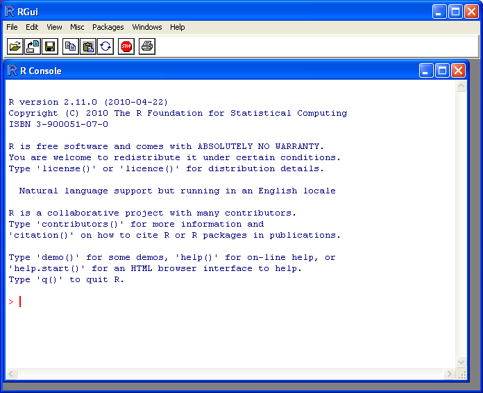

How to install R  
================

Introduction to R
-----------------

This little booklet has some information on how to use R for biomedical statistics.

R (`www.r-project.org <http://www.r-project.org/>`_) is a commonly used
free Statistics software. R allows you to carry out statistical
analyses in an interactive mode, as well as allowing simple programming.

How to check if R is installed on a Windows PC
----------------------------------------------

To use R, you first need to install the R program on your computer.

These instructions are for installing R on a Windows PC.

Before you install R on your computer, the first thing to do is to check whether
R is already installed on your computer (for example, by a previous user). 
There are two ways you can do this:

1. Check if there is an "R" icon on the desktop of the computer that you are using.
   If so, double-click on the "R" icon to start R. If you cannot find an "R" icon, try step 2 instead.
2. Click on the "Start" menu at the bottom left of your Windows desktop, and then move your 
   mouse over "All Programs" in the menu that pops up. See if "R" appears in the list
   of programs that pops up. If it does, it means that R is already installed on your
   computer, and you can start R by selecting "R"  (or R X.X.X, where X.X.X gives the version of R, 
   eg. R 2.10.0) from the list.

If either (1) or (2) above does succeed in starting R, it means that R is already installed
on the computer that you are using. (If neither succeeds, R is not installed yet).
If there is an old version of R installed on the Windows PC that you are using,
it is worth installing the latest version of R, to make sure that you have all the
latest R functions available to you to use.

Finding out what is the latest version of R
-------------------------------------------

To find out what is the latest version of R, you can look at the CRAN (Comprehensive
R Network) website, `http://cran.r-project.org/ <http://cran.r-project.org/>`_.

Beside "The latest release" (about half way down the page), it will say something like
"R-X.X.X.tar.gz" (eg. "R-2.12.1.tar.gz"). This means that the latest release of R is X.X.X (for
example, 2.12.1).

New releases of R are made very regularly (approximately once a month), as R is actively being
improved all the time. It is worthwhile installing new versions of R regularly, to make sure
that you have a recent version of R (to ensure compatibility with all the latest versions of
the R packages that you have downloaded). 

Installing R on a Windows PC
----------------------------

To install R on your Windows computer, follow these steps:

1. Go to `http://ftp.heanet.ie/mirrors/cran.r-project.org <http://ftp.heanet.ie/mirrors/cran.r-project.org>`_.
2. Under "Download and Install R", click on the "Windows" link.
3. Under "Subdirectories", click on the "base" link.
4. On the next page, you should see a link saying something like "Download R 2.10.1 for Windows" (or R X.X.X, where X.X.X gives the version of R, eg. R 2.11.1). 
   Click on this link.
5. You may be asked if you want to save or run a file "R-2.10.1-win32.exe". Choose "Save" and
   save the file on the Desktop. Then double-click on the icon for the file to run it.
6. You will be asked what language to install it in - choose English.
7. The R Setup Wizard will appear in a window. Click "Next" at the bottom of the R Setup wizard 
   window.
8. The next page says "Information" at the top. Click "Next" again.
9. The next page says "Information" at the top. Click "Next" again.
10. The next page says "Select Destination Location" at the top. 
    By default, it will suggest to install R in "C:\\Program Files" on your computer. 
11. Click "Next" at the bottom of the R Setup wizard window.
12. The next page says "Select components" at the top. Click "Next" again.
13. The next page says "Startup options" at the top. Click "Next" again.
14. The next page says "Select start menu folder" at the top. Click "Next" again.
15. The next page says "Select additional tasks" at the top. Click "Next" again.
16. R should now be installed. This will take about a minute. When R has finished, you will 
    see "Completing the R for Windows Setup Wizard" appear. Click "Finish".
17. To start R, you can either follow step 18, or 19:
18. Check if there is an "R" icon on the desktop of the computer that you are using.
    If so, double-click on the "R" icon to start R. If you cannot find an "R" icon, try step 19 instead.
19. Click on the "Start" button at the bottom left of your computer screen, and then 
    choose "All programs", and start R by selecting "R"  (or R X.X.X, where 
    X.X.X gives the version of R, eg. R 2.10.0) from the menu of programs. 
20. The R console (a rectangle) should pop up:

|image3|

How to install R on non-Windows computers (eg. Macintosh or Linux computers)
----------------------------------------------------------------------------

The instructions above are for installing R on a Windows PC. If you want to install R 
on a computer that has a non-Windows operating system (for example, a Macintosh or computer running Linux,
you should download the appropriate R installer for that operating system at 
`http://ftp.heanet.ie/mirrors/cran.r-project.org
<http://ftp.heanet.ie/mirrors/cran.r-project.org/>`_ and 
follow the R installation instructions for the appropriate operating system at 
`http://ftp.heanet.ie/mirrors/cran.r-project.org/doc/FAQ/R-FAQ.html#How-can-R-be-installed_003f 
<http://ftp.heanet.ie/mirrors/cran.r-project.org/doc/FAQ/R-FAQ.html#How-can-R-be-installed_003f>`_).

How to install an R package
---------------------------

R comes with some standard packages that are installed when you install R. However, in this 
booklet I will also tell you how to use some additional R packages that are useful, for example,
the "rmeta" package. These additional packages do not come with the standard installation of R,
so you need to install them yourself.

Once you have installed R on a Windows computer (following the steps above), you can install 
an additional package by following the steps below:

1. To start R, follow either step 2 or 3:
2. Check if there is an "R" icon on the desktop of the computer that you are using.
   If so, double-click on the "R" icon to start R. If you cannot find an "R" icon, try step 3 instead.
3. Click on the "Start" button at the bottom left of your computer screen, and then 
   choose "All programs", and start R by selecting "R"  (or R X.X.X, where 
   X.X.X gives the version of R, eg. R 2.10.0) from the menu of programs. 
4. The R console (a rectangle) should pop up.
5. Once you have started R, you can now install an R package (eg. the "rmeta" package) by 
   choosing "Install package(s)" from the "Packages" menu at the top of the R console.
   This will ask you what website you want to download the package from, you should choose 
   "Ireland" (or another country, if you prefer). It will also bring up a list of available
   packages that you can install, and you should choose the package that you want to install
   from that list (eg. "rmeta").
6. This will install the "rmeta" package.
7. The "rmeta" package is now installed. Whenever you want to use the "rmeta" package after this, 
   after starting R, you first have to load the package by typing into the R console:

.. highlight:: r

::

    > library("rmeta")

Note that there are some additional R packages for bioinformatics that are part of a special 
set of R packages called Bioconductor (`www.bioconductor.org <http://www.bioconductor.org/>`_) 
such as the "yeastExpData" R package, the "Biostrings" R package, etc.). 
These Bioconductor packages need to be installed using a different, Bioconductor-specific procedure 
(see `How to install a Bioconductor R package`_ below).

How to install a Bioconductor R package
---------------------------------------

The procedure above can be used to install the majority of R packages. However, the
Bioconductor set of bioinformatics R packages need to be installed by a special procedure.
Bioconductor (`www.bioconductor.org <http://www.bioconductor.org/>`_)
is a group of R packages that have been developed for bioinformatics. This includes 
R packages such as "yeastExpData", "Biostrings", etc.

To install the Bioconductor packages, follow these steps:

1. To start R, follow either step 2 or 3:
2. Check if there is an "R" icon on the desktop of the computer that you are using.
   If so, double-click on the "R" icon to start R. If you cannot find an "R" icon, try step 3 instead.
3. Click on the "Start" button at the bottom left of your computer screen, and then choose "All programs", and start R by selecting "R"  (or R X.X.X, where X.X.X gives the version of R, eg. R 2.10.0) from the menu of programs. 
4. The R console (a rectangle) should pop up.
5. Once you have started R, now type in the R console:

.. highlight:: r

::

    > source("http://bioconductor.org/biocLite.R")
    > biocLite()

6. This will install a core set of Bioconductor packages ("affy", "affydata", "affyPLM", 
   "annaffy", "annotate", "Biobase", "Biostrings", "DynDoc", "gcrma", "genefilter", 
   "geneplotter", "hgu95av2.db", "limma", "marray", "matchprobes", "multtest", "ROC", 
   "vsn", "xtable", "affyQCReport").
   This takes a few minutes (eg. 10 minutes). 
7. At a later date, you may wish to install some extra Bioconductor packages that do not belong 
   to the core set of Bioconductor packages. For example, to install the Bioconductor package called 
   "yeastExpData", start R and type in the R console:

.. highlight:: r

::

    > source("http://bioconductor.org/biocLite.R")
    > biocLite("yeastExpData")

8. Whenever you want to use a package after installing it, you need to load it into R by typing:

.. highlight:: r

::

   > library("yeastExpData")

Running R
-----------

To use R, you first need to start the R program on your computer.
You should have already installed R on your computer (see above). 

To start R, you can either follow step 1 or 2:
1. Check if there is an "R" icon on the desktop of the computer that you are using.
   If so, double-click on the "R" icon to start R. If you cannot find an "R" icon, try step 2 instead.
2. Click on the "Start" button at the bottom left of your computer screen, and then choose "All programs", and start R by selecting "R"  (or R X.X.X, where X.X.X gives the version of R, eg. R 2.10.0) from the menu of programs.

This should bring up a new window, which is the *R console*.

A brief introduction to R
-------------------------

You will type R commands into the R console in order to carry out
analyses in R. In the R console you will see:

.. highlight:: r

::

    >

This is the R prompt. We type the commands needed for a particular
task after this prompt. The command is carried out after you hit
the Return key.

Once you have started R, you can start typing in commands, and the
results will be calculated immediately, for example:

.. highlight:: r

::

    > 2*3
    [1] 6
    > 10-3
    [1] 7

All variables (scalars, vectors, matrices, etc.) created by R are
called *objects*. In R, we assign values to variables using an
arrow. For example, we can assign the value 2\*3 to the variable
*x* using the command:

.. highlight:: r

::

    > x <- 2*3 

To view the contents of any R object, just type its name, and the
contents of that R object will be displayed:

.. highlight:: r

::

    > x
    [1] 6

There are several possible different types of objects in R,
including scalars, vectors, matrices, arrays, data frames, tables,
and lists. The scalar variable *x* above is one example of an R
object. While a scalar variable such as *x* has just one element, a
vector consists of several elements. The elements in a vector are
all of the same type (eg. numeric or characters), while lists may
include elements such as characters as well as numeric quantities.

To create a vector, we can use the c() (combine) function. For
example, to create a vector called *myvector* that has elements
with values 8, 6, 9, 10, and 5, we type:

.. highlight:: r

::

    > myvector <- c(8, 6, 9, 10, 5)

To see the contents of the variable *myvector*, we can just type
its name:

.. highlight:: r

::

    > myvector
    [1]  8  6  9 10  5

The [1] is the index of the first element in the vector. We can
extract any element of the vector by typing the vector name with
the index of that element given in square brackets. For example, to
get the value of the 4th element in the vector *myvector*, we
type:

.. highlight:: r

::

    > myvector[4]
    [1] 10

In contrast to a vector, a list can contain elements of different
types, for example, both numeric and character elements. A list can
also include other variables such as a vector. The list() function
is used to create a list. For example, we could create a list
*mylist* by typing:

.. highlight:: r

::

    > mylist <- list(name="Fred", wife="Mary", myvector)

We can then print out the contents of the list *mylist* by typing
its name:

.. highlight:: r

::

    > mylist
    $name
    [1] "Fred"
    
    $wife
    [1] "Mary"
    
    [[3]]
    [1]  8  6  9 10  5

The elements in a list are numbered, and can be referred to using
indices. We can extract an element of a list by typing the list
name with the index of the element given in double square brackets
(in contrast to a vector, where we only use single square
brackets). Thus, we can extract the second and third elements from
*mylist* by typing:

.. highlight:: r

::

    > mylist[[2]]
    [1] "Mary"
    > mylist[[3]]
    [1]  8  6  9 10  5

Elements of lists may also be named, and in this case the elements
may be referred to by giving the list name, followed by "$",
followed by the element name. For example, *mylist$name* is the
same as *mylist[[1]]* and *mylist$wife* is the same as
*mylist[[2]]*:

.. highlight:: r

::

    > mylist$wife
    [1] "Mary"

We can find out the names of the named elements in a list by using
the attributes() function, for example:

.. highlight:: r

::

    > attributes(mylist)
    $names
    [1] "name" "wife" ""    

When you use the attributes() function to find the named elements
of a list variable, the named elements are always listed under a
heading "$names". Therefore, we see that the named elements of the
list variable *mylist* are called "name" and "wife", and we can
retrieve their values by typing *mylist$name* and *mylist$wife*,
respectively.

Another type of object that you will encounter in R is a *table*
variable. For example, if we made a vector variable *mynames*
containing the names of children in a class, we can use the table()
function to produce a table variable that contains the number of
children with each possible name:

.. highlight:: r

::

    > mynames <- c("Mary", "John", "Ann", "Sinead", "Joe", "Mary", "Jim", "John", "Simon")
    > table(mynames)
    mynames
       Ann    Jim    Joe   John   Mary  Simon Sinead 
         1      1      1      2      2      1      1 

We can store the table variable produced by the function table(),
and call the stored table "mytable", by typing:

.. highlight:: r

::

    > mytable <- table(mynames)

To access elements in a table variable, you need to use double
square brackets, just like accessing elements in a list. For
example, to access the fourth element in the table *mytable* (the
number of children called "John"), we type:

.. highlight:: r

::

    > mytable[[4]]
    [1] 2

Alternatively, you can use the name of the fourth element in
the table ("John") to find the value of that table element:

.. highlight:: r

::

    > mytable[["John"]]
    [1] 2

Functions in R usually require *arguments*, which are input
variables (ie. objects) that are passed to them, which they then
carry out some operation on. For example, the log10() function is
passed a number, and it then calculates the log to the base 10 of
that number:

.. highlight:: r

::

    > log10(100)
    2

In R, you can get help about a particular function by using the
help() function. For example, if you want help about the log10()
function, you can type:

.. highlight:: r

::

    > help("log10")

When you use the help() function, a box or webpage will pop up with
information about the function that you asked for help with.

If you are not sure of the name of a function, but think you know
part of its name, you can search for the function name using the
help.search() and RSiteSearch() functions. The help.search() function
searches to see if you already have a function installed (from one of
the R packages that you have installed) that may be related to some
topic you're interested in. The RSiteSearch() function searches all
R functions (including those in packages that you haven't yet installed)
for functions related to the topic you are interested in.

For example, if you want to know if there
is a function to calculate the standard deviation of a set of
numbers, you can search for the names of all installed functions containing
the word "deviation" in their description by typing:

.. highlight:: r

::

    > help.search("deviation")
    Help files with alias or concept or title matching
    'deviation' using fuzzy matching:
    
    genefilter::rowSds
                        Row variance and standard deviation of
                        a numeric array
    nlme::pooledSD      Extract Pooled Standard Deviation
    stats::mad          Median Absolute Deviation
    stats::sd           Standard Deviation
    vsn::meanSdPlot     Plot row standard deviations versus row

Among the functions that were found, is the function sd() in the
"stats" package (an R package that comes with the standard R
installation), which is used for calculating the standard deviation.

In the example above, the help.search() function found a relevant
function (sd() here). However, if you did not find what you were looking
for with help.search(), you could then use the RSiteSearch() function to
see if a search of all functions described on the R website may find
something relevant to the topic that you're interested in:

.. highlight:: r

:: 

   > RSiteSearch("deviation") 

The results of the RSiteSearch() function will be hits to descriptions
of R functions, as well as to R mailing list discussions of those
functions.

We can perform computations with R using objects such as scalars
and vectors. For example, to calculate the average of the values in
the vector *myvector* (ie. the average of 8, 6, 9, 10 and 5), we
can use the mean() function:

.. highlight:: r

::

    > mean(myvector)
    [1] 7.6

We have been using built-in R functions such as mean(),
length(), print(), plot(), etc. We can also create our own
functions in R to do calculations that you want to carry out very
often on different input data sets. For example, we can create a
function to calculate the value of 20 plus square of some input
number:

.. highlight:: r

::

    > myfunction <- function(x) { return(20 + (x*x)) }

This function will calculate the square of a number (*x*), and then
add 20 to that value. The return() statement returns the calculated
value. Once you have typed in this function, the function is then
available for use. For example, we can use the function for
different input numbers (eg. 10, 25):

.. highlight:: r

::

    > myfunction(10)
    [1] 120
    > myfunction(25) 
    [1] 645

To quit R, type:

.. highlight:: r

::

    > q()

Links and Further Reading
-------------------------

Some links are included here for further reading.

For a more in-depth introduction to R, a good online tutorial is
available on the "Kickstarting R" website,
`cran.r-project.org/doc/contrib/Lemon-kickstart <http://cran.r-project.org/doc/contrib/Lemon-kickstart/>`_.

There is another nice (slightly more in-depth) tutorial to R
available on the "Introduction to R" website,
`cran.r-project.org/doc/manuals/R-intro.html <http://cran.r-project.org/doc/manuals/R-intro.html>`_.

Acknowledgements
----------------

Thank you to Noel O'Boyle for helping in using Sphinx, `http://sphinx.pocoo.org <http://sphinx.pocoo.org>`_, to create
this document, and github, `https://github.com/ <https://github.com/>`_, to store different versions of the document
as I was writing it, and readthedocs, `http://readthedocs.org/ <http://readthedocs.org/>`_, to build and distribute
this document.

For very helpful comments and suggestions for improvements, thank you very much to:
Tony Burton, Richard A. Friedman, Duleep Samuel, R.Heberto Ghezzo, David Levine, Lavinia Gordon, 
Friedrich Leisch, and Phil Spector.

Contact
-------

I will be grateful if you will send me (`Avril Coghlan <http://www.ucc.ie/microbio/avrilcoghlan/>`_) corrections or suggestions for improvements to
my email address a.coghlan@ucc.ie 

License
-------

The content in this book is licensed under a `Creative Commons Attribution 3.0 License
<http://creativecommons.org/licenses/by/3.0/>`_.

